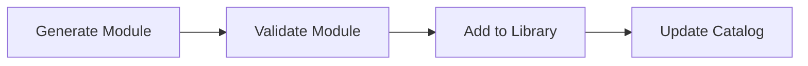
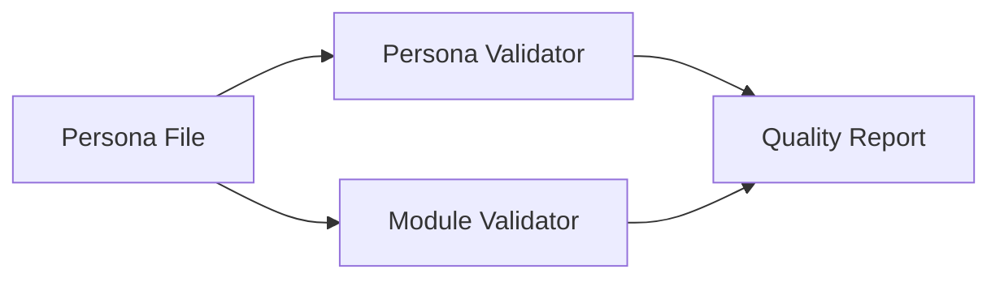

# Claude Code Agents

This directory contains specialized sub-agents designed to assist with specific tasks in the UMS (Unified Module System) development workflow.

## Agent Overview

### General Purpose Agents

#### github-cli-agent
Specialized agent for GitHub CLI (gh) operations including PR management, issue tracking, releases, and repository interactions.

**Use Cases:**
- Creating and managing pull requests
- Issue creation and management
- Code review workflows
- GitHub API interactions

---

## UMS v2.0 Toolkit Plugin

A comprehensive plugin for developing and maintaining the Unified Module System v2.0. All UMS v2.0 functionality is organized under the `ums-v2-toolkit` plugin with slash commands and specialized agents.

### Plugin Overview

**Location**: `.claude/plugins/ums-v2-toolkit/`

The UMS v2.0 Toolkit provides:
- 6 slash commands for common workflows
- 5 specialized agents for development tasks
- 3 reusable procedure workflows
- Complete documentation

### Quick Reference

```bash
# Create new module
/ums:create [description]

# Validate module
/ums:validate-module [path]

# Validate persona
/ums:validate-persona [path]

# Run quality audit
/ums:audit

# Manage standard library
/ums:curate [action]

# Build system development
/ums:build [task]
```

For complete documentation, see `.claude/plugins/ums-v2-toolkit/README.md`

---

## UMS v2.0 Development Agents (Plugin-Based)

The following agents are part of the `ums-v2-toolkit` plugin and are automatically available when using the plugin commands.

### 1. ums-v2-module-validator

**Purpose**: Validates UMS v2.0 module files for spec compliance

**Key Capabilities:**
- Validates `.module.ts` files against UMS v2.0 specification
- Checks required fields and structure
- Verifies export naming conventions
- Assesses component architecture
- Generates detailed validation reports

**When to Use:**
- After creating a new module
- Before committing module changes
- During code reviews
- For comprehensive library audits

**Usage Example:**
```bash
# Validate single module
claude-code --agent ums-v2-module-validator "Validate instruct-modules-v2/modules/foundation/ethics/do-no-harm.module.ts"

# Validate all modules in a directory
claude-code --agent ums-v2-module-validator "Validate all modules in instruct-modules-v2/modules/"
```

**Output:**
- ✅ PASS / ⚠️ WARNINGS / ❌ FAIL status
- Detailed validation checklist
- Specific errors and warnings
- Actionable recommendations

---

### 2. ums-v2-persona-validator

**Purpose**: Validates UMS v2.0 persona files for spec compliance and quality

**Key Capabilities:**
- Validates `.persona.ts` files against UMS v2.0 specification
- Checks module composition correctness
- Detects duplicate module IDs
- Assesses identity and semantic quality
- Analyzes tier distribution
- Validates module relationships

**When to Use:**
- After creating a new persona
- Before building a persona
- During persona composition
- For quality assessment

**Usage Example:**
```bash
# Validate persona
claude-code --agent ums-v2-persona-validator "Validate instruct-modules-v2/personas/systems-architect.persona.ts"

# Validate with module cross-reference
claude-code --agent ums-v2-persona-validator "Validate systems-architect persona and check all module references exist"
```

**Output:**
- Compliance status
- Module composition analysis
- Tier distribution metrics
- Quality assessment scores
- Recommendations for improvement

---

### 3. ums-v2-module-generator

**Purpose**: Generates UMS v2.0 compliant module files

**Key Capabilities:**
- Interactive module creation wizard
- Template-based generation
- Automatic export naming
- Metadata optimization
- Component selection guidance
- Cognitive level assignment
- Relationship management

**When to Use:**
- Creating new modules from scratch
- Standardizing module structure
- Ensuring spec compliance from the start
- Learning UMS v2.0 best practices

**Usage Example:**
```bash
# Interactive generation
claude-code --agent ums-v2-module-generator "Create a module for async/await best practices in Python"

# With specific parameters
claude-code --agent ums-v2-module-generator "Generate a foundation tier module for critical thinking at cognitive level 2"
```

**Workflow:**
1. Gathers requirements through questions
2. Determines tier and structure
3. Generates module ID and export name
4. Creates spec-compliant file
5. Suggests validation
6. Provides usage examples

---

### 4. ums-v2-build-developer

**Purpose**: Develops and maintains the UMS v2.0 build system

**Key Capabilities:**
- Module registry implementation
- TypeScript dynamic loading (tsx)
- Persona resolution
- Markdown rendering
- Build report generation
- Configuration management
- SHA-256 hashing for reproducibility

**When to Use:**
- Implementing build pipeline features
- Fixing build system bugs
- Optimizing build performance
- Adding new rendering rules
- Implementing module resolution

**Usage Example:**
```bash
# Implement new feature
claude-code --agent ums-v2-build-developer "Implement module caching to improve build performance"

# Fix issue
claude-code --agent ums-v2-build-developer "Fix bug in markdown rendering for Data components"

# Add capability
claude-code --agent ums-v2-build-developer "Add support for incremental builds"
```

**Key Responsibilities:**
- Module Registry implementation
- Module Loader with tsx
- Persona Resolver
- Markdown Renderer
- Build Report Generator
- CLI Interface

---

### 5. ums-v2-standard-library-curator

**Purpose**: Curates and maintains the standard library of modules

**Key Capabilities:**
- Module selection and inclusion
- Quality assessment
- Cognitive hierarchy curation
- Relationship management
- Taxonomy organization
- Documentation maintenance
- Metrics tracking

**When to Use:**
- Adding modules to standard library
- Deprecating outdated modules
- Organizing library structure
- Conducting quality audits
- Maintaining documentation
- Tracking library metrics

**Usage Example:**
```bash
# Add module to standard library
claude-code --agent ums-v2-standard-library-curator "Evaluate foundation/reasoning/lateral-thinking for inclusion in standard library"

# Audit quality
claude-code --agent ums-v2-standard-library-curator "Run quarterly quality audit on all foundation tier modules"

# Generate metrics
claude-code --agent ums-v2-standard-library-curator "Generate standard library metrics report"
```

**Curation Criteria:**
- Widely applicable
- Best practices
- High quality
- Well-documented
- Clear relationships

---

## Agent Interaction Patterns

### Sequential Workflow


**Example:**
1. Use `ums-v2-module-generator` to create a new module
2. Use `ums-v2-module-validator` to verify compliance
3. Use `ums-v2-standard-library-curator` to add to library
4. Use `ums-v2-build-developer` to test build integration

### Parallel Validation


**Example:**
1. Use `ums-v2-persona-validator` for persona structure
2. Use `ums-v2-module-validator` for all referenced modules
3. Combine results for comprehensive quality report

### Development Cycle
```
Create → Validate → Curate → Build → Test
   ↓        ↓         ↓        ↓       ↓
Generator → Validators → Curator → Builder → [System]
```

---

## Choosing the Right Command/Agent

### "I want to create a new module"
→ Use `/ums:create` command

### "I want to check if my module is valid"
→ Use `/ums:validate-module [path]` command

### "I want to create a new persona"
→ Use `/ums:create` for modules, then manually create persona file, then `/ums:validate-persona`

### "I want to check if my persona is valid"
→ Use `/ums:validate-persona [path]` command

### "I want to add a module to the standard library"
→ Use `/ums:curate add [path]` command

### "I want to run a quality audit"
→ Use `/ums:audit` command

### "I want to build the compilation pipeline"
→ Use `/ums:build [task]` command

### "I want to work with GitHub"
→ Use **github-cli-agent**

---

## Plugin Workflows

The UMS v2.0 Toolkit plugin provides organized workflows:

### Complete Module Development
```bash
# Single command handles entire workflow
/ums:create

# This automatically:
# 1. Generates module with guidance
# 2. Validates spec compliance
# 3. Offers library addition
```

### Quality Audit
```bash
# Comprehensive audit of everything
/ums:audit

# This runs:
# 1. Module validation (all modules)
# 2. Persona validation (all personas)
# 3. Relationship checks
# 4. Metrics generation
# 5. Prioritized recommendations
```

### Library Management
```bash
# Evaluate and add module
/ums:curate add path/to/module.module.ts

# View library metrics
/ums:curate metrics

# Organize tier structure
/ums:curate organize foundation
```

---

## Best Practices

### 1. Use the Plugin Commands
The plugin commands orchestrate agents automatically:
```bash
# This handles creation AND validation
/ums:create

# Rather than manually calling individual agents
```

### 2. Run Regular Audits
Keep quality high with regular audits:
```bash
# Weekly or before releases
/ums:audit
```

### 3. Validate Before Committing
Always validate changes:
```bash
# After modifying modules
/ums:validate-module path/to/modified-module.module.ts

# After modifying personas
/ums:validate-persona path/to/modified-persona.persona.ts
```

### 4. Use Tab Completion
Type `/ums:` and press tab to see all available commands

---

## Agent Development Guidelines

### Adding a New Agent

1. **Create agent file** in `.claude/agents/{name}.md`
2. **Define frontmatter**:
   ```yaml
   ---
   name: agent-name
   description: Clear description
   tools: Tool1, Tool2, Tool3
   autonomy_level: high|medium|low
   version: 1.0.0
   ---
   ```
3. **Document expertise and responsibilities**
4. **Provide clear usage patterns**
5. **Add to this README**

### Agent Design Principles

- ✅ **Single Responsibility**: Each agent has one clear purpose
- ✅ **Composable**: Agents work together for complex workflows
- ✅ **Autonomous**: High autonomy level for specialized tasks
- ✅ **Documented**: Clear documentation of capabilities
- ✅ **Validated**: Agents should validate their own output when possible

---

## Troubleshooting

### Agent Not Found
Ensure the agent file exists in `.claude/agents/` and has proper frontmatter.

### Agent Not Working as Expected
Check that:
1. Agent has access to required tools
2. Input is clear and specific
3. Required files/directories exist
4. Agent has necessary permissions

### Multiple Agents Needed
Some tasks require multiple agents. Use them sequentially or in parallel as appropriate.

---

## Future Agents (Planned)

- **ums-v2-migration-assistant**: Migrate v1.0 modules to v2.0
- **ums-v2-persona-composer**: Interactive persona composition wizard
- **ums-v2-analytics**: Analyze module usage and persona effectiveness
- **ums-v2-documentation-generator**: Generate comprehensive documentation

---

## Contributing

When adding new agents:
1. Follow the established format
2. Document clearly with examples
3. Update this README
4. Test thoroughly
5. Add to appropriate workflow

---

## Version History

- **1.1.0** (2025-10-13): UMS v2.0 Toolkit Plugin
  - Organized all UMS functionality into plugin structure
  - Added 6 slash commands for streamlined workflows
  - Created 3 reusable procedure workflows
  - Comprehensive plugin documentation
  - Moved agents into plugin: module-validator, persona-validator, module-generator, build-developer, library-curator

- **1.0.0** (2025-10-13): Initial UMS v2.0 agent suite
  - ums-v2-module-validator
  - ums-v2-persona-validator
  - ums-v2-module-generator
  - ums-v2-build-developer
  - ums-v2-standard-library-curator
