# 📖 CLI Reference: AI Persona Builder

This document provides a complete reference for the `copilot-instructions` CLI tool, including all commands, options, and usage examples.

## 📚 Table of Contents

- [📖 CLI Reference: AI Persona Builder](#-cli-reference-ai-persona-builder)
  - [📚 Table of Contents](#-table-of-contents)
  - [📦 Installation](#-installation)
  - [🌍 Global Options](#-global-options)
  - [🧭 Commands Overview](#-commands-overview)
  - [🛠️ Command Reference](#️-command-reference)
    - [`build` - Compile a Persona](#build---compile-a-persona)
      - [Syntax](#syntax)
      - [Flow](#flow)
      - [Options](#options)
      - [Requirements](#requirements)
      - [Examples](#examples)
    - [`list` - List Available Modules](#list---list-available-modules)
      - [Syntax](#syntax-1)
      - [Options](#options-1)
      - [Output Format](#output-format)
      - [Examples](#examples-1)
    - [`search` - Search for Modules](#search---search-for-modules)
      - [Syntax](#syntax-2)
      - [Arguments](#arguments)
      - [Options](#options-2)
      - [Examples](#examples-2)
    - [`validate` - Validate Files](#validate---validate-files)
      - [Syntax](#syntax-3)
      - [Arguments](#arguments-1)
      - [Options](#options-3)
      - [Validation Rules](#validation-rules)
      - [Output](#output)
      - [Examples](#examples-3)
    - [`create-module` - Create a New Module](#create-module---create-a-new-module)
      - [Syntax](#syntax-4)
      - [Arguments](#arguments-2)
      - [Options](#options-4)
      - [Order Requirements for Foundation Tier](#order-requirements-for-foundation-tier)
      - [Examples](#examples-4)
    - [`create-persona` - Create a New Persona](#create-persona---create-a-new-persona)
      - [Syntax](#syntax-5)
      - [Arguments](#arguments-3)
      - [Options](#options-5)
      - [File Generation](#file-generation)
      - [Examples](#examples-5)
  - [✨ Examples](#-examples)
    - [Complete Workflow Example](#complete-workflow-example)
    - [Quick Module-to-Persona Pipeline](#quick-module-to-persona-pipeline)
    - [Batch Validation](#batch-validation)
  - [🚨 Exit Codes](#-exit-codes)
    - [Common Error Scenarios](#common-error-scenarios)
  - [💡 Advanced Usage Tips](#-advanced-usage-tips)
    - [Using with CI/CD](#using-with-cicd)
    - [Module Development Workflow](#module-development-workflow)
    - [Debugging with Verbose Output](#debugging-with-verbose-output)

---

## 📦 Installation

Install the CLI globally via npm:

```bash
npm install -g @copilot-instructions/cli
```

## 🌍 Global Options

| Option          | Description                                |
| --------------- | ------------------------------------------ |
| `-v, --verbose` | Enable verbose output for detailed logging |
| `--version`     | Display the CLI version                    |
| `--help`        | Display help information                   |

---

## 🧭 Commands Overview

| Command                                                    | Purpose                                              |
| ---------------------------------------------------------- | ---------------------------------------------------- |
| [`build`](#build---compile-a-persona)                      | Compile a persona from modules or configuration file |
| [`list`](#list---list-available-modules)                   | List all available instruction modules               |
| [`search`](#search---search-for-modules)                   | Search for modules by name or description            |
| [`validate`](#validate---validate-files)                   | Validate modules and persona files                   |
| [`create-module`](#create-module---create-a-new-module)    | Create a new instruction module                      |
| [`create-persona`](#create-persona---create-a-new-persona) | Create a new persona configuration                   |

---

## 🛠️ Command Reference

### `build` - Compile a Persona

Builds a persona instruction file from a `.persona.jsonc` configuration or directly from a list of modules.

#### Syntax

```bash
copilot-instructions build [options]
```

#### Flow

```mermaid
graph LR
    A["`**persona.jsonc**
    Configuration file`"] --> B["`**Module Discovery**
    Find all referenced modules`"]

    B --> C["`**Tier Sorting**
    Group by Foundation→Principle→Technology→Execution`"]

    C --> D["`**Layer Ordering**
    Within Foundation: 0→1→2→3→4`"]

    D --> E["`**Schema Processing**
    Apply content structure rules`"]

    E --> F["`**Final Prompt**
    Cohesive AI instructions`"]

    subgraph "Layering Rules"
        G["`**Foundation:** Order-based (0-4)
        **Principle:** Generality-based
        **Technology:** Language→Framework→Tool
        **Execution:** Sequential playbooks`"]
    end

    C -.-> G

    style A fill:#e1f5fe
    style F fill:#c8e6c9
```



#### Options

| Option                        | Type    | Description                                    |
| ----------------------------- | ------- | ---------------------------------------------- |
| `-p, --persona <file>`        | String  | Path to the persona configuration file         |
| `--name <name>`               | String  | Override the persona name in the output        |
| `--description <description>` | String  | Override the persona description in the output |
| `--no-attributions`           | Boolean | Exclude module attributions in the output      |
| `-o, --output <file>`         | String  | Specify the output file path                   |
| `-m, --modules <path...>`     | Array   | List of instruction module IDs to include      |
| `-v, --verbose`               | Boolean | Enable verbose output                          |

#### Requirements

- Must specify either `--persona <file>` OR `--modules <path...>`
- When using `--modules`, the output is sent to stdout unless `--output` is specified

#### Examples

**Build from persona file:**

```bash
copilot-instructions build --persona ./personas/my-persona.persona.jsonc
```

**Build from modules list:**

```bash
copilot-instructions build --modules foundation/logic/deductive-reasoning principle/quality/clean-code technology/language/typescript --output ./dist/my-persona.md
```

**Build with overrides:**

```bash
copilot-instructions build --persona ./personas/base.persona.jsonc --name "Custom Persona" --no-attributions
```

**Build to stdout:**

```bash
copilot-instructions build --modules foundation/ethics/be-truthful principle/testing/test-isolation
```

---

### `list` - List Available Modules

Displays a table of all available instruction modules with their metadata.

#### Syntax

```bash
copilot-instructions list [options]
```

#### Options

| Option              | Type    | Description                                                           |
| ------------------- | ------- | --------------------------------------------------------------------- |
| `-t, --tier <name>` | String  | Filter by tier (`foundation`, `principle`, `technology`, `execution`) |
| `-v, --verbose`     | Boolean | Enable verbose output                                                 |

#### Output Format

The command displays a table with the following columns:

- **Order**: The cognitive ordering (0-5 for foundation modules, N/A for others)
- **Tier/Subject**: The module's tier and subject path
- **Name**: Human-readable module name
- **Description**: Brief module description

#### Examples

**List all modules:**

```bash
copilot-instructions list
```

**Filter by tier:**

```bash
copilot-instructions list --tier foundation
copilot-instructions list --tier technology
```

---

### `search` - Search for Modules

Searches for modules by name or description using case-insensitive matching.

#### Syntax

```bash
copilot-instructions search <query> [options]
```

#### Arguments

| Argument  | Type   | Required | Description                                         |
| --------- | ------ | -------- | --------------------------------------------------- |
| `<query>` | String | Yes      | Text to search for in module names and descriptions |

#### Options

| Option              | Type    | Description                      |
| ------------------- | ------- | -------------------------------- |
| `-t, --tier <name>` | String  | Restrict search to specific tier |
| `-v, --verbose`     | Boolean | Enable verbose output            |

#### Examples

**Basic search:**

```bash
copilot-instructions search "logic"
copilot-instructions search "error handling"
```

**Search within tier:**

```bash
copilot-instructions search "reasoning" --tier foundation
copilot-instructions search "react" --tier technology
```

---

### `validate` - Validate Files

Validates instruction modules and persona files for correctness, including frontmatter structure, schema compliance, and content requirements.

#### Syntax

```bash
copilot-instructions validate [path] [options]
```

#### Arguments

| Argument | Type   | Required | Description                                                   |
| -------- | ------ | -------- | ------------------------------------------------------------- |
| `[path]` | String | No       | Path to specific file or directory (validates all if omitted) |

#### Options

| Option          | Type    | Description                                          |
| --------------- | ------- | ---------------------------------------------------- |
| `-v, --verbose` | Boolean | Enable verbose output with detailed validation steps |

#### Validation Rules

**Module Files (`.md`):**

- Valid YAML frontmatter with required fields
- Correct schema structure and section order
- Proper tier-specific rules (e.g., order for foundation modules)
- Must be within `instructions-modules/` directory

\*\*Persona Files (`.persona.json`, `.persona.jsonc`):

- Required fields: `name`, `modules`
- Valid JSON/JSONC syntax
- Non-empty modules array with valid module IDs

#### Output

- Summary with pass/fail counts
- Detailed error reports for failed validations
- File-by-file validation status (in verbose mode)

#### Examples

**Validate all files:**

```bash
copilot-instructions validate
```

**Validate specific file:**

```bash
copilot-instructions validate ./instructions-modules/foundation/logic/deductive-reasoning.md
copilot-instructions validate ./personas/my-persona.persona.jsonc
```

**Validate directory:**

```bash
copilot-instructions validate ./instructions-modules/foundation/
```

**Verbose validation:**

```bash
copilot-instructions validate --verbose
```

---

### `create-module` - Create a New Module

Creates a new instruction module file with proper frontmatter and schema structure.

#### Syntax

```bash
copilot-instructions create-module <tier> <subject> <name> [description] [options]
```

#### Arguments

| Argument        | Type   | Required | Description                                                        |
| --------------- | ------ | -------- | ------------------------------------------------------------------ |
| `<tier>`        | String | Yes      | Module tier (`foundation`, `principle`, `technology`, `execution`) |
| `<subject>`     | String | Yes      | Subject path within tier (e.g., `logic`, `framework/react`)        |
| `<name>`        | String | Yes      | Human-readable module name                                         |
| `[description]` | String | No       | Module description (auto-generated if omitted)                     |

#### Options

| Option                 | Type   | Description                        |
| ---------------------- | ------ | ---------------------------------- |
| `-o, --order <number>` | Number | Order for foundation modules (0-5) |

#### Order Requirements for Foundation Tier

| Subject           | Default Order | Description                     |
| ----------------- | ------------- | ------------------------------- |
| `bias`            | 1             | Cognitive bias mitigation       |
| `communication`   | 2             | Information exchange principles |
| `decision-making` | 3             | Decision frameworks             |
| `epistemology`    | 4             | Knowledge theory                |
| `ethics`          | 0             | Ethical foundations             |
| `judgment`        | 2             | Evaluation processes            |
| `logic`           | 0             | Logical foundations             |
| `metacognition`   | 4             | Meta-thinking processes         |
| `problem-solving` | 1             | Problem-solving methods         |
| `reasoning`       | 1             | Reasoning techniques            |

#### Examples

**Foundation module with auto-detected order:**

```bash
copilot-instructions create-module foundation logic "Inductive Reasoning" "Reasoning from specific observations to general conclusions"
```

**Foundation module with explicit order:**

```bash
copilot-instructions create-module foundation "new-subject" "Custom Foundation Module" "A custom module" --order 2
```

**Non-foundation modules:**

```bash
copilot-instructions create-module principle quality "Code Review Standards" "Standards for effective code reviews"
copilot-instructions create-module technology "language/python" "PEP 8 Style Guide" "Python code style guidelines"
copilot-instructions create-module execution "playbook" "Debug API Issues" "Step-by-step API debugging guide"
```

---

### `create-persona` - Create a New Persona

Creates a new persona configuration file with optional template support.

#### Syntax

```bash
copilot-instructions create-persona <name> [description] [options]
```

#### Arguments

| Argument        | Type   | Required | Description                                           |
| --------------- | ------ | -------- | ----------------------------------------------------- |
| `<name>`        | String | Yes      | Persona name (used for file naming and configuration) |
| `[description]` | String | No       | Persona description (auto-generated if omitted)       |

#### Options

| Option                        | Type    | Description                                       |
| ----------------------------- | ------- | ------------------------------------------------- |
| `--no-attributions`           | Boolean | Disable attributions in the persona configuration |
| `-p, --persona-output <path>` | String  | Custom path for the persona file                  |
| `-b, --build-output <file>`   | String  | Custom output path for built persona              |
| `-t, --template <name>`       | String  | Use a template from `./templates/persona/`        |

#### File Generation

- Creates `.persona.jsonc` file with proper structure
- Automatically generates slugified filename from persona name
- Includes empty `modules` array for customization
- Sets default output path based on persona name

#### Examples

**Basic persona creation:**

```bash
copilot-instructions create-persona "My Developer Assistant"
# Creates: my-developer-assistant.persona.jsonc
```

**Custom paths:**

```bash
copilot-instructions create-persona "API Tester" \
  --persona-output ./personas/api-tester.persona.jsonc \
  --build-output ./dist/api-tester.md
```

**Using template:**

```bash
copilot-instructions create-persona "Code Reviewer" --template code-critic
```

**Disable attributions:**

```bash
copilot-instructions create-persona "Production Assistant" --no-attributions
```

---

## ✨ Examples

### Complete Workflow Example

```bash
# 1. List available modules
copilot-instructions list --tier foundation

# 2. Search for specific functionality
copilot-instructions search "error handling"

# 3. Create a new module
copilot-instructions create-module principle quality "Error Handling Standards" \
  "Best practices for error handling in software development"

# 4. Create a persona configuration
copilot-instructions create-persona "Error Handler Specialist" \
  "A persona focused on robust error handling" \
  --persona-output ./personas/error-handler.persona.jsonc

# 5. Edit the persona file to add modules (manual step)
# Add modules to the "modules" array in error-handler.persona.jsonc

# 6. Validate the configuration
copilot-instructions validate ./personas/error-handler.persona.jsonc

# 7. Build the final persona
copilot-instructions build --persona ./personas/error-handler.persona.jsonc

# 8. Validate everything
copilot-instructions validate
```

### Quick Module-to-Persona Pipeline

```bash
# Build a persona directly from modules without configuration file
copilot-instructions build \
  --modules \
    foundation/ethics/be-truthful \
    foundation/logic/deductive-reasoning \
    principle/quality/clean-code \
    technology/language/typescript \
    execution/playbook/debug-failing-unit-test \
  --name "TypeScript Debugger" \
  --description "A specialized persona for TypeScript debugging" \
  --output ./personas/typescript-debugger.md
```

### Batch Validation

```bash
# Validate all modules in a specific tier
copilot-instructions validate ./instructions-modules/foundation/ --verbose

# Validate all persona files
copilot-instructions validate ./personas/ --verbose

# Validate entire project
copilot-instructions validate --verbose
```

---

## 🚨 Exit Codes

The CLI uses standard exit codes to indicate success or failure:

| Exit Code | Meaning                                                                         |
| --------- | ------------------------------------------------------------------------------- |
| `0`       | Success - Command completed without errors                                      |
| `1`       | Error - Command failed due to validation errors, missing files, or other issues |

### Common Error Scenarios

**Build Command:**

- Exit code 1: Persona validation failed, module not found, file write error
- Exit code 0: Successfully built persona file

**Validate Command:**

- Exit code 1: One or more validation failures detected
- Exit code 0: All validations passed

**Create Commands:**

- Exit code 1: File already exists, invalid parameters, filesystem errors
- Exit code 0: Successfully created file

**List/Search Commands:**

- Exit code 1: Filesystem errors, module directory not found
- Exit code 0: Successfully displayed results (even if no results found)

---

## 💡 Advanced Usage Tips

### Using with CI/CD

```bash
# Validate all files in CI pipeline
copilot-instructions validate || exit 1

# Build persona for deployment
copilot-instructions build --persona ./config/production.persona.jsonc --output ./dist/persona.md
```

### Module Development Workflow

```bash
# Create and immediately validate new module
copilot-instructions create-module foundation reasoning "Abductive Reasoning" && \
copilot-instructions validate ./instructions-modules/foundation/reasoning/abductive-reasoning.md
```

### Debugging with Verbose Output

```bash
# Get detailed information about build process
copilot-instructions build --persona ./personas/complex.persona.jsonc --verbose

# See exactly which validations pass/fail
copilot-instructions validate --verbose
```

This CLI reference provides complete documentation for all available commands and options in the AI Persona Builder toolkit.
