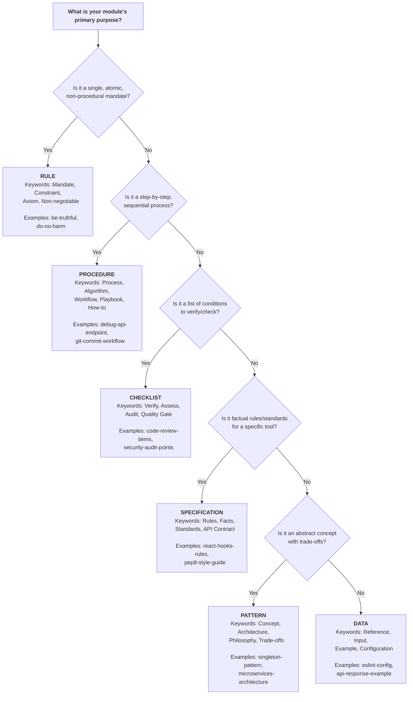
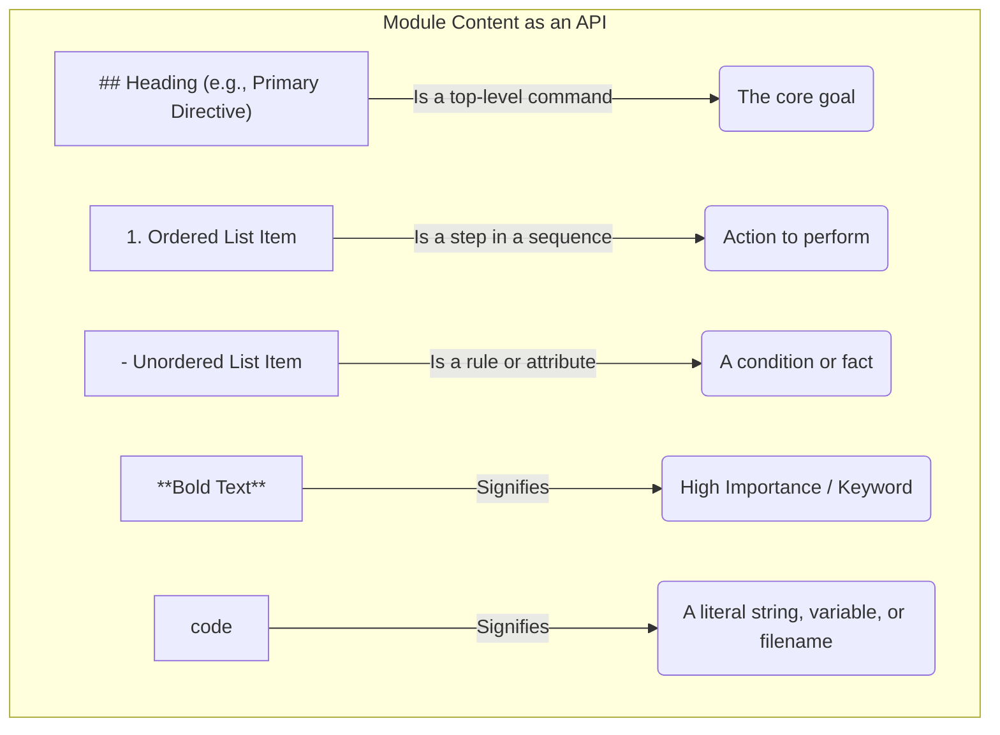

# ✍️ Module Authoring & Development Guide

- [✍️ Module Authoring \& Development Guide](#️-module-authoring--development-guide)
  - [1. Introduction 📜](#1-introduction-)
  - [2. Module Anatomy 🧬](#2-module-anatomy-)
  - [3. Frontmatter Requirements 📝](#3-frontmatter-requirements-)
    - [Required Fields](#required-fields)
    - [Optional Fields](#optional-fields)
    - [Frontmatter Examples](#frontmatter-examples)
  - [4. The Five Module Schemas: A Deep Dive 🗂️](#4-the-five-module-schemas-a-deep-dive-️)
    - [4.1. Quick Reference: The Five Module Schemas](#41-quick-reference-the-five-module-schemas)
    - [4.2. The `procedure` Schema](#42-the-procedure-schema)
    - [4.3. The `specification` Schema](#43-the-specification-schema)
    - [4.4. The `pattern` Schema](#44-the-pattern-schema)
    - [4.5. The `checklist` Schema](#45-the-checklist-schema)
    - [4.6. The `data` Schema](#46-the-data-schema)
    - [`data`](#data)
    - [5.1. The Core Philosophy: The AI is a Tool, Not a Colleague 🤖](#51-the-core-philosophy-the-ai-is-a-tool-not-a-colleague-)
    - [Schema Decision Guide: A Step-by-Step Process 🗺️](#schema-decision-guide-a-step-by-step-process-️)
      - [**Step 1: The `procedure` Question**](#step-1-the-procedure-question)
      - [**Step 2: The `checklist` Question**](#step-2-the-checklist-question)
      - [**Step 3: The `specification` Question**](#step-3-the-specification-question)
      - [**Step 4: The `pattern` Question**](#step-4-the-pattern-question)
      - [**Step 5: The `data` Question**](#step-5-the-data-question)
    - [Summary Table](#summary-table)
    - [5.2. The Three Pillars of Machine-Centric Writing 🏛️](#52-the-three-pillars-of-machine-centric-writing-️)
      - [A. Determinism: Ensure One Path of Execution](#a-determinism-ensure-one-path-of-execution)
      - [B. Precision: Use Specific and Quantifiable Language](#b-precision-use-specific-and-quantifiable-language)
      - [C. Structure: Use Markdown as an API](#c-structure-use-markdown-as-an-api)
    - [5.3. Applying the Principles by Schema](#53-applying-the-principles-by-schema)
      - [For `procedure` Schemas](#for-procedure-schemas)
      - [For `specification` Schemas](#for-specification-schemas)
      - [For `pattern` Schemas](#for-pattern-schemas)
      - [For `checklist` Schemas](#for-checklist-schemas)
  - [6. Full Module Examples 🖼️](#6-full-module-examples-️)
    - [Example 1: A `procedure` in the `Execution` Tier](#example-1-a-procedure-in-the-execution-tier)
    - [Example 2: A `pattern` in the `Principle` Tier](#example-2-a-pattern-in-the-principle-tier)
    - [Example 3: A `data` Module in the `Technology` Tier](#example-3-a-data-module-in-the-technology-tier)
  - [7. Authoring Best Practices \& Style Guide 🎨](#7-authoring-best-practices--style-guide-)
    - [Atomicity: One Module, One Concept](#atomicity-one-module-one-concept)
    - [Machine-Centric Language](#machine-centric-language)
    - [Use Markdown Effectively](#use-markdown-effectively)
  - [8. Module Creation Workflow 🔄](#8-module-creation-workflow-)

## 1. Introduction 📜

This guide provides the official standards and best practices for authoring and developing instruction modules for the AI Persona Builder ecosystem. It is the definitive source of truth for all module authors. Adhering to these guidelines is mandatory to ensure all modules are high-quality, consistent, effective, and work harmoniously within the system.

The core philosophy is that **a module is a configuration file for an AI's reasoning process.** Every decision in this guide supports that goal. The content of these modules is written for an AI system, not a human; therefore, clarity, precision, and unambiguous language are paramount.

## 2. Module Anatomy 🧬

A module is a single Markdown file (`.md`) composed of two distinct parts: YAML frontmatter for structured metadata and Markdown content for the instructions themselves.

1.  **Frontmatter:** A YAML block at the top of the file that defines the module's identity, scope, and structure.
2.  **Content:** The Markdown body that follows the frontmatter, containing the instructional text for the AI. Its structure is strictly defined by the `schema` declared in the frontmatter.

## 3. Frontmatter Requirements 📝

The frontmatter is a YAML block at the top of the file, enclosed by `---`. It contains the module's essential, machine-readable metadata. All fields are required.

### Required Fields

- `name` (string): The human-readable name of the module. Be descriptive and intuitive, Title Case (e.g., `First-Principles Thinking`, not `fpt_reasoning`).

- `description` (string): A concise summary of what the module does or what concept it represents. Used in help menus and search results.

- `tier` (string): The module's high-level scope and compilation priority. It MUST be one of the four official tiers:
  - `foundation`: For universal principles of logic, reason, and ethics.
  - `principle`: For technology-agnostic best practices and methodologies.
  - `technology`: For factual knowledge about a specific tool, language, or platform.
  - `execution`: For step-by-step playbooks that perform a concrete task.

- `schema` (string): Dictates the required format of the module content. One of the six official schemas:
  - `procedure`
  - `specification`
  - `pattern`
  - `checklist`
  - `data`
  - `rule`

- `layer` (number): A number from 0-4 that defines the module's position in the cognitive hierarchy. Its purpose is to enable validation of the cognitive flow, ensuring bedrock concepts like `Ethics` (Layer 0) are processed before dependent concepts like `Decision-Making` (Layer 3).
  - For `foundation` modules, a number between 0-4.
  - For `principle`, `technology`, and `execution` modules, this field **MUST** be set to null.

### Optional Fields

- `authors` (array of strings): A list of contributors to the module. `'Jane Doe <jane.doe@example.com>', 'John Smith <john.smith@example.com>'`

### Frontmatter Examples

**Foundation Module Example:**

```yaml
---
name: 'First-Principles Thinking'
description: 'A process for deconstructing problems to their most fundamental, indivisible truths.'
tier: foundation
layer: 1
schema: procedure
authors:
  - 'Jane Doe <jane.doe@example.com>'
---
```

**Technology Module Example:**

```yaml
---
name: 'React: Rules of Hooks'
description: 'The two fundamental rules for using React Hooks correctly.'
tier: technology
layer: null
schema: specification
authors:
  - 'John Smith <john.smith@example.com>'
---
```

## 4. The Six Module Schemas: A Deep Dive 🗂️

A module's **schema** is a formal declaration of its purpose and structure. It is the most important piece of metadata an author provides, as it tells the system how the module's content should be interpreted and validated.

The core philosophy is **"structure should follow intent."** By choosing the correct schema, an author makes their module clearer, more effective, and easier for both humans and machines to understand.

This section details the six official schemas. While each schema has a natural affinity for certain tiers, the author's explicit choice in the module's frontmatter is the final authority.

### 4.1. Quick Reference: The Six Module Schemas

The fastest way to choose the right schema is to follow this decision process:



| Schema Name         | Purpose                                                                                |
| :------------------ | :------------------------------------------------------------------------------------- |
| **`procedure`**     | To provide a step-by-step guide for a task, algorithm, or workflow.                    |
| **`specification`** | To provide declarative rules, facts, or standards for a specific tool or API.          |
| **`pattern`**       | To explain an abstract concept, architecture, or design philosophy and its trade-offs. |
| **`checklist`**     | To provide a list of items to verify for quality, completeness, or correctness.        |
| **`data`**          | To provide a raw, structured block of data for context or as input.                    |

### 4.2. The `procedure` Schema

The procedure schema is designed for creating a recipe or workflow. It is imperative and action-oriented, guiding the AI through a specific, ordered sequence of steps to achieve a deterministic outcome.

- **Purpose:** To create a recipe or workflow. It is imperative and action-oriented, guiding the AI through a sequence of steps to achieve a specific outcome.
- **When to Use:** Choose `procedure` when the module's primary goal is to describe "how to do something" in a specific order. It is ideal for playbooks, algorithms, and problem-solving frameworks.

- It is the appropriate choice for modules that describe:
  - **Playbooks:** A step-by-step guide for a common task (e.g., debug-failing-unit-test).
  - **Algorithms:** A formal, computational process (e.g., binary-search-debugging).
  - **Problem-Solving Frameworks:** A structured method for thinking through a problem (e.g., root-cause-analysis).

The key differentiator of the procedure schema is its focus on a sequential, actionable process.

**Content Requirements:**

```Markdown
## Primary Directive:
A single, non-negotiable command stating the ultimate goal.
## Process:
An ordered list (`1.`, `2.`, `3.`) of the steps to be taken.
## Constraints:
A bulleted list (`-`) of explicit "do not" rules and boundaries.
```

**Example:**

```Markdown
## Primary Directive
You MUST write a Git commit message that follows the Conventional Commits standard.
## Process
1.  Determine the commit type (e.g., `feat`, `fix`, `chore`).
2.  Write a concise subject line in the imperative mood.
3.  Provide a detailed body explaining the 'what' and 'why'.
## Constraints
- Do NOT exceed 50 characters in the subject line.
- Do NOT use past tense in the subject line.
```

### 4.3. The `specification` Schema

The specification schema is designed for creating a datasheet or a set of formal rules. It is declarative, providing objective, factual information about a specific entity.

- **Purpose:** To create a datasheet or a set of formal rules. It is declarative, providing factual information about a specific tool, language, or API.
- **When to Use:** Choose `specification` when the module's goal is to define "what is true" about a subject. It is perfect for style guides, API contracts, and technical rulebooks.

It is the appropriate choice for modules that describe:

- **Technical Standards:** A set of non-negotiable rules for a tool or language (e.g., React: Rules of Hooks, Conventional Commits).
- **API Contracts:** The defined inputs, outputs, and behaviors of an API.
- **Style Guides:** A set of rules for code formatting and quality (e.g., PEP 8 Style Guide).

The key differentiator of the specification schema is its focus on declarative, verifiable rules and facts.

**Content Requirements:**

```Markdown
## Core Concept:
A one-sentence summary of the technology's purpose.
## Key Rules:
An unordered list (`-`) of the most important, non-negotiable rules.
## Best Practices:
A list of recommended "do's".
## Anti-Pattern:
A list of common mistakes or "don'ts".
```

**Example:**

```Markdown
## Core Concept
PEP 8 is the official style guide for Python code, intended to improve readability.
## Key Rules
- Use 4 spaces per indentation level.
- Limit all lines to a maximum of 79 characters.
## Best Practices
- Use a linter like `flake8` to automatically check for compliance.
- Imports should be on separate lines.
## Anti-Patterns
- Using tabs for indentation.
- Writing overly long, complex single lines of code.
```

### 4.4. The `pattern` Schema

The pattern schema is designed for explaining high-level, abstract concepts where the primary goal is to explore the "why" and "when" through an analysis of principles and trade-offs.
It is the appropriate choice for modules that describe:

- **Single, Concrete Design Patterns:** A reusable solution to a common problem (e.g., Singleton Pattern).
- **High-Level Architectural Styles:** A fundamental approach to system organization (e.g., Microservices).
- **Design Philosophies or "Meta-Patterns":** A set of related principles that form a cohesive school of thought (e.g., SOLID).
  - **Purpose:** To explain a high-level, abstract concept, architectural style, or design philosophy where the primary goal is to explore the "why" and "when" through an analysis of principles and trade-offs.
  - **When to Use:** Choose pattern when the module's content fits one of the following categories:
    - It describes a single, reusable design pattern (e.g., Singleton, Factory).
    - It explains a high-level architectural style (e.g., Microservices, Event-Driven).
    - It defines a set of related principles that form a design philosophy (e.g., SOLID, DRY).
    - The primary goal is to discuss the advantages, disadvantages, and trade-offs of the concept.

The key differentiator of the pattern schema is its focus on discussing the advantages, disadvantages, and trade-offs of a concept.

**Content Requirements:**

```Markdown
## Summary:
A brief, high-level explanation of the concept.
## Core Principles:
The fundamental ideas that define the concept.
## Advantages / Use Cases:
Benefits and situations where this concept is applicable.
## Disadvantages / Trade-offs:
Costs, risks, and situations where this concept should be avoided.
```

**Example:**

```markdown
## Summary

The Singleton Pattern ensures a class has only one instance and provides a global point of access to it.

## Core Principles

- The constructor must be private to prevent direct instantiation.
- A static method provides access to the single instance.

## Advantages / Use Cases

- Guarantees a single instance for resources like database connections or loggers.
- Provides a global access point.

## Disadvantages / Trade-offs

- Violates the Single Responsibility Principle.
- Can make unit testing difficult due to global state.
```

### 4.5. The `checklist` Schema

The checklist schema is designed for creating a quality gate or an audit form. It provides a list of conditions to be verified to ensure quality, completeness, or correctness.
It is the appropriate choice for modules that describe:

- **Code Reviews:** A list of items to check before merging a pull request.
- **Security Audits:** A set of vulnerabilities to check for.
- **Pre-Deployment Verification:** A list of conditions that must be met before a release.
  - **Purpose:** To create a quality gate or an audit form. It provides a list of conditions to be verified to ensure quality, completeness, or correctness. It is for assessment, not transformation.
  - **When to Use:** Choose `checklist` when the module's goal is to verify a set of conditions, often in any order. It is perfect for code reviews, security audits, and pre-deployment verification.

The key differentiator of the checklist schema is its focus on assessment and verification, not transformation. The order of items is often not critical.

**Content Requirements:**

```Markdown
## Objective:
A concise statement describing the goal of the checklist.
## Items:
A list of conditions to verify. Using Markdown's task list syntax (`- [ ]`) is highly recommended.
```

**Example:**

```Markdown
## Objective
To verify that a new API endpoint is secure and ready for production.
## Items
- [ ] Is input validation strictly enforced?
- [ ] Are authentication and authorization checks performed on every request?
- [ ] Is all sensitive data encrypted in transit and at rest?
- [ ] Are error messages generic and do not leak internal system details?
```

### 4.6. The `data` Schema

The data schema is designed for providing a self-contained, raw, structured block of information. It is used to give the AI context or input for another process.
It is the appropriate choice for modules whose primary content is:

- **Configuration Files:** e.g., .eslintrc.json, tsconfig.json.
- **Example Payloads:** e.g., an example API request body.
- **Code Snippets:** A reusable block of code for reference.
  - **Purpose:** To provide a self-contained block of raw, structured information. It is used to give the AI context or input for another process.
  - **When to Use:** Choose `data` when the module's content is primarily a block of code, configuration, or structured text that is not an instruction itself but is meant to be referenced or analyzed.

The key differentiator of the data schema is that its content is information to be referenced, not an instruction to be followed.

**Content Requirements:**

`````Markdown
## Description: A brief summary of what the data represents and how it should be used.
The description MUST be followed immediately by a single, fenced code block (e.g., ````json`).
`````

### `data`

````Markdown
## Description
This is the standard `tsconfig.json` configuration for a strict Node.js project.
```json
{
  "compilerOptions": {
    "target": "ES2020",
    "module": "NodeNext",
    "strict": true,
    "esModuleInterop": true,
    "skipLibCheck": true,
    "forceConsistentCasingInFileNames": true
  }
}
```
````

This schema is particularly useful for providing configuration files, code snippets, or other structured data that the AI can use as a reference or input in its reasoning process.

### 4.7. The `rule` Schema

#### **1. Purpose and Philosophy**

The `rule` schema is designed to define a single, atomic, non-procedural constraint with maximum force and clarity. Its purpose is to establish a non-negotiable mandate that governs an AI's behavior or output.

When authoring a `rule` module, it is useful to consider the "spirit of the law" versus the "letter of the law":

- **The "Letter" (A Heuristic):** "The mandate must be a single, imperative sentence." This is a simple guideline that is correct in most cases and serves as an excellent starting point.
- **The "Spirit" (The Core Principle):** "The mandate must represent one, and only one, indivisible concept, expressed with maximum force and minimum noise."

The ultimate goal is **conceptual atomicity**. While a single sentence is the ideal, perfect clarity for a single concept may occasionally require two tightly-coupled sentences or a short, focused list.

#### **2. Formal Definition**

A module using the `rule` schema must adhere to the following principles:

1.  **Conceptual Atomicity:** It **MUST** represent a single, indivisible concept. If the content introduces multiple, distinct, and separable rules, it is not atomic and should be broken into multiple `rule` modules or refactored into a `specification`.
2.  **Declarative Nature:** It **MUST** be declarative, not procedural. It must describe a state, a condition, or a constraint on the final output. It **MUST NOT** describe a sequence of steps or a process.
3.  **Imperative Language:** The content **MUST** consist only of imperative statements (e.g., using `MUST`, `WILL`, `SHALL`, `MUST NOT`). It **MUST NOT** contain descriptive, explanatory, or conversational text.
4.  **Brevity and Potency:** It **MUST** be concise. The content should be a single, short paragraph. A short, unordered list is permissible only if every list item directly supports and clarifies the single, overarching mandate.

#### **3. Content Requirements**

The Markdown content of a `rule` module must contain only one section:

```markdown
## Mandate

The imperative statement(s) that form the rule.
```

#### **4. Illustrative Examples**

##### ✅ **Good Example (The Ideal - Single Sentence)**

This is the gold standard for a `rule` module.

```markdown
## Mandate

You MUST NOT knowingly present false, fabricated, or misleading information as fact.
```

- **Critique:** Perfect. It is one sentence expressing one indivisible concept: truthfulness.

##### ✅ **Good Example (Acceptable - Tightly-Coupled Sentences)**

This is acceptable because two sentences are required to fully express the single, atomic concept of epistemic responsibility.

```markdown
## Mandate

You MUST explicitly state when you do not have sufficient information to answer a question. You MUST also proactively correct any errors you identify in your own previous statements.
```

- **Critique:** Acceptable. The two commands—"clarify ignorance" and "correct errors"—are two facets of the same core idea. They are not independent rules that could be used separately.

##### ❌ **Bad Example (Multiple, Unrelated Ideas)**

This violates the principle of conceptual atomicity.

```markdown
## Mandate

You MUST NOT present false information. You MUST also ensure all TypeScript code is compatible with `strict: true`.
```

- **Critique:** Incorrect. This contains two completely separate rules. It **MUST** be split into two different modules: one `rule` module for truthfulness and one `specification` or `rule` module for TypeScript standards.

##### ❌ **Bad Example (Becomes a `specification`)**

This example violates multiple principles and should be refactored.

```markdown
## Mandate

You MUST report errors in a clear and actionable way. This is important for user experience. The error message MUST NOT expose stack traces or other sensitive system details. You MUST also provide a unique correlation ID for tracking purposes.
```

- **Critique:** Flawed. It contains (1) descriptive filler, and (2) three distinct, separable rules. This module **MUST** be refactored into a `specification` schema, where each rule becomes an item under `## Key Rules`.

#### **5. Schema Decision Guide (The Litmus Test)**

An author should use the `rule` schema if they can answer "yes" to all of the following questions:

1.  **Does my instruction represent a single, indivisible concept?**
2.  **Is it a non-procedural constraint, rather than a sequence of steps?**
3.  **Is it expressed purely as imperative commands, with no descriptive filler?**

If the answer to any of these is "no," another schema (`specification` or `procedure`) is more appropriate.

#### **6. Summary: `rule` vs. Other Schemas**

| Schema              | Core Purpose                                                  | Example Use Case                              |
| :------------------ | :------------------------------------------------------------ | :-------------------------------------------- |
| **`rule`**          | A single, atomic, non-procedural mandate.                     | `You MUST NOT cause harm.`                    |
| **`specification`** | A set of declarative rules and facts about a specific entity. | The key rules for using React Hooks.          |
| **`procedure`**     | A step-by-step, sequential process for performing a task.     | The process for writing a Git commit message. |

[For full examples of a module, refer to Section 6](#6-full-module-examples).

### 5.1. The Core Philosophy: The AI is a Tool, Not a Colleague 🤖

The single most important principle of authoring is to **write for a machine, not a human.** An AI, even a highly advanced one, is not your colleague. It does not infer intent, understand nuance, or "read between the lines" in the same way a human does. It is a highly advanced, literal-minded tool that executes instructions based on the patterns and directives it is given.

A human can understand a vague request like "make the login page look better." An AI will struggle because "better" is not a defined parameter. A machine-centric instruction would be "Implement a three-column layout with a 16px gap, use the primary brand color `#0044CC` for the login button, and ensure the email input field has a `aria-label` for accessibility."

Therefore, our goal as module authors is to eliminate ambiguity. We achieve this through three core pillars: **Determinism, Precision, and Structure.**

### Schema Decision Guide: A Step-by-Step Process 🗺️

To find the perfect schema for your module, ask yourself the following questions **in order**. The first question that you can answer "yes" to reveals the correct schema for your content.

---

#### **Step 1: The `rule` Question**

> Is the primary purpose of this module to define a **single, atomic, non-procedural mandate** with no descriptive filler?

- **Think:** Is this a single, non-negotiable constraint? Is it an axiom? Would adding sections like `## Process` or `## Best Practices` be nonsensical?
- **Keywords:** Mandate, Constraint, Axiom, Non-negotiable.

✅ **If yes,** your schema is **`rule`**. You are done.

❌ **If no,** proceed to Step 2.

---

#### **Step 2: The `procedure` Question**

> Is the primary purpose of this module to describe a **step-by-step, sequential process** for performing a task, executing an algorithm, or achieving a specific outcome?

- **Think:** Is this a "how-to" guide? Is the order of operations critical? Am I writing a recipe or a workflow?
- **Keywords:** Process, Algorithm, Workflow, Playbook, Steps, How-to.

✅ **If yes,** your schema is **`procedure`**. You are done.

❌ **If no,** proceed to Step 3.

---

#### **Step 3: The `checklist` Question**

> Is the primary purpose of this module to provide a list of **conditions to be verified** to ensure quality, completeness, or correctness?

- **Think:** Is this a quality gate? Is it for assessment, not creation? Am I listing items to check off?
- **Keywords:** Verify, Assess, Audit, Quality Gate, Conditions, Criteria.

✅ **If yes,** your schema is **`checklist`**. You are done.

❌ **If no,** proceed to Step 4.

---

#### **Step 4: The `specification` Question**

> Is the primary purpose of this module to provide a set of **declarative, factual rules** or standards for a specific tool, API, or style?

- **Think:** Is this a datasheet or a rulebook? Am I defining "what is true" or "what is correct" for a specific entity?
- **Keywords:** Rules, Facts, Standards, Contract, Style Guide, API Definition.

✅ **If yes,** your schema is **`specification`**. You are done.

❌ **If no,** proceed to Step 5.

---

#### **Step 5: The `pattern` Question**

> Is the primary purpose of this module to explain a **high-level, abstract concept** by analyzing its principles, advantages, and disadvantages?

- **Think:** Is this about the "why" and "when" of a concept? Am I explaining a design philosophy, an architectural style, or a set of trade-offs?
- **Keywords:** Concept, Architecture, Philosophy, Trade-offs, Principles, Advantages.

✅ **If yes,** your schema is **`pattern`**. You are done.

❌ **If no,** proceed to Step 6.

---

#### **Step 6: The `data` Question**

> Is the primary content of this module a **raw, structured block of information** (like code or configuration) intended for reference or as input for another process?

- **Think:** Is the main content a code snippet, a JSON object, or a YAML file? Is it information _to be used_, not an instruction _to be followed_?
- **Keywords:** Reference, Input, Example, Snippet, Configuration, Payload.

✅ **If yes,** your schema is **`data`**. You are done.

---

### Summary Table

Use this table as a quick reference once you are familiar with the decision process.

| Schema              | Core Question                                | Keywords                                         |
| :------------------ | :------------------------------------------- | :----------------------------------------------- |
| **`rule`**          | Is it a single, atomic "mandate"?            | Constraint, Axiom, Non-negotiable                |
| **`procedure`**     | Is it a step-by-step "how-to"?               | Process, Algorithm, Workflow, Playbook           |
| **`checklist`**     | Is it a list of conditions to "verify"?      | Assess, Audit, Quality Gate, Criteria            |
| **`specification`** | Is it a set of factual "rules"?              | Standards, Contract, Style Guide, Facts          |
| **`pattern`**       | Is it an abstract concept with "trade-offs"? | Philosophy, Architecture, Principles, Why & When |
| **`data`**          | Is it raw information for "reference"?       | Input, Example, Snippet, Configuration           |

### 5.2. The Three Pillars of Machine-Centric Writing 🏛️

Every instruction you write should be evaluated against these three principles.

#### A. Determinism: Ensure One Path of Execution

A deterministic instruction has only one possible, correct interpretation. The AI should not have to guess or choose between multiple valid options.

- **AVOID Suggestive Language:** Words that imply choice, preference, or possibility create ambiguity.
- **USE Imperative Commands:** Words that state a requirement or a non-negotiable command create clarity.

| Words to Avoid (Suggestive) | Words to Use (Imperative)            |
| :-------------------------- | :----------------------------------- |
| should, could, might        | MUST, WILL, SHALL                    |
| try to, maybe, perhaps      | anaylze, define, generate, implement |
| probably, a good idea is    | verify, ensure, calculate            |
| consider, think about       | for each, if/then, apply             |

#### B. Precision: Use Specific and Quantifiable Language

Precision means replacing vague, subjective descriptions with concrete, objective, and measurable parameters.

- **AVOID Vague Descriptors:** Words that are relative or subjective are not machine-verifiable.
- **USE Concrete Metrics:** Use numbers, industry-standard terms, and specific names.

| Vague & Subjective         | Precise & Objective                                                                                                                                     |
| :------------------------- | :------------------------------------------------------------------------------------------------------------------------------------------------------ |
| "Make it fast"             | "The API response time MUST be less than 100ms on the 95th percentile."                                                                                 |
| "A lot of tests"           | "The function MUST have a minimum of 90% branch test coverage."                                                                                         |
| "Handle errors gracefully" | "On a database connection failure, you MUST return a `503 Service Unavailable` error with a JSON body: `{"error": "Database offline"}`."                |
| "A secure password"        | "A password that is a minimum of 16 characters and contains at least one uppercase letter, one number, and one special character from the set `!@#$%`." |

#### C. Structure: Use Markdown as an API

The Markdown formatting of a module is not just for visual presentation; it is the **Application Programming Interface (API)** for the AI's understanding. Each structural element communicates a different level of importance and relationship.



Using this structure consistently allows the AI to parse the instructions correctly and understand the hierarchy of the information provided.

### 5.3. Applying the Principles by Schema

Here is how the three pillars apply to each specific schema type, with detailed good and bad examples.

#### For `procedure` Schemas

A `procedure` must be a deterministic algorithm.

| ✅ Good Example (Machine-Centric)                                                                                                                                                                                                                                                                                      | ❌ Bad Example (Human-Centric)                                                                                                                                                                                                                                                          |
| :--------------------------------------------------------------------------------------------------------------------------------------------------------------------------------------------------------------------------------------------------------------------------------------------------------------------- | :-------------------------------------------------------------------------------------------------------------------------------------------------------------------------------------------------------------------------------------------------------------------------------------- |
| `## Primary Directive`<br>`You MUST parse the input string using the provided regular expression.`<br><br>`## Process`<br>`1. Apply the regex /^\d{3}-\d{2}-\d{4}$/ to the input.`<br>`2. If it matches, return the parsed groups.`<br>`3. If it does not match, you MUST trigger the 'invalid-input' error protocol.` | `## Primary Directive`<br>`You should try to parse the input string.`<br><br>`## Process`<br>`1. First, see if the input looks like a Social Security Number.`<br>`2. Regular expressions are a good way to do this.`<br>`3. If it's not valid, you should probably let the user know.` |
| **Why it Works:** Imperative commands (`MUST`), specific, deterministic steps, and defined outcomes.                                                                                                                                                                                                                   | **Why it Fails:** Suggestive language (`should`), conversational tone, and ambiguous outcomes (`probably`).                                                                                                                                                                             |

#### For `specification` Schemas

A `specification` must contain non-negotiable rules and clear best practices.

| ✅ Good Example (Machine-Centric)                                                                                                                                                 | ❌ Bad Example (Human-Centric)                                                                                                                       |
| :-------------------------------------------------------------------------------------------------------------------------------------------------------------------------------- | :--------------------------------------------------------------------------------------------------------------------------------------------------- |
| `## Key Rules`<br>`- All API endpoints MUST return JSON objects with camelCase keys.`<br><br>`## Anti-Patterns`<br>`- Returning snake_case or PascalCase keys from any endpoint.` | `## Key Rules`<br>`- It's a good idea for APIs to be consistent, so try to use camelCase.`<br><br>`## Anti-Patterns`<br>`- Inconsistent key casing.` |
| **Why it Works:** The rule is a testable, non-negotiable fact. The anti-pattern is a specific, concrete example of what not to do.                                                | **Why it Fails:** The rule is a weak suggestion. The anti-pattern is vague and not easily testable.                                                  |

#### For `pattern` Schemas

A `pattern` must explain concepts with precise, technical language.

| ✅ Good Example (Machine-Centric)                                                                                                                                                                                                                                 | ❌ Bad Example (Human-Centric)                                                                                                                                                                                         |
| :---------------------------------------------------------------------------------------------------------------------------------------------------------------------------------------------------------------------------------------------------------------- | :--------------------------------------------------------------------------------------------------------------------------------------------------------------------------------------------------------------------- |
| `## Advantages / Use Cases`<br>`- Decouples the read and write models, allowing independent scaling of each workload.`<br><br>`## Disadvantages / Trade-offs`<br>`- Introduces eventual consistency, which requires the client to handle potentially stale data.` | `## Advantages / Use Cases`<br>`- It can make things faster because you can scale different parts of the system.`<br><br>`## Disadvantages / Trade-offs`<br>`- Sometimes the data might not be up-to-date right away.` |
| **Why it Works:** Uses precise, standard industry terms (`decouples`, `workloads`, `eventual consistency`).                                                                                                                                                       | **Why it Fails:** Overly simplistic, conversational, and lacks the technical vocabulary needed for deep understanding.                                                                                                 |

#### For `checklist` Schemas

A `checklist` must contain specific, verifiable, and objective items.

| ✅ Good Example (Machine-Centric)                                                                                                                                                    | ❌ Bad Example (Human-Centric)                                                                                         |
| :----------------------------------------------------------------------------------------------------------------------------------------------------------------------------------- | :--------------------------------------------------------------------------------------------------------------------- |
| `## Items`<br>`- [ ] Does the function include JSDoc comments for all parameters, including their types?`<br>`- [ ] Does every `if/else` block have a corresponding unit test case?` | `## Items`<br>`- [ ] Is the documentation good?`<br>`- [ ] Are there enough tests?`                                    |
| **Why it Works:** Each item is a closed question (yes/no) that can be verified by inspecting the code.                                                                               | **Why it Fails:** The items are subjective and open to interpretation. "Good" and "enough" are not machine-verifiable. |

## 6. Full Module Examples 🖼️

Here are three complete, real-world examples demonstrating how to apply these principles.

### Example 1: A `procedure` in the `Execution` Tier

This module is a classic playbook: a direct, step-by-step guide for the AI to perform a task.

```yaml
---
name: 'Write Commit Message'
description: 'A playbook for writing a well-formed Git commit message following the Conventional Commits standard.'
tier: execution
schema: procedure
authors:
  - 'Jane Doe <jane.doe@example.com>'
---
## Primary Directive
Given a set of code changes, you MUST generate a commit message that strictly adheres to the Conventional Commits v1.0.0 specification.

## Process
1.  **Analyze the Changes:** Review the provided code `diff` to understand the primary intent of the changes.
2.  **Determine the Type:** Classify the changes into one of the following types: `feat`, `fix`, `chore`, `docs`, `style`, `refactor`, `test`.
3.  **Define the Scope (Optional):** Identify the part of the codebase affected (e.g., `api`, `auth`). Enclose it in parentheses.
4.  **Write the Subject:** Create a concise summary of the change in 50 characters or less. Use the imperative mood (e.g., "add," "fix," not "added," "fixes").
5.  **Write the Body (Optional):** If the change is complex, provide a more detailed explanation, describing the motivation and contrasting with previous behavior.
6.  **Add a Footer (Optional):** For breaking changes, add a `BREAKING CHANGE:` footer. For issue tracking, add a `Closes: #123` footer.
7.  **Assemble the Message:** Combine the parts into the final commit message format.

## Constraints
- Do NOT use a type other than the ones listed in the process.
- The subject line MUST NOT end with a period.
- The subject line MUST be written in the present, imperative tense.
```

### Example 2: A `pattern` in the `Principle` Tier

This module explains a high-level architectural concept, focusing on the "why" and its trade-offs.

```yaml
---
name: 'Command Query Responsibility Segregation (CQRS)'
description: 'The principle that separates methods that change state (Commands) from methods that read state (Queries).'
tier: principle
schema: pattern
authors:
  - 'John Smith <john.smith@example.com>'
---
## Summary
Command Query Responsibility Segregation (CQRS) is an architectural pattern that separates the data models used for updating information (the "write" side) from the models used for reading information (the "read" side).

## Core Principles
- **Command:** An object representing an intent to change system state. It is named imperatively (e.g., `UpdateUserAddress`) and does not return data.
- **Query:** A request for data that MUST NOT change system state.
- **Model Separation:** The write model (e.g., normalized) can be completely different from the read model (e.g., denormalized view).

## Advantages / Use Cases
- **Performance & Scalability:** The read and write workloads can be scaled independently.
- **Simplicity:** Queries become simpler as they don't have to navigate complex object graphs.
- **Ideal for complex domains** where business operations differ significantly from data reporting needs.

## Disadvantages / Trade-offs
- **Complexity:** Introduces significant architectural complexity and is not suitable for simple CRUD applications.
- **Eventual Consistency:** The read model is typically updated asynchronously, requiring the client to handle potentially stale data.
```

### Example 3: A `data` Module in the `Technology` Tier

This module provides a raw, structured block of information for the AI to use as a reference.

````yaml
---
name: 'Standard ESLint Configuration for TypeScript'
description: 'A standard, shareable ESLint configuration file for TypeScript projects.'
tier: technology
schema: data
authors:
  - 'Jane Doe <jane.doe@example.com>'
---
## Description
This is a standard `.eslintrc.json` configuration for a modern TypeScript project. It includes recommended rules from ESLint, TypeScript-ESLint, and Prettier to enforce a consistent, high-quality coding style. This file should be used as the starting point for all new projects.

```json
{
  "root": true,
  "parser": "@typescript-eslint/parser",
  "plugins": [
    "@typescript-eslint"
  ],
  "extends": [
    "eslint:recommended",
    "plugin:@typescript-eslint/recommended",
    "prettier"
  ],
  "rules": {
    "@typescript-eslint/no-unused-vars": [ "warn", { "argsIgnorePattern": "^_" } ],
    "@typescript-eslint/no-explicit-any": "warn",
    "no-console": "warn"
  }
}
````

## 7. Authoring Best Practices & Style Guide 🎨

### Atomicity: One Module, One Concept

A module should be atomic and represent the smallest reasonable unit of instruction. Avoid creating generic "bucket" files (e.g., `basics.md`). Instead, create specific, descriptive modules (e.g., `deductive-reasoning.md`). The module file system is a library of specific concepts.

### Machine-Centric Language

Write for a machine, not a human. The language must be direct, explicit, and structured.

| ✅ Good Example (Machine-Centric)                                                      | ❌ Bad Example (Human-Centric)                                    |
| :------------------------------------------------------------------------------------- | :---------------------------------------------------------------- |
| `You MUST validate all user-provided input against a strict schema before processing.` | `It's very important to think about validating user input.`       |
| `- Do NOT attempt to sanitize or correct invalid input.`                               | `Try not to change the user's input, as that could be confusing.` |

### Use Markdown Effectively

Use formatting elements like lists, bolding (`**text**`), and code blocks (`` `code` ``) to create a clear visual and logical hierarchy of information. This helps the AI parse and prioritize the instructions correctly.

## 8. Module Creation Workflow 🔄

Follow this systematic process to create new, high-quality modules.

1.  **Conceptualize and Scope:**
    - Identify the single, atomic idea the module will represent.
    - Determine its `tier` based on its scope (is it a universal truth, a professional principle, a specific technology, or a task?).
    - If it is a `foundation` module, determine its `layer` in the cognitive hierarchy.

2.  **Select the Schema:**
    - Based on the module's core purpose, choose the most appropriate schema from the five official types. This is the most critical authoring decision.

3.  **Draft the Content:**
    - Create the Markdown file and add the required H2 headings for your chosen schema.
    - Write the content for each section, following the principles of machine-centric language and atomicity.

4.  **Complete the Frontmatter:**
    - Fill in all required frontmatter fields (`name`, `description`, `tier`, `layer`, `schema`). Double-check that the `layer` value is correct based on the tier.

5.  **Test and Iterate:**
    - Create a minimal test persona that includes the new module.
    - Craft specific prompts to test the AI's behavior. Does it follow the process? Adhere to the constraints? Use the data correctly?
    - Refine the module's content based on the test results until the AI's behavior is reliable and correct.
