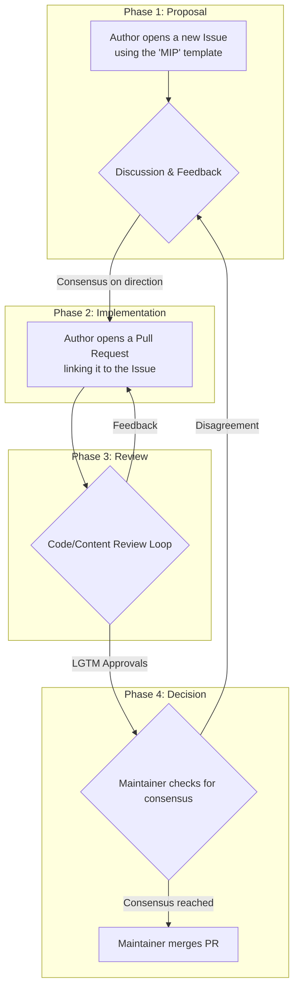
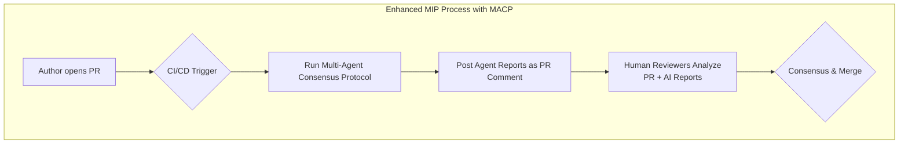

# 🏛️ Governance and Quality Assurance

This document outlines the formal processes for contributing to the AI Persona Builder ecosystem, including both human-driven governance through the Module Improvement Proposal (MIP) process and our vision for automated quality assurance through the Multi-Agent Consensus Protocol (MACP).

## 📜 Table of Contents

- [Governance and Quality Assurance](#governance-and-quality-assurance)
  - [Table of Contents](#table-of-contents)
  - [1. The Module Improvement Proposal (MIP) Process](#1-the-module-improvement-proposal-mip-process)
    - [1.1. Overview](#11-overview)
    - [1.2. Phase 1: The Proposal (Issue)](#12-phase-1-the-proposal-issue)
    - [1.3. Phase 2: The Implementation (Pull Request)](#13-phase-2-the-implementation-pull-request)
    - [1.4. Phase 3: The Review](#14-phase-3-the-review)
    - [1.5. Phase 4: The Decision (Consensus)](#15-phase-4-the-decision-consensus)
  - [2. The Multi-Agent Consensus Protocol (MACP)](#2-the-multi-agent-consensus-protocol-macp)
    - [2.1. Vision and Goals](#21-vision-and-goals)
    - [2.2. Workflow Integration](#22-workflow-integration)
    - [2.3. Agent Roles and Responsibilities](#23-agent-roles-and-responsibilities)
      - [2.3.1. Agent 1: The Scribe (Linter)](#231-agent-1-the-scribe-linter)
      - [2.3.2. Agent 2: The Logician (Validator)](#232-agent-2-the-logician-validator)
      - [2.3.3. Agent 3: The Architect (Expert)](#233-agent-3-the-architect-expert)
    - [2.4. Report Structure](#24-report-structure)
  - [3. Integration: Human + AI Quality Assurance](#3-integration-human--ai-quality-assurance)
    - [3.1. Complementary Strengths](#31-complementary-strengths)
    - [3.2. Decision Framework](#32-decision-framework)
    - [3.3. Continuous Improvement](#33-continuous-improvement)
  - [Implementation Status](#implementation-status)
    - [Current State](#current-state)
    - [Next Steps](#next-steps)

---

## 1. The Module Improvement Proposal (MIP) Process 📝

The MIP process is the official workflow for proposing, discussing, and implementing any changes to the module library or core documentation. This ensures all changes are of high quality and align with the project's vision.

### 1.1. Overview

The MIP process consists of four distinct phases, each with specific roles and responsibilities:



### 1.2. Phase 1: The Proposal (Issue)

Before writing any code or content, the **Author** must open a new Issue using the "Module Improvement Proposal (MIP)" template.

**Requirements:**

- **What:** Clearly state the proposed change
- **Why:** Provide justification and rationale
- **Scope:** Define the impact and affected components

**Purpose:** All high-level discussion and consensus-building happens in this phase. This prevents wasted effort on implementations that may not align with project goals.

### 1.3. Phase 2: The Implementation (Pull Request)

Once there is rough consensus on the direction, the **Author** opens a Pull Request with the implemented changes.

**Requirements:**

- The PR **MUST** link back to the original MIP Issue
- All code/content must follow the established authoring standards
- Include appropriate tests or validation where applicable

### 1.4. Phase 3: The Review

**Reviewers** examine the PR's content against the module authoring guide and established principles.

**Review Criteria:**

- Adherence to schema requirements
- Content quality and clarity
- Alignment with tier-specific rules
- Technical accuracy and completeness

This is a collaborative loop of feedback and iteration until the contribution meets quality standards.

### 1.5. Phase 4: The Decision (Consensus)

We operate on a "lazy consensus" model for final decisions.

**Consensus Requirements:**

- At least **two (2) approvals** from other contributors
- **24-hour final comment period** with no blocking objections
- All review feedback has been addressed

The **Maintainer** then merges the change once consensus is achieved.

---

## 2. The Multi-Agent Consensus Protocol (MACP) 🤖

The MACP represents our vision for automated, AI-driven quality assurance that augments human review with structured, objective analysis.

### 2.1. Vision and Goals

**Primary Goal:** Provide human reviewers with comprehensive, structured analysis to improve review quality and efficiency.

**Secondary Goals:**

- Catch objective quality issues before human review
- Ensure consistent application of authoring standards
- Scale quality assurance as the module library grows

### 2.2. Workflow Integration



**Trigger:** When a Pull Request is opened or updated
**Output:** Structured analysis reports posted as PR comments
**Integration:** AI reports inform but do not replace human decision-making

### 2.3. Agent Roles and Responsibilities

#### 2.3.1. Agent 1: The Scribe (Linter)

**Role:** Objective validation specialist
**Focus:** Strict adherence to authoring guide standards

**Responsibilities:**

- Validate frontmatter structure and required fields
- Check schema compliance (headings, format)
- Verify tier-specific content rules
- Identify formatting and style issues

**Output:** Pass/fail checklist with specific violations

#### 2.3.2. Agent 2: The Logician (Validator)

**Role:** Conceptual integrity specialist
**Focus:** Logic, consistency, and conceptual soundness

**Responsibilities:**

- Analyze logical flow and reasoning
- Identify conceptual overlaps with existing modules
- Check for logical fallacies or contradictions
- Assess clarity and precision of instructions

**Output:** Conceptual analysis with recommendations

#### 2.3.3. Agent 3: The Architect (Expert)

**Role:** Technical accuracy specialist  
**Focus:** Real-world applicability and domain expertise

**Responsibilities:**

- Validate technical accuracy and best practices
- Assess practical applicability
- Review examples and code snippets
- Evaluate alignment with industry standards

**Output:** Technical review with expert assessment

### 2.4. Report Structure

Each agent produces a structured report following this format:

```markdown
## Agent Report: [Agent Name]

### Overall Assessment

- **Status:** [PASS/FAIL/NEEDS_REVIEW]
- **Confidence:** [HIGH/MEDIUM/LOW]

### Key Findings

- [Specific issues or observations]

### Recommendations

- [Actionable suggestions for improvement]

### Details

[Detailed analysis and supporting evidence]
```

---

## 3. Integration: Human + AI Quality Assurance 🤝

### 3.1. Complementary Strengths

**Human Reviewers Excel At:**

- Strategic vision and project alignment
- Subjective quality assessment
- Complex context understanding
- Final decision-making authority

**AI Agents Excel At:**

- Consistent application of objective rules
- Comprehensive coverage of standards
- Pattern recognition across large codebases
- Detailed technical validation

### 3.2. Decision Framework

**AI Reports as Input:** Agent reports provide structured analysis to inform human decisions, not replace them.

**Human Authority:** Final merge decisions remain with human maintainers who consider:

- AI agent findings and recommendations
- Project vision and strategic alignment
- Community feedback and discussion
- Long-term maintenance implications

### 3.3. Continuous Improvement

**Feedback Loop:** Human reviewers can provide feedback on AI agent performance to improve future analysis.

**Iterative Refinement:** Agent prompts and criteria evolve based on real-world usage and community needs.

**Quality Metrics:** Track correlation between AI predictions and human decisions to validate and improve the system.

---

## Implementation Status 📈

### Current State

- **MIP Process:** Fully implemented and operational
- **MACP:** Vision defined, implementation planned for future release

### Next Steps

1. Develop and test individual agent personas
2. Create CI/CD integration infrastructure
3. Pilot program with volunteer contributors
4. Full deployment based on pilot results

This integrated approach ensures both immediate quality through human expertise and scalable, consistent quality assurance through
