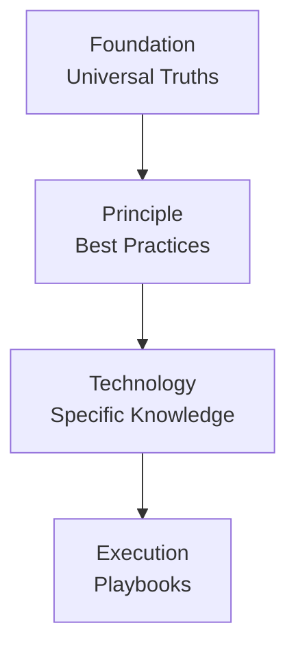

### **Full Project Plan: Copilot Instructions Builder CLI**

#### **1. Vision & Core Concept**

The project is a command-line interface (CLI) tool designed to revolutionize how developers create and manage instructions for AI assistants. It moves away from monolithic, hard-to-maintain prompt files towards a modular, versionable, and shareable ecosystem.

The core purpose of this tool is to act as a **Persona Builder**. By combining modules from four distinct tiers of knowledge, a user can construct a highly specialized AI persona tailored for any development scenario, from high-level architectural planning to detailed, technology-specific bug fixing.

#### **2. Core Architectural Concepts**

- **Module:** The atomic unit of instruction. A single markdown file containing a focused piece of guidance and YAML frontmatter for metadata (`name`, `description`).
- **Tier:** The module's high-level scope and, most importantly, its **compilation priority**. This is determined by the module's top-level directory.
- **Subject:** The module's specific topic, represented by a directory path within a tier. This path can have a maximum depth of two directories to balance organization with simplicity.
- **Persona File:** A self-contained JSON or JSONC file (`*.persona.json` or `*.persona.jsonc`) that defines a single build. It specifies one output file and the modules required to create it. Only files with these extensions are recognized as persona files. The `modules` array must contain at least one valid module identifier; validation will fail if empty or if modules cannot be resolved.
- **Module Path:** The location of the root modules directory (default: `./instructions-modules`).

#### **3. The Four-Tier System: A Layered Architecture**

The architecture is built on a four-tier system. Each tier represents a different level of abstraction and rate of change, ensuring a logical and efficient compilation process from the most abstract principles to the most concrete actions.



1.  **`Foundation`**
    - **Analogy:** The Laws of Physics.
    - **Purpose:** Contains the absolute, universal truths of logic, reason, and systematic thinking. It is completely abstract and applies to any problem-solving domain, inside or outside of software.
    - **Litmus Test:** "Is this a fundamental rule of how to think?"
    - **Examples:** `reasoning/first-principles-thinking`, `logic/deductive-reasoning`, `ethics/be-truthful`.

2.  **`Principle`**
    - **Analogy:** The Engineering Blueprints.
    - **Purpose:** Contains the established principles, practices, methodologies, and architectural patterns of the software engineering profession. These are the "best practices" of the craft, but they are still technology-agnostic.
    - **Litmus Test:** "Is this a widely accepted practice or pattern for building quality software, regardless of the specific language or framework?"
    - **Examples:** `methodology/test-driven-development`, `architecture/microservices`, `quality/solid-principles`, `process/agile-scrum`.

3.  **`Technology`**
    - **Analogy:** The Tool Manual.
    - **Purpose:** Contains the specific, factual knowledge about a particular tool, language, framework, or platform. This is the "how-to" guide for a specific named technology.
    - **Litmus Test:** "Is this knowledge tied to a specific brand or product name (React, Python, AWS, Docker)?"
    - **Examples:** `language/python/pep8-style`, `framework/react/rules-of-hooks`, `platform/aws/iam-best-practices`.

4.  **`Execution`**
    - **Analogy:** The Assembly Instructions.
    - **Purpose:** Contains the literal, step-by-step, imperative playbooks for performing a specific, concrete action _right now_. It combines principles and technology knowledge into a sequence.
    - **Litmus Test:** "Does this describe a sequence of actions to be performed for the current, immediate task?"
    - **Examples:** `playbook/create-api-endpoint`, `playbook/refactor-component`, `playbook/debug-issue`.

#### **4. Directory & File Structure**

The directory structure enforces the four-tier hierarchy. The default directory for modules is `instructions-modules`.

```
copilot-instructions-builder/
├── personas/
│   └── secure-react-developer.persona.json
│
├── instructions-modules/     // Default module path
│   ├── foundation/
│   │   └── reasoning/
│   │       └── 1-systems-thinking.md
│   ├── principle/
│   │   └── security/
│   │       └── 1-owasp-top-10.md
│   ├── technology/
│   │   └── framework/
│   │       └── react/
│   │           └── 1-hooks-rules.md
│   └── execution/
│       └── playbook/
│           └── create-new-component/
│               └── 1-define-props-first.md
│
└── instructions-modules.index.json // Default index file location
```

#### **5. Data Structures (Types)**

```typescript
// src/types/index.ts

/**
 * Represents a single, parsed instruction module from a markdown file.
 */
export interface Module {
  /** Unique identifier, e.g., 'tier/subject/filename' */
  id: string;
  /** The top-level category, e.g., 'foundation' */
  tier: string;
  /** The sub-category path, e.g., 'logic' or 'framework/react' */
  subject: string;
  /** Human-readable name from frontmatter */
  name: string;
  /** Description from frontmatter */
  description: string;
  /** The raw markdown content of the module */
  content: string;
  /** The absolute path to the source file */
  filePath: string;
  /** The layer of the module (foundation tier only) */
  layer?: number;
}

/**
 * Represents the structure of a *.persona.json configuration file.
 */
export interface PersonaConfig {
  name: string;
  description?: string;
  output?: string;
  attributions?: boolean;
  modules: string[];
}
```

#### **6. Module Path Workflows & Configuration**

- **Project-Local Workflow (Default):** The `instructions-modules` directory lives inside the project. This is the recommended approach for collaborative and version-controlled projects.
- **Configuration Precedence:** CLI option > Persona file setting > Default (`./instructions-modules`). Only project-local module paths are supported in the current version.

#### **7. Command-Line Interface (CLI) Design**

- **`build <personaFile>`**
  - **Purpose:** Builds a persona instruction file from a `.persona.json` or `.persona.jsonc` configuration.
  - **Usage:** `copilot-instructions build <personaFile>`
  - **Arguments:**
    - `<personaFile>`: Path to the persona configuration file.
  - **Example:**
    `copilot-instructions build ./personas/my-persona.persona.jsonc`

- **`list`**
  - **Purpose:** Lists all available instruction modules.
  - **Usage:** `copilot-instructions list [options]`
  - **Options:**
    - `-t, --tier <name>`: Filter by tier (`foundation`, `principle`, `technology`, `execution`)
  - **Examples:**
    `copilot-instructions list`
    `copilot-instructions list --tier foundation`

- **`search <query>`**
  - **Purpose:** Searches for modules by name or description.
  - **Usage:** `copilot-instructions search <query> [options]`
  - **Arguments:**
    - `<query>`: The text to search for.
  - **Options:**
    - `-t, --tier <name>`: Restrict the search to a specific tier (`foundation`, `principle`, `technology`, `execution`)
  - **Examples:**
    `copilot-instructions search "logic"`
    `copilot-instructions search "reasoning" --tier foundation`

- **`validate [path]`**
  - **Purpose:** Validates all modules and persona files, or a specific file/directory.
  - **Usage:** `copilot-instructions validate [path]`
  - **Arguments:**
    - `[path]`: Optional path to a specific file or directory.
  - **Examples:**
    `copilot-instructions validate`
    `copilot-instructions validate ./modules/my-module.md`
    `copilot-instructions validate ./personas/my-persona.persona.jsonc`
  - **Behavior:**
    - Checks file extension and schema.
    - Ensures `modules` array is present and non-empty in persona files.
    - Verifies all module identifiers resolve to existing modules.
    - Reports errors for missing/invalid modules or schema violations.

- **`create-module <tier> <subject> <name> [description]`**
  - **Purpose:** Creates a new instruction module file.
  - **Usage:** `copilot-instructions create-module <tier> <subject> <name> [description] [options]`
  - **Arguments:**
    - `<tier>`: The tier for the new module (`foundation`, `principle`, `technology`, `execution`)
    - `<subject>`: The subject path within the tier (e.g., `logic/reasoning`)
    - `<name>`: The name for the new module
    - `[description]`: A short description for the module
  - **Options:**
    - `-l, --layer <number>`: The layer for foundation modules (0-5)
  - **Example:**
    `copilot-instructions create-module foundation logic/reasoning "Systems Thinking" "Module description" --layer 2`

- **`create-persona <name> [description]`**
  - **Purpose:** Creates a new persona configuration file.
  - **Usage:** `copilot-instructions create-persona <name> [description] [options]`
  - **Arguments:**
    - `<name>`: The name for the new persona
    - `[description]`: A short description for the persona
  - **Options:**
    - `--no-attributions`: Do not include attributions in the persona file
    - `-p, --persona-output <path>`: Path where the persona file will be saved (default: `./<name>.persona.jsonc`)
    - `-b, --build-output <file>`: File name for the generated persona markdown (default: `./dist/<name>.md`)
    - `-t, --template <name>`: Name of a template file from `./templates/persona` to use as a base
  - **Examples:**
    `copilot-instructions create-persona "My New Persona"`
    `copilot-instructions create-persona "My New Persona" "A description of my persona."`
    `copilot-instructions create-persona "My New Persona" --persona-output ./personas/my-new-persona.persona.jsonc --build-output ./dist/my-new-persona.md`
    `copilot-instructions create-persona "My New Persona" --no-attributions`
    `copilot-instructions create-persona "My New Persona" --template code-critic`

#### **8. Compilation Logic: Tier-Locked with Globbing**

The compilation process is deterministic and robust.

1.  **Configuration:** The final build configuration is determined by loading the Persona file and overwriting its properties with any matching CLI options.
2.  **Module Resolution:** For each tier, in order (`foundation` -> `principle` -> `technology` -> `execution`), the application resolves the module identifiers. Glob patterns (`/*`) are expanded and sorted alphabetically by filename. Modules must reside within their correct tier directory; location enforcement is strict.
3.  **Assembly:** The content of all resolved modules is concatenated into a single string, strictly following the four-tier order. Sorting is always alphabetical within each tier.

#### **9. Future Enhancements (Post-MVP)**

The architecture is designed to support future growth, including:

- **Namespaces & Versioning:** To enable a multi-user ecosystem.
