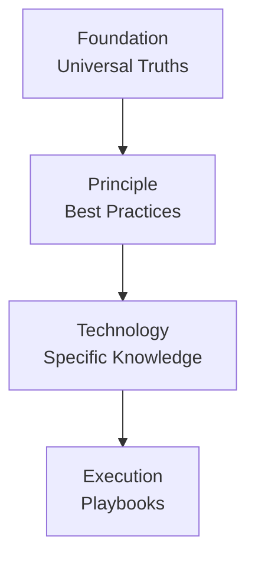

### **Full Project Plan: Copilot Instructions Builder CLI**

#### **1. Vision & Core Concept**

The project is a command-line interface (CLI) tool designed to revolutionize how developers create and manage instructions for AI assistants. It moves away from monolithic, hard-to-maintain prompt files towards a modular, versionable, and shareable ecosystem.

The core purpose of this tool is to act as a **Persona Builder**. By combining modules from four distinct tiers of knowledge, a user can construct a highly specialized AI persona tailored for any development scenario, from high-level architectural planning to detailed, technology-specific bug fixing.

#### **2. Core Architectural Concepts**

- **Module:** The atomic unit of instruction. A single markdown file containing a focused piece of guidance and YAML frontmatter for metadata (`name`, `description`).
- **Tier:** The module's high-level scope and, most importantly, its **compilation priority**. This is determined by the module's top-level directory.
- **Subject:** The module's specific topic, represented by a directory path within a tier. This path can have a maximum depth of two directories to balance organization with simplicity.
- **Persona File:** A self-contained JSON file (`*.persona.jsonc`) that defines a single build. It specifies one output file and the modules required to create it.
- **Module Path:** The location of the root modules directory (default: `./instructions-modules`).
- **Module Index:** A pre-compiled JSON cache of all module metadata (`instructions-modules.index.json`), used to accelerate the `list` and `search` commands.

#### **3. The Four-Tier System: A Layered Architecture**

The architecture is built on a four-tier system. Each tier represents a different level of abstraction and rate of change, ensuring a logical and efficient compilation process from the most abstract principles to the most concrete actions.



1.  **`Foundation`**
    - **Analogy:** The Laws of Physics.
    - **Purpose:** Contains the absolute, universal truths of logic, reason, and systematic thinking. It is completely abstract and applies to any problem-solving domain, inside or outside of software.
    - **Litmus Test:** "Is this a fundamental rule of how to think?"
    - **Examples:** `reasoning/first-principles-thinking`, `logic/deductive-reasoning`, `ethics/be-truthful`.

2.  **`Principle`**
    - **Analogy:** The Engineering Blueprints.
    - **Purpose:** Contains the established principles, practices, methodologies, and architectural patterns of the software engineering profession. These are the "best practices" of the craft, but they are still technology-agnostic.
    - **Litmus Test:** "Is this a widely accepted practice or pattern for building quality software, regardless of the specific language or framework?"
    - **Examples:** `methodology/test-driven-development`, `architecture/microservices`, `quality/solid-principles`, `process/agile-scrum`.

3.  **`Technology`**
    - **Analogy:** The Tool Manual.
    - **Purpose:** Contains the specific, factual knowledge about a particular tool, language, framework, or platform. This is the "how-to" guide for a specific named technology.
    - **Litmus Test:** "Is this knowledge tied to a specific brand or product name (React, Python, AWS, Docker)?"
    - **Examples:** `language/python/pep8-style`, `framework/react/rules-of-hooks`, `platform/aws/iam-best-practices`.

4.  **`Execution`**
    - **Analogy:** The Assembly Instructions.
    - **Purpose:** Contains the literal, step-by-step, imperative playbooks for performing a specific, concrete action _right now_. It combines principles and technology knowledge into a sequence.
    - **Litmus Test:** "Does this describe a sequence of actions to be performed for the current, immediate task?"
    - **Examples:** `playbook/create-api-endpoint`, `playbook/refactor-component`, `playbook/debug-issue`.

#### **4. Directory & File Structure**

The directory structure enforces the four-tier hierarchy. The default directory for modules is `instructions-modules`.

```
copilot-instructions-builder/
├── personas/
│   └── secure-react-developer.persona.json
│
├── instructions-modules/     // Default module path
│   ├── foundation/
│   │   └── reasoning/
│   │       └── 1-systems-thinking.md
│   ├── principle/
│   │   └── security/
│   │       └── 1-owasp-top-10.md
│   ├── technology/
│   │   └── framework/
│   │       └── react/
│   │           └── 1-hooks-rules.md
│   └── execution/
│       └── playbook/
│           └── create-new-component/
│               └── 1-define-props-first.md
│
└── instructions-modules.index.json // Default index file location
```

#### **5. Data Structures (Types)**

```typescript
// src/types/index.ts

/**
 * The four tiers of the modular architecture, representing different levels
 * of abstraction and compilation priority.
 */
export type ModuleTier =
  | 'foundation'
  | 'principle'
  | 'technology'
  | 'execution';

/**
 * Metadata structure for module frontmatter (YAML)
 */
export interface ModuleMetadata {
  tier: ModuleTier;
  name: string;
  subject: string;
  description: string;
  tags?: string[];
  dependencies?: string[];
  conflicts?: string[];
}

/**
 * Lightweight module representation used in the module index
 */
export interface IndexedModule {
  id: string;
  path: string;
  tier: ModuleTier;
  subject: string;
  metadata: ModuleMetadata;
}

/**
 * Complete module data structure including content
 */
export interface Module {
  id: string;
  path: string;
  metadata: ModuleMetadata;
  content: string;
}

/**
 * Persona file structure defining instruction composition requirements
 */
export interface PersonaFile {
  name: string;
  description?: string;
  output: {
    file: string;
    format?: {
      includeAttribution?: boolean;
      header?: string;
      footer?: string;
    };
  };
  modules: string[];
  optional_modules?: string[];
}
```

#### **6. Module Path Workflows & Configuration**

- **Project-Local Workflow (Default):** The `instructions-modules` directory lives inside the project. This is the recommended approach for collaborative and version-controlled projects.
- **Centralized (Global) Workflow:** A user can maintain a master modules directory (e.g., `~/.instructions-modules`) and reference it from multiple projects using the `--modules-path` CLI option or the `modulesPath` setting in a Persona file.
- **Configuration Precedence:** CLI option > Persona file setting > Default (`./instructions-modules`).

#### **7. Command-Line Interface (CLI) Design**

- **Global Option**
  - `-m, --modules-path <path>`: Specifies the path to the modules directory.

- **`index`**
  - **Purpose:** Scans the module directory and creates/updates the index file. **This command must be run whenever modules are added, removed, or have their frontmatter changed.**
  - **Usage:** `copilot-instructions index` or `copilot-instructions index -m ~/.instructions-modules`

- **`list`**
  - **Purpose:** Displays available modules from the index.
  - **Usage:** `copilot-instructions list`, `copilot-instructions list -f`, `copilot-instructions list -p -t`
  - **Options:** `-f, --foundation`, `-p, --principle`, `-t, --technology`, `-e, --execution`.

- **`search <query>`**
  - **Purpose:** Searches modules from the index.
  - **Usage:** `copilot-instructions search "hooks"`, `copilot-instructions search -t "hooks"`
  - **Options:** `-f, --foundation`, `-p, --principle`, `-t, --technology`, `-e, --execution`.

- **`build [personaFile]`**
  - **Purpose:** Compiles instructions into a final output file.
  - **Usage:** `copilot-instructions build ./personas/my-persona.json`, `copilot-instructions -o "temp.md" --foundation "reasoning/*"`
  - **Options:**
    - `-o, --output <path>`
    - `-m, --modules-path <path>`
    - `--foundation <modules...>`
    - `--principle <modules...>`
    - `--technology <modules...>`
    - `--execution <modules...>`
    - `--modules <modules...>`
    - `--optional-modules <modules...>`
    - `--include-attribution`
    - `--header <text>`
    - `--footer <text>`

#### **8. Compilation Logic: Tier-Locked with Globbing**

The compilation process is deterministic and robust.

1.  **Configuration:** The final build configuration is determined by loading the Persona file and overwriting its properties with any matching CLI options.
2.  **Module Resolution:** For each tier, in order (`foundation` -> `principle` -> `technology` -> `execution`), the application resolves the module identifiers. Glob patterns (`/*`) are expanded and sorted alphabetically by filename.
3.  **Assembly:** The content of all resolved modules is concatenated into a single string, strictly following the four-tier order.

#### **9. Future Enhancements (Post-MVP)**

The architecture is designed to support future growth, including:

- **Namespaces & Versioning:** To enable a multi-user ecosystem.
- **Online Registry:** For sharing and discovering modules (`add`, `publish` commands).
- **Interactive Mode:** An `init` command for interactively building Persona files.
- **Advanced Strategies:** Such as `verbose` or `section-overwrite` compilation.
