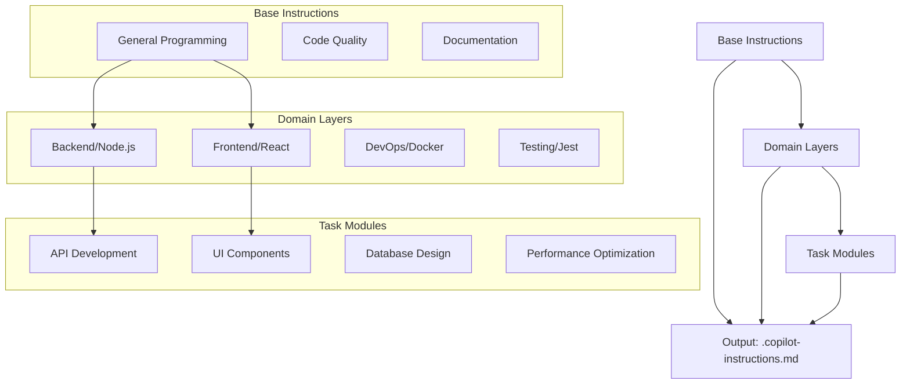
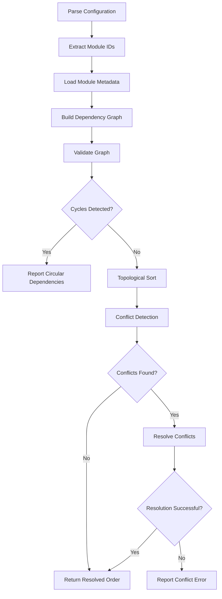
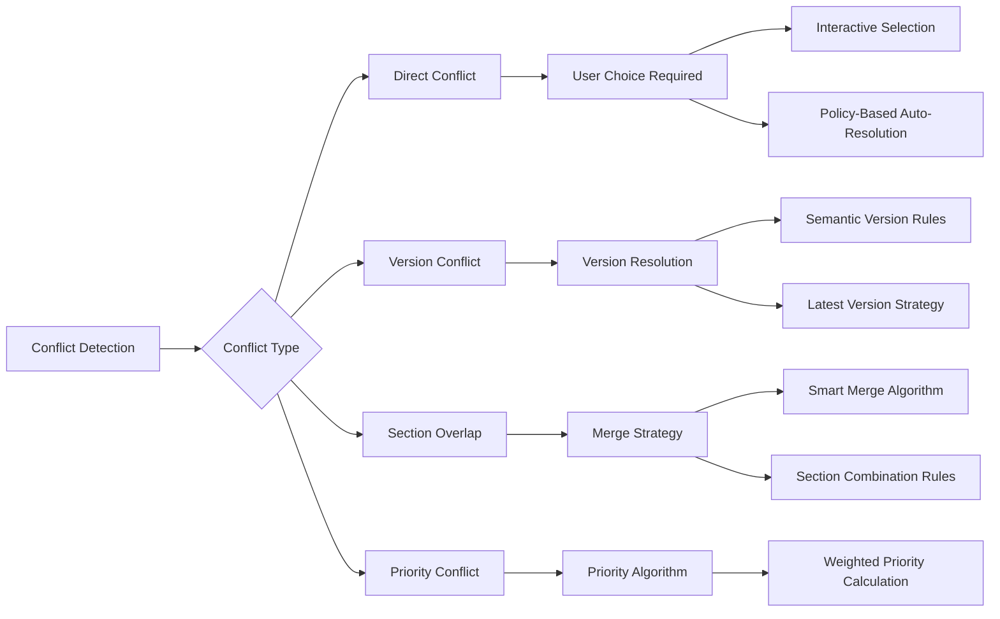
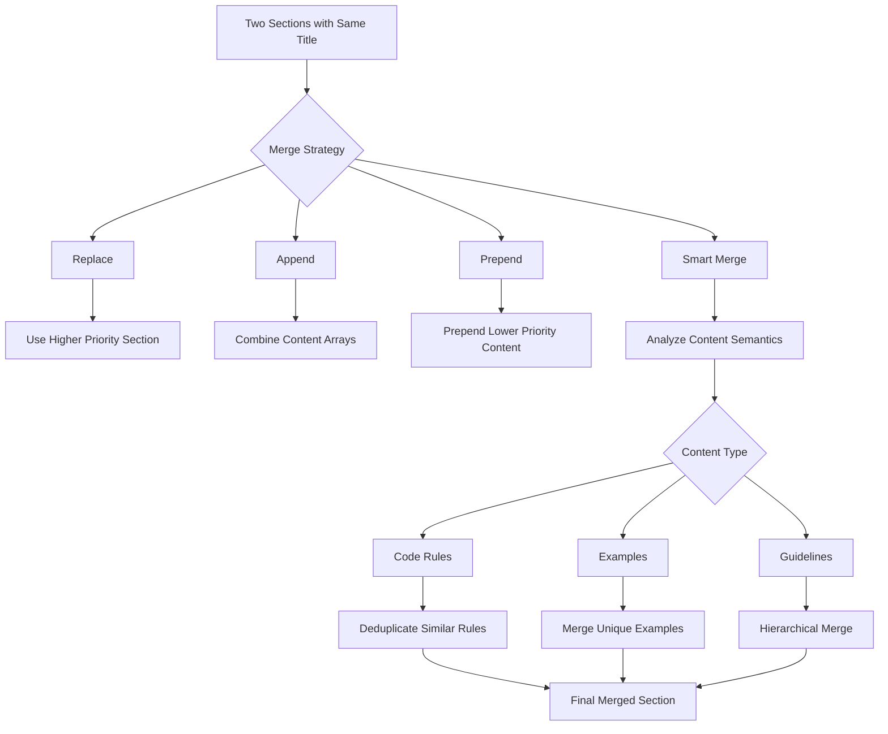
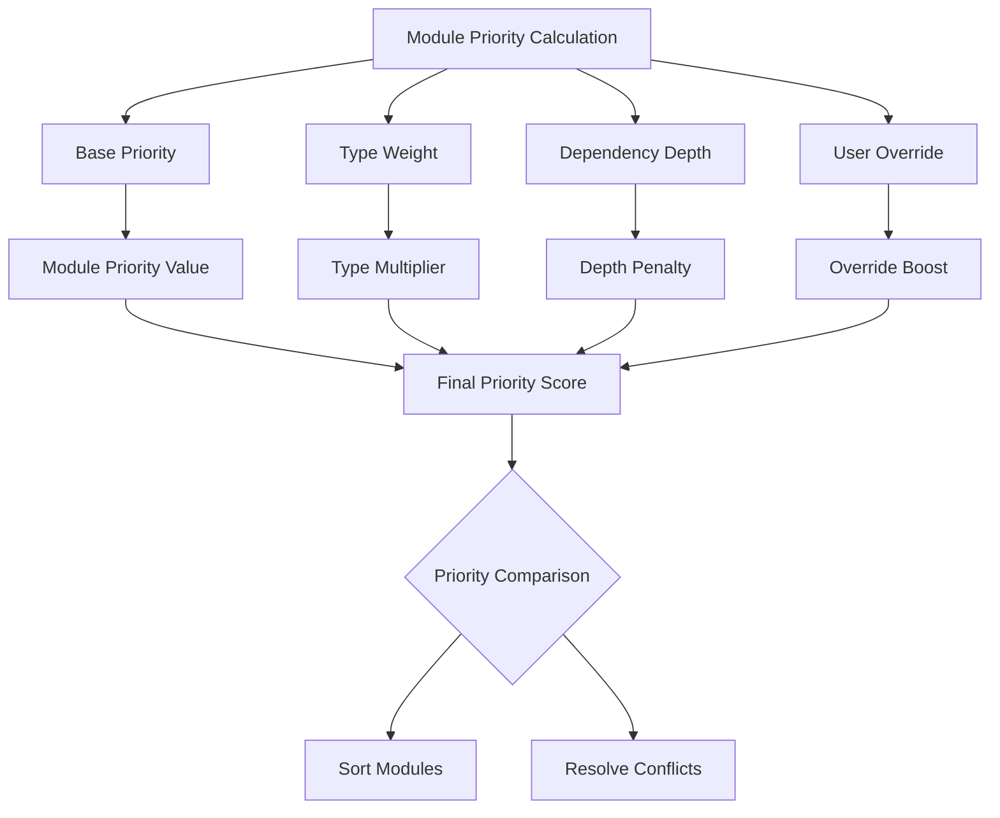
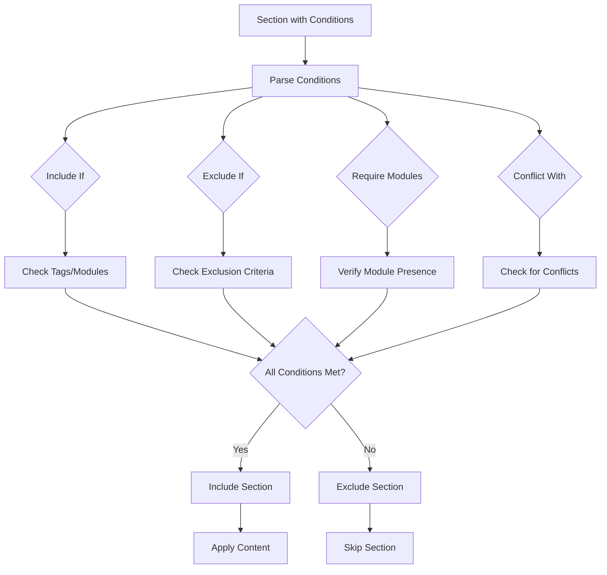
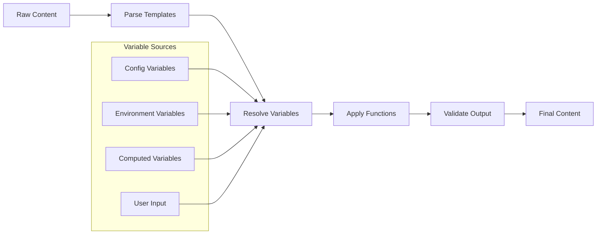
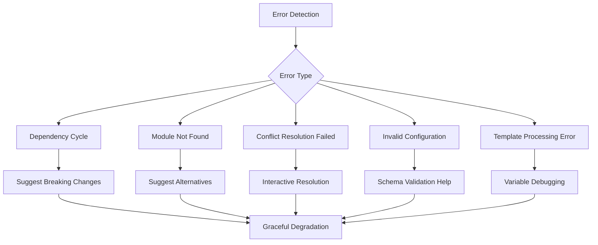
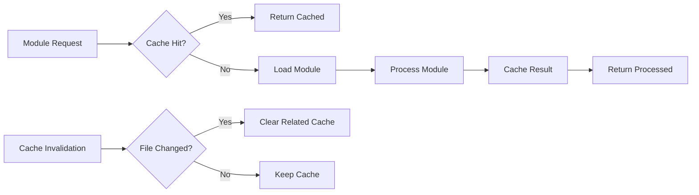

# Copilot Instructions Builder CLI - Detailed Architectural Plan
<!-- Generated by Claude Sonnet 4 -->

## Overview

A new CLI application for building GitHub Copilot instruction files from modular, hierarchical components. The system supports a three-tier architecture: **Base Instructions** → **Domain-Specific Layers** → **Task-Specific Modules**, with both configuration-driven and command-driven interfaces.

## Core Architecture

### Hierarchical Instruction System



### Module Structure

Each instruction module follows a consistent structure:

```json
{
  "id": "module-identifier",
  "name": "Module Display Name",
  "type": "base|domain|task",
  "version": "1.0.0",
  "dependencies": ["required-module-ids"],
  "conflicts": ["conflicting-module-ids"],
  "tags": ["react", "frontend", "ui"],
  "priority": 100,
  "metadata": {
    "description": "Module description",
    "author": "author-name",
    "category": "frontend|backend|testing|devops|general",
    "weight": 50
  },
  "instructions": {
    "sections": [
      {
        "id": "section-identifier",
        "title": "Section Title",
        "priority": 100,
        "merge_strategy": "replace|append|prepend|smart_merge",
        "content": ["instruction 1", "instruction 2"],
        "conditions": {
          "include_if": ["tag1", "tag2"],
          "exclude_if": ["tag3"],
          "require_modules": ["module-id"],
          "conflict_with": ["conflicting-module"]
        }
      }
    ]
  },
  "variables": {
    "projectName": "{{PROJECT_NAME}}",
    "framework": "{{FRAMEWORK}}"
  },
  "hooks": {
    "pre_compose": "function_name",
    "post_compose": "function_name"
  }
}
```

## Detailed Composition Algorithm

### 1. Module Resolution Phase



#### Dependency Resolution Algorithm

```javascript
class DependencyResolver {
  async resolve(moduleIds, options = {}) {
    const graph = new Map();
    const visited = new Set();
    const visiting = new Set();
    const resolved = [];
    
    // Phase 1: Build dependency graph
    for (const id of moduleIds) {
      await this.buildGraph(id, graph, visited);
    }
    
    // Phase 2: Detect cycles using DFS
    for (const [id, module] of graph) {
      if (!visited.has(id)) {
        const cycle = this.detectCycle(id, graph, new Set(), new Set());
        if (cycle.length > 0) {
          throw new CircularDependencyError(cycle);
        }
      }
    }
    
    // Phase 3: Topological sort
    const sorted = this.topologicalSort(graph);
    
    // Phase 4: Conflict detection and resolution
    return this.resolveConflicts(sorted, options);
  }
  
  detectCycle(nodeId, graph, visiting, visited) {
    if (visiting.has(nodeId)) {
      return [nodeId]; // Cycle found
    }
    
    if (visited.has(nodeId)) {
      return [];
    }
    
    visiting.add(nodeId);
    const node = graph.get(nodeId);
    
    for (const depId of node.dependencies) {
      const cycle = this.detectCycle(depId, graph, visiting, visited);
      if (cycle.length > 0) {
        cycle.unshift(nodeId);
        return cycle;
      }
    }
    
    visiting.delete(nodeId);
    visited.add(nodeId);
    return [];
  }
}
```

### 2. Conflict Resolution System

#### Conflict Types and Resolution Strategies



#### Conflict Resolution Implementation

```javascript
class ConflictResolver {
  async resolveConflicts(modules, resolutionPolicy = 'interactive') {
    const conflicts = this.detectConflicts(modules);
    const resolved = [];
    
    for (const conflict of conflicts) {
      switch (conflict.type) {
        case 'direct':
          resolved.push(await this.resolveDirectConflict(conflict, resolutionPolicy));
          break;
        case 'version':
          resolved.push(this.resolveVersionConflict(conflict));
          break;
        case 'section_overlap':
          resolved.push(await this.resolveSectionConflict(conflict));
          break;
        case 'priority':
          resolved.push(this.resolvePriorityConflict(conflict));
          break;
      }
    }
    
    return this.mergeResolvedModules(modules, resolved);
  }
  
  detectConflicts(modules) {
    const conflicts = [];
    const moduleMap = new Map(modules.map(m => [m.id, m]));
    
    // Direct conflicts
    for (const module of modules) {
      for (const conflictId of module.conflicts || []) {
        if (moduleMap.has(conflictId)) {
          conflicts.push({
            type: 'direct',
            modules: [module.id, conflictId],
            severity: 'high'
          });
        }
      }
    }
    
    // Section overlaps
    const sectionMap = new Map();
    for (const module of modules) {
      for (const section of module.instructions.sections) {
        const key = `${section.title}-${section.id || ''}`;
        if (sectionMap.has(key)) {
          conflicts.push({
            type: 'section_overlap',
            section: key,
            modules: [sectionMap.get(key), module.id],
            severity: this.calculateSeverity(section)
          });
        } else {
          sectionMap.set(key, module.id);
        }
      }
    }
    
    return conflicts;
  }
  
  async resolveDirectConflict(conflict, policy) {
    switch (policy) {
      case 'interactive':
        return this.promptUserChoice(conflict);
      case 'priority':
        return this.resolveByCPriority(conflict);
      case 'latest':
        return this.resolveByVersion(conflict);
      case 'fail':
        throw new ConflictError(`Unresolvable conflict: ${conflict.modules.join(' vs ')}`);
    }
  }
}
```

### 3. Smart Merge Algorithm

#### Section Merging Strategies



#### Smart Merge Implementation

```javascript
class SmartMerger {
  mergeSections(section1, section2) {
    const strategy = this.determineMergeStrategy(section1, section2);
    
    switch (strategy) {
      case 'replace':
        return this.priorityReplace(section1, section2);
      case 'append':
        return this.appendContent(section1, section2);
      case 'smart_merge':
        return this.intelligentMerge(section1, section2);
      default:
        return this.defaultMerge(section1, section2);
    }
  }
  
  intelligentMerge(section1, section2) {
    const merged = {
      ...section1,
      content: []
    };
    
    // Analyze content types
    const content1 = this.categorizeContent(section1.content);
    const content2 = this.categorizeContent(section2.content);
    
    // Merge by content type
    merged.content = [
      ...this.mergeContentType(content1.rules, content2.rules, 'rules'),
      ...this.mergeContentType(content1.examples, content2.examples, 'examples'),
      ...this.mergeContentType(content1.guidelines, content2.guidelines, 'guidelines')
    ];
    
    return merged;
  }
  
  categorizeContent(content) {
    const categories = { rules: [], examples: [], guidelines: [] };
    
    for (const item of content) {
      if (this.isRule(item)) {
        categories.rules.push(item);
      } else if (this.isExample(item)) {
        categories.examples.push(item);
      } else {
        categories.guidelines.push(item);
      }
    }
    
    return categories;
  }
  
  mergeContentType(content1, content2, type) {
    switch (type) {
      case 'rules':
        return this.deduplicateRules([...content1, ...content2]);
      case 'examples':
        return this.mergeExamples(content1, content2);
      case 'guidelines':
        return this.hierarchicalMerge(content1, content2);
      default:
        return [...content1, ...content2];
    }
  }
  
  deduplicateRules(rules) {
    const seen = new Set();
    const unique = [];
    
    for (const rule of rules) {
      const normalized = this.normalizeRule(rule);
      if (!seen.has(normalized)) {
        seen.add(normalized);
        unique.push(rule);
      }
    }
    
    return unique;
  }
}
```

### 4. Priority Calculation System

#### Multi-Factor Priority Algorithm



#### Priority Calculation Implementation

```javascript
class PriorityCalculator {
  calculateModulePriority(module, context) {
    const factors = {
      basePriority: module.priority || 0,
      typeWeight: this.getTypeWeight(module.type),
      dependencyDepth: this.calculateDepth(module, context.dependencyGraph),
      userOverride: context.userPriorities[module.id] || 0,
      conflictPenalty: this.calculateConflictPenalty(module, context.conflicts),
      metadataWeight: module.metadata?.weight || 0
    };
    
    return this.computeFinalPriority(factors);
  }
  
  computeFinalPriority(factors) {
    const {
      basePriority,
      typeWeight,
      dependencyDepth,
      userOverride,
      conflictPenalty,
      metadataWeight
    } = factors;
    
    // Weighted formula for priority calculation
    const typeScore = basePriority * typeWeight;
    const depthPenalty = Math.max(0, dependencyDepth * 5); // Penalty for deep dependencies
    const overrideBoost = userOverride * 10; // Strong user preference
    const conflictMalus = conflictPenalty * 2; // Penalty for conflicts
    
    return Math.round(
      typeScore - depthPenalty + overrideBoost - conflictMalus + metadataWeight
    );
  }
  
  getTypeWeight(type) {
    const weights = {
      'base': 1.0,      // Foundation modules
      'domain': 1.2,    // Slightly higher for domain expertise
      'task': 1.5       // Highest for specific tasks
    };
    return weights[type] || 1.0;
  }
  
  calculateDepth(module, graph) {
    const visited = new Set();
    
    function traverse(nodeId, depth = 0) {
      if (visited.has(nodeId)) return depth;
      visited.add(nodeId);
      
      const node = graph.get(nodeId);
      if (!node || !node.dependencies.length) return depth;
      
      return Math.max(
        ...node.dependencies.map(depId => traverse(depId, depth + 1))
      );
    }
    
    return traverse(module.id);
  }
}
```

### 5. Conditional Instruction Processing

#### Condition Evaluation Engine



#### Condition Evaluation Implementation

```javascript
class ConditionEvaluator {
  evaluateSection(section, context) {
    const conditions = section.conditions || {};
    
    // All conditions must pass for section to be included
    const checks = [
      this.checkIncludeIf(conditions.include_if, context),
      this.checkExcludeIf(conditions.exclude_if, context),
      this.checkRequireModules(conditions.require_modules, context),
      this.checkConflictWith(conditions.conflict_with, context)
    ];
    
    return checks.every(check => check === true);
  }
  
  checkIncludeIf(criteria, context) {
    if (!criteria || criteria.length === 0) return true;
    
    // OR logic: any criteria match
    return criteria.some(criterion => {
      if (this.isTag(criterion)) {
        return context.activeTags.has(criterion);
      }
      if (this.isModule(criterion)) {
        return context.activeModules.has(criterion);
      }
      if (this.isVariable(criterion)) {
        return this.evaluateVariableCondition(criterion, context.variables);
      }
      return false;
    });
  }
  
  checkExcludeIf(criteria, context) {
    if (!criteria || criteria.length === 0) return true;
    
    // None of the exclusion criteria should match
    return !criteria.some(criterion => {
      if (this.isTag(criterion)) {
        return context.activeTags.has(criterion);
      }
      if (this.isModule(criterion)) {
        return context.activeModules.has(criterion);
      }
      return false;
    });
  }
  
  evaluateVariableCondition(condition, variables) {
    // Support conditions like: "FRAMEWORK=React", "ENV!=production"
    const [variable, operator, value] = this.parseCondition(condition);
    const actualValue = variables[variable];
    
    switch (operator) {
      case '=':
      case '==':
        return actualValue === value;
      case '!=':
        return actualValue !== value;
      case 'contains':
        return actualValue && actualValue.includes(value);
      case 'startsWith':
        return actualValue && actualValue.startsWith(value);
      default:
        return false;
    }
  }
}
```

### 6. Variable Template System

#### Template Processing Pipeline



#### Variable Processing Implementation

```javascript
class TemplateProcessor {
  processContent(content, variables, functions = {}) {
    if (Array.isArray(content)) {
      return content.map(item => this.processString(item, variables, functions));
    }
    return this.processString(content, variables, functions);
  }
  
  processString(template, variables, functions) {
    // Support multiple template syntaxes
    const patterns = {
      simple: /\{\{(\w+)\}\}/g,                    // {{VAR}}
      default: /\{\{(\w+)\s*\|\|\s*['"]([^'"]*)['"]\}\}/g, // {{VAR || 'default'}}
      function: /\{\{(\w+)\(([^)]*)\)\}\}/g,       // {{func(args)}}
      complex: /\{\{([^}]+)\}\}/g                  // {{complex expression}}
    };
    
    let processed = template;
    
    // Process simple variables
    processed = processed.replace(patterns.simple, (match, varName) => {
      return variables[varName] ?? match;
    });
    
    // Process variables with defaults
    processed = processed.replace(patterns.default, (match, varName, defaultValue) => {
      return variables[varName] ?? defaultValue;
    });
    
    // Process function calls
    processed = processed.replace(patterns.function, (match, funcName, args) => {
      const func = functions[funcName];
      if (func) {
        const parsedArgs = this.parseArguments(args, variables);
        return func(...parsedArgs);
      }
      return match;
    });
    
    return processed;
  }
  
  parseArguments(argsString, variables) {
    if (!argsString.trim()) return [];
    
    return argsString.split(',').map(arg => {
      const trimmed = arg.trim();
      
      // String literal
      if (trimmed.startsWith('"') && trimmed.endsWith('"')) {
        return trimmed.slice(1, -1);
      }
      
      // Number
      if (/^\d+$/.test(trimmed)) {
        return parseInt(trimmed);
      }
      
      // Variable reference
      return variables[trimmed] ?? trimmed;
    });
  }
}
## CLI Commands

### Quick Operations

```bash
# Initialize a new project configuration
copilot-instructions init

# List available modules
copilot-instructions list [--type base|domain|task] [--tags react,frontend]

# Quick build with modules
copilot-instructions build --base programming-fundamentals --domain frontend/react --task ui-components

# Add module to existing config
copilot-instructions add frontend/vue

# Validate configuration
copilot-instructions validate

# Show module dependencies
copilot-instructions deps frontend/react

# Search modules
copilot-instructions search "api development"

# Enable/disable instruction files (low-priority feature)
copilot-instructions active --enable
copilot-instructions active --disable
copilot-instructions active --status
```

### Configuration-Driven Operations

```bash
# Build from configuration file
copilot-instructions build

# Build specific profile
copilot-instructions build --profile production

# Use custom config file
copilot-instructions build --config ./configs/backend.config.js

# Build all profiles
copilot-instructions build --all-profiles
```

```

## Directory Structure

```
copilot-instructions-builder/
├── src/
│   ├── core/
│   │   ├── cli.js              # Main CLI entry point
│   │   ├── composer.js         # Instruction composition engine
│   │   ├── resolver.js         # Dependency resolution
│   │   ├── conflict-resolver.js # Conflict detection and resolution
│   │   ├── priority-calculator.js # Priority calculation system
│   │   ├── condition-evaluator.js # Conditional instruction processing
│   │   ├── template-processor.js  # Variable template processing
│   │   ├── smart-merger.js     # Smart section merging
│   │   ├── validator.js        # Module validation
│   │   └── config-manager.js   # Configuration handling
│   ├── modules/
│   │   ├── discovery.js        # Module discovery and indexing
│   │   ├── loader.js          # Module loading and caching
│   │   └── registry.js        # Module registry management
│   ├── commands/
│   │   ├── build.js           # Build command
│   │   ├── list.js            # List modules command
│   │   ├── init.js            # Initialize project command
│   │   ├── add.js             # Add module command
│   │   ├── validate.js        # Validate configuration command
│   │   ├── resolve.js         # Dependency resolution command
│   │   └── active.js          # Enable/disable instruction files (low-priority)
│   ├── utils/
│   │   ├── templates.js       # Template processing utilities
│   │   ├── output.js          # Output formatting
│   │   ├── logger.js          # Logging utilities
│   │   └── errors.js          # Custom error classes
│   └── algorithms/
│       ├── graph.js           # Graph algorithms
│       ├── topological-sort.js # Topological sorting
│       └── cycle-detection.js  # Cycle detection algorithms
├── modules/                   # Built-in instruction modules
│   ├── base/
│   │   ├── programming-fundamentals.json
│   │   ├── code-quality.json
│   │   └── documentation.json
│   ├── domains/
│   │   ├── frontend/
│   │   │   ├── react.json
│   │   │   ├── vue.json
│   │   │   └── vanilla-js.json
│   │   ├── backend/
│   │   │   ├── nodejs.json
│   │   │   ├── python.json
│   │   │   └── go.json
│   │   └── testing/
│   │       ├── jest.json
│   │       ├── cypress.json
│   │       └── playwright.json
│   └── tasks/
│       ├── api-development.json
│       ├── ui-components.json
│       ├── database-design.json
│       └── performance-optimization.json
├── templates/                 # Output templates
│   ├── default.hbs
│   ├── markdown.hbs
│   └── json.hbs
├── config/
│   ├── schema.json           # Configuration schema
│   └── defaults.json         # Default settings
└── tests/
    ├── unit/
    ├── integration/
    └── fixtures/
```

## Error Handling and Recovery

### Error Types and Recovery Strategies



### Error Classes

```javascript
class CopilotBuilderError extends Error {
  constructor(message, context = {}) {
    super(message);
    this.context = context;
    this.name = this.constructor.name;
  }
}

class CircularDependencyError extends CopilotBuilderError {
  constructor(cycle) {
    const path = cycle.join(' → ');
    super(`Circular dependency detected: ${path}`);
    this.cycle = cycle;
  }
  
  getSuggestion() {
    return `Consider removing one of these dependencies: ${this.cycle.join(', ')}`;
  }
}

class ConflictResolutionError extends CopilotBuilderError {
  constructor(conflicts) {
    super(`Unable to resolve module conflicts`);
    this.conflicts = conflicts;
  }
  
  getSuggestion() {
    return `Use --interactive flag to manually resolve conflicts`;
  }
}
```

## Performance Optimizations

### Caching Strategy



### Performance Features

1. **Lazy Loading**: Load modules only when needed
2. **Incremental Builds**: Only rebuild changed dependencies
3. **Parallel Processing**: Resolve independent modules concurrently
4. **Memory Management**: Stream large instruction sets
5. **Cache Strategies**: Multi-level caching for modules and results

## Testing Strategy

### Test Coverage Areas

1. **Unit Tests**
   - Dependency resolution algorithms
   - Conflict resolution logic
   - Template processing
   - Priority calculations

2. **Integration Tests**
   - End-to-end composition workflows
   - CLI command interactions
   - Configuration loading and validation

3. **Performance Tests**
   - Large module set handling
   - Memory usage optimization
   - Build time benchmarks

4. **Error Handling Tests**
   - Graceful failure scenarios
   - Recovery mechanisms
   - User-friendly error messages

This detailed architectural plan provides a comprehensive foundation for building a robust, scalable CLI application for modular GitHub Copilot instruction composition. The algorithms and strategies outlined ensure reliable conflict resolution, intelligent merging, and efficient processing of complex module hierarchies.