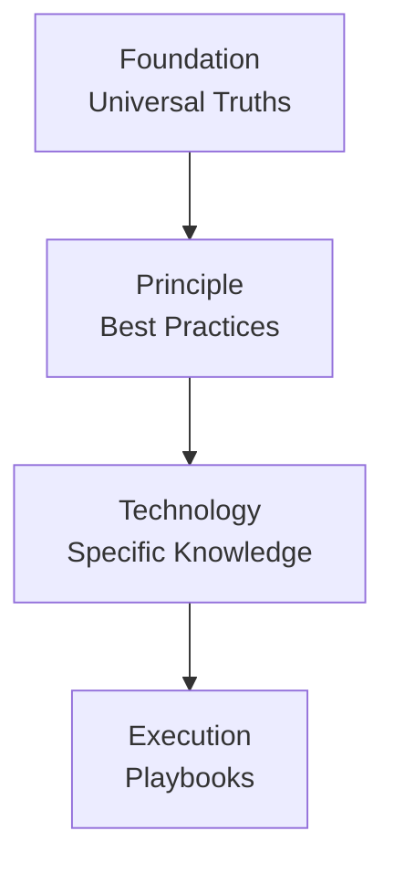

# Architecture

## Four-Tier System

The Copilot Instructions Builder CLI is structured around a layered, four-tier architecture. Each tier represents a different level of abstraction and rate of change, ensuring a logical flow from universal principles to concrete actions.

### 1. Foundation
- **Analogy:** Laws of Physics
- **Purpose:** Universal truths of logic, reasoning, and systematic thinking. Abstract and domain-agnostic.
- **Examples:** Reasoning, logic, ethics.

### 2. Principle
- **Analogy:** Engineering Blueprints
- **Purpose:** Established software engineering principles, methodologies, and patterns. Technology-agnostic best practices.
- **Examples:** Test-driven development, microservices, SOLID principles.

### 3. Technology
- **Analogy:** Tool Manual
- **Purpose:** Specific knowledge about tools, languages, frameworks, or platforms.
- **Examples:** Python PEP8, React Hooks, AWS IAM.

### 4. Execution
- **Analogy:** Assembly Instructions
- **Purpose:** Step-by-step playbooks for concrete, immediate tasks.
- **Examples:** Creating an API endpoint, refactoring a component.

---

## Directory Structure

The directory structure enforces the four-tier hierarchy and organizes modules for clarity and scalability.

```plaintext
copilot-instructions-builder/
├── personas/
│   └── secure-react-developer.persona.json
│
├── instructions-modules/
│   ├── foundation/
│   │   └── reasoning/
│   │       └── 1-systems-thinking.md
│   ├── principle/
│   │   └── security/
│   │       └── 1-owasp-top-10.md
│   ├── technology/
│   │   └── framework/
│   │       └── react/
│   │           └── 1-hooks-rules.md
│   └── execution/
│       └── playbook/
│           └── create-new-component/
│               └── 1-define-props-first.md
│
└── instructions-modules.index.json
```

---

## Architectural Diagram



---

## Compilation Flow

1. **Foundation** modules are compiled first.
2. **Principle** modules are layered on top.
3. **Technology** modules are added next.
4. **Execution** modules finalize the output.

This ensures that every persona or instruction set is built from abstract reasoning down to actionable steps.