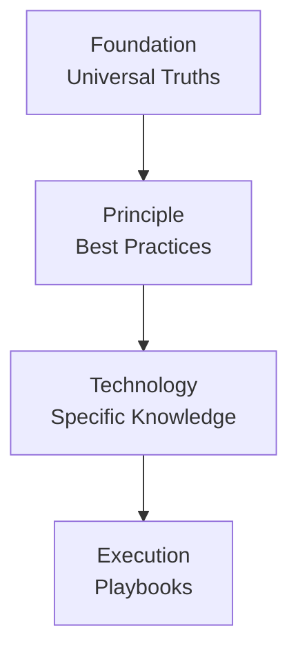

# Architecture

## Four-Tier System

The Copilot Instructions Builder CLI is structured around a layered, four-tier architecture. Each tier represents a different level of abstraction and rate of change, ensuring a logical flow from universal principles to concrete actions.

### 1. Foundation

- **Analogy:** Laws of Physics
- **Purpose:** This tier contains universal, domain-agnostic truths of logic, reasoning, and systematic thinking. These modules are abstract and provide the foundational principles that guide all other instructions. They change rarely, if ever.
- **Examples:** Deductive reasoning, systems thinking, bias awareness.

### 2. Principle

- **Analogy:** Engineering Blueprints
- **Purpose:** This tier builds on the foundation with established software engineering principles, methodologies, and patterns. These are best practices that are generally technology-agnostic but specific to the domain of software development.
- **Examples:** Test-driven development (TDD), SOLID principles, separation of concerns.

### 3. Technology

- **Analogy:** Tool Manual
- **Purpose:** This tier provides specific knowledge about particular tools, languages, frameworks, or platforms. These modules are highly specific and are likely to be updated as technologies evolve.
- **Examples:** Python PEP8 standards, React Hooks guidelines, AWS IAM policies.

### 4. Execution

- **Analogy:** Assembly Instructions
- **Purpose:** This is the most concrete tier, providing step-by-step playbooks for specific, immediate tasks. These instructions are highly detailed and guide the user through a particular workflow.
- **Examples:** Creating a new API endpoint, refactoring a React component, auditing a smart contract.

---

## Directory Structure

The directory structure enforces the four-tier hierarchy and organizes modules for clarity and scalability.

```plaintext
copilot-instructions-builder/
├── personas/
│   └── secure-react-developer.persona.json
│
├── instructions-modules/
│   ├── foundation/
│   │   └── reasoning/
│   │       └── 1-systems-thinking.md
│   ├── principle/
│   │   └── security/
│   │       └── 1-owasp-top-10.md
│   ├── technology/
│   │   └── framework/
│   │       └── react/
│   │           └── 1-hooks-rules.md
│   └── execution/
│       └── playbook/
│           └── create-new-component/
│               └── 1-define-props-first.md
│
└── instructions-modules.index.json
```

---

## Architectural Diagram



---

## Compilation Flow

The CLI compiles modules in a specific order to ensure that the final instruction set is coherent and logically structured. The process follows the architectural tiers from most abstract to most concrete:

1.  **Foundation First:** The compilation process begins with the **Foundation** modules. These provide the core logic and reasoning principles that underpin all subsequent instructions. Because they are universal, they form the base of any instruction set.

2.  **Layering Principles:** Next, the **Principle** modules are layered on top. These introduce established software engineering best practices, building upon the abstract concepts from the foundation with domain-specific guidelines.

3.  **Adding Technology:** After principles, **Technology** modules are incorporated. This step tailors the instruction set to a specific tech stack, providing rules and standards for the languages, frameworks, and tools being used.

4.  **Finalizing with Execution:** Finally, **Execution** modules are added. These provide concrete, step-by-step playbooks for specific tasks, ensuring that the final output is not only well-principled and technologically sound but also immediately actionable.

This layered approach guarantees that every persona or instruction set is built on a solid foundation of abstract reasoning, refined by established principles, tailored to specific technologies, and equipped with clear, actionable steps.
