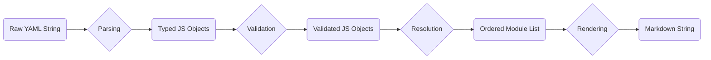

# UMS Library: Data Flow Architecture

**Author:** Gemini
**Date:** 2025-10-10

## 1. Introduction

The `ums-lib` operates as a pure data transformation pipeline. It processes raw YAML content through a series of stages, each transforming the data into a more structured format, ultimately producing a final Markdown document. This unidirectional data flow, combined with the use of immutable data structures, ensures predictability and testability.

## 2. The Data Flow Pipeline

The following diagram illustrates the data flow through the `ums-lib` components:

### Stage 1: Input (Raw YAML String)

*   **Data Format:** Raw text (string).
*   **Description:** The process begins with one or more YAML strings, typically representing UMS modules and a UMS persona. The calling application is responsible for reading these from the file system or another source.

### Stage 2: Parsing

*   **Component:** Parsing (`/core/parsing`)
*   **Data Format:** Typed JavaScript objects (`UMSModule`, `UMSPersona`).
*   **Description:** The `parseModule` and `parsePersona` functions consume the raw YAML strings. They use the `yaml` library to parse the text and then cast the result into the appropriate TypeScript types.

### Stage 3: Validation

*   **Component:** Validation (`/core/validation`)
*   **Data Format:** Validated JavaScript objects.
*   **Description:** The `validateModule` and `validatePersona` functions inspect the parsed objects to ensure they conform to the UMS v1.0 specification. This includes checking for required fields, correct data types, and adherence to shape-specific rules.

### Stage 4: Resolution

*   **Component:** Resolution (`/core/resolution`) & Registry (`/core/registry`)
*   **Data Format:** An ordered list of `UMSModule` objects.
*   **Description:** The `ModuleRegistry` is used to store all available modules. The `resolvePersonaModules` function then takes the persona and the registry, and produces a final, ordered list of modules that are ready for rendering. This stage also handles conflict resolution and deprecation warnings.

### Stage 5: Rendering

*   **Component:** Rendering (`/core/rendering`)
*   **Data Format:** A single Markdown string.
*   **Description:** The `renderMarkdown` function takes the validated persona and the ordered list of resolved modules. It iterates through them, rendering each component according to the UMS v1.0 Markdown rendering specification, and concatenates them into a single string.

### Stage 6: Output (Markdown String)

*   **Data Format:** Raw text (string).
*   **Description:** The final output is a single Markdown string, ready to be written to the file system or used by the calling application.
