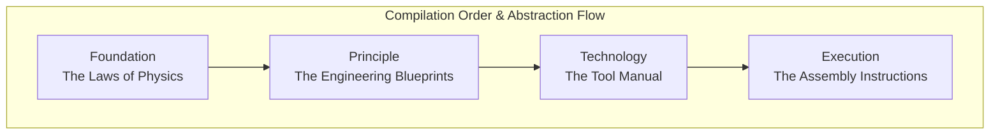

# The Philosophy of the Unified Module System

- [The Philosophy of the Unified Module System](#the-philosophy-of-the-unified-module-system)
  - [Our Vision: From Prompting to Architecture](#our-vision-from-prompting-to-architecture)
  - [The Core Architectural Principles](#the-core-architectural-principles)
    - [Layered Architecture](#layered-architecture)
    - [Module Atomicity (The Single Responsibility Principle)](#module-atomicity-the-single-responsibility-principle)
    - [Shape-Driven Content (Separation of Intent and Structure)](#shape-driven-content-separation-of-intent-and-structure)
    - [Explicit over Implicit (Clarity is King)](#explicit-over-implicit-clarity-is-king)
    - [Composition at the Persona Level (The Library vs. The Application)](#composition-at-the-persona-level-the-library-vs-the-application)
    - [Machine-Centric Language (Write for the AI)](#machine-centric-language-write-for-the-ai)
  - [The Four-Tier System](#the-four-tier-system)
    - [`foundation`](#foundation)
    - [`principle`](#principle)
    - [`technology`](#technology)
    - [`execution`](#execution)
    - [A Deeper Dive: The `foundation` Tier](#a-deeper-dive-the-foundation-tier)
      - [The `layer` Metadata](#the-layer-metadata)
    - [The Action Prompt: The `execution` Tier](#the-action-prompt-the-execution-tier)
      - [The On-Demand Expert](#the-on-demand-expert)
      - [Automated Agent](#automated-agent)
  - [The Atomic Unit: What is a Module?](#the-atomic-unit-what-is-a-module)
  - [How It Works: Building a Persona](#how-it-works-building-a-persona)
  - [Guiding Principles for Authors](#guiding-principles-for-authors)
    - [1. Write for a Machine](#1-write-for-a-machine)
    - [2. Be Explicit and Structured](#2-be-explicit-and-structured)
    - [3. Prioritize Clarity and Simplicity](#3-prioritize-clarity-and-simplicity)
    - [4. Embrace Reusability](#4-embrace-reusability)

## Our Vision: From Prompting to Architecture

> To transform monolithic, ambiguous prompts into a modular, predictable, and powerful ecosystem of explicit, machine-centric instructions.

The Unified Module System (UMS) is designed to enable the construction of sophisticated AI agents through the composition of atomic, reusable, and verifiable components, leading to greater precision, maintainability, and power.

Instead of writing long, hard-to-maintain prompt files, you act as a **Persona Builder**. By combining small, reusable modules of instruction, you can construct a highly specialized and sophisticated AI persona tailored for any task, from high-level strategic planning to detailed, technology-specific coding.

## The Core Architectural Principles

### Layered Architecture

- **Principle:** The module system’s multi-tier hierarchy represents a “waterfall of abstraction,” flowing from universal concepts to concrete actions.
- **Rationale:** This principle ensures a logical and predictable reasoning flow for the AI. By processing universal truths before professional practices and professional practices before tool-specific knowledge, the AI builds a layered, coherent understanding, controlling its cognitive process.

### Module Atomicity (The Single Responsibility Principle)

- **Principle:** Every module represents a single, atomic, and self-contained concept.
- **Rationale:** This principle prevents the creation of vague, oversized "bucket" modules (e.g., `basics.module.yml`). Atomicity ensures that modules are highly reusable, easily discoverable, and conceptually clean. The module library is a collection of precise, individual concepts, not a series of chapters in a book. This is the key to achieving a truly modular and composable system.

### Shape-Driven Content (Separation of Intent and Structure)

- **Principle:** The internal structure of a module's rendered Markdown content is strictly defined by its `shape` and directives in the corresponding `.module.yml` file.
- **Rationale:** This separates the _intent_ of a module from its content. The shape (`procedure`, `specification`, `pattern`, etc.) and directives (e.g., `purpose`, `process`, `constraints`, etc.) is a formal contract that guarantees the module's structure is predictable and validatable. This allows the system's tooling (parsers, linters, and the AI itself) to understand the purpose of the content without ambiguity, transforming it from a simple document into a structured API for the AI.

### Explicit over Implicit (Clarity is King)

- **Principle:** The system favors explicit declarations over implicit conventions or the absence of information.
- **Rationale:** Ambiguity is the primary source of error in complex systems. By requiring all critical information to be explicitly declared, we eliminate entire classes of potential misunderstandings and mistakes.

### Composition at the Persona Level (The Library vs. The Application)

- **Principle:** Modules are independent and self-contained. The composition of modules into a coherent instruction set is the exclusive responsibility of the `.persona.yml` file.
- **Rationale:** This principle prevents the creation of a tightly-coupled, fragile "web" of hidden dependencies between modules (e.g., via an `@include` directive). By keeping composition explicit and at the highest level, we ensure that modules are truly reusable and that the final build process is predictable and easy to debug. It maintains a clean separation between the "library" (the modules) and the "application" (the persona).

### Machine-Centric Language (Write for the AI)

- **Principle:** The module content is written for a machine, not a human. The language must be deterministic, precise, and structured.
- **Rationale:** An AI is a literal-minded tool, not a colleague. It does not infer intent from conversational or ambiguous language. This principle mandates the use of imperative commands, quantifiable metrics, and a consistent structure to eliminate ambiguity and ensure the AI's behavior is as predictable and reliable as possible.

## The Four-Tier System

The module system is organized into a four-tier hierarchy. This structure creates a **"waterfall of abstraction,"** guiding the AI from the most universal rules of thought down to the most concrete actions. When you build a persona, you should assemble modules in this order for the most logical and effective result.

### `foundation`

- **Analogy:** The Laws of Physics.
- **Purpose:** Contains the absolute, universal truths of logic, reason, and systematic thinking. It is completely abstract and applies to any problem-solving domain, inside or outside of software.
- **Litmus Test:** "Is this a fundamental rule of how to think?"
- **Examples:** `reasoning/first-principles-thinking`, `logic/deductive-reasoning`, `ethics/be-truthful`.

### `principle`

- **Analogy:** The Engineering Blueprints.
- **Purpose:** Contains the established principles, practices, methodologies, and architectural patterns of the software engineering profession. These are the "best practices" of the craft, but they are still technology-agnostic.
- **Litmus Test:** "Is this a widely accepted practice or pattern for building quality software, regardless of the specific language or framework?"
- **Examples:** `methodology/test-driven-development`, `architecture/microservices`, `quality/solid-principles`, `process/agile-scrum`.

### `technology`

- **Analogy:** The Tool Manual.
- **Purpose:** Contains the specific, factual knowledge about a particular tool, language, framework, or platform. This is the "how-to" guide for a specific named technology.
- **Litmus Test:** "Is this knowledge tied to a specific brand or product name (React, Python, AWS, Docker)?" - **Examples:** `language/python/pep8-style`, `framework/react/rules-of-hooks`, `platform/aws/iam-best-practices`, `tool/docker/compose-best-practices`.

### `execution`

- **Analogy:** The Assembly Instructions.
- **Purpose:** Contains the literal, step-by-step, imperative playbooks for performing a specific, concrete action _right now_. It combines principles and technology knowledge into a sequence.
- **Litmus Test:** "Does this describe a sequence of actions to be performed for the current, immediate task?"
- **Examples:** `playbook/create-api-endpoint`, `playbook/refactor-component`, `playbook/debug-issue`, `playbook/write-unit-tests`.

### A Deeper Dive: The `foundation` Tier

The `foundation` tier is unique because it defines the AI's core cognitive architecture. The subjects within this tier form a conceptual hierarchy. While the system does not currently have an automated linter, the `layer` metadata is included in modules as a forward-looking feature to support future validation tools.

#### The `layer` Metadata

The `layer` property in a `foundation` module is designed to help users reason about the cognitive flow.

| Layer | Name                   | Purpose                                               | Example Subjects                       |
| :---- | :--------------------- | :---------------------------------------------------- | :------------------------------------- |
| 0     | Bedrock / Axioms       | The absolute, non-negotiable rules of the game.       | `ethics`, `logic`                      |
| 1     | Core Processes         | The active "thinking" engines and primary algorithms. | `reasoning`, `problem-solving`, `bias` |
| 2     | Evaluation & Synthesis | Analyzing, refining, and preparing the output.        | `judgment`, `communication`            |
| 3     | Action / Decision      | Selecting a final course of action.                   | `decision-making`                      |
| 4     | Meta-Cognition         | "Thinking about thinking"; self-regulation.           | `metacognition`, `epistemology`        |

As a best practice, users should manually order their `foundation` modules according to this hierarchy to build the most robust personas.

### The Action Prompt: The `execution` Tier

An `execution` module is the **imperative, task-activating component** of the final compiled meta-prompt. While the first three tiers are declarative ("Be this way," "Know this fact"), the `execution` tier is imperative ("Do this now").

#### The On-Demand Expert

This is a primary use case. Personas without `execution` modules act as **on-demand experts**. They create an AI that is in a fully configured state but is awaiting its first instruction from the user's live prompt. This is ideal for interactive or conversational tasks.

#### Automated Agent

Personas WITH `execution` modules act as **automated agents** that begin a pre-defined workflow immediately. Multiple `execution` modules can be chained to create complex, sequential workflows.

## The Atomic Unit: What is a Module?

The entire system is built on one foundational idea: **every module represents one single, atomic, and self-contained concept.**

A module is:

- **Atomic:** It represents the smallest reasonable unit of instruction (e.g., a single reasoning technique or a specific coding standard).
- **Discoverable:** Its name and metadata tell you exactly what it does.
- **Reusable:** It can be picked and chosen individually to be included in any number of different personas.

This means we use specific, descriptive modules (e.g., `deductive-reasoning.module.yml`) and strictly avoid generic "bucket" files (e.g., `basics.module.yml`). The module library is a **collection of precise concepts**, not a series of chapters in a book.

## How It Works: Building a Persona

Modules are composed into a coherent instruction set within a `.persona.yml` file. This is the **sole mechanism for composition**. By keeping composition explicit and at the highest level, we ensure that modules are truly reusable and that the final build process is predictable and easy to debug.

This approach keeps modules independent and self-contained, preventing a fragile "web" of hidden dependencies. It maintains a clean separation between the "library" (the modules) and the "application" (the persona), ensuring that the final build process is predictable and easy to debug.

## Guiding Principles for Authors

### 1. Write for a Machine

The content of all modules **MUST** be written for a machine, not a human. An AI is a literal-minded tool, not a colleague. It does not infer intent from conversational or ambiguous language. This principle mandates the use of imperative commands and structured language to ensure the AI's behavior is as predictable and reliable as possible.

### 2. Be Explicit and Structured

The system favors explicit declarations over implicit conventions. In UMS, this is achieved by defining modules as structured data (`.module.yml` files) with a clear `shape`. This contract guarantees that a module's structure is predictable and verifiable, transforming it from a simple document into a structured API for the AI.

### 3. Prioritize Clarity and Simplicity

When writing modules, aim for clarity and simplicity. Avoid jargon, complex sentences, or unnecessary details. The goal is to make the instructions as clear and unambiguous as possible for the AI to interpret and execute.

### 4. Embrace Reusability

Design modules with reusability in mind. This means creating modules that can be easily adapted for different personas or contexts without modification. Use generic names and avoid hardcoding specific details.
aAaQ
