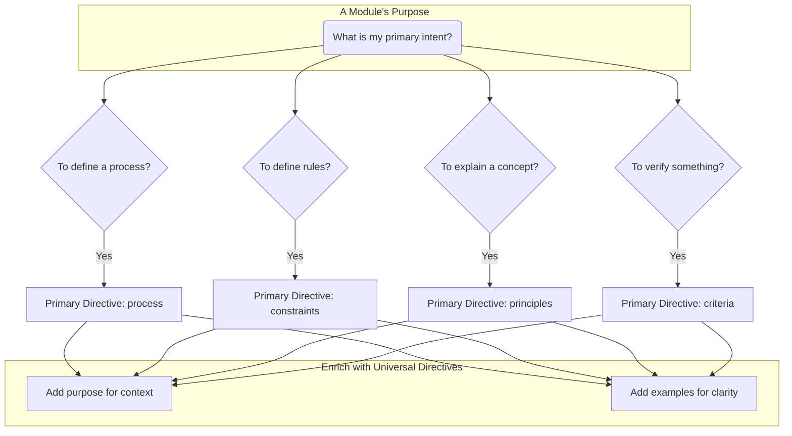

# Authoring Module Content: The `body` and its Directives

- [Authoring Module Content: The `body` and its Directives](#authoring-module-content-the-body-and-its-directives)
  - [1. Overview: The Heart of the Module](#1-overview-the-heart-of-the-module)
  - [2. The Role of `shape`](#2-the-role-of-shape)
  - [3. The 7 Standard Directives](#3-the-7-standard-directives)
    - [3.1. `purpose`](#31-purpose)
    - [3.2. `process`](#32-process)
    - [3.3. `constraints`](#33-constraints)
    - [3.4. `principles`](#34-principles)
    - [3.5. `criteria`](#35-criteria)
    - [3.6. `data`](#36-data)
    - [3.7. `examples`](#37-examples)
  - [3. The Power of Composition: Defining a Module's "Schema"](#3-the-power-of-composition-defining-a-modules-schema)

## 1. Overview: The Heart of the Module

The `body` block is the instructional core of every `.module.yml` file. It contains the actual knowledge, rules, and processes that you want to impart to an AI.

Unlike traditional documents, the `body` is not free-form text. It is a **structured object** composed of one or more **Directive Blocks**. A Directive Block is a key-value pair that represents a single, specific type of instruction. The key is the directive's name (e.g., `process`), and the value is its content in a specific, required format.

The structure of the `body` is not arbitrary; it is strictly governed by the module's top-level `shape` and its directives, as defined in the UMS v1.1 Specification.

## 2. The Role of `shape`

Before authoring the `body`, you must understand its relationship to the module's structural contract.

The `shape` determines which directives are required, which are optional, and the expected content type for each directive. This contract ensures that every module is consistent, predictable, and machine-readable.
This top-level key explicitly declares the module's structural intent (e.g., `specification`, `procedure`, `pattern`). It's the primary classification of the module's purpose.
A module is only valid if the directives present in its `body` satisfy the contract defined by its `shape`.

For example:

- A module with the `shape` of `procedure` must include a `purpose` and a `process` directive. It can also include `recommended`, `discouraged`, or `examples`.
- A module with the `shape` of `specification` must include a `purpose` and a `constraints` directive. It can also include `recommended`, `discouraged`, or `examples`.

## 3. The 7 Standard Directives

There are seven official directive keys you can use within the `body` block. Understanding the purpose, required format, and when to use each is the key to authoring valid, high-quality modules.

| Directive         | Core Purpose  | Content Type                              | Use When You Need To...                                         |
| :---------------- | :------------ | :---------------------------------------- | :-------------------------------------------------------------- |
| **`goal`**        | Set Context   | String (Paragraph)                        | Define the module's primary objective or core concept.          |
| **`process`**     | Define Action | Array of Strings                          | Provide a sequential, step-by-step algorithm.                   |
| **`constraints`** | Define Rules  | Array of Strings                          | List non-negotiable, verifiable rules and prohibitions.         |
| **`principles`**  | Explain "Why" | Array of Strings                          | Discuss abstract concepts, philosophies, and their trade-offs.  |
| **`criteria`**    | Verify State  | Array of Strings                          | Provide a checklist of items to assess an existing artifact.    |
| **`data`**        | Provide Input | Object (mediaType: String, value: String) | Include a raw, self-contained block of code or configuration.   |
| **`examples`**    | Clarify       | Array of Objects                          | Show concrete illustrations of your other directives in action. |

### 3.1. `purpose`

- **Purpose:** To define the module's primary objective or core concept.
- **When to Use:** Every module shape requires a `purpose`. It is the entry point that sets the context for all other directives in the module. It answers the question, "What is this module fundamentally about?"
- **Content Type:** `String` (A single paragraph, written as a multi-line string).

**Example:** A `pattern` module explaining a core concept.

```yaml
id: principle/quality/clean-code-philosophy
version: "1.0.0"
schemaVersion: "1.0"
shape: pattern
meta:
  name: "Clean Code Philosophy"
  description: "Defines the core philosophy of Clean Code."
body:
  purpose: |
    This module defines the core philosophy of Clean Code, which prioritizes readability, simplicity, and maintainability to ensure a codebase is easy for any developer to understand and modify over time.
  principles:
    - "Readability is paramount. Code is read far more often than it is written."
    - "Simplicity over complexity (KISS). Avoid clever tricks that obscure intent."
    - "Maintainability is the goal. Write code for the developer who will maintain it next year, which might be you."
```

### 3.2. `process`

- **Purpose:** To define a sequential, step-by-step algorithm for performing a task.
- **When to Use:** Use the `process` directive when you need to provide an explicit, ordered workflow. This is the core of `procedure` and `playbook` shapes.
- **Content Type:** `Array of Strings`. Each string in the array represents a single step in the process.
- **Formatting Rule:** Do not include literal numeric prefixes (e.g., "1.", "2.") in step text. Ordering is implied by array position and renderers will output an ordered list.

**Example:** A `procedure` module for debugging.

```yaml
id: execution/playbook/debug-root-cause-analysis
version: "1.0.0"
schemaVersion: "1.0"
shape: procedure
meta:
  name: "Root Cause Analysis Procedure"
  description: "A systematic process to identify the root cause of a bug."
body:
  purpose: |
    Given a bug report, you MUST follow a systematic process to identify the root cause and propose a minimal, correct fix.
  process:
    - "**Reproduce the Issue:** First, confirm you can reliably reproduce the bug. If not, ask for clarifying steps."
    - "**Analyze the Symptoms:** Observe the incorrect behavior. What is happening versus what is expected?"
    - "**Formulate a Hypothesis:** Based on the symptoms, form an initial, testable hypothesis about the likely cause."
    - "**Isolate the Fault:** Use techniques like binary debugging to narrow down the exact location of the fault."
    - "**Identify the Root Cause:** Determine the underlying reason for the error, not just the immediate symptom."
    - "**Propose a Fix:** Design a minimal, targeted code change that corrects the root cause."
```

### 3.3. `constraints`

- **Purpose:** To define a set of non-negotiable rules, prohibitions, or conditions.
- **When to Use:** Use `constraints` when you need to provide a set of verifiable, static rules that an AI's output or behavior must adhere to. This is the core of the `specification` shape.
- **Content Type:** `Array of Strings`. Each string in the array represents a single rule.

**Example:** A `specification` module for PEP 8.

```yaml
id: technology/language/python/pep8-style-guide
version: "1.0.0"
schemaVersion: "1.0"
shape: specification
meta:
  name: "PEP 8 Style Guide Specification"
  description: "Defines the core rules of the PEP 8 style guide for Python code."
body:
  purpose: |
    All Python code you generate MUST conform to the PEP 8 style guide.
  constraints:
    - "Lines MUST NOT exceed 79 characters."
    - "Use 4 spaces for indentation; do NOT use tabs."
    - "Use snake_case for function and variable names."
    - "Use PascalCase for class names."
```

### 3.4. `principles`

- **Purpose:** To explain high-level, abstract concepts, philosophies, and their trade-offs.
- **When to Use:** Use `principles` when the goal is to teach the AI the "why" behind a concept, not just the "what" or "how." This is the core of the `pattern` shape.
- **Content Type:** `Array of Strings`. Each string can represent a core idea or a list of advantages/disadvantages.

**Example:** A `pattern` module for an architectural principle.

```yaml
id: principle/architecture/composition-over-inheritance
version: "1.0.0"
schemaVersion: "1.0"
shape: pattern
meta:
  name: "Composition Over Inheritance Pattern"
  description: "Explains the principle of favoring object composition over class inheritance."
body:
  purpose: |
    This module explains the principle of favoring object composition over class inheritance to build flexible systems.
  principles:
    - "**Core Idea:** Systems achieve code reuse by containing instances of other classes, rather than inheriting from a base class."
    - "**Advantages:** Flexibility (behavior can be changed at runtime), Loose Coupling, and improved Testability."
    - "**Disadvantages:** Can lead to more boilerplate code and a higher level of indirection."
```

### 3.5. `criteria`

- **Purpose:** To provide a set of items for verification or assessment (a checklist).
- **When to Use:** Use `criteria` when the AI's task is to **evaluate an existing artifact** (like a piece of code or a document) against a set of standards. This is the core of the `checklist` shape.
- **Content Type:** Each list item is rendered using Markdown task list syntax (`- [ ]`) for clarity.

**Example:** A `checklist` module for code reviews.

```yaml
id: execution/checklist/standard-code-review
version: "1.0.0"
schemaVersion: "1.0"
shape: checklist
meta:
  name: "Standard Code Review Checklist"
  description: "A checklist for evaluating code during a review."
body:
  purpose: |
    You are a code reviewer. You MUST evaluate the provided code against the following criteria.
  criteria:
    - "**Clarity:** Is the code easy to understand? Are variable names descriptive?"
    - "**Correctness:** Does the code solve the intended problem without introducing new bugs?"
    - "**Testability:** Is the code written in a way that is easy to unit test? Are there sufficient tests?"
    - "**Security:** Does the code introduce any potential security vulnerabilities?"
```

### 3.6. `data`

- **Purpose:** To provide a raw, structured block of information to be used as a reference or input.
- **When to Use:** Use `data` when the primary content of the module is a self-contained block of code, configuration, or other structured text. This is the core of the `data` shape.
- **Content Type:** `Object`. The object MUST contain two keys: `mediaType` (string) and `value` (multi-line string).

| Key         | Type   | Required? | Description                                                                     |
| :---------- | :----- | :-------- | :------------------------------------------------------------------------------ |
| `mediaType` | String | Yes       | The IANA media type of the content (e.g., `application/json`, `text/x-python`). |
| `value`     | String | Yes       | The raw content of the data block as a multi-line string.                       |

**Example:** A `data` module providing a configuration file.

```yaml
id: technology/tool/typescript/standard-tsconfig
version: "1.0.0"
schemaVersion: "1.0"
shape: data
meta:
  name: "Standard tsconfig.json for Node.js"
  description: "Provides a standard tsconfig.json configuration for a strict Node.js project."
body:
  purpose: |
    This module provides the standard `tsconfig.json` configuration for a strict Node.js project.
  data:
    mediaType: application/json
    value: |
      {
        "compilerOptions": {
          "target": "ES2022",
          "module": "NodeNext",
          "strict": true,
          "esModuleInterop": true
        },
        "include": ["src"],
        "exclude": ["dist", "node_modules"]
      }
```

### 3.7. `examples`

- **Purpose:** To provide one or more illustrative examples to clarify the other directives.
- **When to Use:** Use `examples` to make abstract rules or processes more concrete. It is a powerful tool for reducing ambiguity and is an `optional` directive for most shapes.
- **Content Type:** Array of Objects with `title`, `rationale`, `snippet`, and optional `language`.

Each example object MUST contain the following keys:

| Key         | Type   | Required? | Description                                                                                                                              |
| :---------- | :----- | :-------- | :--------------------------------------------------------------------------------------------------------------------------------------- |
| `title`     | String | Yes       | A short, descriptive title for the example. This title **MUST** be unique within the module, as it serves as a key for merge operations. |
| `rationale` | String | Yes       | A brief explanation of what the example demonstrates.                                                                                    |
| `language`  | String | No        | The language of the snippet for syntax highlighting (e.g., `python`, `typescript`).                                                      |
| `snippet`   | String | Yes       | The primary code or text snippet for the example.                                                                                        |

**Example:** A `specification` module clarified with `examples`.

```yaml
id: principle/instructions/machine-centric-language
version: "1.0.0"
schemaVersion: "1.1"
shape: specification
meta:
  name: "Machine-Centric Language Specification"
  description: "Defines the standard for writing machine-centric instructions."
body:
  purpose: |
    This specification defines the standard for writing machine-centric instructions.
  constraints:
    - "Instructions MUST use imperative commands, not suggestive language."
  examples:
    - title: "Incorrect, Human-Centric Instruction"
      rationale: "This example is incorrect because it uses the suggestive word 'should'."
      language: text
      snippet: |
        You should probably handle errors.
    - title: "Correct, Machine-Centric Instruction"
      rationale: "This example is correct because it uses the imperative command `MUST`."
      language: text
      snippet: |
        Upon a database connection failure, you MUST return HTTP 503 and log the error context.
```

## 3. The Power of Composition: Defining a Module's "Schema"

A module's "schema" or type is not declared in the frontmatter; it is **implicitly defined by the combination of directives in its body.** This allows you to create rich, nuanced modules that precisely match your intent.



**Pure Modules (Recommended Default):** A module is considered "pure" when it focuses on one primary directive (e.g., `process`, `constraints`, `criteria`) enriched with `purpose` and `examples`. This is the default best practice as it creates highly reusable, atomic components.

- A module with `purpose` and `process` is a **Procedure**.
- A module with `purpose` and `constraints` is a **Specification**.
- A module with `purpose` and `principles` is a **Pattern**.
- A module with `purpose` and `criteria` is a **Checklist**.

**Bundled Modules (Advanced Pattern):** A module is "bundled" when it combines multiple primary directives, such as `process` and `constraints`. This is a powerful pattern for defining a task where the process and its rules are inextricably linked and not intended for separate reuse.

- A module with `purpose`, `process`, and `constraints` is a **Procedural Specification**—a powerful hybrid that defines both the steps to take and the rules to follow.
- A module with `purpose`, `principles`, and `examples` is a **Pattern Library**—a curated collection of design patterns that provide reusable solutions to common problems.
- A module with `purpose`, `criteria`, and `examples` is a **Checklist Library**—a comprehensive set of checklists that ensure all criteria are met.
