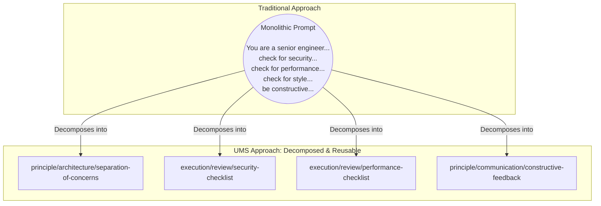
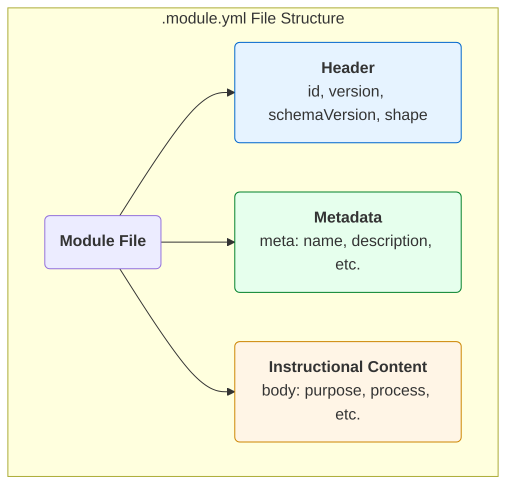
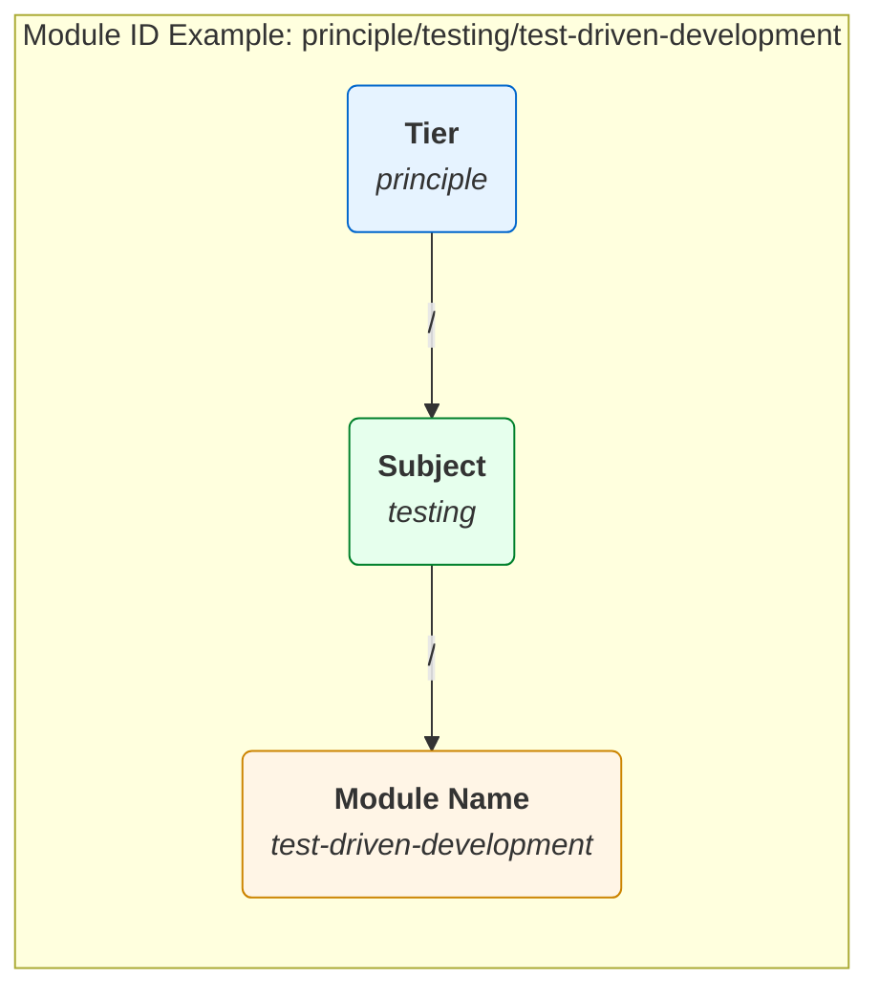
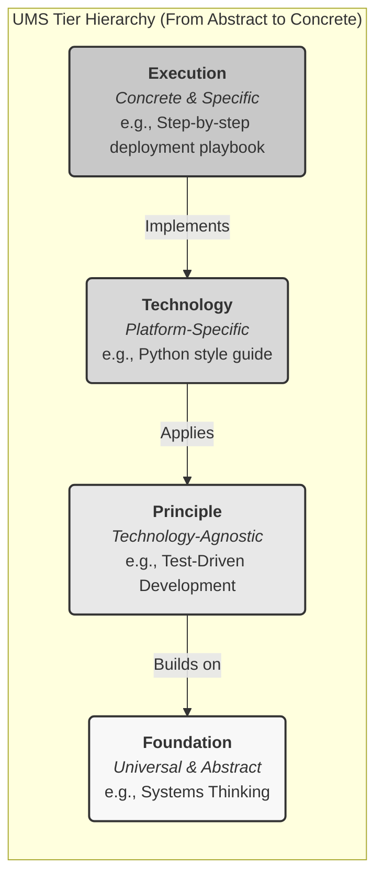
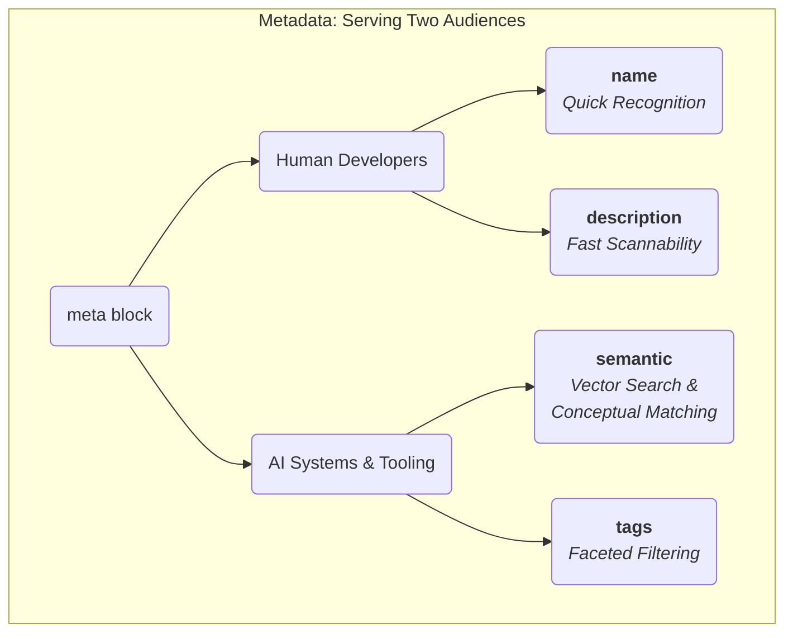
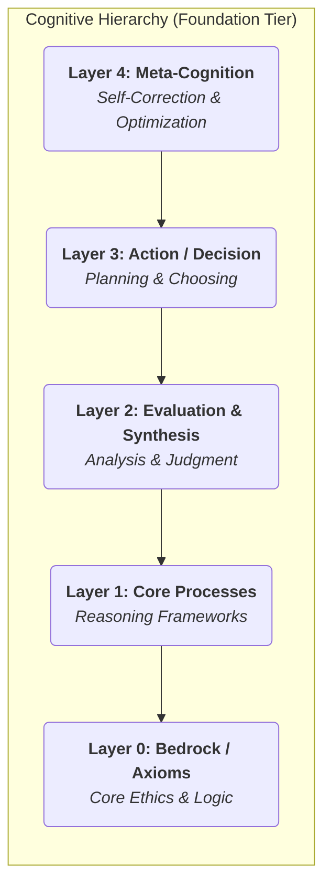
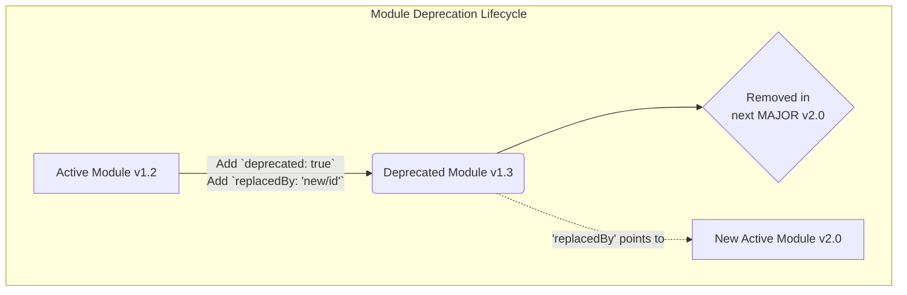
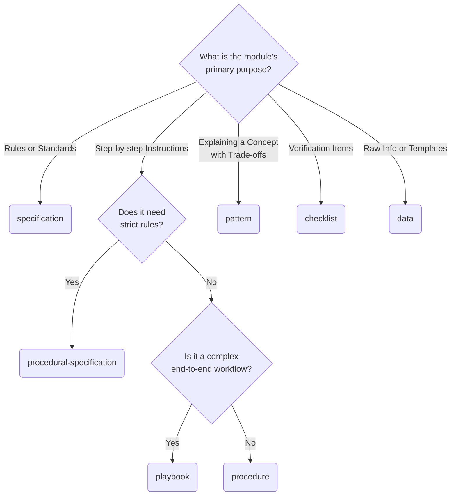
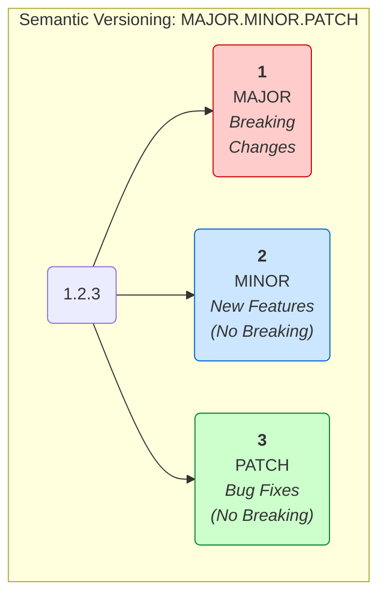

# 1. Introduction

- [1. Introduction](#1-introduction)
  - [What You'll Learn](#what-youll-learn)
  - [Who Should Use This Guide](#who-should-use-this-guide)
  - [1.1. Philosophy: Instructions as Code](#11-philosophy-instructions-as-code)
    - [The Problems with Traditional Prompting](#the-problems-with-traditional-prompting)
    - [The UMS Solution: Three Core Principles](#the-ums-solution-three-core-principles)
    - [Benefits of the Instructions-as-Code Approach](#benefits-of-the-instructions-as-code-approach)
  - [1.2. The Role of the Module Author](#12-the-role-of-the-module-author)
    - [Core Responsibilities](#core-responsibilities)
    - [Content Creation Excellence](#content-creation-excellence)
    - [Quality Assurance and Testing](#quality-assurance-and-testing)
    - [Lifecycle and Community Engagement](#lifecycle-and-community-engagement)
    - [Impact and Responsibility](#impact-and-responsibility)
  - [Getting Started](#getting-started)
- [2. The Module File (`.module.yml`)](#2-the-module-file-moduleyml)
  - [Overview: Your Module's Complete Definition](#overview-your-modules-complete-definition)
  - [2.1. File Structure Overview](#21-file-structure-overview)
  - [2.2. Top-Level Keys: The Module's Foundation](#22-top-level-keys-the-modules-foundation)
- [3. Crafting the Module ID](#3-crafting-the-module-id)
  - [The Anatomy of a Module ID](#the-anatomy-of-a-module-id)
  - [3.1. Understanding Tiers](#31-understanding-tiers)
      - [`foundation`: Core Cognitive Architecture](#foundation-core-cognitive-architecture)
      - [`principle`: Universal Best Practices and Design Patterns](#principle-universal-best-practices-and-design-patterns)
      - [`technology`: Platform and Tool-Specific Guidance](#technology-platform-and-tool-specific-guidance)
      - [`execution`: Step-by-Step Procedures and Workflows](#execution-step-by-step-procedures-and-workflows)
  - [3.2. Defining a Subject](#32-defining-a-subject)
      - [Subject Design Principles](#subject-design-principles)
      - [Common Subject Patterns](#common-subject-patterns)
      - [Multi-Level Subject Hierarchies](#multi-level-subject-hierarchies)
  - [3.3. Naming the Module](#33-naming-the-module)
      - [Module Naming Principles](#module-naming-principles)
      - [Common Naming Patterns](#common-naming-patterns)
  - [3.4. ID Grammar and Validation](#34-id-grammar-and-validation)
      - [Character and Format Rules](#character-and-format-rules)
      - [Validation Examples](#validation-examples)
      - [Validation Regex](#validation-regex)
    - [Strategic ID Design](#strategic-id-design)
      - [Planning Your Module Family](#planning-your-module-family)
      - [Considering Evolution and Deprecation](#considering-evolution-and-deprecation)
      - [Common ID Design Mistakes](#common-id-design-mistakes)
    - [Best Practices Summary](#best-practices-summary)
- [4. Writing Effective Metadata (`meta`)](#4-writing-effective-metadata-meta)
  - [The Dual-Audience Challenge](#the-dual-audience-challenge)
  - [4.1. `name`: The Human-Readable Title](#41-name-the-human-readable-title)
      - [Core Principles](#core-principles)
      - [Naming Strategies by Module Type](#naming-strategies-by-module-type)
      - [Common Naming Mistakes](#common-naming-mistakes)
  - [4.2. `description`: The Quick Summary](#42-description-the-quick-summary)
      - [Writing Effective Descriptions](#writing-effective-descriptions)
      - [Description Patterns by Module Type](#description-patterns-by-module-type)
      - [Length and Complexity Guidelines](#length-and-complexity-guidelines)
  - [4.3. `semantic`: Optimizing for AI Discovery](#43-semantic-optimizing-for-ai-discovery)
      - [Understanding Semantic Search](#understanding-semantic-search)
      - [Writing for Vector Embeddings](#writing-for-vector-embeddings)
      - [Semantic Field Strategies](#semantic-field-strategies)
      - [Search Term Research](#search-term-research)
      - [Common Semantic Field Mistakes](#common-semantic-field-mistakes)
  - [4.4. `layer`: The Cognitive Hierarchy (Foundation Tier)](#44-layer-the-cognitive-hierarchy-foundation-tier)
      - [Layer Definitions](#layer-definitions)
      - [Layer Field Requirements](#layer-field-requirements)
  - [4.5. Using `tags` for Filtering](#45-using-tags-for-filtering)
      - [Tag Design Principles](#tag-design-principles)
      - [Standard Tag Categories](#standard-tag-categories)
      - [Strategic Tag Selection](#strategic-tag-selection)
  - [4.6. Lifecycle Management (`deprecated`, `replacedBy`)](#46-lifecycle-management-deprecated-replacedby)
      - [Deprecation Workflow](#deprecation-workflow)
      - [Implementing Deprecation](#implementing-deprecation)
      - [Replacement Strategy](#replacement-strategy)
  - [4.7. Attribution and Licensing (`authors`, `license`, `homepage`)](#47-attribution-and-licensing-authors-license-homepage)
      - [Author Attribution](#author-attribution)
      - [Licensing](#licensing)
      - [Homepage and Source Links](#homepage-and-source-links)
    - [Metadata Quality Checklist](#metadata-quality-checklist)
      - [Completeness](#completeness)
      - [Accuracy](#accuracy)
      - [Discoverability](#discoverability)
      - [Professional Standards](#professional-standards)
    - [Common Metadata Mistakes](#common-metadata-mistakes)
- [5. Choosing the Right Shape](#5-choosing-the-right-shape)
  - [Understanding Shape as Contract](#understanding-shape-as-contract)
  - [5.1. Overview of Standard Shapes](#51-overview-of-standard-shapes)
      - [Shape Decision Matrix](#shape-decision-matrix)
      - [Directive Overlap Between Shapes](#directive-overlap-between-shapes)
  - [5.2. When to Use `specification`](#52-when-to-use-specification)
      - [Core Characteristics](#core-characteristics)
      - [Required Directives](#required-directives)
      - [Optional Directives](#optional-directives)
      - [Typical Use Cases](#typical-use-cases)
      - [When NOT to Use `specification`](#when-not-to-use-specification)
  - [5.3. When to Use `procedure`](#53-when-to-use-procedure)
      - [Core Characteristics](#core-characteristics-1)
      - [Required Directives](#required-directives-1)
      - [Optional Directives](#optional-directives-1)
      - [Typical Use Cases](#typical-use-cases-1)
      - [Advanced Process Structures](#advanced-process-structures)
      - [When NOT to Use `procedure`](#when-not-to-use-procedure)
  - [5.4. When to Use `pattern`](#54-when-to-use-pattern)
      - [Core Characteristics](#core-characteristics-2)
      - [Required Directives](#required-directives-2)
      - [Optional Directives](#optional-directives-2)
      - [Typical Use Cases](#typical-use-cases-2)
      - [Context and Applicability Guidance](#context-and-applicability-guidance)
      - [When NOT to Use `pattern`](#when-not-to-use-pattern)
  - [5.5. When to Use `checklist`](#55-when-to-use-checklist)
      - [Core Characteristics](#core-characteristics-3)
      - [Required Directives](#required-directives-3)
      - [Optional Directives](#optional-directives-3)
      - [Rendering Behavior](#rendering-behavior)
      - [Typical Use Cases](#typical-use-cases-3)
      - [Advanced Criteria Structures](#advanced-criteria-structures)
      - [When NOT to Use `checklist`](#when-not-to-use-checklist)
  - [5.6. When to Use `data`](#56-when-to-use-data)
      - [Core Characteristics](#core-characteristics-4)
      - [Required Directives](#required-directives-4)
      - [Optional Directives](#optional-directives-4)
      - [Data Directive Structure](#data-directive-structure)
      - [Typical Use Cases](#typical-use-cases-4)
      - [Media Type Selection](#media-type-selection)
      - [When NOT to Use `data`](#when-not-to-use-data)
  - [5.7. Hybrid Shapes: `procedural-specification` and `playbook`](#57-hybrid-shapes-procedural-specification-and-playbook)
      - [`procedural-specification`: Process + Rules](#procedural-specification-process--rules)
      - [`playbook`: Comprehensive End-to-End Workflows](#playbook-comprehensive-end-to-end-workflows)
    - [Shape Selection Decision Tree](#shape-selection-decision-tree)
- [6. Authoring the Instructional `body`](#6-authoring-the-instructional-body)
  - [Understanding the Body Structure](#understanding-the-body-structure)
  - [Writing Philosophy: Instructions for Intelligence](#writing-philosophy-instructions-for-intelligence)
  - [6.1. The `purpose` Directive: The North Star](#61-the-purpose-directive-the-north-star)
    - [Writing Effective Purpose Statements](#writing-effective-purpose-statements)
    - [Purpose Statements by Shape](#purpose-statements-by-shape)
      - [Common Purpose Statement Mistakes](#common-purpose-statement-mistakes)
  - [6.2. Defining Sequences with `process`](#62-defining-sequences-with-process)
    - [Core Principles for Process Design](#core-principles-for-process-design)
    - [Writing Effective Process Steps](#writing-effective-process-steps)
    - [Advanced Process Structures](#advanced-process-structures-1)
      - [Process Patterns by Use Case](#process-patterns-by-use-case)
  - [6.3. Setting Boundaries with `constraints`](#63-setting-boundaries-with-constraints)
    - [Understanding Constraint Types](#understanding-constraint-types)
    - [Writing Effective Constraints](#writing-effective-constraints)
    - [Constraint Patterns by Domain](#constraint-patterns-by-domain)
    - [Advanced Constraint Structures](#advanced-constraint-structures)
  - [6.4. Explaining Concepts with `principles`](#64-explaining-concepts-with-principles)
    - [Writing Balanced Trade-off Analysis](#writing-balanced-trade-off-analysis)
    - [Context-Sensitive Trade-off Analysis](#context-sensitive-trade-off-analysis)
  - [6.7. Ensuring Quality with `criteria`](#67-ensuring-quality-with-criteria)
    - [Writing Effective Criteria](#writing-effective-criteria)
    - [Criteria Patterns by Purpose](#criteria-patterns-by-purpose)
  - [6.8. Providing Raw Information with `data`](#68-providing-raw-information-with-data)
    - [Data Authoring Principles](#data-authoring-principles)
  - [6.9. Using Composite Lists for Richer Content](#69-using-composite-lists-for-richer-content)
      - [When to Use Composite Lists](#when-to-use-composite-lists)
- [7. Creating Illustrative Examples](#7-creating-illustrative-examples)
  - [7.1. The `examples` Directive Structure](#71-the-examples-directive-structure)
    - [Example Structure Guidelines](#example-structure-guidelines)
  - [7.2. Writing a Clear `title` and `rationale`](#72-writing-a-clear-title-and-rationale)
      - [Effective Title Patterns](#effective-title-patterns)
      - [Rationale Writing Best Practices](#rationale-writing-best-practices)
  - [7.3. Providing an Effective `snippet`](#73-providing-an-effective-snippet)
      - [Code Quality Standards](#code-quality-standards)
      - [Example Types and Patterns](#example-types-and-patterns)
      - [Examples for Different Shapes](#examples-for-different-shapes)
      - [Multi-Language and Multi-Context Examples](#multi-language-and-multi-context-examples)
    - [Example Quality Checklist](#example-quality-checklist)
- [8. Versioning and Lifecycle](#8-versioning-and-lifecycle)
  - [8.1. `version` (SemVer 2.0.0)](#81-version-semver-200)
    - [Version Format Structure](#version-format-structure)
    - [Semantic Versioning Rules](#semantic-versioning-rules)
      - [Pre-Release Versioning](#pre-release-versioning)
  - [8.2. Module Lifecycle Stages](#82-module-lifecycle-stages)
      - [Stage 1: Development (`0.x.y` or `-alpha`)](#stage-1-development-0xy-or--alpha)
      - [Stage 2: Stabilization (`1.0.0-beta` to `1.0.0-rc`)](#stage-2-stabilization-100-beta-to-100-rc)
      - [Stage 3: Stable Release (`1.0.0+`)](#stage-3-stable-release-100)
      - [Stage 4: Maintenance and Evolution](#stage-4-maintenance-and-evolution)
  - [8.3. Deprecation and Sunset Strategy](#83-deprecation-and-sunset-strategy)
      - [Graceful Deprecation Process](#graceful-deprecation-process)
      - [Migration Guide Template](#migration-guide-template)
  - [8.4. Version Compatibility Matrix](#84-version-compatibility-matrix)
      - [Cross-Module Dependencies](#cross-module-dependencies)
      - [Breaking Change Communication](#breaking-change-communication)
  - [Compatibility](#compatibility)
      - [Version Release Checklist](#version-release-checklist)
  - [8.6. Ecosystem Coordination](#86-ecosystem-coordination)
      - [Version Synchronization Strategy](#version-synchronization-strategy)
      - [Community Version Adoption](#community-version-adoption)
- [9. Appendix: Authoring Checklist](#9-appendix-authoring-checklist)
  - [9.1. Module Structure and Format](#91-module-structure-and-format)
      - [File and Format Requirements](#file-and-format-requirements)
      - [Required Top-Level Fields](#required-top-level-fields)
  - [9.2. Module ID and Metadata Quality](#92-module-id-and-metadata-quality)
      - [Module ID (`id`) Validation](#module-id-id-validation)
      - [Metadata (`meta`) Completeness](#metadata-meta-completeness)
  - [9.3. Shape and Body Validation](#93-shape-and-body-validation)
      - [Shape Selection Appropriateness](#shape-selection-appropriateness)
      - [Shape-Specific Requirements](#shape-specific-requirements)
  - [9.4. Content Quality Standards](#94-content-quality-standards)
      - [Writing Quality](#writing-quality)
      - [Technical Accuracy](#technical-accuracy)
      - [Accessibility and Usability](#accessibility-and-usability)
  - [9.5. Examples and Documentation](#95-examples-and-documentation)
      - [Example Quality (if `examples` present)](#example-quality-if-examples-present)
      - [Example Structure](#example-structure)
  - [9.6. Version and Lifecycle Management](#96-version-and-lifecycle-management)
      - [Version Specification](#version-specification)
      - [Lifecycle Considerations](#lifecycle-considerations)
  - [9.7. Ecosystem Integration](#97-ecosystem-integration)
      - [Discoverability](#discoverability-1)
      - [Compatibility](#compatibility-1)
  - [9.8. Quality Assurance Validation](#98-quality-assurance-validation)
      - [Pre-Publication Review](#pre-publication-review)
      - [Testing and Validation](#testing-and-validation)
      - [Publication Readiness](#publication-readiness)
  - [9.9. Maintenance and Updates](#99-maintenance-and-updates)
      - [Ongoing Maintenance](#ongoing-maintenance)
      - [Evolution Planning](#evolution-planning)
    - [Quick Reference: Common Issues and Solutions](#quick-reference-common-issues-and-solutions)
      - [Frequent Validation Failures](#frequent-validation-failures)
      - [Quality Improvement Tips](#quality-improvement-tips)


Welcome to the comprehensive guide for authoring Unified Module System (UMS) modules. Whether you're new to structured AI instruction design or looking to contribute to an existing UMS ecosystem, this guide will teach you everything you need to know to create high-quality, reusable modules.

The Unified Module System represents a fundamental paradigm shift in AI instruction design. Instead of writing monolithic, free-form prompts, UMS treats AI instructions as **machine-readable source code**—structured, validated, and infinitely composable. This approach transforms AI instruction development from an ad-hoc craft into a systematic engineering discipline.

## What You'll Learn

By the end of this guide, you'll be able to:

- Understand the core philosophy and principles behind UMS v1.1
- Design and structure effective module identifiers and namespaces
- Write compelling metadata that makes your modules discoverable
- Choose the appropriate module shape for your instructional content
- Author clear, actionable directive content in the module body
- Create comprehensive examples that illustrate your modules in action
- Manage module lifecycle, versioning, and deprecation
- Follow best practices for module composition and reusability

## Who Should Use This Guide

This guide is designed for:

- **AI Engineers** building sophisticated AI assistants and need modular, reusable instructions
- **Prompt Engineers** looking to move beyond ad-hoc prompting to systematic instruction design
- **DevOps Teams** implementing AI-powered automation and need maintainable, version-controlled prompts
- **Technical Writers** documenting AI behavior and wanting to create structured, searchable content
- **Open Source Contributors** contributing to shared UMS libraries and ecosystems
- **Enterprise Teams** standardizing AI instructions across organizations

## 1.1. Philosophy: Instructions as Code

Traditional AI prompting approaches suffer from several critical limitations that become apparent at scale:

### The Problems with Traditional Prompting

**Document-Centric Thinking**
Most AI prompts are written as prose documents—long, unstructured text blocks that humans find readable but machines cannot easily parse, validate, or manipulate. Consider this typical prompt:

```
You are a senior software engineer conducting code reviews. When reviewing code,
make sure to check for security vulnerabilities, performance issues, proper error
handling, code style consistency, test coverage, and documentation. Also consider
architectural concerns like separation of concerns, single responsibility principle,
and overall maintainability. Don't forget to be constructive in your feedback and
explain the reasoning behind your suggestions...
```

While functional, this approach creates several problems:
- **No structure:** Information is buried in prose, making it hard to extract or modify specific aspects
- **No validation:** There's no way to ensure all required topics are covered
- **Poor maintainability:** Updates require careful manual editing to avoid breaking context
- **Limited reusability:** The entire prompt must be copied and modified for different contexts

**Lack of Modularity**
Traditional prompts become monolithic as requirements grow. A comprehensive code review prompt might grow to hundreds of lines, mixing security concerns, style guidelines, architectural principles, and process steps in a single unwieldy document. This makes it nearly impossible to:
- Reuse specific parts across different contexts
- Update individual concerns without affecting others
- Compose different combinations of instructions for different scenarios
- Share common patterns across teams or projects

**No Validation or Consistency**
Without structured formats, there's no way to automatically validate that prompts contain required information, follow consistent patterns, or conform to organizational standards. Teams end up with:
- Inconsistent instruction quality across different AI applications
- Missing critical information that only becomes apparent in production
- No way to programmatically ensure compliance with policies or standards
- Difficulty maintaining consistency as teams and requirements grow

**Poor Discoverability**
Finding relevant existing prompts requires manual searching through unstructured text. As organizations build more AI applications:
- Valuable prompt patterns get lost in documentation systems
- Teams reinvent the wheel instead of reusing proven approaches
- No semantic search capabilities to find conceptually related instructions
- Knowledge becomes siloed within individual teams or developers

### The UMS Solution: Three Core Principles

UMS v1.1 addresses these limitations through three foundational principles that transform AI instruction design:

**1. Data-Centric Architecture**

Every UMS module is a structured `.module.yml` file—a machine-readable data format rather than a prose document. This fundamental shift means:

- **Structured Content:** Instructions are organized into typed directive blocks (like `purpose`, `process`, `constraints`) that tools can parse and manipulate
- **Automated Validation:** Build tools can verify that modules conform to expected structures and contain required information
- **Programmatic Composition:** Modules can be automatically combined, ordered, and rendered into final prompts
- **Rich Metadata:** Structured metadata enables sophisticated search, filtering, and discovery capabilities

**2. Atomic Modularity**

Each module represents a single, indivisible instructional concept with a clear, well-defined purpose. This means:

- **Single Responsibility:** A module does one thing well—whether it's defining a coding standard, outlining a review process, or providing a security checklist
- **Clear Boundaries:** Module scope is explicitly defined, making dependencies and interactions predictable
- **Maximum Reusability:** Atomic modules can be combined in countless ways without modification
- **Independent Evolution:** Modules can be updated, deprecated, or replaced without affecting unrelated functionality

**3. Static Composition**

Complex AI behaviors emerge from explicitly sequencing atomic modules in persona files, rather than trying to capture everything in monolithic prompts:

- **Explicit Dependencies:** The composition process makes module relationships clear and manageable
- **Predictable Behavior:** The same set of modules in the same order produces identical results
- **Flexible Recombination:** Different combinations of the same modules create different AI behaviors
- **Version Control:** Persona compositions can be versioned, reviewed, and rolled back like code

### Benefits of the Instructions-as-Code Approach

This paradigm shift brings software engineering best practices to AI instruction design:

**Version Control and Change Management**
- Track changes to instructions with Git or other VCS systems
- Review and approve instruction updates through pull requests
- Roll back problematic changes with confidence
- Maintain different versions for different environments (dev, staging, production)

**Automated Testing and Validation**
- Validate module structure and content automatically in CI/CD pipelines
- Test different module combinations before deployment
- Ensure organizational policies are consistently applied
- Catch structural errors before they reach production AI systems

**Collaboration and Code Sharing**
- Multiple team members can contribute to the same instruction set
- Share proven patterns across teams and organizations
- Build standardized libraries of domain-specific instructions
- Contribute to and benefit from open-source instruction libraries

**Systematic Maintenance and Evolution**
- Update specific concerns (like security policies) across all relevant AI applications
- Deprecate outdated practices with clear migration paths
- Refactor instruction organization without breaking existing applications
- Monitor usage patterns to identify optimization opportunities

## 1.2. The Role of the Module Author

As a UMS module author, you become a **software engineer for AI instructions**. This role requires a unique combination of technical precision, clear communication, and systematic thinking. Understanding your responsibilities and the impact of your work is crucial for creating modules that serve the broader ecosystem effectively.

### Core Responsibilities

**Strategic Decomposition**

Your first and most critical responsibility is breaking down complex AI behaviors into atomic, reusable components. This requires thinking beyond immediate use cases to identify underlying patterns and reusable concepts.

*Example: Instead of creating a monolithic "Senior Developer Code Reviewer" module, decompose it into:*
- `principle/architecture/separation-of-concerns` - Core architectural principles
- `execution/review/security-checklist` - Security-specific review criteria
- `execution/review/performance-checklist` - Performance review guidelines
- `principle/communication/constructive-feedback` - Guidelines for giving helpful feedback

This decomposition enables:



- **Flexible Recombination:** Create different reviewer personas (junior, security-focused, performance-focused) by combining different modules
- **Independent Updates:** Update security guidelines without affecting architectural principles
- **Cross-Domain Reuse:** Use the constructive feedback module in non-code-review contexts
- **Specialized Expertise:** Different domain experts can author modules in their areas of expertise

**Thoughtful Abstraction**

Finding the right level of abstraction is an art that balances specificity with reusability. Your modules should be:

- **Specific enough to be actionable:** Vague guidelines like "write good code" provide little value
- **General enough to be reusable:** Overly specific instructions limit applicability
- **Technology-agnostic when appropriate:** Principles often transcend specific tools or languages
- **Domain-specific when necessary:** Some instructions are inherently tied to specific contexts

*Example: A module about dependency injection should focus on the general principle and benefits rather than specific framework syntax, making it applicable across multiple programming languages and frameworks.*

**Interface Design Excellence**

Just as well-designed software APIs have clear contracts, your modules need clear, predictable interfaces:

**Clear Purpose Statements:** Every module should have an unambiguous `purpose` directive that explains exactly what it does and when it applies.

**Predictable Interactions:** Consider how your module will work when combined with others. Avoid conflicting directives or overlapping concerns.

**Consistent Terminology:** Use standard terms and concepts that align with other modules in the ecosystem.

**Appropriate Dependencies:** If your module builds on concepts from other modules, make those relationships clear in documentation and metadata.

### Content Creation Excellence

**Documentation for Multiple Audiences**

Your modules serve both human developers and AI systems, requiring different types of documentation:

**For Human Discovery and Understanding:**
- `name`: Clear, descriptive titles that immediately convey purpose
- `description`: Concise summaries optimized for quick scanning in lists
- `tags`: Relevant keywords for filtering and categorization

**For AI Semantic Search:**
- `semantic`: Dense, keyword-rich paragraphs optimized for vector embeddings
- Include synonyms, related concepts, and technical terminology
- Consider what terms someone might search for when looking for your module's functionality

**For Tool Validation:**
- Proper `shape` declaration that accurately reflects your module's structure
- Correct directive usage that aligns with your chosen shape's contract
- Valid examples that demonstrate proper usage patterns

**Technical Precision**

Your modules become part of a larger computational system, requiring technical rigor:

**Schema Compliance:** Ensure your modules validate against UMS v1.1 schema requirements
**Consistent Structure:** Follow established patterns for directive organization and content formatting
**Error Handling:** Consider edge cases and provide clear guidance for unusual situations
**Performance Awareness:** Write content that renders efficiently and doesn't create excessively long prompts

### Quality Assurance and Testing

```mermaid
graph TD
    subgraph Module Authoring & Validation Workflow
        A["1. Decompose Behavior<br/>into Atomic Concept"] --> B{"2. Design Module ID<br/><tier>/<subject>/<name>"};
        B --> C[3. Choose Shape<br/>e.g., procedure, pattern];
        C --> D[4. Write Metadata<br/>(name, description, semantic, tags)];
        D --> E[5. Author Body Content<br/>(purpose, process, etc.)];
        E --> F[6. Add Examples];
        F --> G{7. Validate Schema<br/>e.g., ums validate module.yml};
        G -- Valid --> H[8. Test in Persona<br>e.g., build & review output];
        G -- Invalid --> E;
        H --> I[9. Publish & Share];
    end
```

**Validation and Integration**

Before publishing modules, ensure they:
- Validate successfully against UMS schema requirements
- Render correctly in build tools and produce readable Markdown output
- Integrate cleanly with related modules without conflicts or redundancy
- Follow established conventions for ID naming, metadata structure, and content organization

**Usage Testing**

Consider testing your modules in realistic scenarios:
- Compose them with related modules to verify they work well together
- Test the resulting AI behavior to ensure instructions are clear and effective
- Gather feedback from other developers who might use your modules
- Iterate based on real-world usage patterns and outcomes

### Lifecycle and Community Engagement

**Long-term Maintenance**

Module authoring is not a one-time activity. Plan for:

**Evolutionary Updates:** As best practices evolve, update your modules to reflect current thinking
**Deprecation Management:** When modules become obsolete, provide clear replacement guidance
**Version Compatibility:** Understand how your changes affect existing compositions
**Community Feedback:** Respond to issues and suggestions from module users

**Ecosystem Contribution**

Consider your role in the broader UMS community:
- **Knowledge Sharing:** Document patterns and approaches that others can learn from
- **Standard Development:** Contribute to discussions about UMS evolution and best practices
- **Quality Improvement:** Help identify and resolve issues in the broader module library
- **Mentorship:** Help new module authors understand effective patterns and approaches

### Impact and Responsibility

Your modules become building blocks that others depend on to create reliable AI systems. This carries significant responsibility:

**Accuracy and Reliability:** Ensure your instructions are technically accurate and lead to desired outcomes
**Clarity and Precision:** Write content that minimizes ambiguity and misinterpretation
**Ethical Considerations:** Consider the broader implications of the behaviors your modules encourage
**Performance Impact:** Be mindful of how your modules affect overall system performance and token usage

The ultimate goal is creating a **standard library of AI instructions** that enables developers to build sophisticated, reliable AI assistants through composition rather than custom development. Your contributions to this ecosystem have the potential to influence how AI systems behave across many applications and organizations.

## Getting Started

Now that you understand the philosophy and responsibilities involved, you're ready to dive into the practical aspects of module creation. The following sections will guide you through each step of the authoring process, from designing effective module identifiers to writing compelling instructional content.

Remember: effective module authoring is both an art and a science. While this guide provides the technical framework and best practices, developing intuition for good module design comes through practice and engagement with the broader UMS community.

# 2. The Module File (`.module.yml`)

The `.module.yml` file is the foundation of the UMS ecosystem—a structured, machine-readable document that defines everything about your module. Understanding its structure, requirements, and best practices is essential for creating effective modules that integrate seamlessly with the broader UMS ecosystem.

## Overview: Your Module's Complete Definition

A `.module.yml` file is more than just a configuration file; it's the complete specification of your module's identity, purpose, structure, and content. Every piece of information that tools, AI systems, and other developers need to understand, discover, validate, and use your module is contained within this single file.

Think of it as the "source code" for an AI instruction—just as a software function has a signature, documentation, and implementation, your module has metadata, structural definition, and instructional content, all precisely specified in a machine-readable format.

## 2.1. File Structure Overview

Every UMS v1.1 module follows a consistent, hierarchical structure that organizes information from general to specific:

```yaml
# Required header information
id: "tier/subject/module-name"
version: "1.0.0"
schemaVersion: "1.1"
shape: "procedure"

# Rich metadata for discovery and understanding
meta:
  name: "Human-Readable Module Name"
  description: "Concise summary of what this module does."
  semantic: |
    Dense, keyword-rich paragraph optimized for AI semantic search and vector embeddings.
    Includes related concepts, synonyms, and technical details.
  # Optional metadata fields...

# The instructional content
body:
  purpose: |
    Clear statement of what this module accomplishes and when it applies.
  # Additional directives based on the module's shape...
```



This structure serves multiple purposes:

**Machine Readability:** Tools can parse and validate the structure automatically
**Human Scannability:** Developers can quickly understand a module's purpose and structure
**Composability:** Build systems can combine modules predictably
**Discoverability:** Search and filtering systems can index and retrieve modules effectively

## 2.2. Top-Level Keys: The Module's Foundation

The top level of every module contains six required keys that establish the module's identity and structure. Understanding each key's purpose, requirements, and impact is crucial for effective module authoring.

# 3. Crafting the Module ID

The module ID is arguably the most important design decision you'll make when creating a UMS module. It serves as your module's permanent address, defines its place in the architectural hierarchy, and directly impacts discoverability and usability. A well-crafted ID tells a story about your module's purpose, scope, and relationships within the broader ecosystem.

## The Anatomy of a Module ID

Every UMS module ID follows a strict three-part hierarchical structure:

```
<tier>/<subject>/<module-name>
```



This structure isn't arbitrary—it reflects a carefully designed information architecture that organizes all AI instructions from abstract concepts to concrete implementations. Understanding each component and their relationships is essential for creating effective, discoverable modules.

## 3.1. Understanding Tiers

The tier represents the highest level of categorization in the UMS architecture, defining the fundamental nature of your module's content. Each tier has a distinct purpose, scope, and relationship to AI reasoning patterns.



#### `foundation`: Core Cognitive Architecture

The foundation tier contains the fundamental building blocks of AI reasoning—universal principles, cognitive frameworks, and ethical guidelines that form the bedrock of intelligent behavior.

**Purpose:** Establish core reasoning capabilities and ethical boundaries that apply across all domains and contexts.

**Scope:** Universal principles that transcend specific technologies, methodologies, or use cases.

**Characteristics:**
- Technology-agnostic and domain-neutral
- Fundamental to rational thinking and ethical behavior
- Rarely change once established
- Form the basis for higher-tier reasoning

**Example Foundation Modules:**
```yaml
# Ethical principles that guide all AI behavior
id: "foundation/ethics/do-no-harm"

# Core reasoning frameworks
id: "foundation/reasoning/systems-thinking"
id: "foundation/reasoning/first-principles-analysis"

# Fundamental cognitive processes
id: "foundation/thinking/critical-analysis"
id: "foundation/thinking/pattern-recognition"

# Meta-cognitive capabilities
id: "foundation/metacognition/self-reflection"
id: "foundation/metacognition/bias-awareness"
```

**Special Requirements for Foundation Modules:**
Foundation modules must include a `layer` field in their metadata, indicating their position in the cognitive hierarchy (0-4):

- **Layer 0 (Bedrock):** Core ethical principles and inviolable constraints
- **Layer 1 (Core Processes):** Fundamental reasoning frameworks
- **Layer 2 (Evaluation):** Analysis, judgment, and synthesis capabilities
- **Layer 3 (Action):** Decision-making and planning frameworks
- **Layer 4 (Meta-Cognition):** Self-awareness and process optimization

**When to Use Foundation Tier:**
- Defining universal ethical principles
- Establishing core reasoning methodologies
- Creating cognitive frameworks applicable across all domains
- Setting fundamental behavioral patterns for AI systems

**When NOT to Use Foundation Tier:**
- Technology-specific guidance (use `technology` instead)
- Domain-specific best practices (use `principle` instead)
- Step-by-step procedures (use `execution` instead)
- Implementation details (use appropriate other tiers)

#### `principle`: Universal Best Practices and Design Patterns

The principle tier captures technology-agnostic best practices, design patterns, and methodological approaches that represent accumulated wisdom about effective practices.

**Purpose:** Codify proven approaches and patterns that work across multiple contexts and technologies.

**Scope:** Universal principles that apply broadly but aren't as fundamental as foundation-tier concepts.

**Characteristics:**
- Technology-agnostic but more specific than foundation concepts
- Based on proven industry practices and accumulated wisdom
- Applicable across multiple domains and contexts
- May evolve as practices mature and change

**Example Principle Modules:**
```yaml
# Software architecture principles
id: "principle/architecture/separation-of-concerns"
id: "principle/architecture/single-responsibility"
id: "principle/architecture/dependency-inversion"

# Development methodologies
id: "principle/testing/test-driven-development"
id: "principle/testing/behavior-driven-development"

# Communication and collaboration
id: "principle/communication/constructive-feedback"
id: "principle/communication/active-listening"

# Quality assurance approaches
id: "principle/quality/code-review-practices"
id: "principle/quality/continuous-integration"

# Design patterns and approaches
id: "principle/design/adapter-pattern"
id: "principle/design/observer-pattern"
```

**Subject Organization in Principle Tier:**
- **`architecture`:** Software design and system architecture principles
- **`testing`:** Quality assurance and testing methodologies
- **`design`:** Design patterns and structural approaches
- **`communication`:** Interaction and collaboration patterns
- **`quality`:** Quality assurance and improvement practices
- **`security`:** Security principles and approaches
- **`performance`:** Performance optimization principles

**When to Use Principle Tier:**
- Documenting proven methodologies and approaches
- Capturing design patterns and architectural principles
- Defining quality standards and practices
- Establishing communication and collaboration patterns

#### `technology`: Platform and Tool-Specific Guidance

The technology tier contains instructions specific to particular programming languages, frameworks, tools, or platforms. This tier bridges universal principles with concrete implementation details.

**Purpose:** Provide specific guidance for working with particular technologies, tools, or platforms.

**Scope:** Technology-specific implementations, configurations, and best practices.

**Characteristics:**
- Tied to specific technologies, languages, or tools
- May become obsolete as technologies evolve
- More concrete than principles, more specific than execution procedures
- Often implements or applies principle-tier concepts in specific contexts

**Example Technology Modules:**
```yaml
# Programming language specifics
id: "technology/language/python/pep8-style-guide"
id: "technology/language/javascript/eslint-configuration"
id: "technology/language/typescript/interface-design"

# Framework-specific guidance
id: "technology/framework/react/component-patterns"
id: "technology/framework/django/model-relationships"
id: "technology/framework/express/middleware-composition"

# Tool configurations and usage
id: "technology/tool/docker/multi-stage-builds"
id: "technology/tool/kubernetes/resource-management"
id: "technology/tool/git/branching-strategies"

# Platform-specific implementations
id: "technology/platform/aws/lambda-best-practices"
id: "technology/platform/azure/storage-optimization"
```

**Subject Organization in Technology Tier:**
- **`language/[lang]`:** Programming language-specific guidance
- **`framework/[framework]`:** Framework and library specifics
- **`tool/[tool]`:** Development and deployment tool guidance
- **`platform/[platform]`:** Cloud platform and service specifics
- **`database/[db]`:** Database technology and optimization
- **`protocol/[protocol]`:** Network protocols and communication standards

**When to Use Technology Tier:**
- Providing language-specific implementation guidance
- Documenting framework or tool-specific best practices
- Creating platform-specific configuration templates
- Bridging principles with concrete technical implementations

#### `execution`: Step-by-Step Procedures and Workflows

The execution tier contains concrete, actionable procedures, workflows, and playbooks that guide specific tasks and activities.

**Purpose:** Provide detailed, step-by-step guidance for accomplishing specific tasks or workflows.

**Scope:** Concrete procedures, checklists, and workflows that produce specific outcomes.

**Characteristics:**
- Action-oriented with clear, sequential steps
- Designed to produce specific, measurable outcomes
- May combine guidance from multiple other tiers
- Focus on "how to do X" rather than "what is X" or "why do X"

**Example Execution Modules:**
```yaml
# Development workflows
id: "execution/development/feature-branch-workflow"
id: "execution/development/code-review-process"

# Testing procedures
id: "execution/testing/unit-test-creation"
id: "execution/testing/integration-test-setup"

# Deployment and operations
id: "execution/deployment/blue-green-deployment"
id: "execution/operations/incident-response-playbook"

# Review and quality assurance
id: "execution/review/security-checklist"
id: "execution/review/performance-audit"

# Project management and planning
id: "execution/planning/sprint-planning-process"
id: "execution/planning/retrospective-facilitation"

# Security implementation and audit procedures
id: "execution/security/vulnerability-assessment"
```

**Subject Organization in Execution Tier:**
- **`development`:** Code development workflows and processes
- **`testing`:** Testing and quality assurance procedures
- **`deployment`:** Deployment and release procedures
- **`operations`:** Operational procedures and incident response
- **`review`:** Review processes and quality gates
- **`planning`:** Project planning and management procedures
- **`security`:** Security implementation and audit procedures

**When to Use Execution Tier:**
- Creating step-by-step procedures for specific tasks
- Documenting operational workflows and processes
- Building checklists and verification procedures
- Combining multiple concepts into actionable workflows

## 3.2. Defining a Subject

The subject represents the middle layer of your module's namespace—a domain-specific categorization that organizes modules within a tier. Good subject design creates logical groupings that make modules easy to discover and understand.

#### Subject Design Principles

**Logical Grouping:** Subjects should represent coherent domains of knowledge or practice
```yaml
# Good - clear logical grouping
id: "principle/testing/test-driven-development"
id: "principle/testing/behavior-driven-development"
id: "principle/testing/mutation-testing"

# Poor - mixed concerns
id: "principle/mixed/testing-and-deployment"
```

**Hierarchical Structure:** Subjects can use path-like structures for deeper organization
```yaml
# Multi-level subjects for complex domains
id: "technology/language/python/data-structures"
id: "technology/language/python/async-programming"
id: "technology/framework/django/orm/relationships"
id: "technology/framework/django/orm/optimization"
```

**Consistent Terminology:** Use standard, widely-understood terms
```yaml
# Good - standard terminology
id: "execution/security/vulnerability-assessment"

# Poor - unclear or non-standard terms
id: "execution/safety/bad-thing-checking"
```

**Future-Friendly:** Design subjects that can accommodate growth
```yaml
# Leaves room for related modules
id: "principle/communication/constructive-feedback"
# Future: principle/communication/active-listening
# Future: principle/communication/conflict-resolution
```

#### Common Subject Patterns

**By Domain or Practice Area:**
```yaml
# Domain-based subjects
"principle/testing/*"     # All testing-related principles
"principle/security/*"    # All security principles
"principle/architecture/*" # All architectural principles
```

**By Technology or Platform:**
```yaml
# Technology-based subjects
"technology/language/python/*"    # Python-specific modules
"technology/framework/react/*"    # React-specific modules
"technology/platform/aws/*"       # AWS-specific modules
```

**By Process or Workflow:**
```yaml
# Process-based subjects
"execution/development/*"  # Development workflow procedures
"execution/deployment/*"   # Deployment procedures
"execution/operations/*"   # Operational procedures
```

**By Functional Area:**
```yaml
# Function-based subjects
"execution/review/*"       # Review and audit procedures
"execution/planning/*"     # Planning and management procedures
"execution/security/*"     # Security implementation procedures
```

#### Multi-Level Subject Hierarchies

For complex domains, use hierarchical subjects to create deeper organization:

```yaml
# Database technology hierarchy
"technology/database/sql/query-optimization"
"technology/database/sql/schema-design"
"technology/database/nosql/document-modeling"
"technology/database/nosql/consistency-patterns"

# Communication principle hierarchy
"principle/communication/written/technical-documentation"
"principle/communication/written/user-documentation"
"principle/communication/verbal/presentation-skills"
"principle/communication/verbal/meeting-facilitation"
```

**Guidelines for Multi-Level Subjects:**
- Maximum depth of 3-4 levels for readability
- Each level should represent a meaningful categorization
- Avoid overly deep hierarchies that obscure rather than clarify
- Consider alternative flat structures if hierarchy becomes unwieldy

## 3.3. Naming the Module

The module name is the final component of your ID—the specific identifier that distinguishes your module from others in the same subject. Effective module names are descriptive, concise, and follow established conventions.

#### Module Naming Principles

**Descriptive and Specific:** Names should clearly indicate the module's purpose
```yaml
# Good - immediately clear what this does
id: "execution/testing/unit-test-creation-procedure"
id: "principle/architecture/dependency-injection-pattern"

# Poor - too vague or generic
id: "execution/testing/procedure"
id: "principle/architecture/pattern"
```

**Action-Oriented for Procedures:** Use verbs for execution-tier modules
```yaml
# Good - action-oriented procedure names
id: "execution/deployment/deploy-with-blue-green-strategy"
id: "execution/review/conduct-security-audit"
id: "execution/planning/facilitate-retrospective-meeting"

# Acceptable for non-procedure modules
id: "principle/testing/test-driven-development"
id: "technology/tool/docker/multi-stage-build-configuration"
```

**Consistent Length and Detail:** Balance specificity with readability
```yaml
# Good - appropriately specific
id: "execution/security/vulnerability-scanning-procedure"
id: "principle/design/observer-pattern-implementation"

# Too short - lacks clarity
id: "execution/security/scan"
id: "principle/design/observer"

# Too long - becomes unwieldy
id: "execution/security/automated-vulnerability-scanning-with-report-generation-procedure"
```

**Standard Terminology:** Use widely recognized terms and conventions
```yaml
# Good - standard industry terminology
id: "principle/testing/test-driven-development"
id: "execution/deployment/continuous-integration-pipeline"

# Poor - non-standard or confusing terms
id: "principle/testing/test-first-programming"
id: "execution/deployment/auto-ship-pipeline"
```

#### Common Naming Patterns

**For Specifications and Standards:**
```yaml
"principle/architecture/clean-architecture-principles"
"principle/quality/code-review-standards"
"technology/language/python/pep8-compliance-guide"
```

**For Procedures and Workflows:**
```yaml
"execution/development/feature-branch-workflow"
"execution/testing/automated-test-execution"
"execution/deployment/zero-downtime-deployment"
```

**For Patterns and Concepts:**
```yaml
"principle/design/adapter-pattern"
"principle/architecture/microservices-pattern"
"foundation/thinking/systems-thinking-approach"
```

**For Checklists and Criteria:**
```yaml
"execution/review/code-quality-checklist"
"execution/security/deployment-security-audit"
"execution/planning/definition-of-done-criteria"
```

**For Data and Configuration:**
```yaml
"technology/tool/eslint/recommended-rule-configuration"
"technology/platform/kubernetes/resource-limit-templates"
"technology/database/postgresql/performance-tuning-parameters"
```

## 3.4. ID Grammar and Validation

UMS enforces strict grammar rules for module IDs to ensure consistency, machine-readability, and avoid conflicts. Understanding these rules is essential for creating valid modules.

#### Character and Format Rules

**Allowed Characters:**
- Lowercase letters (a-z)
- Numbers (0-9)
- Hyphens (-) for word separation

**Prohibited Characters:**
- Uppercase letters (A-Z)
- Underscores (_)
- Spaces or other punctuation
- Unicode or special characters

**Structure Requirements:**
```
<tier>/<subject>/<module-name>

Where:
- tier: Must be one of foundation|principle|technology|execution
- subject: One or more path segments separated by /
- module-name: Single identifier for the specific module
```

#### Validation Examples

**Valid IDs:**
```yaml
id: "foundation/reasoning/systems-thinking"
id: "principle/architecture/separation-of-concerns"
id: "technology/language/python/pep8-style-guide"
id: "execution/deployment/blue-green-deployment"
id: "technology/framework/react/functional-components"
id: "principle/testing/test-driven-development"
```

**Invalid IDs:**
```yaml
# Uppercase letters
id: "Foundation/reasoning/systems-thinking"  # ❌

# Trailing slash
id: "principle/architecture/separation-of-concerns/"  # ❌

# Empty segments
id: "execution//deployment-process"  # ❌

# Invalid tier
id: "business/process/requirements-gathering"  # ❌

# Underscores instead of hyphens
id: "execution/testing/unit_test_creation"  # ❌

# Spaces
id: "principle/architecture/separation of concerns"  # ❌
```

#### Validation Regex

The complete validation pattern for UMS v1.1 module IDs:

```regex
^(foundation|principle|technology|execution)\
/(?:[a-z0-9-]+(?:\/[a-z0-9-]+)*)\
/[a-z0-9][a-z0-9-]*$
```

This regex ensures:
- Valid tier at the start
- Proper subject path structure
- Valid module name format
- No invalid characters or empty segments

### Strategic ID Design

#### Planning Your Module Family

When creating multiple related modules, plan your ID strategy to create logical groupings:

**Example: Testing Module Family**
```yaml
# Foundation concepts
id: "foundation/quality/verification-principles"

# Universal principles
id: "principle/testing/test-driven-development"
id: "principle/testing/behavior-driven-development"
id: "principle/testing/test-pyramid-concept"

# Technology-specific implementations
id: "technology/language/python/pytest-best-practices"
id: "technology/language/javascript/jest-configuration"

# Execution procedures
id: "execution/testing/unit-test-creation"
id: "execution/testing/integration-test-setup"
id: "execution/testing/test-automation-pipeline"
```

#### Considering Evolution and Deprecation

Design IDs that accommodate growth and change:

**Version-Agnostic Naming:**
```yaml
# Good - version-agnostic
id: "technology/framework/react/component-patterns"

# Poor - version-specific (will become outdated)
id: "technology/framework/react16/component-patterns"
```

**Evolution-Friendly Structure:**
```yaml
# Initial module
id: "principle/architecture/microservices-basics"

# Evolution path allows for:
# "principle/architecture/microservices-advanced"
# "principle/architecture/microservices-security"
# "principle/architecture/microservices-testing"
```

#### Common ID Design Mistakes

**Overly Generic Names:**
```yaml
# Too generic - doesn't convey specific purpose
id: "execution/development/process"

# Better - specific and clear
id: "execution/development/feature-branch-workflow"
```

**Technology Lock-in:**
```yaml
# Too specific to current technology
id: "principle/deployment/docker-kubernetes-only"

# Better - technology-agnostic principle
id: "principle/deployment/container-orchestration"
```

**Inconsistent Terminology:**
```yaml
# Inconsistent with ecosystem terms
id: "execution/quality/code-checking-procedure"

# Consistent with standard terms
id: "execution/quality/code-review-procedure"
```

**Poor Hierarchy Planning:**
```yaml
# Poorly planned - will conflict with future modules
id: "principle/testing/testing"

# Well planned - leaves room for growth
id: "principle/testing/test-driven-development"
```

### Best Practices Summary

1. **Choose the Right Tier:** Match your content to the appropriate level of abstraction
2. **Create Logical Subjects:** Group related modules under coherent subject hierarchies
3. **Use Descriptive Names:** Make module purpose immediately clear from the name
4. **Follow Grammar Rules:** Ensure your ID validates against UMS requirements
5. **Plan for Growth:** Design ID structures that accommodate related future modules
6. **Use Standard Terms:** Align with established industry and ecosystem terminology
7. **Consider Your Audience:** Make IDs intuitive for developers who will discover and use them

The module ID is your module's permanent identity in the UMS ecosystem. Invest the time to craft it thoughtfully—it will impact discoverability, usability, and maintainability throughout your module's lifecycle.

# 4. Writing Effective Metadata (`meta`)

The `meta` block is where your module becomes discoverable, understandable, and usable by both humans and AI systems. It's the bridge between your module's technical implementation and its practical application in the real world. Effective metadata transforms a technically correct module into a valuable ecosystem contribution that others can easily find, understand, and integrate into their own work.

## The Dual-Audience Challenge

Writing effective metadata requires balancing the needs of two very different audiences:



**Human Developers** who need:
- Quick, scannable summaries to understand relevance
- Clear, jargon-free descriptions for decision-making
- Logical categorization for browsing and filtering
- Attribution and licensing information for compliance

**AI Systems** that need:
- Dense, keyword-rich content for semantic search
- Vector embedding-optimized text for similarity matching
- Structured data for automated processing
- Rich context for understanding relationships between modules

The key to effective metadata is understanding how each field serves these different audiences and optimizing accordingly.

## 4.1. `name`: The Human-Readable Title

The `name` field is your module's first impression—the title that appears in search results, lists, and user interfaces. It needs to immediately convey what your module does in a way that's both accurate and appealing to human readers.

#### Core Principles

**Clarity Over Cleverness:** Your name should prioritize immediate understanding
```yaml
# Good - immediately clear what this covers
meta:
  name: "Test-Driven Development"

# Poor - requires domain knowledge to understand
meta:
  name: "Red-Green-Refactor Methodology"
```

**Title Case Formatting:** Use standard title capitalization for professional appearance
```yaml
# Good - proper title case
meta:
  name: "Dependency Injection Pattern"

# Poor - inconsistent capitalization
meta:
  name: "dependency injection pattern"
meta:
  name: "DEPENDENCY INJECTION PATTERN"
```

**Balanced Length:** Aim for 2-6 words that capture the essence without being verbose
```yaml
# Good - concise but complete
meta:
  name: "Code Review Checklist"
meta:
  name: "Microservices Architecture Principles"

# Too short - lacks clarity
meta:
  name: "Review"

# Too long - becomes unwieldy
meta:
  name: "Comprehensive Multi-Stage Code Quality Review and Validation Checklist"
```

#### Naming Strategies by Module Type

**For Specifications and Standards:**
```yaml
# Emphasize the normative nature
meta:
  name: "Clean Architecture Principles"
  name: "API Design Standards"
  name: "Security Compliance Requirements"
```

**For Procedures and Workflows:**
```yaml
# Use action-oriented language
meta:
  name: "Feature Branch Workflow"
  name: "Incident Response Procedure"
  name: "Database Migration Process"
```

**For Patterns and Concepts:**
```yaml
# Focus on the pattern or concept name
meta:
  name: "Observer Pattern"
  name: "Event-Driven Architecture"
  name: "Domain-Driven Design"
```

**For Tools and Technology:**
```yaml
# Include the technology context
meta:
  name: "Docker Multi-Stage Builds"
  name: "React Component Testing"
  name: "PostgreSQL Query Optimization"
```

#### Common Naming Mistakes

**Generic Names That Don't Differentiate:**
```yaml
# Poor - could apply to anything
meta:
  name: "Best Practices"
  name: "Guidelines"
  name: "Process"

# Better - specific and distinctive
meta:
  name: "API Documentation Best Practices"
  name: "Git Branching Guidelines"
  name: "Code Deployment Process"
```

**Technical Jargon Without Context:**
```yaml
# Poor - assumes specialized knowledge
meta:
  name: "CRUD Operations"
  name: "JWT Implementation"

# Better - provides context
meta:
  name: "Database CRUD Operations"
  name: "JWT Authentication Implementation"
```

**Inconsistent Terminology:**
```yaml
# Poor - conflicts with ecosystem standards
meta:
  name: "Unit Testing Methodology"

# Better - uses standard term
meta:
  name: "Test-Driven Development"
```

## 4.2. `description`: The Quick Summary

The `description` field serves as your module's elevator pitch—a single, well-crafted sentence that quickly communicates value to someone scanning a list of modules. It's optimized for speed and clarity, helping users make rapid decisions about relevance.

#### Writing Effective Descriptions

**Single Sentence Structure:** Keep it to one complete, well-formed sentence
```yaml
# Good - complete thought in one sentence
meta:
  description: "A development methodology that emphasizes writing tests before implementing functionality to ensure code correctness and maintainability."

# Poor - multiple sentences or fragments
meta:
  description: "A development methodology. Write tests first. Ensures code quality."
meta:
  description: "This module covers test-driven development which is a methodology where you write tests first and then implement the code to make the tests pass and this helps ensure quality."
```

**Value-Focused Content:** Lead with the benefit or outcome
```yaml
# Good - emphasizes the value delivered
meta:
  description: "A systematic approach to breaking down complex problems into manageable components for more effective analysis and decision-making."

# Poor - focuses on process rather than value
meta:
  description: "A method where you identify system components and analyze their relationships."
```

**Clear and Accessible Language:** Avoid unnecessary jargon
```yaml
# Good - accessible to broader audience
meta:
  description: "A code organization principle that separates different concerns into distinct modules to improve maintainability and reduce complexity."

# Poor - heavy on technical jargon
meta:
  description: "An architectural paradigm for achieving orthogonal decomposition of cross-cutting concerns via aspect-oriented encapsulation."
```

#### Description Patterns by Module Type

**For Principle and Pattern Modules:**
```yaml
# Focus on the concept and its benefits
meta:
  description: "An architectural pattern that decouples application components by having them communicate through events rather than direct calls."
  description: "A design principle that ensures each class or module has responsibility for a single part of the functionality."
```

**For Procedure and Workflow Modules:**
```yaml
# Emphasize the process and outcome
meta:
  description: "A step-by-step workflow for safely deploying applications with zero downtime using blue-green deployment techniques."
  description: "A systematic procedure for conducting comprehensive security reviews of application deployments."
```

**For Technology-Specific Modules:**
```yaml
# Include technology context and specific benefits
meta:
  description: "Best practices for optimizing Docker builds using multi-stage techniques to reduce image size and improve security."
  description: "Configuration guidelines for ESLint that enforce consistent JavaScript code style and catch common errors."
```

**For Checklist and Validation Modules:**
```yaml
# Focus on verification and quality assurance
meta:
  description: "A comprehensive checklist for evaluating code quality, security, and maintainability during pull request reviews."
  description: "Verification criteria for ensuring API endpoints meet security, performance, and documentation standards."
```

#### Length and Complexity Guidelines

**Target Length:** 15-25 words for optimal scannability
```yaml
# Good length - informative but scannable
meta:
  description: "A deployment strategy that maintains two identical production environments to enable zero-downtime releases and quick rollbacks."
```

**Complexity Balance:** Provide enough detail without overwhelming
```yaml
# Good - specific enough to be useful, simple enough to understand quickly
meta:
  description: "A testing approach that validates system behavior by testing interactions between integrated components rather than individual units."

# Too simple - doesn't provide enough information
meta:
  description: "A testing method for checking integrated components."

# Too complex - too much detail for quick scanning
meta:
  description: "A comprehensive testing methodology that focuses on validating the interfaces and data flow between integrated application components to ensure proper system behavior under various load conditions and error scenarios."
```

## 4.3. `semantic`: Optimizing for AI Discovery

The `semantic` field is perhaps the most critical metadata for AI-driven discovery systems. It's specifically designed to be converted into vector embeddings for semantic search, meaning every word choice impacts how well users can find your module when searching for conceptually related content.

#### Understanding Semantic Search

Modern AI search systems don't just match keywords—they understand conceptual relationships. Your `semantic` field becomes a vector in high-dimensional space, where modules with related concepts cluster together. This means:

- **Synonyms Matter:** Include alternative terms people might search for
- **Related Concepts:** Mention connected ideas and practices
- **Context Keywords:** Include domain-specific terminology
- **Technical Details:** Add implementation-relevant specifics

#### Writing for Vector Embeddings

**Keyword Density:** Pack relevant terms without sacrificing readability
```yaml
# Good - dense with relevant keywords while remaining coherent
meta:
  semantic: |
    Test-driven development (TDD) methodology emphasizing red-green-refactor cycle, unit testing,
    integration testing, behavior-driven development, ATDD, specification by example, test coverage,
    refactoring, code quality, maintainability, regression prevention, continuous integration,
    automated testing pipeline, mock objects, test doubles, Kent Beck, extreme programming practices.

# Poor - too sparse, missing key terms
meta:
  semantic: |
    A development approach where you write tests first and then write code to make them pass.
```

**Comprehensive Coverage:** Include terms from multiple perspectives
```yaml
# Good - covers technical, methodological, and practical aspects
meta:
  semantic: |
    Microservices architecture pattern emphasizing service decomposition, distributed systems,
    API-first design, autonomous teams, independent deployment, fault tolerance, circuit breakers,
    service mesh, containerization, Docker, Kubernetes, DevOps practices, continuous delivery,
    monitoring, observability, distributed tracing, eventual consistency, CAP theorem, scalability,
    resilience patterns, domain-driven design, bounded contexts.

# Poor - only covers one aspect
meta:
  semantic: |
    Breaking applications into smaller services that communicate over networks.
```

#### Semantic Field Strategies

**Multi-Paragraph Structure:** Use for complex topics
```yaml
meta:
  semantic: |
    Domain-driven design (DDD) strategic and tactical patterns for complex software development.
    Emphasizes ubiquitous language, bounded contexts, context mapping, domain modeling, aggregates,
    entities, value objects, repositories, domain services, application services, infrastructure.

    Event sourcing, CQRS, hexagonal architecture, clean architecture integration. Microservices
    decomposition strategies, anti-corruption layers, shared kernels, customer-supplier relationships.
    Legacy system modernization, strangler fig pattern, big ball of mud refactoring.
```

**Technology Intersection:** Include related technologies and frameworks
```yaml
meta:
  semantic: |
    React functional components, hooks ecosystem, useState, useEffect, useContext, useReducer,
    custom hooks, component composition, props drilling, context API, state management, Redux,
    Zustand, performance optimization, React.memo, useMemo, useCallback, virtual DOM, reconciliation,
    JSX, TypeScript integration, testing with Jest, React Testing Library, Storybook, component
    documentation, accessibility, WCAG compliance, responsive design, CSS-in-JS, styled-components.
```

#### Search Term Research

**Think Like Your Users:** Consider various search approaches
```yaml
# Include terms for different user contexts
meta:
  semantic: |
    # For beginners: "getting started", "introduction", "basics"
    # For experts: "advanced patterns", "optimization", "best practices"
    # For specific use cases: "enterprise", "scale", "performance"
    # For problem-solving: "troubleshooting", "debugging", "common issues"

    Kubernetes container orchestration platform, cluster management, pod scheduling, service discovery,
    load balancing, ingress controllers, persistent volumes, ConfigMaps, secrets management,
    deployment strategies, rolling updates, blue-green deployment, canary releases, monitoring,
    logging, resource management, autoscaling, high availability, disaster recovery, security policies,
    network policies, RBAC, admission controllers, operators, Helm charts, GitOps, CI/CD integration.
```

**Industry Terminology:** Include standard terms and alternatives
```yaml
meta:
  semantic: |
    Continuous integration, continuous delivery, CI/CD pipeline, DevOps practices, automated testing,
    build automation, deployment automation, infrastructure as code, configuration management,
    version control, Git workflows, branching strategies, merge requests, pull requests, code review,
    quality gates, static analysis, security scanning, dependency management, artifact repositories,
    containerization, Docker, orchestration, monitoring, observability, deployment strategies.
```

#### Common Semantic Field Mistakes

**Keyword Stuffing Without Context:**
```yaml
# Poor - just a list of keywords
meta:
  semantic: |
    testing, unit testing, integration testing, TDD, BDD, quality, code, development, programming

# Better - keywords in meaningful context
meta:
  semantic: |
    Comprehensive testing strategies combining unit testing for individual components, integration
    testing for system interactions, test-driven development (TDD) methodology, behavior-driven
    development (BDD) practices, quality assurance processes, automated testing pipelines.
```

**Too Abstract or Generic:**
```yaml
# Poor - too high-level
meta:
  semantic: |
    Software development practices for building better applications with improved quality and maintainability.

# Better - specific and actionable
meta:
  semantic: |
    Clean code principles, SOLID design patterns, refactoring techniques, code smell identification,
    maintainable architecture, readable code, technical debt management, code review practices.
```

## 4.4. `layer`: The Cognitive Hierarchy (Foundation Tier)

For foundation tier modules only, the `layer` field defines the module's position in the cognitive hierarchy. This field helps organize foundational concepts from basic principles to meta-cognitive capabilities.

**Special Requirements for Foundation Modules:**
Foundation modules must include a `layer` field in their metadata, indicating their position in the cognitive hierarchy (0-4):



- **Layer 0 (Bedrock):** Core ethical principles and inviolable constraints
- **Layer 1 (Core Processes):** Fundamental reasoning frameworks
- **Layer 2 (Evaluation):** Analysis, judgment, and synthesis capabilities
- **Layer 3 (Action):** Decision-making and planning frameworks
- **Layer 4 (Meta-Cognition):** Self-awareness and process optimization

#### Layer Definitions

**Layer 0: Bedrock / Axioms**
Core ethical principles and inviolable constraints that form the foundation of all AI behavior.

```yaml
meta:
  layer: 0
# Example modules:
# - "foundation/ethics/do-no-harm"
# - "foundation/ethics/privacy-protection"
# - "foundation/ethics/transparency-principle"
```

**Characteristics:**
- Absolute, non-negotiable principles
- Universal across all contexts and applications
- Rarely if ever change once established
- Form the ethical and logical foundation for all other reasoning

**Layer 1: Core Processes**
Fundamental reasoning frameworks and cognitive processes that define how to think systematically.

```yaml
meta:
  layer: 1
# Example modules:
# - "foundation/reasoning/systems-thinking"
# - "foundation/reasoning/first-principles-analysis"
# - "foundation/reasoning/logical-deduction"
```

**Characteristics:**
- Basic reasoning methodologies
- Domain-agnostic thinking frameworks
- Provide structure for analysis and problem-solving
- Build directly on Layer 0 ethical foundations

**Layer 2: Evaluation & Synthesis**
Advanced cognitive capabilities for analysis, judgment, creativity, and combining ideas into new insights.

```yaml
meta:
  layer: 2
# Example modules:
# - "foundation/thinking/critical-analysis"
# - "foundation/thinking/pattern-recognition"
# - "foundation/thinking/creative-synthesis"
```

**Characteristics:**
- Analysis and evaluation capabilities
- Pattern recognition and insight generation
- Creative and synthetic thinking processes
- Enable assessment and judgment of information

**Layer 3: Action / Decision**
Frameworks for making concrete decisions and formulating plans based on analysis and evaluation.

```yaml
meta:
  layer: 3
# Example modules:
# - "foundation/decision-making/goal-oriented-planning"
# - "foundation/decision-making/risk-assessment"
# - "foundation/decision-making/trade-off-analysis"
```

**Characteristics:**
- Decision-making frameworks
- Planning and goal-setting processes
- Action-oriented cognitive tools
- Bridge thinking and doing

**Layer 4: Meta-Cognition**
Self-awareness capabilities for monitoring, evaluating, and optimizing cognitive processes.

```yaml
meta:
  layer: 4
# Example modules:
# - "foundation/metacognition/self-reflection"
# - "foundation/metacognition/bias-awareness"
# - "foundation/metacognition/process-optimization"
```

**Characteristics:**
- Self-awareness and introspection
- Process monitoring and optimization
- Bias recognition and correction
- Adaptive learning capabilities

#### Layer Field Requirements

**Foundation Tier Only:** This field is required for foundation modules and forbidden for others
```yaml
# Correct - foundation tier with layer
id: "foundation/reasoning/systems-thinking"
meta:
  layer: 1

# Incorrect - non-foundation tier with layer (will be ignored)
id: "principle/architecture/separation-of-concerns"
meta:
  layer: 2  # This will be ignored and may generate warnings
```

**Single Layer Assignment:** Each module belongs to exactly one layer
```yaml
# Correct
meta:
  layer: 2

# Incorrect - multiple layers not supported
meta:
  layer: [1, 2]
  layers: 2
```

## 4.5. Using `tags` for Filtering

Tags provide explicit, keyword-based categorization that enables faceted search and filtering. Unlike the semantic field, tags are discrete, standardized keywords that users can filter by directly.

#### Tag Design Principles

**Broad Categories:** Use tags for general, reusable categories rather than highly specific terms
```yaml
# Good - broad, reusable categories
meta:
  tags:
    - testing
    - methodology
    - quality-assurance
    - automation

# Poor - too specific or one-off terms
meta:
  tags:
    - red-green-refactor-cycle
    - junit5-specific-patterns
```

**Consistent Format:** Always use lowercase with kebab-case for multi-word tags
```yaml
# Good - consistent formatting
meta:
  tags:
    - continuous-integration
    - code-quality
    - security-scanning

# Poor - inconsistent formatting
meta:
  tags:
    - "Continuous Integration"
    - code_quality
    - Security-Scanning
```

**Balanced Quantity:** Aim for 3-8 tags per module for optimal filtering
```yaml
# Good - focused set of relevant tags
meta:
  tags:
    - architecture
    - microservices
    - distributed-systems
    - scalability
    - devops

# Too few - limits discoverability
meta:
  tags:
    - architecture

# Too many - dilutes relevance
meta:
  tags:
    - architecture
    - microservices
    - distributed-systems
    - scalability
    - devops
    - containers
    - orchestration
    - monitoring
    - security
    - performance
    - automation
    - cloud-native
```

#### Standard Tag Categories

**Technology Tags:**
```yaml
# Programming languages
- python
- javascript
- typescript
- java
- go

# Frameworks and libraries
- react
- django
- express
- kubernetes
- docker

# Platforms and services
- aws
- azure
- gcp
- github
- gitlab
```

**Practice Area Tags:**
```yaml
# Development practices
- testing
- debugging
- refactoring
- code-review
- version-control

# Architecture and design
- architecture
- design-patterns
- microservices
- api-design
- database-design

# Operations and deployment
- devops
- deployment
- monitoring
- security
- performance
```

**Methodology Tags:**
```yaml
# Development methodologies
- agile
- scrum
- kanban
- lean
- waterfall

# Quality practices
- tdd
- bdd
- continuous-integration
- quality-assurance
- automation

# Architectural approaches
- domain-driven-design
- event-driven
- service-oriented
- clean-architecture
- hexagonal-architecture
```

#### Strategic Tag Selection

**User Journey Considerations:** Include tags for different user contexts
```yaml
# For a testing methodology module
meta:
  tags:
    - testing          # Primary practice area
    - methodology      # Type of content
    - quality-assurance # Related practice
    - automation       # Implementation approach
    - beginner-friendly # Skill level (if appropriate)
```

**Cross-Reference Related Modules:** Use tags that connect to related content
```yaml
# For a microservices module
meta:
  tags:
    - architecture       # Primary category
    - microservices     # Specific approach
    - distributed-systems # Related concept
    - api-design        # Related practice
    - devops           # Implementation context
```

## 4.6. Lifecycle Management (`deprecated`, `replacedBy`)

As the UMS ecosystem evolves, modules may become outdated, be superseded by better approaches, or need replacement due to changing best practices. The lifecycle management fields provide a systematic way to handle these transitions.

#### Deprecation Workflow

**When to Deprecate:**
- Better approaches have been developed and proven
- Technology or methodology has become obsolete
- Security vulnerabilities cannot be adequately addressed
- Industry standards have shifted significantly
- Module has been superseded by more comprehensive alternatives

**Deprecation Process:**
1. Identify the replacement module or approach
2. Set `deprecated: true` in the module's metadata
3. Specify `replacedBy` with the ID of the replacement module
4. Update related documentation and announcements
5. Plan eventual removal from the standard library



#### Implementing Deprecation

**Basic Deprecation:**
```yaml
meta:
  name: "Legacy Authentication Method"
  description: "An older authentication approach that has been superseded by more secure methods."
  deprecated: true
  replacedBy: "execution/security/oauth2-authentication"
  semantic: |
    Legacy authentication system, basic auth, security concerns, deprecated approach,
    replaced by OAuth2, modern security practices, token-based authentication.
```

**Deprecation with Migration Guidance:**
```yaml
meta:
  name: "Old Testing Framework"
  description: "A testing framework that is no longer recommended due to limited functionality and poor maintenance."
  deprecated: true
  replacedBy: "technology/language/javascript/modern-testing-framework"
  semantic: |
    Deprecated testing framework, legacy testing tools, migration required, modern alternatives,
    improved testing practices, Jest, Vitest, contemporary JavaScript testing ecosystem.
  tags:
    - testing
    - deprecated
    - migration
    - javascript
```

#### Replacement Strategy

**Direct Replacement:** When a module is directly superseded
```yaml
# Old module
meta:
  deprecated: true
  replacedBy: "principle/security/modern-encryption-standards"

# Replacement module should acknowledge the transition
meta:
  name: "Modern Encryption Standards"
  description: "Current best practices for encryption that replace older, less secure approaches."
  semantic: |
    Modern encryption standards, AES-256, RSA-4096, elliptic curve cryptography,
    replaces legacy encryption methods, current security practices, cryptographic best practices.
```

**Partial Replacement:** When functionality is distributed across multiple modules
```yaml
# Old comprehensive module
meta:
  deprecated: true
  replacedBy: "execution/deployment/containerized-deployment"
  # Note: Additional functionality now covered by:
  # - "execution/monitoring/application-monitoring"
  # - "execution/security/deployment-security"

# Consider adding this information to the semantic field for clarity
meta:
  semantic: |
    Legacy deployment process, monolithic deployment approach, replaced by containerized deployment,
    monitoring now handled separately, security practices modularized, microservices architecture.
```

## 4.7. Attribution and Licensing (`authors`, `license`, `homepage`)

Attribution fields provide essential information about module ownership, licensing, and source locations. This information is crucial for understanding module provenance, getting support, and ensuring legal compliance.

#### Author Attribution

**Format and Structure:**
```yaml
meta:
  authors:
    - "Jane Doe <jane.doe@example.com>"
    - "John Smith <john.smith@company.com>"
    - "Alex Johnson <alex@opensource.org>"
```

**Best Practices for Author Information:**
- Use full names with email addresses
- Ensure email addresses are monitored and responsive
- List authors in order of contribution significance
- Include current maintainers, not just original authors
- Update when maintainership changes

**Multi-Contributor Scenarios:**
```yaml
# Original author with current maintainers
meta:
  authors:
    - "Original Author <original@example.com>"
    - "Current Maintainer <maintainer@company.com>"
    - "Contributing Team Lead <team.lead@organization.org>"
```

#### Licensing

**SPDX License Identifiers:** Use standard identifiers for clarity
```yaml
# Common open-source licenses
meta:
  license: "MIT"
  license: "Apache-2.0"
  license: "BSD-3-Clause"
  license: "GPL-3.0-or-later"

# Creative Commons licenses
meta:
  license: "CC-BY-4.0"
  license: "CC-BY-SA-4.0"

# Proprietary licenses
meta:
  license: "Proprietary"
```

**License Selection Guidance:**
- **MIT:** Permissive, allows commercial use, minimal restrictions
- **Apache-2.0:** Permissive with patent protection, good for commercial projects
- **GPL-3.0:** Copyleft, requires derivative works to use same license
- **CC-BY-4.0:** Attribution required, good for documentation and non-code content

#### Homepage and Source Links

**Repository Links:**
```yaml
meta:
  homepage: "https://github.com/organization/module-library/tree/main/modules/testing/tdd"
  homepage: "https://gitlab.com/team/modules/-/blob/main/execution/deployment/blue-green"
```

**Documentation Sites:**
```yaml
meta:
  homepage: "https://docs.company.com/modules/architecture/microservices"
  homepage: "https://wiki.organization.org/development/testing-guidelines"
```

**Version-Specific Links:** Point to stable, versioned content when possible
```yaml
# Good - points to specific version
meta:
  homepage: "https://github.com/org/modules/tree/v1.2.0/principle/security/oauth2"

# Acceptable - points to main branch with stable content
meta:
  homepage: "https://github.com/org/modules/tree/main/principle/security/oauth2"
```

### Metadata Quality Checklist

Before publishing your module, verify your metadata meets these quality standards:

#### Completeness
- [ ] All required fields are present and non-empty
- [ ] Optional fields add value and are properly formatted
- [ ] Foundation tier modules include appropriate `layer` values
- [ ] Deprecated modules include `replacedBy` information

#### Accuracy
- [ ] Name accurately reflects module content
- [ ] Description matches the actual module functionality
- [ ] Semantic field includes relevant keywords and concepts
- [ ] Tags are appropriate and follow formatting conventions

#### Discoverability
- [ ] Semantic field includes terms users might search for
- [ ] Tags cover different aspects and use cases
- [ ] Name and description use standard, recognizable terminology
- [ ] Related concepts and synonyms are included

#### Professional Standards
- [ ] Author information is current and contacts are responsive
- [ ] License is appropriate and clearly specified
- [ ] Homepage links are valid and point to stable content
- [ ] Deprecation information provides clear migration paths

### Common Metadata Mistakes

**Generic or Vague Content:**
```yaml
# Poor
meta:
  name: "Development Process"
  description: "A process for developing software."

# Better
meta:
  name: "Feature Branch Development Workflow"
  description: "A Git-based development process that isolates feature work in dedicated branches to enable parallel development and code review."
```

**Inconsistent Terminology:**
```yaml
# Poor - uses non-standard terms
meta:
  tags:
    - "quality-checking"
    - "code-validation"

# Better - uses standard ecosystem terms
meta:
  tags:
    - "code-review"
    - "quality-assurance"
```

**Insufficient Attribution:**
```yaml
# Poor
meta:
  authors:
    - "admin@company.com"

# Better
meta:
  authors:
    - "Jane Smith <jane.smith@company.com>"
    - "Development Team <dev-team@company.com>"
```

Effective metadata transforms technical modules into discoverable, usable resources. Invest the time to craft comprehensive, accurate metadata—it directly impacts how valuable your module will be to the broader UMS community.

# 5. Choosing the Right Shape

The `shape` field is one of the most critical decisions in module authoring—it defines the structural contract your module follows and determines which directives are required, optional, or forbidden in your module's body. Choosing the right shape ensures your module is properly validated, clearly understood by users, and optimally rendered by build tools.

## Understanding Shape as Contract

Think of a shape as a formal interface or contract that your module implements. Just as software interfaces define what methods must be present and their signatures, UMS shapes define what directives must be present in your module's body and what content types they should contain.

This contract serves multiple crucial purposes:

**Validation:** Build tools validate your module's body against your declared shape, ensuring structural correctness and completeness.

**User Expectations:** Developers know exactly what kind of content and structure to expect when they see your shape declaration.

**Tool Integration:** Renderers, editors, and other tools can provide shape-specific functionality and optimizations.

**Composition Planning:** Users can understand how your module will behave when composed with others in a persona.

## 5.1. Overview of Standard Shapes

UMS v1.1 defines seven standard shapes, each optimized for different types of instructional content. Understanding when and how to use each shape is essential for effective module design.

#### Shape Decision Matrix

| Shape | Primary Use | Key Characteristics | When to Choose |
|---|---|---|---|
| `specification` | Rules and standards | Defines what MUST/SHOULD be done | Setting boundaries, policies, requirements |
| `procedure` | Step-by-step processes | Sequential actions to achieve goals | Workflows, tutorials, implementation guides |
| `pattern` | Concepts and approaches | Explains principles with trade-offs | Design patterns, architectural concepts |
| `checklist` | Verification criteria | Items to validate or assess | Quality gates, review criteria, audits |
| `data` | Raw information | Structured data or configuration | Templates, schemas, reference data |
| `procedural-specification` | Process + rules hybrid | Combines procedures with strict requirements | Regulated processes, compliance workflows |
| `playbook` | End-to-end workflows | Comprehensive processes with verification | Incident response, complex deployments |

#### Directive Overlap Between Shapes

Some directives appear in multiple shapes but serve different purposes:

**`purpose`** - Required in all shapes, but emphasis varies:
- `specification`: Defines the scope of rules
- `procedure`: Describes the workflow goal
- `pattern`: Explains the concept's value
- `checklist`: States verification objectives

**`constraints`** - Appears in multiple shapes with different meanings:
- `specification`: Core rules and requirements
- `pattern`: Limitations and applicability bounds
- `procedural-specification`/`playbook`: Process constraints and guardrails

**`examples`** - Optional in most shapes:
- `specification`: Demonstrates rule application
- `procedure`: Shows process outcomes
- `pattern`: Illustrates concept implementation

## 5.2. When to Use `specification`

The `specification` shape is designed for modules that define rules, standards, policies, or requirements. These modules establish "what should be done" rather than "how to do it."

#### Core Characteristics

**Rule-Oriented:** Focuses on defining boundaries, requirements, and standards
**Declarative:** States what should exist rather than how to create it
**Reference Material:** Designed to be consulted during work rather than followed step-by-step
**Authoritative:** Provides definitive guidance on correctness and compliance

#### Required Directives
- `purpose`: Scope and intent of the specification
- `constraints`: The actual rules, requirements, and standards

#### Optional Directives
- `recommended`: Best practices that go beyond minimum requirements
- `discouraged`: Common mistakes and anti-patterns to avoid
- `examples`: Illustrations of rule application

#### Typical Use Cases

**Coding Standards:**
```yaml
id: "technology/language/python/pep8-compliance"
shape: specification
body:
  purpose: |
    Define mandatory and recommended Python code formatting standards based on PEP 8
    to ensure consistent, readable code across all Python projects.

  constraints:
    - Line length MUST NOT exceed 79 characters for code, 72 for comments
    - Indentation MUST use 4 spaces per level, NO tabs allowed
    - Function and variable names MUST use snake_case convention
    - Class names MUST use PascalCase convention
    - Import statements MUST be grouped: standard library, third-party, local imports

  recommended:
    - Use descriptive variable names that clearly indicate purpose
    - Add type hints for function parameters and return values
    - Include docstrings for all public functions and classes

  discouraged:
    - Avoid single-letter variable names except for loop counters
    - Don't use wildcard imports (from module import *)
    - Avoid deeply nested code structures (more than 4 levels)
```

**API Design Standards:**
```yaml
id: "principle/api/rest-design-standards"
shape: specification
body:
  purpose: |
    Establish consistent REST API design principles to ensure predictable,
    maintainable, and developer-friendly interfaces across all services.

  constraints:
    - URLs MUST use nouns, not verbs (GET /users/123, not GET /getUser/123)
    - HTTP methods MUST be used semantically (GET for read, POST for create, etc.)
    - Response status codes MUST follow HTTP standards (200, 201, 400, 404, 500)
    - All responses MUST include proper Content-Type headers
    - Error responses MUST include structured error messages with details

  recommended:
    - Use consistent naming conventions for resource collections and items
    - Implement pagination for large result sets using standard patterns
    - Provide comprehensive API documentation with examples
    - Version APIs using URL versioning (/v1/, /v2/) or header versioning

  examples:
    - title: Proper REST Endpoint Design
      rationale: Demonstrates correct resource naming and HTTP method usage
      language: bash
      snippet: |
        GET    /api/v1/users           # List all users
        GET    /api/v1/users/123       # Get specific user
        POST   /api/v1/users           # Create new user
        PUT    /api/v1/users/123       # Update specific user
        DELETE /api/v1/users/123       # Delete specific user
```

#### When NOT to Use `specification`

**Avoid for Process Documentation:**
```yaml
# Wrong shape for step-by-step processes
shape: specification  # Should be 'procedure'
body:
  purpose: "Deploy applications using blue-green methodology"
  constraints: "First, prepare the green environment"
    - "Then, deploy new version to green"
    - "Finally, switch traffic from blue to green"
```

**Avoid for Concept Explanation:**
```yaml
# Wrong shape for explaining concepts
shape: specification  # Should be 'pattern'
body:
  purpose: "Understand the Observer pattern benefits and trade-offs"
  constraints: "Observer pattern decouples subjects from observers"
    - "Enables one-to-many dependencies between objects"
```

## 5.3. When to Use `procedure`

The `procedure` shape is designed for step-by-step workflows, tutorials, and implementation guides. These modules focus on "how to do something" with clear, sequential instructions.

#### Core Characteristics

**Process-Oriented:** Focuses on sequential steps to achieve a goal
**Action-Based:** Emphasizes doing rather than understanding
**Sequential:** Steps have a specific order that should be followed
**Outcome-Focused:** Designed to produce specific, measurable results

#### Required Directives
- `purpose`: Goal and outcome of the procedure
- `process`: Sequential steps to follow

#### Optional Directives
- `recommended`: Best practices for executing the procedure
- `discouraged`: Common mistakes to avoid during execution
- `examples`: Sample outcomes or process variations

#### Typical Use Cases

**Development Workflows:**
```yaml
id: "execution/development/feature-branch-workflow"
shape: procedure
body:
  purpose: |
    Execute a complete feature development workflow using Git branches to enable
    parallel development, code review, and safe integration of new functionality.

  process:
    - Create a new feature branch from the main development branch
    - Implement the feature with regular commits and clear commit messages
    - Write or update tests to cover the new functionality
    - Run the full test suite and ensure all tests pass
    - Push the feature branch to the remote repository
    - Create a pull request with detailed description and testing notes
    - Address feedback from code review and update the branch as needed
    - Merge the approved pull request using the team's preferred strategy
    - Delete the feature branch after successful integration
    - Pull the updated main branch to sync with the latest changes

  recommended:
    - Keep feature branches focused on single features or bug fixes
    - Rebase feature branches regularly to stay current with main
    - Use conventional commit messages for automated changelog generation
    - Include relevant test coverage for all new code paths

  discouraged:
    - Avoid long-lived feature branches that become difficult to merge
    - Don't commit directly to the main branch without review
    - Avoid force-pushing to shared branches after others have pulled them
```

**Deployment Procedures:**
```yaml
id: "execution/deployment/blue-green-deployment"
shape: procedure
body:
  purpose: |
    Deploy applications with zero downtime using blue-green deployment strategy,
    enabling instant rollback and risk-free production updates.

  process:
    - Verify the current production environment (blue) is healthy and stable
    - Prepare the staging environment (green) with identical infrastructure
    - Deploy the new application version to the green environment
    - Run comprehensive health checks and smoke tests on green
    - Perform load testing to validate green environment performance
    - Update load balancer configuration to route traffic to green
    - Monitor application metrics and error rates for the first 15 minutes
    - Keep blue environment running for quick rollback if issues arise
    - After confirming stability, decommission the old blue environment
    - Update monitoring and documentation to reflect the new deployment

  recommended:
    - Maintain automated health checks throughout the process
    - Keep detailed logs of each deployment step for troubleshooting
    - Practice the deployment process in staging environments regularly
    - Prepare rollback procedures before starting the deployment

  examples:
    - title: Load Balancer Traffic Switch
      rationale: Shows the critical step of routing production traffic
      language: bash
      snippet: |
        # Switch traffic from blue to green environment
        aws elbv2 modify-target-group --target-group-arn $GREEN_TG_ARN \
          --health-check-path /health --health-check-interval-seconds 10

        # Wait for health checks to pass
        aws elbv2 wait target-in-service --target-group-arn $GREEN_TG_ARN

        # Update listener to route traffic to green
        aws elbv2 modify-listener --listener-arn $LISTENER_ARN \
          --default-actions Type=forward,TargetGroupArn=$GREEN_TG_ARN
```

#### Advanced Process Structures

**Composite Process with Context:**
```yaml
body:
  purpose: |
    Conduct thorough security testing of web applications to identify vulnerabilities
    before production deployment.

  process:
    desc: |
      This security testing procedure covers both automated and manual testing phases.
      Each phase builds on the previous one, creating a comprehensive security assessment.
    list:
      - Set up isolated testing environment with production-like data
      - Run automated security scanners (OWASP ZAP, Burp Suite, Nessus)
      - Perform manual penetration testing focusing on business logic
      - Test authentication and authorization mechanisms thoroughly
      - Validate input sanitization and output encoding
      - Check for sensitive data exposure in responses and logs
      - Document all findings with severity levels and remediation steps
      - Verify fixes and re-test critical vulnerabilities
      - Generate final security assessment report for stakeholders
```

#### When NOT to Use `procedure`

**Avoid for Rules and Standards:**
```yaml
# Wrong shape for defining standards
shape: procedure  # Should be 'specification'
body:
  purpose: "Follow proper API design standards"
  process:
    - "APIs must use RESTful conventions"
    - "Status codes must follow HTTP standards"
```

**Avoid for Verification Lists:**
```yaml
# Wrong shape for checklists
shape: procedure  # Should be 'checklist'
body:
  purpose: "Verify code quality before merging"
  process:
    - "Check if tests are present"
    - "Check if documentation is updated"
```

## 5.4. When to Use `pattern`

The `pattern` shape is designed for explaining high-level concepts, design patterns, architectural approaches, and methodologies. These modules focus on "what this is and why it matters" with emphasis on understanding trade-offs.

#### Core Characteristics

**Concept-Oriented:** Focuses on understanding ideas rather than implementation
**Educational:** Designed to teach principles and approaches
**Trade-off Aware:** Explicitly discusses benefits and drawbacks
**Context-Sensitive:** Explains when and where the pattern applies

#### Required Directives
- `purpose`: What the pattern is and its fundamental value
- `principles`: Core concepts and governing ideas
- `advantages`: Benefits and positive outcomes
- `disadvantages`: Costs, limitations, and trade-offs

#### Optional Directives
- `constraints`: Boundaries and applicability limits
- `recommended`: Best practices for implementation
- `discouraged`: Common misapplications to avoid
- `examples`: Concrete implementations or use cases

#### Typical Use Cases

**Design Patterns:**
```yaml
id: "principle/design/observer-pattern"
shape: pattern
body:
  purpose: |
    The Observer pattern defines a one-to-many dependency between objects so that
    when one object changes state, all dependents are automatically notified and updated.
    This pattern promotes loose coupling between subjects and their observers.

  principles:
    - Subject maintains a list of observers without knowing their concrete types
    - Observers register and unregister themselves with subjects dynamically
    - State changes in the subject trigger automatic notifications to all observers
    - Communication flows one-way from subject to observers
    - Multiple observers can react to the same subject events independently

  advantages:
    - Decouples subjects from observers, enabling independent evolution
    - Supports dynamic relationships between objects at runtime
    - Enables broadcast communication without tight coupling
    - Follows the Open/Closed Principle for adding new observer types
    - Supports multiple observers with different update strategies

  disadvantages:
    - Can create performance issues with many observers or frequent updates
    - Makes debugging more difficult due to indirect communication paths
    - Risk of memory leaks if observers aren't properly unregistered
    - Update order dependencies can create subtle bugs
    - Can lead to unexpected cascading updates in complex systems

  recommended:
    - Use weak references to prevent memory leaks in observer lists
    - Implement proper cleanup mechanisms for observer registration
    - Consider batching notifications for performance in high-frequency scenarios
    - Document the expected observer interface clearly

  discouraged:
    - Avoid using the pattern for simple one-to-one relationships
    - Don't ignore the performance implications of notification overhead
    - Avoid complex notification hierarchies that create debugging challenges

  examples:
    - title: Model-View Architecture
      rationale: Classic use case where UI views observe model changes
      language: typescript
      snippet: |
        interface Observer { update(data: any): void; }

        class Subject {
          private observers: Observer[] = [];

          attach(observer: Observer): void { this.observers.push(observer); }

          notify(data: any): void { this.observers.forEach(obs => obs.update(data)); }
        }
```

**Architectural Patterns:**
```yaml
id: "principle/architecture/microservices-pattern"
shape: pattern
body:
  purpose: |
    Microservices architecture structures applications as collections of loosely coupled,
    independently deployable services that communicate through well-defined APIs.
    Each service owns its data and business logic for a specific domain area.

  principles:
    - Services are organized around business capabilities, not technical layers
    - Each service has a single responsibility and owns its complete data lifecycle
    - Services communicate through network calls, never through shared databases
    - Services can be developed, deployed, and scaled independently
    - Failure in one service should not cascade to others without circuit breakers
    - Teams own services end-to-end, including development, deployment, and operations

  advantages:
    - Enables independent development and deployment of service components
    - Supports technology diversity with each service choosing optimal tools
    - Improves fault isolation and system resilience through service boundaries
    - Facilitates team autonomy and reduces coordination overhead
    - Allows fine-grained scaling of individual service components
    - Enables faster time-to-market through parallel development streams

  disadvantages:
    - Introduces network latency and potential points of failure between services
    - Increases operational complexity with distributed monitoring and debugging
    - Requires sophisticated deployment and orchestration infrastructure
    - Can lead to data consistency challenges across service boundaries
    - Creates potential for service versioning and API compatibility issues
    - May result in code duplication across service implementations

  constraints:
    - Services must be truly independent with no shared databases or dependencies
    - Network communication adds latency that may not suit all use cases
    - Requires mature DevOps practices and tooling for effective management
    - Team size and structure must align with service ownership model

  recommended:
    - Start with a monolith and extract services as domain boundaries become clear
    - Implement comprehensive monitoring and distributed tracing from the beginning
    - Use API versioning strategies to manage evolution of service interfaces
    - Adopt automated testing strategies that work across service boundaries
    - Design for failure with circuit breakers, timeouts, and bulkhead patterns

  discouraged:
    - Avoid creating services that are too fine-grained or tightly coupled
    - Don't ignore the operational complexity and infrastructure requirements
    - Avoid distributed transactions; design for eventual consistency instead
    - Don't underestimate the team communication and coordination challenges
```

#### Context and Applicability Guidance

**When to Apply Patterns:**
```yaml
body:
  purpose: |
    Event-driven architecture enables loose coupling between system components
    by using events to communicate state changes and trigger asynchronous processing.

  principles:
    - Events represent facts about what happened in the system
    - Event producers don't know about event consumers
    - Events are immutable records of state changes
    - Processing can be asynchronous and distributed

  constraints:
    - Best suited for systems that can tolerate eventual consistency
    - Requires infrastructure for reliable event delivery and processing
    - May not be appropriate for systems requiring immediate consistency
    - Event schema evolution requires careful versioning strategies
```

#### When NOT to Use `pattern`

**Avoid for Step-by-Step Instructions:**
```yaml
# Wrong shape for procedures
shape: pattern  # Should be 'procedure'
body:
  purpose: "Understand how to implement OAuth2 authentication"
  principles:
    - "First, register your application with the provider"
    - "Then, redirect users to the authorization server"
```

**Avoid for Verification Criteria:**
```yaml
# Wrong shape for checklists
shape: pattern  # Should be 'checklist'
body:
  purpose: "Understand what makes good code quality"
  principles:
    - "Code should have unit tests"
    - "Code should follow style guidelines"
```

## 5.5. When to Use `checklist`

The `checklist` shape is designed for verification criteria, quality gates, and assessment tools. These modules focus on "what to check" rather than "how to do it" or "why it matters."

#### Core Characteristics

**Verification-Oriented:** Focuses on assessment and validation
**Binary Evaluation:** Items can be checked off as complete/incomplete
**Quality Assurance:** Ensures standards and requirements are met
**Gate-Keeping:** Often used as approval criteria for processes

#### Required Directives
- `purpose`: What is being verified and why
- `criteria`: List of items to check or validate

#### Optional Directives
- `examples`: Sample implementations or assessment results

#### Rendering Behavior
All `criteria` items are rendered as Markdown task lists (`- [ ] item text`) regardless of how they're authored, enabling interactive checking.

#### Typical Use Cases

**Code Review Checklists:**
```yaml
id: "execution/review/pull-request-checklist"
shape: checklist
body:
  purpose: |
    Ensure pull requests meet quality, security, and maintainability standards
    before merging into the main branch.

  criteria:
    - "Code follows established style guidelines and passes automated linting"
    - "All new functionality includes comprehensive unit tests"
    - "Integration tests cover the happy path and common error scenarios"
    - "Public APIs include clear documentation and usage examples"
    - "Security considerations have been reviewed and addressed"
    - "Performance impact has been assessed for high-traffic code paths"
    - "Database migrations are backward-compatible and reversible"
    - "Configuration changes are documented and deployment-ready"
    - "Logging provides adequate information for monitoring and debugging"
    - "Error handling covers expected failure modes gracefully"

  examples:
    - title: Security Review Checklist Item
      rationale: Shows how to evaluate security aspects of code changes
      snippet: |
        ✓ No sensitive data (passwords, API keys, tokens) in code or logs
        ✓ Input validation prevents injection attacks and malformed data
        ✓ Authentication and authorization controls are properly implemented
        ✓ Dependencies have been scanned for known vulnerabilities
```

**Deployment Readiness Checklists:**
```yaml
id: "execution/deployment/production-readiness-checklist"
shape: checklist
body:
  purpose: |
    Verify that applications meet all operational requirements before
    deploying to production environments.

  criteria:
    - "Application health check endpoints return correct status information"
    - "Monitoring and alerting are configured for critical application metrics"
    - "Log aggregation captures structured logs with appropriate levels"
    - "Database connection pooling and timeout settings are production-tuned"
    - "Load testing validates performance under expected traffic patterns"
    - "Security scanning shows no high or critical vulnerabilities"
    - "SSL/TLS certificates are valid and properly configured"
    - "Backup and disaster recovery procedures are tested and documented"
    - "Rollback procedures are documented and rehearsed"
    - "Team runbooks include troubleshooting steps for common issues"
    - "Capacity planning accounts for expected growth and traffic patterns"
    - "Dependencies are documented with SLA and support contact information"

  examples:
    - title: Health Check Implementation
      rationale: Example of proper health check endpoint design
      language: typescript
      snippet: |
        app.get('/health', async (req, res) => {
          const checks = {
            database: await checkDatabase(),
            cache: await checkRedis(),
            externalApi: await checkExternalService()
          };

          const healthy = Object.values(checks).every(check => check.status === 'ok');
          res.status(healthy ? 200 : 503).json({
            status: healthy ? 'healthy' : 'unhealthy',
            checks,
            timestamp: new Date().toISOString()
          });
        });
```

**Architecture Review Checklists:**
```yaml
id: "execution/review/architecture-review-checklist"
shape: checklist
body:
  purpose: |
    Evaluate system architecture decisions for scalability, maintainability,
    security, and alignment with organizational standards.

  criteria:
    - "System boundaries and service responsibilities are clearly defined"
    - "Data flow and integration patterns follow established architectural principles"
    - "Scalability requirements can be met with the proposed design"
    - "Security controls are integrated into the architecture, not added afterward"
    - "Technology choices align with team expertise and organizational standards"
    - "Dependencies on external systems include fallback and failure handling"
    - "Data storage and processing comply with privacy and regulatory requirements"
    - "Monitoring and observability are designed into the system architecture"
    - "Deployment and operational concerns are addressed in the design"
    - "Cost implications of the architecture are understood and acceptable"
```

#### Advanced Criteria Structures

**Grouped Criteria with Context:**
```yaml
body:
  purpose: |
    Comprehensive security assessment covering application, infrastructure,
    and operational security concerns.

  criteria:
    desc: |
      This security checklist covers multiple layers of the application stack.
      Each category should be thoroughly evaluated before production deployment.
    list:
      - "Application code has been scanned for security vulnerabilities"
      - "Authentication mechanisms follow current security best practices"
      - "Authorization controls properly restrict access to sensitive resources"
      - "Input validation prevents injection attacks and malformed data"
      - "Infrastructure follows principle of least privilege for all services"
      - "Network communications are encrypted in transit and at rest"
      - "Logging captures security events without exposing sensitive data"
      - "Incident response procedures include security breach protocols"
```

#### When NOT to Use `checklist`

**Avoid for Process Documentation:**
```yaml
# Wrong shape for procedures
shape: checklist  # Should be 'procedure'
body:
  purpose: "Deploy applications using CI/CD pipeline"
  criteria:
    - "First, commit code to repository"
    - "Then, trigger automated build process"
```

**Avoid for Concept Explanation:**
```yaml
# Wrong shape for patterns
shape: checklist  # Should be 'pattern'
body:
  purpose: "Understand clean architecture benefits"
  criteria:
    - "Clean architecture separates concerns"
    - "Dependencies point inward toward business logic"
```

## 5.6. When to Use `data`

The `data` shape is designed for modules that primarily contain structured information, configuration templates, schemas, or reference data. These modules focus on "what information is available" rather than instructions or concepts.

#### Core Characteristics

**Information-Centric:** Primary value is the data itself, not instruction
**Structured Content:** Uses the specific data directive format with media types
**Reference Material:** Designed to be consumed by tools or referenced by other modules
**Template-Oriented:** Often provides starting points for configuration or implementation

#### Required Directives
- `purpose`: What the data represents and how it should be used
- `data`: The structured content with media type specification

#### Optional Directives
- `examples`: Usage examples or implementation samples

#### Data Directive Structure
```yaml
data:
  mediaType: "application/json"  # IANA media type
  value: |
    {
      "key": "value",
      "nested": {
        "property": "example"
      }
    }
```

#### Typical Use Cases

**Configuration Templates:**
```yaml
id: "technology/tool/docker/multi-stage-build-template"
shape: data
body:
  purpose: |
    Provide a production-ready Docker multi-stage build template that optimizes
    image size and security for Node.js applications.

  data:
    mediaType: "text/plain"
    value: |
      # Multi-stage Node.js Dockerfile template

      # Build stage
      FROM node:18-alpine AS builder
      WORKDIR /app
      COPY package*.json ./
      RUN npm ci --only=production && npm cache clean --force
      COPY . .
      RUN npm run build

      # Production stage
      FROM node:18-alpine AS production

      # Create non-root user for security
      RUN addgroup -g 1001 -S nodejs && \
          adduser -S nextjs -u 1001

      WORKDIR /app

      # Copy built application
      COPY --from=builder --chown=nextjs:nodejs /app/dist ./dist
      COPY --from=builder --chown=nextjs:nodejs /app/node_modules ./node_modules
      COPY --from=builder --chown=nextjs:nodejs /app/package.json ./package.json

      USER nextjs

      EXPOSE 3000
      ENV NODE_ENV=production

      CMD ["node", "dist/index.js"]

  examples:
    - title: Customizing for Different Frameworks
      rationale: Shows how to adapt the template for different Node.js frameworks
      language: dockerfile
      snippet: |
        # For React applications, modify the build stage:
        RUN npm run build

        # Copy build artifacts to production stage:
        COPY --from=builder --chown=nextjs:nodejs /app/build ./build

        # Update the CMD for serving static files:
        CMD ["npx", "serve", "-s", "build", "-l", "3000"]
```

**API Schema Definitions:**
```yaml
id: "technology/api/openapi-error-response-schema"
shape: data
body:
  purpose: |
    Standard OpenAPI schema definition for consistent error responses across
    all REST APIs, enabling predictable client error handling.

  data:
    mediaType: "application/json"
    value: |
      {
        "ErrorResponse": {
          "type": "object",
          "required": ["error", "timestamp", "path"],
          "properties": {
            "error": {
              "type": "object",
              "required": ["code", "message"],
              "properties": {
                "code": {
                  "type": "string",
                  "description": "Machine-readable error code",
                  "example": "VALIDATION_FAILED"
                },
                "message": {
                  "type": "string",
                  "description": "Human-readable error description",
                  "example": "The provided email address is not valid"
                },
                "details": {
                  "type": "array",
                  "description": "Detailed validation errors",
                  "items": {
                    "type": "object",
                    "properties": {
                      "field": {
                        "type": "string",
                        "description": "Field that caused the error"
                      },
                      "message": {
                        "type": "string",
                        "description": "Field-specific error message"
                      }
                    }
                  }
                }
              }
            },
            "timestamp": {
              "type": "string",
              "format": "date-time",
              "description": "ISO 8601 timestamp of the error"
            },
            "path": {
              "type": "string",
              "description": "Request path that generated the error"
            },
            "requestId": {
              "type": "string",
              "description": "Unique identifier for tracing the request"
            }
          }
        }
      }

  examples:
    - title: Example Error Response
      rationale: Shows how the schema appears in actual API responses
      language: json
      snippet: |
        {
          "error": {
            "code": "VALIDATION_FAILED",
            "message": "Request validation failed",
            "details": [
              {
                "field": "email",
                "message": "Email address format is invalid"
              },
              {
                "field": "password",
                "message": "Password must be at least 8 characters"
              }
            ]
          },
          "timestamp": "2024-01-15T10:30:00Z",
          "path": "/api/v1/users",
          "requestId": "req_1234567890abcdef"
        }
```

**Environment Configuration:**
```yaml
id: "technology/platform/kubernetes/resource-limits-template"
shape: data
body:
  purpose: |
    Standard Kubernetes resource limits and requests template that balances
    performance with cluster efficiency for typical web applications.

  data:
    mediaType: "application/yaml"
    value: |
      # Resource configuration for typical web application
      apiVersion: v1
      kind: Pod
      spec:
        containers:
        - name: web-app
          resources:
            requests:
              # Minimum guaranteed resources
              memory: "256Mi"
              cpu: "100m"
              ephemeral-storage: "1Gi"
            limits:
              # Maximum allowed resources
              memory: "512Mi"
              cpu: "500m"
              ephemeral-storage: "2Gi"

        # For background job containers
        - name: worker
          resources:
            requests:
              memory: "512Mi"
              cpu: "200m"
            limits:
              memory: "1Gi"
              cpu: "1000m"
```

**Reference Data:**
```yaml
id: "technology/http/standard-status-codes"
shape: data
body:
  purpose: |
    Comprehensive reference of HTTP status codes with their meanings and
    appropriate use cases for REST API development.

  data:
    mediaType: "application/json"
    value: |
      {
        "successCodes": {
          "200": {
            "name": "OK",
            "description": "Request succeeded",
            "useCase": "Successful GET, PUT, PATCH operations"
          },
          "201": {
            "name": "Created",
            "description": "Resource successfully created",
            "useCase": "Successful POST operations that create resources"
          },
          "202": {
            "name": "Accepted",
            "description": "Request accepted for processing",
            "useCase": "Asynchronous operations that will complete later"
          },
          "204": {
            "name": "No Content",
            "description": "Request succeeded with no response body",
            "useCase": "Successful DELETE operations"
          }
        },
        "clientErrorCodes": {
          "400": {
            "name": "Bad Request",
            "description": "Request syntax is invalid",
            "useCase": "Malformed JSON, invalid parameters"
          },
          "401": {
            "name": "Unauthorized",
            "description": "Authentication required",
            "useCase": "Missing or invalid authentication credentials"
          },
          "403": {
            "name": "Forbidden",
            "description": "Access denied to authenticated user",
            "useCase": "User lacks permission for requested resource"
          },
          "404": {
            "name": "Not Found",
            "description": "Resource does not exist",
            "useCase": "Invalid resource ID or deleted resources"
          },
          "409": {
            "name": "Conflict",
            "description": "Request conflicts with current state",
            "useCase": "Duplicate resources, version conflicts"
          },
          "422": {
            "name": "Unprocessable Entity",
            "description": "Semantically invalid request",
            "useCase": "Valid JSON but business logic validation fails"
          }
        },
        "serverErrorCodes": {
          "500": {
            "name": "Internal Server Error",
            "description": "Unexpected server error",
            "useCase": "Unhandled exceptions, system failures"
          },
          "502": {
            "name": "Bad Gateway",
            "description": "Invalid response from upstream server",
            "useCase": "Proxy or gateway errors"
          },
          "503": {
            "name": "Service Unavailable",
            "description": "Server temporarily unavailable",
            "useCase": "Maintenance mode, overloaded servers"
          }
        }
      }
```

#### Media Type Selection

Choose appropriate IANA media types for your content:

**Common Media Types:**
- `application/json` - JSON data structures
- `application/yaml` - YAML configuration files
- `text/plain` - Plain text templates
- `text/x-python` - Python code snippets
- `text/x-sql` - SQL scripts
- `application/xml` - XML documents
- `text/css` - CSS stylesheets
- `text/javascript` - JavaScript code

#### When NOT to Use `data`

**Avoid for Instructional Content:**
```yaml
# Wrong shape for procedures
shape: data  # Should be 'procedure'
body:
  purpose: "Deploy using this configuration"
  data:
    mediaType: "text/plain"
    value: "First deploy to staging, then to production"
```

**Avoid for Rules and Standards:**
```yaml
# Wrong shape for specifications
shape: data  # Should be 'specification'
body:
  purpose: "API design standards"
  data:
    mediaType: "text/plain"
    value: "APIs must use REST conventions"
```

## 5.7. Hybrid Shapes: `procedural-specification` and `playbook`

UMS v1.1 includes two hybrid shapes that combine elements from multiple basic shapes. These are designed for complex scenarios where simple shapes don't capture the full requirements.

#### `procedural-specification`: Process + Rules

The `procedural-specification` shape combines step-by-step procedures with strict requirements and constraints. This is ideal for regulated processes, compliance workflows, or procedures that must follow specific rules.

**Required Directives:**
- `purpose`: Goal of the process and scope of rules
- `process`: Sequential steps to follow
- `constraints`: Mandatory rules that govern the process

**Optional Directives:**
- `recommended`: Best practices for executing the process
- `discouraged`: Common mistakes to avoid
- `examples`: Sample implementations or outcomes

**Use Cases:**
```yaml
id: "execution/security/secure-code-deployment"
shape: procedural-specification
body:
  purpose: |
    Deploy code changes through a security-validated process that ensures
    no vulnerabilities are introduced into production systems.

  process:
    - Run automated security scanning on all code changes
    - Perform manual security review for high-risk changes
    - Execute penetration testing for authentication-related changes
    - Update security documentation to reflect any new attack surfaces
    - Deploy through staging environment with security monitoring enabled
    - Verify security controls are functioning in production environment
    - Document any security exceptions or compensating controls

  constraints:
    - ALL code changes MUST pass OWASP security scanning with no high or critical findings
    - Authentication and authorization changes MUST be reviewed by security team
    - Production deployments MUST NOT occur during high-traffic periods
    - Security scan results MUST be retained for compliance audit purposes
    - Rollback procedures MUST be tested and ready before production deployment
    - All production access MUST be logged and monitored for unauthorized changes

  recommended:
    - Schedule security-sensitive deployments during maintenance windows
    - Use automated deployment tools to reduce human error and ensure consistency
    - Maintain separate deployment credentials with limited scope and expiration
    - Conduct security training for all team members involved in deployment

  discouraged:
    - Avoid manual production deployments that bypass security controls
    - Don't deploy security changes without thorough testing in staging
    - Avoid bundling security fixes with feature changes in the same deployment
```

#### `playbook`: Comprehensive End-to-End Workflows

The `playbook` shape is the most comprehensive UMS shape, designed for complex workflows that need processes, rules, verification criteria, and potentially reference data all in one module.

**Required Directives:**
- `purpose`: Comprehensive goal and scope of the playbook
- `process`: Sequential workflow steps
- `constraints`: Rules and requirements that govern execution
- `criteria`: Verification and success criteria

**Optional Directives:**
- `principles`: Guiding philosophies for the workflow
- `recommended`: Best practices and optimization tips
- `discouraged`: Common pitfalls and mistakes to avoid
- `examples`: Sample implementations or case studies
- `data`: Reference information or templates

**Use Cases:**
```yaml
id: "execution/incidents/security-breach-response"
shape: playbook
body:
  purpose: |
    Comprehensive incident response playbook for security breaches that ensures
    rapid containment, thorough investigation, and proper recovery procedures.

  process:
    - Immediately assess scope and severity of the security breach
    - Activate incident response team and establish communication channels
    - Contain the breach by isolating affected systems and networks
    - Preserve forensic evidence while containing ongoing damage
    - Assess data exposure and potential impact on customers and business
    - Notify relevant stakeholders according to communication matrix
    - Begin forensic investigation to understand attack vectors and timeline
    - Implement remediation measures to close security vulnerabilities
    - Monitor systems for continued compromise or lateral movement
    - Document all actions taken and evidence collected throughout response
    - Conduct post-incident review and update security measures

  constraints:
    - Incident commander MUST be designated within 15 minutes of detection
    - All containment actions MUST be logged with timestamps and responsible parties
    - Forensic evidence MUST be preserved according to legal chain of custody requirements
    - Customer notification MUST occur within legal and contractual timeframes
    - All communications MUST follow pre-approved messaging and legal review
    - System recovery MUST NOT begin until containment is verified complete

  principles:
    - Containment takes priority over business continuity in active breaches
    - Evidence preservation is essential for legal and compliance requirements
    - Clear communication prevents panic and ensures coordinated response
    - Transparency builds trust but must balance legal and competitive concerns

  criteria:
    - "All affected systems have been identified and isolated from the network"
    - "Forensic evidence has been collected and secured according to legal standards"
    - "Root cause analysis has identified how the breach occurred"
    - "All vulnerabilities that enabled the breach have been remediated"
    - "Customer and regulatory notifications have been completed as required"
    - "Business operations have been restored to normal functionality"
    - "Post-incident review has been conducted with lessons learned documented"
    - "Security monitoring has been enhanced to detect similar future attacks"

  recommended:
    - Conduct regular tabletop exercises to practice incident response procedures
    - Maintain updated contact information for all incident response team members
    - Pre-approve communication templates to enable rapid stakeholder notification
    - Establish relationships with external forensic and legal experts before needed

  discouraged:
    - Avoid making public statements before coordinating with legal and PR teams
    - Don't attempt to restore systems before ensuring complete containment
    - Avoid collecting evidence without proper chain of custody procedures

  data:
    mediaType: "application/json"
    value: |
      {
        "communicationMatrix": {
          "immediate": ["CISO", "CTO", "CEO", "Legal Counsel"],
          "within1Hour": ["Board Chair", "Major Customers", "Key Partners"],
          "within24Hours": ["All Customers", "Regulatory Bodies", "Media"]
        },
        "severity levels": {
          "critical": "Active breach with data exfiltration confirmed",
          "high": "Unauthorized access detected, scope unknown",
          "medium": "Potential breach indicators detected",
          "low": "Security controls triggered, no confirmed breach"
        }
      }
```

### Shape Selection Decision Tree

Use this decision tree to choose the appropriate shape:



```
Is this primarily...?

┌─ Rules/Standards/Policies?
│  └─ specification
│
├─ Step-by-step Instructions?
│  ├─ Simple process? → procedure
│  ├─ Process with strict rules? → procedural-specification
│  └─ Complex end-to-end workflow? → playbook
│
├─ Concepts/Patterns/Ideas?
│  └─ pattern
│
├─ Verification/Assessment?
│  ├─ Simple verification? → checklist
│  └─ Part of complex workflow? → playbook
│
└─ Structured Information/Data?
   ├─ Pure data/templates? → data
   └─ Data supporting complex workflow? → playbook
```

# 6. Authoring the Instructional `body`

The `body` is where your module delivers its core value—the actual instructions, guidance, and information that will shape AI behavior. While the metadata makes your module discoverable, the body makes it useful. Writing effective body content requires understanding both the technical requirements of each directive and the art of clear, actionable communication.

## Understanding the Body Structure

The `body` is an object composed of directive blocks, where each key is a standard directive name and each value contains the instructional content for that directive. The available directives and their requirements depend entirely on your chosen shape—this is where the shape contract is enforced.

```yaml
body:
  purpose: |
    Clear statement of what this module accomplishes and when it applies.

  # Additional directives based on your shape
  process:
    - "Sequential step that moves toward the goal"
    - "Another step that builds on the previous one"

  constraints:
    - "Hard requirement that MUST be followed"
    - "Boundary condition that defines limits"
```

## Writing Philosophy: Instructions for Intelligence

When authoring body content, remember that you're writing instructions for an intelligent system, not rigid automation. Your directives should:

**Be Precise Yet Flexible:** Provide clear guidance while allowing for intelligent interpretation and adaptation to context.

**Assume Intelligence:** Write for a capable partner who can understand nuance, infer context, and make reasonable decisions within your guidance.

**Focus on Intent:** Clearly communicate the "why" behind instructions, not just the "what" and "how."

**Enable Reasoning:** Provide enough context and rationale for the AI to understand when and how to apply your guidance.

## 6.1. The `purpose` Directive: The North Star

The `purpose` directive is the foundation of every UMS module—it appears in all shapes and sets the context for everything else in the body. Think of it as your module's mission statement, clearly articulating what the module accomplishes and when it should be applied.

### Writing Effective Purpose Statements

**Be Outcome-Focused:** Start with what the module achieves, not what it contains
```yaml
# Good - focuses on outcome
purpose: |
  Ensure consistent code formatting across Python projects by enforcing PEP 8
  standards, improving readability and maintainability for development teams.

# Poor - focuses on content rather than outcome
purpose: |
  This module contains Python coding standards and formatting rules.
```

**Include Context and Scope:** Help readers understand when and where to apply the module
```yaml
# Good - provides clear context
purpose: |
  Execute zero-downtime deployments for web applications using blue-green
  deployment strategy, enabling safe production updates with instant rollback capability.

# Poor - lacks important context
purpose: |
  Deploy applications using blue-green methodology.
```

**Use Active, Direct Language:** Write from the perspective of what will be accomplished
```yaml
# Good - active and direct
purpose: |
  Identify and remediate security vulnerabilities in web applications through
  systematic penetration testing and code analysis.

# Poor - passive and indirect
purpose: |
  Security vulnerabilities can be found through various testing approaches.
```

### Purpose Statements by Shape

**Specification Shapes:** Focus on the scope and authority of rules
```yaml
# specification
purpose: |
  Define mandatory REST API design principles that ensure consistent, predictable,
  and developer-friendly interfaces across all microservices in the platform.

# procedural-specification
purpose: |
  Execute secure code deployment through validated processes that prevent
  security vulnerabilities from reaching production systems while maintaining
  compliance with organizational security policies.
```

**Process Shapes:** Emphasize the goal and workflow outcome
```yaml
# procedure
purpose: |
  Complete feature development from conception to deployment using Git-based
  workflows that enable parallel development, thorough review, and safe integration.

# playbook
purpose: |
  Respond to security incidents through coordinated containment, investigation,
  and recovery procedures that minimize damage while preserving forensic evidence
  and maintaining stakeholder communication.
```

**Concept Shapes:** Explain the fundamental value and applicability
```yaml
# pattern
purpose: |
  Implement loose coupling between system components using the Observer pattern,
  enabling one-to-many dependencies where state changes automatically notify
  all dependent objects without creating tight coupling.
```

**Validation and Data Shapes:** State the verification or information goal
```yaml
# checklist
purpose: |
  Verify that pull requests meet quality, security, and maintainability standards
  before integration, ensuring consistent code quality across the development team.

# data
purpose: |
  Provide production-ready Docker multi-stage build template that optimizes
  image size, security, and build performance for Node.js applications.
```

#### Common Purpose Statement Mistakes

**Too Vague or Generic:**
```yaml
# Poor - could apply to almost anything
purpose: |
  Improve code quality and development practices.

# Better - specific and actionable
purpose: |
  Enforce Python PEP 8 coding standards to ensure consistent formatting,
  naming conventions, and structure across all Python codebases.
```

**Missing Context or Scope:**
```yaml
# Poor - lacks important boundaries
purpose: |
  Deploy applications safely.

# Better - clear scope and context
purpose: |
  Deploy web applications to production environments using blue-green deployment
  strategy, ensuring zero downtime and immediate rollback capability.
```

**Implementation Details Instead of Goals:**
```yaml
# Poor - focuses on how rather than what/why
purpose: |
  Use Git branches and pull requests to manage code changes.

# Better - focuses on the goal and value
purpose: |
  Enable parallel feature development and maintain code quality through
  Git branch workflows that isolate changes and require peer review.
```

## 6.2. Defining Sequences with `process`

The `process` directive defines sequential, step-by-step instructions for achieving a goal. It appears in `procedure`, `procedural-specification`, and `playbook` shapes, representing the core workflow that users will follow.

### Core Principles for Process Design

**Sequential Logic:** Each step should build logically on previous steps
**Single Responsibility:** Each step should accomplish one clear, focused task
**Actionable Clarity:** Steps should be specific enough to act upon without ambiguity
**Reasonable Granularity:** Balance detail with readability—not too broad, not too granular

### Writing Effective Process Steps

**Use Action-Oriented Language:** Start steps with verbs that clearly indicate what to do
```yaml
process:
  # Good - clear action verbs
  - "Configure the staging environment with identical infrastructure to production"
  - "Deploy the new application version to the staging environment"
  - "Execute comprehensive health checks and performance validation"

  # Poor - vague or passive language
  - "The staging environment should be ready"
  - "There needs to be deployment to staging"
  - "Health checks are important"
```

**Include Necessary Context:** Provide enough information for intelligent execution
```yaml
process:
  # Good - includes relevant context and criteria
  - "Run automated security scanning using OWASP ZAP and document any findings above medium severity"
  - "Perform load testing with traffic patterns matching 150% of peak production load"
  - "Monitor application metrics for 30 minutes, watching for memory leaks or performance degradation"

  # Poor - lacks important context
  - "Run security scans"
  - "Do load testing"
  - "Monitor the application"
```

**Maintain Appropriate Granularity:** Balance comprehensiveness with usability
```yaml
process:
  # Good granularity - detailed but not overwhelming
  - "Create a feature branch from the current development branch using descriptive naming"
  - "Implement the feature with frequent, atomic commits that include clear commit messages"
  - "Write comprehensive unit tests covering both happy path and edge cases"
  - "Run the complete test suite and ensure all tests pass before proceeding"

  # Too granular - overwhelming detail
  - "Open your terminal application"
  - "Navigate to the project directory using cd command"
  - "Type 'git checkout development' to switch to development branch"
  - "Press enter to execute the command"

  # Too broad - lacks actionable detail
  - "Set up your development environment"
  - "Write the code"
  - "Test everything"
```

### Advanced Process Structures

**Simple Array Format:** For straightforward, linear processes
```yaml
process:
  - "Identify the target deployment environment and verify infrastructure readiness"
  - "Build the application artifacts using the production build configuration"
  - "Deploy artifacts to the staging environment for final validation"
  - "Execute smoke tests and performance validation in staging"
  - "Deploy to production using zero-downtime deployment strategy"
  - "Monitor application health and performance for the first hour after deployment"
```

**Composite Format:** For complex processes that benefit from additional context
```yaml
process:
  desc: |
    This incident response process prioritizes rapid containment while preserving
    evidence for investigation. Each phase builds on the previous one, with clear
    decision points for escalation and communication.
  list:
    - "Assess the scope and severity of the security incident within 5 minutes of detection"
    - "Activate the incident response team using predefined communication channels"
    - "Implement immediate containment measures to prevent further damage or data loss"
    - "Preserve forensic evidence while maintaining detailed logs of all response actions"
    - "Conduct initial damage assessment and determine customer impact"
    - "Execute stakeholder notification according to severity level and legal requirements"
    - "Begin forensic investigation to determine root cause and attack vectors"
    - "Implement permanent remediation measures and verify effectiveness"
    - "Conduct post-incident review and update security measures based on lessons learned"
```

#### Process Patterns by Use Case

**Development Workflows:** Focus on quality gates and collaboration
```yaml
process:
  - "Create a focused feature branch with descriptive naming that indicates the work scope"
  - "Develop the feature using test-driven development practices with frequent commits"
  - "Ensure comprehensive test coverage including unit, integration, and end-to-end tests"
  - "Run automated quality checks including linting, security scanning, and performance testing"
  - "Create a detailed pull request with clear description, testing notes, and deployment considerations"
  - "Address code review feedback promptly and maintain open communication with reviewers"
  - "Merge using the team's established strategy after all approval criteria are met"
  - "Verify successful deployment and monitor for any issues in the first 24 hours"
```

**Deployment Procedures:** Emphasize safety, verification, and rollback readiness
```yaml
process:
  - "Verify all automated tests pass and security scans show no critical issues"
  - "Coordinate deployment timing with stakeholders to minimize business impact"
  - "Prepare rollback procedures and verify they can be executed quickly if needed"
  - "Deploy to staging environment first and validate all functionality works correctly"
  - "Execute production deployment using proven automation tools and procedures"
  - "Monitor key metrics and application health continuously during and after deployment"
  - "Communicate deployment status to stakeholders and document any issues encountered"
```

**Investigation and Analysis:** Structure systematic discovery and documentation
```yaml
process:
  - "Gather initial information about the problem including symptoms, timing, and affected systems"
  - "Reproduce the issue in a controlled environment to understand the failure conditions"
  - "Analyze system logs, metrics, and traces to identify potential root causes"
  - "Form hypotheses about the underlying cause and design tests to validate or refute them"
  - "Implement the most likely solution while monitoring for improvement or side effects"
  - "Document findings, resolution steps, and preventive measures for future reference"
  - "Share lessons learned with the team and update relevant procedures or documentation"
```

## 6.3. Setting Boundaries with `constraints`

The `constraints` directive defines non-negotiable rules, requirements, and boundaries that govern how work should be done. These are the "must do" and "must not do" statements that establish clear limits and requirements.

### Understanding Constraint Types

**Mandatory Requirements:** Things that MUST be done
**Prohibitions:** Things that MUST NOT be done
**Boundary Conditions:** Limits and thresholds that cannot be crossed
**Compliance Rules:** Regulatory or organizational requirements that cannot be negotiated

### Writing Effective Constraints

**Use Strong, Unambiguous Language:** Make clear what is required vs. recommended
```yaml
constraints:
  # Good - uses clear modal verbs for requirements
  - "All API responses MUST include proper HTTP status codes and Content-Type headers"
  - "Database passwords MUST NOT be stored in plain text or committed to version control"
  - "Production deployments MUST be approved by at least two senior engineers"

  # Poor - ambiguous language that leaves room for interpretation
  - "API responses should probably have status codes"
  - "Database passwords shouldn't be stored in plain text if possible"
  - "Production deployments need approval from seniors"
```

**Be Specific About Scope and Context:** Define exactly when and where constraints apply
```yaml
constraints:
  # Good - clear scope and context
  - "All user input in web forms MUST be validated and sanitized before database storage"
  - "Memory usage in production containers MUST NOT exceed 2GB per instance"
  - "Customer data MUST be encrypted at rest using AES-256 or stronger encryption"

  # Poor - unclear scope
  - "Input must be validated"
  - "Memory usage should be reasonable"
  - "Data should be encrypted"
```

**Include Rationale When Helpful:** Explain the reasoning behind important constraints
```yaml
constraints:
  - "Code coverage MUST be at least 80% for all new features to ensure adequate testing"
  - "API keys MUST be rotated every 90 days to limit exposure window in case of compromise"
  - "Database queries MUST use parameterized statements to prevent SQL injection attacks"
```

### Constraint Patterns by Domain

**Security Constraints:** Focus on protection and compliance
```yaml
constraints:
  - "All authentication tokens MUST expire within 24 hours of issuance"
  - "Sensitive data MUST NOT be logged or stored in temporary files"
  - "Production systems MUST be accessed only through approved VPN connections"
  - "Security patches MUST be applied within 72 hours of availability"
  - "Data export functionality MUST include audit logging of all access"
```

**Performance Constraints:** Define acceptable limits and thresholds
```yaml
constraints:
  - "API response times MUST NOT exceed 500ms for 95% of requests"
  - "Database connection pools MUST be limited to prevent resource exhaustion"
  - "Background jobs MUST complete within 5 minutes to avoid blocking other processes"
  - "Image uploads MUST be resized to prevent storage bloat beyond 2MB per file"
```

**Quality and Process Constraints:** Establish standards and workflows
```yaml
constraints:
  - "All public APIs MUST include comprehensive OpenAPI documentation"
  - "Code changes MUST be reviewed by at least one other team member before merging"
  - "Breaking changes MUST be announced at least two weeks before implementation"
  - "Database migrations MUST be backward-compatible and reversible"
  - "Error messages MUST not expose internal system information to end users"
```

**Compliance and Regulatory Constraints:** Address legal and organizational requirements
```yaml
constraints:
  - "Personal data processing MUST comply with GDPR requirements including consent and deletion rights"
  - "Financial calculations MUST use decimal arithmetic to prevent floating-point errors"
  - "Audit logs MUST be tamper-proof and retained for minimum seven years"
  - "Third-party integrations MUST be approved by security team before implementation"
```

### Advanced Constraint Structures

**Simple Array Format:** For straightforward rules and requirements
```yaml
constraints:
  - "All production deployments MUST occur during designated maintenance windows"
  - "Code MUST pass automated security scanning with no high or critical vulnerabilities"
  - "Database changes MUST be backward-compatible to support zero-downtime deployments"
  - "API versioning MUST follow semantic versioning principles with clear deprecation paths"
```

**Composite Format:** For complex constraints that benefit from context
```yaml
constraints:
  desc: |
    These requirements apply to all production systems and are derived from
    SOC 2 compliance requirements and organizational security policies.
  list:
    - "All customer data MUST be encrypted using AES-256 or stronger"
    - "Administrative access MUST use multi-factor authentication"
    - "System logs MUST be tamper-proof and retained for 7 years"
```

## 6.4. Explaining Concepts with `principles`

The `principles` directive appears in `pattern` and `playbook` shapes to help readers understand the trade-offs inherent in different approaches. This balanced perspective is crucial for making informed decisions about when and how to apply patterns.

### Writing Balanced Trade-off Analysis

**`advantages` - Benefits and Positive Outcomes:**
```yaml
advantages:
  # Specific benefits with clear value propositions
  - "Enables independent scaling of services based on individual load patterns and resource requirements"
  - "Facilitates technology diversity by allowing teams to choose optimal tools for each service"
  - "Improves fault isolation so failures in one service don't cascade to the entire system"
  - "Supports parallel development by multiple teams with minimal coordination overhead"
  - "Allows faster deployment cycles since services can be updated independently"
```

**`disadvantages` - Costs and Limitations:**
```yaml
disadvantages:
  # Honest assessment of costs and challenges
  - "Introduces network latency and potential points of failure between service communications"
  - "Increases operational complexity requiring sophisticated monitoring and debugging tools"
  - "Creates challenges with distributed transactions and data consistency across service boundaries"
  - "Requires significant infrastructure investment in container orchestration and service mesh"
  - "May result in code duplication across services and increased maintenance overhead"
```

### Context-Sensitive Trade-off Analysis

**Technical Trade-offs:** Focus on implementation and performance implications
```yaml
advantages:
  - "Reduces memory usage by sharing immutable data structures between components"
  - "Simplifies debugging by eliminating side effects and making state changes explicit"
  - "Enables easy testing through predictable input-output relationships"

disadvantages:
  - "May have performance overhead from creating new objects instead of mutating existing ones"
  - "Can be more difficult for developers familiar with imperative programming patterns"
  - "Requires careful design to avoid excessive object creation and garbage collection pressure"
```

**Organizational Trade-offs:** Consider team and process implications
```yaml
advantages:
  - "Reduces coordination overhead between teams by establishing clear service boundaries"
  - "Enables teams to move at different speeds without blocking each other's progress"
  - "Supports specialization by allowing teams to focus on specific business domains"

disadvantages:
  - "Requires mature DevOps practices and tooling that may not exist in all organizations"
  - "Can create communication silos if service boundaries don't align with team structure"
  - "May lead to inconsistent user experiences if services aren't well coordinated"
```

## 6.7. Ensuring Quality with `criteria`

The `criteria` directive appears in `checklist` and `playbook` shapes to define verification items that can be checked or validated. These are designed to be actionable quality gates that ensure standards are met.

### Writing Effective Criteria

**Make Items Testable and Specific:** Each criterion should be something that can be definitively verified
```yaml
criteria:
  # Good - specific and verifiable
  - "All public API endpoints return appropriate HTTP status codes (200, 201, 400, 404, 500)"
  - "Security scanning shows zero high or critical vulnerabilities in application dependencies"
  - "Load testing demonstrates the system can handle 150% of expected peak traffic"
  - "All user-facing features include comprehensive accessibility testing and WCAG compliance"

  # Poor - vague or subjective
  - "API endpoints work correctly"
  - "Security looks good"
  - "Performance is acceptable"
  - "Accessibility has been considered"
```

**Focus on Observable Outcomes:** Criteria should relate to things that can be measured or demonstrated
```yaml
criteria:
  - "Application startup time is under 30 seconds in production environment"
  - "All database queries complete within 100ms at 95th percentile"
  - "Error pages display helpful information without exposing internal system details"
  - "Backup procedures successfully restore data within defined recovery time objective"
```

**Use Active Language:** Write criteria as positive statements about what should be true
```yaml
criteria:
  # Good - positive, active statements
  - "Code follows established style guidelines and passes automated linting checks"
  - "Documentation includes clear examples and usage instructions for all public APIs"
  - "Monitoring alerts are configured for all critical system components and business metrics"

  # Poor - negative or passive phrasing
  - "Code doesn't violate style guidelines"
  - "Documentation exists for APIs"
  - "There are monitoring alerts"
```

### Criteria Patterns by Purpose

**Quality Assurance Criteria:** Focus on standards and best practices
```yaml
criteria:
  - "All new functionality includes comprehensive unit tests with at least 80% coverage"
  - "Integration tests cover critical user paths and error scenarios"
  - "Code review has been completed by at least one other team member"
  - "Static analysis tools report no critical security or quality issues"
  - "Performance testing shows no regression compared to baseline measurements"
```

**Security Criteria:** Emphasize protection and compliance
```yaml
criteria:
  - "Authentication mechanisms enforce strong password requirements and account lockout policies"
  - "All user inputs are properly validated and sanitized before processing"
  - "Sensitive data is encrypted both at rest and in transit using industry-standard algorithms"
  - "Access controls limit user permissions to only necessary resources and functions"
  - "Security headers are properly configured to prevent common web vulnerabilities"
```

**Operational Readiness Criteria:** Ensure systems are ready for production use
```yaml
criteria:
  - "Health check endpoints provide detailed status information for all critical dependencies"
  - "Logging captures sufficient information for troubleshooting without exposing sensitive data"
  - "Monitoring dashboards display key business and technical metrics with appropriate alerting"
  - "Deployment automation can complete rollouts and rollbacks without manual intervention"
  - "Documentation includes runbooks for common operational tasks and incident response"
```

## 6.8. Providing Raw Information with `data`

The `data` directive is unique in that it contains structured information rather than instructional text. When authoring data modules, focus on providing accurate, well-formatted, and immediately useful information.

### Data Authoring Principles

**Choose Appropriate Media Types:** Select IANA media types that accurately describe your content
```yaml
data:
  mediaType: "application/json"    # For JSON data structures
  mediaType: "application/yaml"    # For YAML configuration files
  mediaType: "text/x-python"       # For Python code snippets
  mediaType: "text/plain"          # For plain text templates
```

**Ensure Data Quality and Accuracy:** Validate that your data is correct and complete
```yaml
data:
  mediaType: "application/json"
  value: |
    {
      "httpStatusCodes": {
        "success": {
          "200": "OK - Request succeeded",
          "201": "Created - Resource successfully created",
          "202": "Accepted - Request accepted for processing"
        },
        "clientError": {
          "400": "Bad Request - Request syntax is invalid",
          "401": "Unauthorized - Authentication required",
          "404": "Not Found - Resource does not exist"
        }
      }
    }
```

**Format for Readability:** Structure data to be easily understood and used
```yaml
data:
  mediaType: "application/yaml"
  value: |
    # Kubernetes resource limits template
    resources:
      requests:
        memory: "256Mi"
        cpu: "100m"
      limits:
        memory: "512Mi"
        cpu: "500m"

    # Environment-specific overrides
    environments:
      staging:
        replicas: 2
      production:
        replicas: 5
        resources:
          limits:
            memory: "1Gi"
            cpu: "1000m"
```

## 6.9. Using Composite Lists for Richer Content

UMS v1.1 supports composite list structures for many directives, allowing you to provide additional context alongside list items. This is particularly useful for complex processes or detailed explanations.

#### When to Use Composite Lists

**Complex Processes That Benefit from Overview:** When steps need additional context
```yaml
process:
  desc: |
    This security incident response process follows industry best practices for
    containment, investigation, and recovery. Each phase has specific timing
    requirements and escalation procedures.
  list:
    - "Assess incident scope and severity within 5 minutes of detection"
    - "Activate incident response team using predefined communication channels"
    - "Implement immediate containment measures to prevent further damage"
```

**Multi-Category Constraints:** When rules apply to different contexts
```yaml
constraints:
  desc: |
    These requirements apply to all production systems and are derived from
    SOC 2 compliance requirements and organizational security policies.
  list:
    - "All production data MUST be encrypted using AES-256 or stronger"
    - "Administrative access MUST use multi-factor authentication"
    - "System logs MUST be tamper-proof and retained for 7 years"
```

**Grouped Criteria:** When validation items fall into logical categories
```yaml
criteria:
  desc: |
    This security review checklist covers application, infrastructure,
    and operational security. Each item must be verified before production deployment.
  list:
    - "Application code has passed automated security scanning"
    - "Infrastructure follows principle of least privilege"
    - "Incident response procedures are tested and documented"
```

# 7. Creating Illustrative Examples

While the body provides the core instructional content, the `examples` directive transforms abstract guidance into concrete, actionable insights. Well-crafted examples bridge the gap between theoretical understanding and practical application, making your modules more accessible and immediately useful to both AI systems and human readers.

## 7.1. The `examples` Directive Structure

The `examples` directive follows a structured format that ensures consistency and maximum pedagogical value:

```yaml
body:
  # Core directives (purpose, process, etc.)
  examples:
    - title: "Descriptive Example Title"
      rationale: "Why this example illustrates the concept effectively"
      snippet: |
        # Concrete code, configuration, or implementation
        # that demonstrates the guidance in practice
```

### Example Structure Guidelines

**Title Requirements:**
- **Specific and Descriptive**: Clearly indicate what the example demonstrates
- **Action-Oriented**: Use verbs that describe what's being shown
- **Context-Rich**: Include enough detail to differentiate from other examples

```yaml
# Good titles
examples:
  - title: "Implementing Observer Pattern with Event Emitters"
  - title: "Database Migration with Zero Downtime Strategy"
  - title: "React Component Testing with User Event Simulation"

# Poor titles
examples:
  - title: "Example 1"
  - title: "Usage"
  - title: "Implementation"
```

**Rationale Purpose:**
- **Educational Value**: Explain why this example was chosen
- **Learning Objectives**: What specific concepts it illustrates
- **Contextual Relevance**: When and where this approach applies

**Snippet Quality:**
- **Complete and Runnable**: Provide enough context for understanding
- **Best Practices**: Demonstrate ideal implementation
- **Commented Appropriately**: Explain non-obvious decisions

## 7.2. Writing a Clear `title` and `rationale`

#### Effective Title Patterns

**For Specification Modules:**
```yaml
examples:
  - title: "API Response Format Compliance Check"
    rationale: "Demonstrates how to validate API responses against the standard format requirements, showing both valid and invalid examples to clarify boundary conditions."

  - title: "Security Header Implementation Verification"
    rationale: "Illustrates proper security header configuration that meets the specification requirements, with explanations of why each header is necessary."
```

**For Procedure Modules:**
```yaml
examples:
  - title: "End-to-End Feature Branch Workflow"
    rationale: "Shows the complete lifecycle from branch creation to merge, including all intermediate steps and decision points that developers encounter in practice."

  - title: "Handling Merge Conflicts in Complex Scenarios"
    rationale: "Demonstrates the procedure's conflict resolution steps in a realistic multi-developer scenario with overlapping changes."
```

**For Pattern Modules:**
```yaml
examples:
  - title: "Repository Pattern with Dependency Injection"
    rationale: "Shows how the repository pattern enables testability and maintainability, with examples of different data sources and mocking strategies."

  - title: "Observer Pattern Anti-Example: Tight Coupling"
    rationale: "Demonstrates scenarios where the observer pattern principles are violated, showing the resulting tight coupling and its consequences."
```

#### Rationale Writing Best Practices

**Structure Your Rationale:**
1. **What**: Brief description of what the example shows
2. **Why**: Explanation of its pedagogical value
3. **When**: Context where this example would be most relevant

```yaml
rationale: "Demonstrates database connection pooling configuration (what) to illustrate the performance optimization principles discussed in the pattern (why). Most relevant for high-traffic applications where connection management becomes a bottleneck (when)."
```

**Common Rationale Patterns:**

**Demonstration Pattern:**
```yaml
rationale: "Demonstrates the core principle of separation of concerns by showing how to isolate business logic from presentation logic in a real-world React component."
```

**Contrast Pattern:**
```yaml
rationale: "Contrasts secure and insecure authentication implementations to highlight the security vulnerabilities that the specification aims to prevent."
```

**Progression Pattern:**
```yaml
rationale: "Shows the evolution from a basic implementation to a production-ready solution, illustrating how the pattern scales with complexity."
```

**Edge Case Pattern:**
```yaml
rationale: "Explores a complex edge case where the standard approach needs modification, demonstrating the principle's flexibility and boundaries."
```

## 7.3. Providing an Effective `snippet`

#### Code Quality Standards

**Complete Context:**
```yaml
snippet: |
  // User authentication middleware with comprehensive error handling
  import jwt from 'jsonwebtoken';
  import { Request, Response, NextFunction } from 'express';

  interface AuthenticatedRequest extends Request {
    user?: { id: string; email: string };
  }

  export const authenticateToken = (
    req: AuthenticatedRequest,
    res: Response,
    next: NextFunction
  ): void => {
    const authHeader = req.headers['authorization'];
    const token = authHeader && authHeader.split(' ')[1];

    if (!token) {
      res.status(401).json({ error: 'Access token required' });
      return;
    }

    jwt.verify(token, process.env.JWT_SECRET!, (err, decoded) => {
      if (err) {
        res.status(403).json({ error: 'Invalid or expired token' });
        return;
      }

      req.user = decoded as { id: string; email: string };
      next();
    });
  };
```

**Appropriate Comments:**
```yaml
snippet: |
  // Configuration follows the three-tier caching strategy
  const cacheConfig = {
    // L1: In-memory cache for frequently accessed data
    memory: {
      maxSize: '100MB',
      ttl: 300 // 5 minutes
    },

    // L2: Redis for shared cache across instances
    redis: {
      host: process.env.REDIS_HOST,
      ttl: 3600 // 1 hour
    },

    // L3: Database with intelligent warming
    database: {
      warmingQueries: ['SELECT * FROM users WHERE active = true']
    }
  };
```

#### Example Types and Patterns

**Implementation Examples:**
```yaml
examples:
  - title: "Production-Ready Error Boundary Implementation"
    rationale: "Shows complete error boundary setup with logging, fallback UI, and error reporting that follows React best practices for production applications."
    snippet: |
      import React, { Component, ErrorInfo, ReactNode } from 'react';
      import { logError } from '../services/errorReporting';

      interface Props {
        children: ReactNode;
        fallback?: ReactNode;
      }

      interface State {
        hasError: boolean;
        error?: Error;
      }

      class ErrorBoundary extends Component<Props, State> {
        constructor(props: Props) {
          super(props);
          this.state = { hasError: false };
        }

        static getDerivedStateFromError(error: Error): State {
          return { hasError: true, error };
        }

        componentDidCatch(error: Error, errorInfo: ErrorInfo): void {
          logError('ErrorBoundary caught an error', {
            error: error.message,
            stack: error.stack,
            componentStack: errorInfo.componentStack
          });
        }

        render(): ReactNode {
          if (this.state.hasError) {
            return this.props.fallback || (
              <div className="error-fallback">
                <h2>Something went wrong</h2>
                <details>
                  {this.state.error?.message}
                </details>
              </div>
            );
          }

          return this.props.children;
        }
      }

      export default ErrorBoundary;
```

**Configuration Examples:**
```yaml
examples:
  - title: "Multi-Environment Docker Compose Configuration"
    rationale: "Demonstrates how to structure Docker Compose files for different environments while maintaining consistency and following the single-responsibility principle."
    snippet: |
      # docker-compose.base.yml - shared configuration
      version: '3.8'

      services:
        app:
          build:
            context: .
            dockerfile: Dockerfile
          environment:
            - NODE_ENV=${NODE_ENV}
          volumes:
            - ./src:/app/src:ro
          depends_on:
            - db
            - redis

        db:
          image: postgres:14
          environment:
            - POSTGRES_DB=${DB_NAME}
            - POSTGRES_USER=${DB_USER}
            - POSTGRES_PASSWORD=${DB_PASSWORD}
          volumes:
            - postgres_data:/var/lib/postgresql/data

        redis:
          image: redis:7-alpine
          volumes:
            - redis_data:/data

      volumes:
        postgres_data:
        redis_data:

      ---
      # docker-compose.dev.yml - development overrides
      version: '3.8'

      services:
        app:
          ports:
            - "3000:3000"
          environment:
            - NODE_ENV=development
            - LOG_LEVEL=debug
          volumes:
            - ./src:/app/src:rw  # Read-write for hot reloading

        db:
          ports:
            - "5432:5432"  # Expose for local debugging

      ---
      # docker-compose.prod.yml - production overrides
      version: '3.8'

      services:
        app:
          environment:
            - NODE_ENV=production
            - LOG_LEVEL=info
          deploy:
            replicas: 3
            resources:
              limits:
                memory: 512M
              reservations:
                memory: 256M

        db:
          deploy:
            resources:
              limits:
                memory: 1G
              reservations:
                memory: 512M
```

**Anti-Pattern Examples:**
```yaml
examples:
  - title: "Common Security Anti-Pattern: Improper Input Validation"
    rationale: "Shows a vulnerable implementation that violates security principles, followed by the secure alternative to illustrate the difference and importance of proper validation."
    snippet: |
      // ❌ VULNERABLE: Direct database query with user input
      app.get('/users/:id', (req, res) => {
        const query = `SELECT * FROM users WHERE id = ${req.params.id}`;
        db.query(query, (err, results) => {
          if (err) throw err;
          res.json(results);
        });
      });

      // ✅ SECURE: Parameterized query with input validation
      import { param, validationResult } from 'express-validator';

      app.get('/users/:id', [
        param('id').isUUID().withMessage('Invalid user ID format')
      ], (req, res) => {
        const errors = validationResult(req);
        if (!errors.isEmpty()) {
          return res.status(400).json({
            error: 'Invalid input',
            details: errors.array()
          });
        }

        const query = 'SELECT id, email, name FROM users WHERE id = $1';
        db.query(query, [req.params.id], (err, results) => {
          if (err) {
            console.error('Database query error:', err);
            return res.status(500).json({ error: 'Internal server error' });
          }

          if (results.rows.length === 0) {
            return res.status(404).json({ error: 'User not found' });
          }

          res.json(results.rows[0]);
        });
      });
```

#### Examples for Different Shapes

**Specification Shape Examples:**
Focus on demonstrating compliance, validation, and boundary conditions:

```yaml
examples:
  - title: "API Response Schema Validation"
    rationale: "Demonstrates how to implement validation logic that ensures API responses conform to the specification schema, including error handling for non-compliant responses."

  - title: "Configuration File Format Verification"
    rationale: "Demonstrates parsing and validation of configuration files against the specification, with clear error messages for violations."
```

**Procedure Shape Examples:**
Show complete workflows and decision points:

```yaml
examples:
  - title: "Complete CI/CD Pipeline Execution"
    rationale: "Walks through the entire continuous integration and deployment process, including error recovery and rollback procedures."

  - title: "Database Migration with Rollback Strategy"
    rationale: "Demonstrates the full migration procedure including pre-migration validation, execution, and emergency rollback scenarios."
```

**Pattern Shape Examples:**
Illustrate principles in action and trade-offs:

```yaml
examples:
  - title: "Repository Pattern with Dependency Injection"
    rationale: "Shows how the repository pattern enables testability and maintainability, with examples of different data sources and mocking strategies."

  - title: "Observer Pattern Anti-Example: Tight Coupling"
    rationale: "Demonstrates scenarios where the observer pattern principles are violated, showing the resulting tight coupling and its consequences."
```

#### Multi-Language and Multi-Context Examples

When your module applies across different technologies, provide diverse examples:

```yaml
examples:
  - title: "Event-Driven Architecture in Node.js"
    rationale: "Demonstrates the pattern using Node.js EventEmitter and async/await patterns common in JavaScript applications."
    snippet: |
      // Event-driven order processing system
      import { EventEmitter } from 'events';

      class Subject extends EventEmitter {
        async processOrder(order) {
          try {
            this.emit('order.started', order);

            const validatedOrder = await this.validateOrder(order);
            this.emit('order.validated', validatedOrder);

            const payment = await this.processPayment(validatedOrder);
            this.emit('payment.completed', payment);

            const shipment = await this.createShipment(validatedOrder);
            this.emit('order.completed', { order: validatedOrder, shipment });

          } catch (error) {
            this.emit('order.failed', { order, error });
          }
        }
      }

  - title: "Event-Driven Architecture in Python"
    rationale: "Shows the same pattern implemented using Python's asyncio and custom event system, highlighting language-specific considerations."
    snippet: |
      # Event-driven order processing system
      import asyncio
      from typing import Any, Callable, Dict, List

      class EventBus:
          def __init__(self):
              self._handlers: Dict[str, List[Callable]] = {}

          def on(self, event: str, handler: Callable):
              if event not in self._handlers:
                  self._handlers[event] = []
              self._handlers[event].append(handler)

          async def emit(self, event: str, data: Any):
              if event in self._handlers:
                  tasks = [handler(data) for handler in self._handlers[event]]
                  await asyncio.gather(*tasks, return_exceptions=True)

      class OrderProcessor:
          def __init__(self, event_bus: EventBus):
              self.event_bus = event_bus

          async def process_order(self, order: dict):
              try {
                  await self.event_bus.emit('order.started', order)

                  validated_order = await self.validate_order(order)
                  await self.event_bus.emit('order.validated', validated_order)

                  payment = await self.process_payment(validated_order)
                  await self.event_bus.emit('payment.completed', payment)

                  shipment = await self.create_shipment(validated_order)
                  await self.event_bus.emit('order.completed', {
                      'order': validated_order,
                      'shipment': shipment
                  })

              } catch (Exception as error) {
                  await self.event_bus.emit('order.failed', {
                      'order': order,
                      'error': str(error)
                  })
```

### Example Quality Checklist

Before finalizing your examples, verify they meet these quality standards:

**Completeness:**
- [ ] Code examples include necessary imports and dependencies
- [ ] Configuration examples show all required fields
- [ ] Procedures include error handling and edge cases
- [ ] Examples are self-contained and runnable

**Clarity:**
- [ ] Comments explain non-obvious decisions
- [ ] Variable and function names are descriptive
- [ ] Code follows established style conventions
- [ ] Examples progress from simple to complex

**Educational Value:**
- [ ] Each example teaches specific concepts
- [ ] Rationale clearly explains the learning objective
- [ ] Examples show both correct and incorrect approaches
- [ ] Multiple perspectives or contexts are covered

**Practical Relevance:**
- [ ] Examples reflect real-world scenarios
- [ ] Code demonstrates production-quality practices
- [ ] Examples address common use cases
- [ ] Anti-patterns show frequent mistakes

Examples transform your modules from theoretical guidance into practical tools. Invest in creating examples that not only illustrate your concepts but also serve as templates that readers can adapt and apply immediately in their own work.

# 8. Versioning and Lifecycle

Effective module lifecycle management ensures that your modules remain reliable, maintainable, and backward-compatible as they evolve. UMS v1.1 provides comprehensive versioning mechanisms that enable sustainable module development and seamless ecosystem evolution.

## 8.1. `version` (SemVer 2.0.0)

UMS modules follow **Semantic Versioning 2.0.0** (semver.org), providing predictable compatibility guarantees and clear upgrade paths for consumers.

### Version Format Structure

```yaml
version: "MAJOR.MINOR.PATCH"

# Examples
version: "1.0.0"    # Initial stable release
version: "1.2.5"    # Bug fix in minor version 1.2
version: "2.0.0"    # Breaking changes requiring major version bump
```



### Semantic Versioning Rules

**MAJOR Version (`X.y.z`)** - Increment for incompatible changes:
- Breaking changes to module interface or behavior
- Removal of body directives or significant structural changes
- Changes that require consumers to modify their implementations
- Fundamental shifts in module philosophy or approach

```yaml
# Examples of MAJOR version changes
# v1.0.0 → v2.0.0

# 1. Directive removal or renaming
# v1.0.0
body:
  purpose: "..."
  steps: ["..."]     # Renamed to 'process' in v2.0.0

# v2.0.0
body:
  purpose: "..."
  process: ["..."]   # Breaking change - consumers must update

# 2. Fundamental approach change
# v1.0.0 - Synchronous processing pattern
body:
  process:
    - "Process items sequentially"
    - "Return results immediately"

# v2.0.0 - Asynchronous processing pattern
body:
  process:
    - "Process items in parallel using async/await"
    - "Handle promises and error propagation"
```

**MINOR Version (`x.Y.z`)** - Increment for backward-compatible additions:
- New optional body directives that enhance functionality
- Additional examples that don't change core behavior
- New optional metadata fields
- Expanded guidance that doesn't contradict existing content

```yaml
# Examples of MINOR version changes
# v1.0.0 → v1.1.0

# 1. Adding new optional directives
# v1.0.0
body:
  purpose: "..."
  process: ["..."]

# v1.1.0
body:
  purpose: "..."
  process: ["..."]
  optimization: ["..."]  # New optional directive added
  troubleshooting: ["..."]  # New optional directive added

# 2. Adding comprehensive examples
# v1.0.0 - basic examples
examples:
  - title: "Basic Implementation"

# v1.1.0 - enhanced examples
examples:
  - title: "Basic Implementation"
  - title: "Advanced Configuration"    # New example added
  - title: "Error Handling Patterns"  # New example added
```

**PATCH Version (`x.y.Z`)** - Increment for backward-compatible fixes:
- Typo corrections and documentation clarifications
- Bug fixes in examples or code snippets
- Minor improvements to existing content that don't change meaning
- Metadata updates that don't affect functionality

```yaml
# Examples of PATCH version changes
# v1.0.0 → v1.0.1

# 1. Typo and clarity fixes
# v1.0.0
body:
  purpose: "Ensure proper error handeling in applications"  # Typo

# v1.0.1
body:
  purpose: "Ensure proper error handling in applications"   # Fixed

# 2. Code example bug fixes
# v1.0.0
examples:
  - snippet: |
      if (error = null) {  // Bug: assignment instead of comparison
        return;
      }

# v1.0.1
examples:
  - snippet: |
      if (error === null) {  // Fixed: proper comparison
        return;
      }
```

#### Pre-Release Versioning

For modules under development, use pre-release identifiers:

```yaml
# Development versions
version: "1.0.0-alpha.1"    # Early development
version: "1.0.0-beta.3"     # Feature-complete, testing phase
version: "1.0.0-rc.1"       # Release candidate

# Pre-release progression example
version: "2.0.0-alpha.1"    # Initial development
version: "2.0.0-alpha.2"    # Additional features
version: "2.0.0-beta.1"     # Feature freeze, testing
version: "2.0.0-beta.2"     # Bug fixes
version: "2.0.0-rc.1"       # Release candidate
version: "2.0.0"            # Stable release
```

## 8.2. Module Lifecycle Stages

#### Stage 1: Development (`0.x.y` or `-alpha`)

**Characteristics:**
- Rapid iteration and experimentation
- Unstable API and frequent breaking changes
- Limited production usage recommended
- Active feedback collection from early adopters

```yaml
id: "technology/react/hooks-patterns"
version: "0.3.0"  # Development stage
meta:
  name: "React Hooks Patterns (Development)"
  description: "Experimental patterns for React hooks usage - API subject to change"
  tags: ["react", "hooks", "patterns", "experimental"]
  stability: "experimental"  # Optional metadata indicating stage
```

**Development Stage Practices:**
- Iterate quickly based on feedback
- Document known limitations and experimental features
- Use descriptive commit messages to track evolution
- Collect usage patterns from early adopters

#### Stage 2: Stabilization (`1.0.0-beta` to `1.0.0-rc`)

**Characteristics:**
- API stabilization and breaking change freeze
- Comprehensive testing and validation
- Documentation completeness review
- Community feedback incorporation

```yaml
id: "technology/react/hooks-patterns"
version: "1.0.0-beta.1"
meta:
  name: "React Hooks Patterns"
  description: "Proven patterns for effective React hooks usage"
  tags: ["react", "hooks", "patterns", "stable"]
```

**Stabilization Stage Practices:**
- Freeze major API changes
- Complete comprehensive testing
- Validate examples with real-world scenarios
- Gather feedback from diverse use cases
- Finalize documentation and examples

#### Stage 3: Stable Release (`1.0.0+`)

**Characteristics:**
- Production-ready with stability guarantees
- Semantic versioning contract enforcement
- Backward compatibility maintenance
- Long-term support considerations

```yaml
id: "technology/react/hooks-patterns"
version: "1.0.0"
meta:
  name: "React Hooks Patterns"
  description: "Proven patterns for effective React hooks usage in production applications"
  tags: ["react", "hooks", "patterns", "production-ready"]
```

**Stable Release Practices:**
- Maintain strict semantic versioning
- Provide clear migration guides for breaking changes
- Support multiple stable versions when appropriate
- Regular maintenance and security updates

#### Stage 4: Maintenance and Evolution

**Long-term Maintenance:**
```yaml
# Maintenance release cycle
version: "1.2.3"  # Regular updates with new features
version: "1.2.4"  # Bug fixes and improvements
version: "2.0.0"  # Major evolution with breaking changes

# Legacy support
version: "1.4.2"  # Last v1.x release with critical fixes
version: "2.1.0"  # Current stable with new features
```

## 8.3. Deprecation and Sunset Strategy

#### Graceful Deprecation Process

**Phase 1: Deprecation Notice (MINOR version)**
```yaml
id: "technology/legacy-framework/old-pattern"
version: "1.3.0"  # MINOR bump to add deprecation notice
meta:
  name: "Legacy Pattern (Deprecated)"
  description: "Legacy implementation pattern - deprecated in favor of modern-pattern-v2-0"
  tags: ["legacy", "deprecated"]
  deprecated: true
  replacedBy: "technology/modern-framework/modern-pattern"

body:
  purpose: |
    ⚠️ DEPRECATED: This pattern is deprecated as of version 1.3.0 and will be removed in version 2.0.0.

    Please migrate to 'technology/modern-framework/modern-pattern' which provides:
    - Better performance and maintainability
    - Modern TypeScript support
    - Improved error handling

    Migration guide: [link to migration documentation]

    Original purpose: Provide legacy implementation for backward compatibility...
```

**Phase 2: Removal Planning (MAJOR version)**
```yaml
# Final version before removal
version: "1.4.0"  # Last version containing deprecated module

# Next major version - module removed
# Reference in release notes and migration guide
```

#### Migration Guide Template

```yaml
# Create migration modules to help transition
id: "technology/migration/legacy-to-modern-pattern"
version: "1.0.0"
shape: "procedure"
meta:
  name: "Migration Guide: Legacy Pattern to Modern Pattern"
  description: "Step-by-step migration from deprecated legacy-pattern to modern-pattern"

body:
  purpose: "Provide clear migration path from legacy implementation to modern approach"

  process:
    - "Assess current usage of legacy pattern in your codebase"
    - "Install dependencies required for modern pattern implementation"
    - "Implement modern pattern alongside legacy pattern for gradual migration"
    - "Test both implementations to ensure functional equivalence"
    - "Gradually replace legacy pattern usage with modern pattern"
    - "Remove legacy pattern dependencies and cleanup code"
    - "Validate complete migration with comprehensive testing"

  examples:
    - title: "Side-by-Side Implementation Comparison"
      rationale: "Shows both legacy and modern implementations to highlight differences and aid in understanding the migration requirements."
      snippet: |
        // Legacy Pattern (Deprecated)
        class LegacyDataProcessor {
          processData(data) {
            // Old synchronous approach
            return data.map(item => this.transformItem(item));
          }
        }

        // Modern Pattern (Recommended)
        class ModernDataProcessor {
          async processData(data) {
            // New asynchronous approach with better error handling
            const results = await Promise.allSettled(
              data.map(item => this.transformItem(item))
            );

            return results
              .filter(result => result.status === 'fulfilled')
              .map(result => result.value);
          }
        }
```

## 8.4. Version Compatibility Matrix

#### Cross-Module Dependencies

When modules reference or build upon each other, maintain clear compatibility requirements:

```yaml
id: "execution/deployment/docker-compose-deployment"
version: "2.1.0"
meta:
  name: "Docker Compose Deployment Procedure"
  description: "Production deployment using Docker Compose with modern best practices"
  dependencies:
    - moduleId: "technology/docker/multi-stage-builds"
      minVersion: "1.2.0"
      maxVersion: "1.x.x"  # Compatible with v1.x series
    - moduleId: "principle/infrastructure/infrastructure-as-code"
      minVersion: "2.0.0"
      maxVersion: "2.x.x"  # Requires v2.x for IaC patterns

body:
  purpose: "Deploy applications using Docker Compose with security and scalability best practices"

  constraints:
    - "MUST use Docker images built with multi-stage-builds pattern (v1.2.0+)"
    - "MUST follow infrastructure-as-code principles (v2.0.0+)"
```

#### Breaking Change Communication

**Release Notes Template:**
```markdown
# Module Release Notes: technology/react/hooks-patterns v2.0.0

## Breaking Changes
- **BREAKING**: Renamed `useCustomHook` pattern to `useOptimizedHook` for clarity
- **BREAKING**: Removed deprecated `useOldPattern` - migrate to `useModernPattern`
- **BREAKING**: Changed `hookOptions` interface - see migration guide below

## New Features
- Added `useAdvancedPattern` for complex state management scenarios
- Enhanced error boundaries integration examples
- Added TypeScript 5.0 support and improved type definitions

## Migration Guide
### useCustomHook → useOptimizedHook
```typescript
// v1.x (deprecated)
const result = useCustomHook(config);

// v2.x (new)
const result = useOptimizedHook(config);
```

## Compatibility
- **Node.js**: 16.0.0+ (unchanged)
- **React**: 18.0.0+ (updated requirement)
- **TypeScript**: 4.5.0+ → 5.0.0+ (updated requirement)
```

## 8.5. Version Testing and Validation

#### Automated Compatibility Testing

```yaml
# Test configuration for version compatibility
id: "internal/testing/version-compatibility-tests"
version: "1.0.0"
shape: "procedure"

body:
  process:
    - "Set up test matrix covering supported version ranges"
    - "Create test scenarios for each major use case and integration point"
    - "Implement automated tests for semantic versioning compliance"
    - "Validate examples work with specified dependency versions"
    - "Test upgrade paths from previous versions"
    - "Verify backward compatibility for MINOR and PATCH releases"
    - "Document any version-specific behaviors or limitations"
```

#### Version Release Checklist

```yaml
examples:
  - title: "Pre-Release Validation Checklist"
    rationale: "Comprehensive checklist to ensure version releases meet quality and compatibility standards before publication."
    snippet: |
      # Module Version Release Checklist

      ## Pre-Release Validation
      - [ ] Version number follows semantic versioning rules
      - [ ] All examples are tested and working
      - [ ] Documentation is complete and accurate
      - [ ] Breaking changes are clearly documented
      - [ ] Migration guides are provided for breaking changes
      - [ ] Dependency versions are validated and tested
      - [ ] Performance impact is assessed and documented

      ## Release Process
      - [ ] Update CHANGELOG.md with version details
      - [ ] Tag release in version control system
      - [ ] Update any dependent modules that reference this module
      - [ ] Notify community of breaking changes (if applicable)
      - [ ] Monitor adoption and gather feedback

      ## Post-Release
      - [ ] Monitor for issues and rapid-fix critical bugs
      - [ ] Update documentation sites and examples
      - [ ] Plan next version based on feedback and roadmap
```

## 8.6. Ecosystem Coordination

#### Version Synchronization Strategy

For modules that work together, coordinate version releases:

```yaml
# Coordinated release example
# All React-related modules updated together
technology/react/hooks-patterns: "2.0.0"
technology/react/component-testing: "2.0.0"
technology/react/performance-optimization: "2.0.0"
execution/frontend/react-app-deployment: "2.1.0"  # Compatible with React v2.x modules
```

#### Community Version Adoption

**Version Adoption Tracking:**
- Monitor which versions are actively used
- Provide migration support for widely-adopted versions
- Plan end-of-life timelines based on community adoption
- Maintain security updates for critical legacy versions

Effective versioning creates trust and predictability in your module ecosystem. By following semantic versioning principles and maintaining clear lifecycle management, you enable users to confidently adopt, upgrade, and integrate your modules into their development workflows.

# 9. Appendix: Authoring Checklist

This comprehensive checklist ensures your modules meet UMS v1.1 standards for quality, usability, and ecosystem compatibility. Use this as your final validation before publishing or sharing modules.

## 9.1. Module Structure and Format

#### File and Format Requirements
- [ ] **File Extension**: Module saved with `.module.yml` extension
- [ ] **YAML Validity**: File parses correctly as valid YAML without syntax errors
- [ ] **Schema Version**: `schemaVersion: "1.1"` specified correctly
- [ ] **Character Encoding**: File saved in UTF-8 encoding
- [ ] **Line Endings**: Consistent line endings (LF recommended)

#### Required Top-Level Fields
- [ ] **Module ID**: `id` field present and follows `tier/subject/module-name` format
- [ ] **Version**: `version` field present and follows semantic versioning (e.g., "1.0.0")
- [ ] **Schema Version**: `schemaVersion` field set to "1.1"
- [ ] **Shape**: `shape` field present and uses valid UMS shape name
- [ ] **Metadata**: `meta` section present with required fields
- [ ] **Body**: `body` section present with shape-appropriate directives

## 9.2. Module ID and Metadata Quality

#### Module ID (`id`) Validation
- [ ] **Format Compliance**: Uses exact format `tier/subject/module-name`
- [ ] **Tier Validity**: Tier is one of: `foundation`, `principle`, `technology`, `execution`
- [ ] **Subject Appropriateness**: Subject accurately represents the domain/category
- [ ] **Name Descriptiveness**: Module name clearly indicates the specific functionality
- [ ] **Uniqueness**: ID is unique within your module ecosystem
- [ ] **URL Safety**: Contains only alphanumeric characters, hyphens, and forward slashes

#### Metadata (`meta`) Completeness
- [ ] **Name Quality**: `name` is descriptive and human-readable
- [ ] **Description Clarity**: `description` provides clear, concise summary
- [ ] **Semantic Richness**: `semantic` field contains comprehensive keywords for discoverability
- [ ] **Tag Relevance**: `tags` (if present) are relevant and helpful for categorization
- [ ] **Author Information**: `authors` (if present) includes valid contact information
- [ ] **License Specification**: `license` (if present) uses standard license identifier

## 9.3. Shape and Body Validation

#### Shape Selection Appropriateness
- [ ] **Shape Accuracy**: Selected shape correctly represents the module's purpose
- [ ] **Directive Alignment**: Body directives match the chosen shape's requirements
- [ ] **Content Structure**: Content organization follows shape-specific patterns

#### Shape-Specific Requirements

**For `specification` Shape:**
- [ ] **Core Concept**: Clearly defines what is being specified
- [ ] **Key Rules**: Provides explicit rules with MUST/SHOULD/MAY language
- [ ] **Best Practices**: Includes recommended approaches
- [ ] **Anti-Patterns**: Identifies what should be avoided

**For `procedure` Shape:**
- [ ] **Purpose**: Clear statement of what the procedure accomplishes
- [ ] **Process**: Step-by-step instructions that are actionable
- [ ] **Constraints**: Non-negotiable requirements clearly identified
- [ ] **Prerequisites**: Dependencies and pre-conditions specified

**For `pattern` Shape:**
- [ ] **Summary**: Concise overview of the pattern
- [ ] **Core Principles**: Fundamental concepts clearly explained
- [ ] **Advantages**: Benefits and appropriate use cases identified
- [ ] **Disadvantages**: Limitations and trade-offs acknowledged

**For `checklist` Shape:**
- [ ] **Objective**: Clear goal for the checklist
- [ ] **Items**: Actionable, checkable items
- [ ] **Completeness**: All necessary items included
- [ ] **Organization**: Logical order and grouping of items

**For `data` Shape:**
- [ ] **Description**: Clear explanation of the data and its purpose
- [ ] **Format**: Data presented in appropriate format (code block, table, etc.)
- [ ] **Context**: Sufficient context for understanding and using the data

**For `procedural-specification` Shape:**
- [ ] **Specification Elements**: Rules and requirements clearly defined
- [ ] **Procedural Elements**: Step-by-step implementation guidance provided
- [ ] **Integration**: Specification and procedure elements work together coherently

**For `playbook` Shape:**
- [ ] **Scenario Definition**: Clear description of when to use this playbook
- [ ] **Decision Points**: Critical decision points and criteria identified
- [ ] **Multiple Procedures**: Comprehensive coverage of related procedures
- [ ] **Flow Logic**: Clear connections between different sections

## 9.4. Content Quality Standards

#### Writing Quality
- [ ] **Clarity**: All content is clear and unambiguous
- [ ] **Conciseness**: Content is appropriately detailed without unnecessary verbosity
- [ ] **Consistency**: Terminology and style are consistent throughout
- [ ] **Grammar**: Proper grammar, spelling, and punctuation
- [ ] **Active Voice**: Uses active voice where appropriate
- [ ] **Actionable Language**: Instructions use clear, action-oriented verbs

#### Technical Accuracy
- [ ] **Factual Correctness**: All technical information is accurate and current
- [ ] **Best Practices**: Reflects current industry best practices
- [ ] **Security Considerations**: Addresses relevant security implications
- [ ] **Performance Impact**: Considers and addresses performance implications
- [ ] **Error Handling**: Includes appropriate error handling guidance

#### Accessibility and Usability
- [ ] **Skill Level Appropriate**: Content matches intended audience skill level
- [ ] **Prerequisites Clear**: Required knowledge and dependencies identified
- [ ] **Context Sufficient**: Enough context for understanding without external references
- [ ] **Scannable Structure**: Uses headings, lists, and formatting for easy scanning

## 9.5. Examples and Documentation

#### Example Quality (if `examples` present)
- [ ] **Relevance**: Examples directly illustrate the module's concepts
- [ ] **Completeness**: Examples include necessary context and dependencies
- [ ] **Accuracy**: All code examples are syntactically correct and functional
- [ ] **Best Practices**: Examples demonstrate proper implementation patterns
- [ ] **Comments**: Code examples include helpful comments where needed
- [ ] **Diversity**: Examples cover different scenarios and use cases

#### Example Structure
- [ ] **Title Descriptiveness**: Each example has a clear, descriptive title
- [ ] **Rationale Clarity**: Rationale explains why the example is valuable
- [ ] **Snippet Quality**: Code snippets are complete and runnable
- [ ] **Error Handling**: Examples include appropriate error handling
- [ ] **Production Readiness**: Examples reflect production-quality code

## 9.6. Version and Lifecycle Management

#### Version Specification
- [ ] **Semantic Versioning**: Version follows SemVer 2.0.0 format
- [ ] **Version Appropriateness**: Version number correctly reflects change magnitude
- [ ] **Breaking Changes**: Breaking changes result in major version increment
- [ ] **Backward Compatibility**: Minor/patch versions maintain backward compatibility

#### Lifecycle Considerations
- [ ] **Stability Level**: Version number reflects module stability (0.x for development, 1.0+ for stable)
- [ ] **Deprecation Handling**: Deprecated content clearly marked with alternatives
- [ ] **Migration Support**: Breaking changes include migration guidance
- [ ] **Dependency Management**: Dependencies on other modules clearly specified

## 9.7. Ecosystem Integration

#### Discoverability
- [ ] **Semantic Field**: Rich semantic content for search and discovery
- [ ] **Tag Strategy**: Relevant tags for categorization and filtering
- [ ] **Cross-References**: Appropriate references to related modules
- [ ] **Search Optimization**: Content optimized for common search patterns

#### Compatibility
- [ ] **Tier Appropriateness**: Module placed in correct tier of the four-tier architecture
- [ ] **Integration Points**: Clear integration with other modules in the ecosystem
- [ ] **Dependency Clarity**: Dependencies and relationships clearly documented
- [ ] **Version Compatibility**: Compatible version ranges specified where relevant

## 9.8. Quality Assurance Validation

#### Pre-Publication Review
- [ ] **Peer Review**: Module reviewed by at least one other team member
- [ ] **Use Case Testing**: Module tested with real-world scenarios
- [ ] **Documentation Review**: All documentation reviewed for accuracy and completeness
- [ ] **Link Validation**: All external links verified and functional

#### Testing and Validation
- [ ] **Example Testing**: All code examples tested and verified working
- [ ] **Integration Testing**: Module tested in context with other modules
- [ ] **User Feedback**: Feedback collected from intended users
- [ ] **Performance Testing**: Performance impact assessed where relevant

#### Publication Readiness
- [ ] **Final Review**: Complete final review of all content
- [ ] **Checklist Completion**: This entire checklist completed successfully
- [ ] **Version Control**: Module committed to version control with appropriate tags
- [ ] **Documentation Updated**: Any ecosystem documentation updated to reflect new module

## 9.9. Maintenance and Updates

#### Ongoing Maintenance
- [ ] **Update Schedule**: Plan for regular review and updates established
- [ ] **Feedback Monitoring**: Process for collecting and addressing user feedback
- [ ] **Dependency Tracking**: Monitoring of dependencies for updates and security issues
- [ ] **Performance Monitoring**: Regular assessment of module performance and relevance

#### Evolution Planning
- [ ] **Roadmap Consideration**: Module fits into overall ecosystem roadmap
- [ ] **Breaking Change Planning**: Strategy for future breaking changes established
- [ ] **Community Engagement**: Plan for engaging with module users and contributors
- [ ] **Deprecation Strategy**: Clear strategy for eventual deprecation if needed

---

### Quick Reference: Common Issues and Solutions

#### Frequent Validation Failures

**Problem**: Module ID format rejected
**Solution**: Ensure ID follows exact `tier/subject/module-name` format with valid tier names

**Problem**: Shape and body directives don't match
**Solution**: Verify chosen shape aligns with content structure and use shape-specific directives

**Problem**: Examples fail to execute
**Solution**: Test all code examples independently and include necessary imports/dependencies

**Problem**: Semantic field too sparse for discoverability
**Solution**: Include comprehensive keywords covering technical, methodological, and practical aspects

**Problem**: Version number doesn't match change magnitude
**Solution**: Review semantic versioning rules and ensure version reflects actual changes made

#### Quality Improvement Tips

1. **Start Simple**: Begin with core functionality and iterate based on feedback
2. **Test Early**: Validate examples and instructions with real users before publication
3. **Document Assumptions**: Make implicit knowledge explicit for broader accessibility
4. **Consider Context**: Ensure module works well both independently and as part of larger compositions
5. **Plan for Evolution**: Design modules with future growth and changes in mind

This checklist serves as your comprehensive quality gate. A module that passes all these checks will provide reliable, discoverable, and valuable guidance to its users while integrating smoothly into the broader UMS ecosystem.
