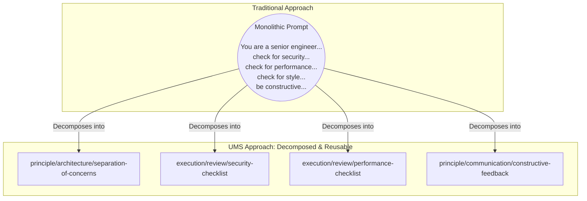
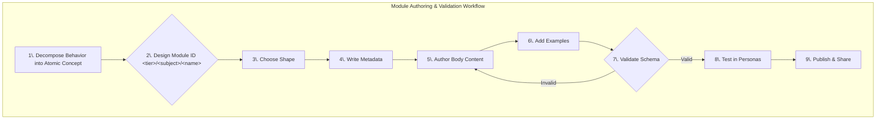
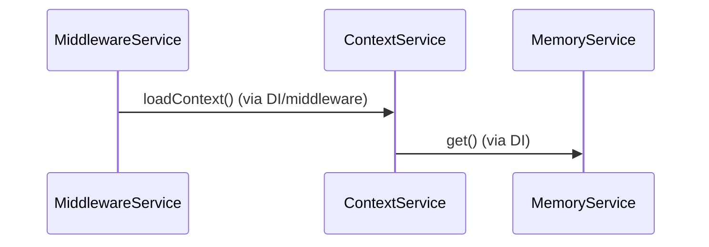
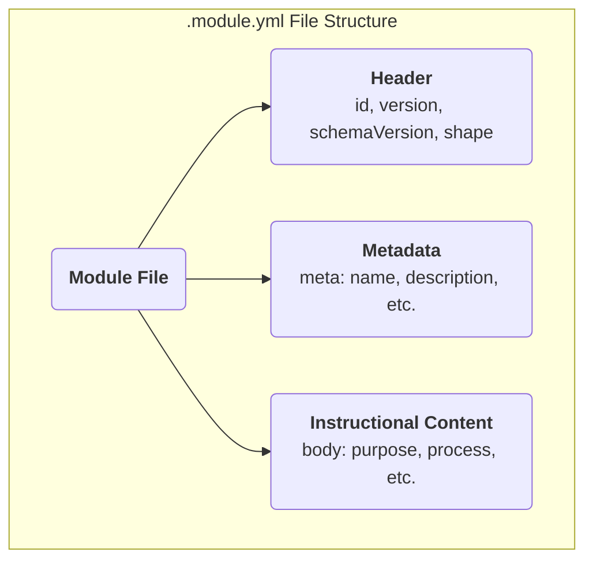
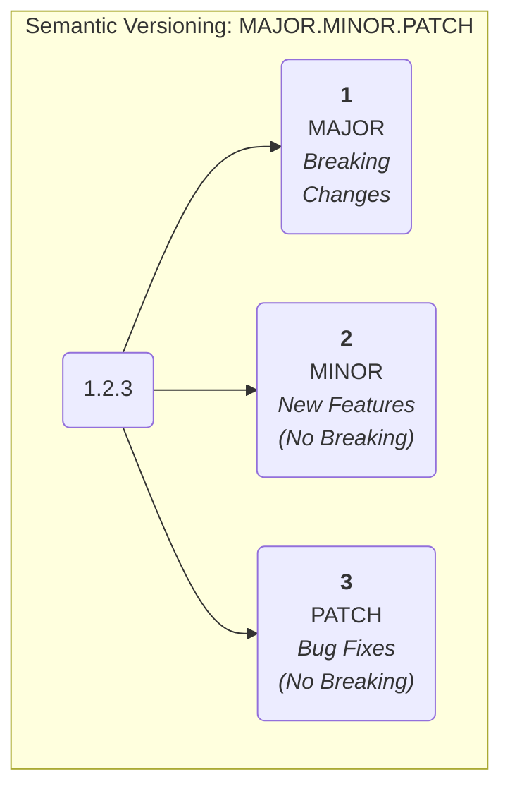

# UMS Module Authoring Guide

This guide provides a comprehensive overview of how to author high-quality Unified Module System (UMS) modules.

# Table of Contents

- [UMS Module Authoring Guide](#ums-module-authoring-guide)
- [Table of Contents](#table-of-contents)
- [1. Introduction](#1-introduction)
  - [What You'll Learn](#what-youll-learn)
  - [Who Should Use This Guide](#who-should-use-this-guide)
  - [1.1. Philosophy: Instructions as Code](#11-philosophy-instructions-as-code)
    - [The Problems with Traditional Prompting](#the-problems-with-traditional-prompting)
    - [The UMS Solution: Three Core Principles](#the-ums-solution-three-core-principles)
    - [Benefits of the Instructions-as-Code Approach](#benefits-of-the-instructions-as-code-approach)
  - [1.2. The Role of the Module Author](#12-the-role-of-the-module-author)
    - [Core Responsibilities](#core-responsibilities)
    - [Content Creation Excellence](#content-creation-excellence)
    - [Quality Assurance and Testing](#quality-assurance-and-testing)
    - [Lifecycle and Community Engagement](#lifecycle-and-community-engagement)
    - [Impact and Responsibility](#impact-and-responsibility)
  - [Getting Started](#getting-started)
- [2. The Module File (`.module.yml`)](#2-the-module-file-moduleyml)
  - [Overview: Your Module's Complete Definition](#overview-your-modules-complete-definition)
  - [2.1. File Structure Overview](#21-file-structure-overview)
  - [2.2. Top-Level Keys: The Module's Foundation](#22-top-level-keys-the-modules-foundation)
    - [`id`: The Module's Unique Address](#id-the-modules-unique-address)
    - [`version`: Semantic Version Control](#version-semantic-version-control)
    - [`schemaVersion`: UMS Specification Compliance](#schemaversion-ums-specification-compliance)
    - [`shape`: Structural Contract Declaration](#shape-structural-contract-declaration)
    - [Common Shape Selection Mistakes](#common-shape-selection-mistakes)
- [6. Authoring the Instructional `body`](#6-authoring-the-instructional-body)
  - [Understanding the Body Structure](#understanding-the-body-structure)
  - [Writing Philosophy: Instructions for Intelligence](#writing-philosophy-instructions-for-intelligence)
  - [6.1. The `purpose` Directive: The North Star](#61-the-purpose-directive-the-north-star)
    - [Writing Effective Purpose Statements](#writing-effective-purpose-statements)
    - [Purpose Statements by Shape](#purpose-statements-by-shape)
      - [Common Purpose Statement Mistakes](#common-purpose-statement-mistakes)
  - [6.2. Defining Sequences with `process`](#62-defining-sequences-with-process)
    - [Core Principles for Process Design](#core-principles-for-process-design)
    - [Writing Effective Process Steps](#writing-effective-process-steps)
    - [Advanced Process Structures](#advanced-process-structures)
      - [Process Patterns by Use Case](#process-patterns-by-use-case)
  - [6.3. Setting Boundaries with `constraints`](#63-setting-boundaries-with-constraints)
    - [Understanding Constraint Types](#understanding-constraint-types)
    - [Writing Effective Constraints](#writing-effective-constraints)
    - [Constraint Patterns by Domain](#constraint-patterns-by-domain)
    - [Advanced Constraint Structures](#advanced-constraint-structures)
  - [6.4. Explaining Concepts with `principles`](#64-explaining-concepts-with-principles)
    - [Writing Balanced Trade-off Analysis](#writing-balanced-trade-off-analysis)
    - [Context-Sensitive Trade-off Analysis](#context-sensitive-trade-off-analysis)
  - [6.7. Ensuring Quality with `criteria`](#67-ensuring-quality-with-criteria)
    - [Writing Effective Criteria](#writing-effective-criteria)
    - [Criteria Patterns by Purpose](#criteria-patterns-by-purpose)
  - [6.8. Providing Raw Information with `data`](#68-providing-raw-information-with-data)
    - [Data Authoring Principles](#data-authoring-principles)
    - [6.9. Using Composite Lists for Richer Content](#69-using-composite-lists-for-richer-content)
      - [When to Use Composite Lists](#when-to-use-composite-lists)
- [7. Creating Illustrative Examples](#7-creating-illustrative-examples)
  - [7.1. The `examples` Directive Structure](#71-the-examples-directive-structure)
    - [Example Structure Guidelines](#example-structure-guidelines)
    - [7.2. Writing a Clear `title` and `rationale`](#72-writing-a-clear-title-and-rationale)
      - [Effective Title Patterns](#effective-title-patterns)
      - [Rationale Writing Best Practices](#rationale-writing-best-practices)
    - [7.3. Providing an Effective `snippet`](#73-providing-an-effective-snippet)
      - [Code Quality Standards](#code-quality-standards)
      - [Example Types and Patterns](#example-types-and-patterns)
      - [Examples for Different Shapes](#examples-for-different-shapes)
      - [Multi-Language and Multi-Context Examples](#multi-language-and-multi-context-examples)
  - [Example Quality Checklist](#example-quality-checklist)
- [8. Versioning and Lifecycle](#8-versioning-and-lifecycle)
  - [8.1. `version` (SemVer 2.0.0)](#81-version-semver-200)
    - [Version Format Structure](#version-format-structure)
    - [Semantic Versioning Rules](#semantic-versioning-rules)
    - [Pre-Release Versioning](#pre-release-versioning)
  - [8.2. Module Lifecycle Stages](#82-module-lifecycle-stages)
      - [Stage 1: Development (`0.x.y` or `-alpha`)](#stage-1-development-0xy-or--alpha)
      - [Stage 2: Stabilization (`1.0.0-beta` to `1.0.0-rc`)](#stage-2-stabilization-100-beta-to-100-rc)
      - [Stage 3: Stable Release (`1.0.0+`)](#stage-3-stable-release-100)
      - [Stage 4: Maintenance and Evolution](#stage-4-maintenance-and-evolution)
  - [8.3. Deprecation and Sunset Strategy](#83-deprecation-and-sunset-strategy)
      - [Graceful Deprecation Process](#graceful-deprecation-process)
      - [Migration Guide Template](#migration-guide-template)
  - [8.4. Version Compatibility Matrix](#84-version-compatibility-matrix)
      - [Cross-Module Dependencies](#cross-module-dependencies)
      - [Breaking Change Communication](#breaking-change-communication)
  - [Compatibility](#compatibility)
      - [Version Release Checklist](#version-release-checklist)
    - [8.6. Ecosystem Coordination](#86-ecosystem-coordination)
      - [Version Synchronization Strategy](#version-synchronization-strategy)
      - [Community Version Adoption](#community-version-adoption)
  - [Effective versioning creates trust and predictability in your module ecosystem. By following semantic versioning principles and maintaining clear lifecycle management, you enable users to confidently adopt, upgrade, and integrate your modules into their development workflows.](#effective-versioning-creates-trust-and-predictability-in-your-module-ecosystem-by-following-semantic-versioning-principles-and-maintaining-clear-lifecycle-management-you-enable-users-to-confidently-adopt-upgrade-and-integrate-your-modules-into-their-development-workflows)
  - [9. Appendix: Authoring Checklist](#9-appendix-authoring-checklist)
    - [9.1. Module Structure and Format](#91-module-structure-and-format)
      - [File and Format Requirements](#file-and-format-requirements)
      - [Required Top-Level Fields](#required-top-level-fields)
    - [9.2. Module ID and Metadata Quality](#92-module-id-and-metadata-quality)
      - [Module ID (`id`) Validation](#module-id-id-validation)
      - [Metadata (`meta`) Completeness](#metadata-meta-completeness)
    - [9.3. Shape and Body Validation](#93-shape-and-body-validation)
      - [Shape Selection Appropriateness](#shape-selection-appropriateness)
      - [Shape-Specific Requirements](#shape-specific-requirements)
    - [9.4. Content Quality Standards](#94-content-quality-standards)
      - [Writing Quality](#writing-quality)
      - [Technical Accuracy](#technical-accuracy)
      - [Accessibility and Usability](#accessibility-and-usability)
    - [9.5. Examples and Documentation](#95-examples-and-documentation)
      - [Example Quality (if `examples` present)](#example-quality-if-examples-present)
      - [Example Structure](#example-structure)
    - [9.6. Version and Lifecycle Management](#96-version-and-lifecycle-management)
      - [Version Specification](#version-specification)
      - [Lifecycle Considerations](#lifecycle-considerations)
    - [9.7. Ecosystem Integration](#97-ecosystem-integration)
      - [Discoverability](#discoverability)
      - [Compatibility](#compatibility-1)
    - [9.8. Quality Assurance Validation](#98-quality-assurance-validation)
      - [Pre-Publication Review](#pre-publication-review)
      - [Testing and Validation](#testing-and-validation)
      - [Publication Readiness](#publication-readiness)
    - [9.9. Maintenance and Updates](#99-maintenance-and-updates)
      - [Ongoing Maintenance](#ongoing-maintenance)
      - [Evolution Planning](#evolution-planning)
    - [Quick Reference: Common Issues and Solutions](#quick-reference-common-issues-and-solutions)
      - [Frequent Validation Failures](#frequent-validation-failures)
      - [Quality Improvement Tips](#quality-improvement-tips)

# 1. Introduction

Welcome to the comprehensive guide for authoring Unified Module System (UMS) modules. Whether you're new to structured AI instruction design or looking to contribute to an existing UMS ecosystem, this guide will teach you everything you need to know to create high-quality, reusable modules.

The Unified Module System represents a fundamental paradigm shift in AI instruction design. Instead of writing monolithic, free-form prompts, UMS treats AI instructions as **machine-readable source code**—structured, validated, and infinitely composable. This approach transforms AI instruction development from an ad-hoc craft into a systematic engineering discipline.

## What You'll Learn

By the end of this guide, you'll be able to:

- Understand the core philosophy and principles behind UMS v1.1
- Design and structure effective module identifiers and namespaces
- Write compelling metadata that makes your modules discoverable
- Choose the appropriate module shape for your instructional content
- Author clear, actionable directive content in the module body
- Create comprehensive examples that illustrate your modules in action
- Manage module lifecycle, versioning, and deprecation
- Follow best practices for module composition and reusability

## Who Should Use This Guide

This guide is designed for:

- **AI Engineers** building sophisticated AI assistants and need modular, reusable instructions
- **Prompt Engineers** looking to move beyond ad-hoc prompting to systematic instruction design
- **DevOps Teams** implementing AI-powered automation and need maintainable, version-controlled prompts
- **Technical Writers** documenting AI behavior and wanting to create structured, searchable content
- **Open Source Contributors** contributing to shared UMS libraries and ecosystems
- **Enterprise Teams** standardizing AI instructions across organizations

## 1.1. Philosophy: Instructions as Code

Traditional AI prompting approaches suffer from several critical limitations that become apparent at scale:

### The Problems with Traditional Prompting

**Document-Centric Thinking**
Most AI prompts are written as prose documents—long, unstructured text blocks that humans find readable but machines cannot easily parse, validate, or manipulate. Consider this typical prompt:

```
You are a senior software engineer conducting code reviews. When reviewing code,
make sure to check for security vulnerabilities, performance issues, proper error
handling, code style consistency, test coverage, and documentation. Also consider
architectural concerns like separation of concerns, single responsibility principle,
and overall maintainability. Don't forget to be constructive in your feedback and
explain the reasoning behind your suggestions...
```

While functional, this approach creates several problems:
- **No structure:** Information is buried in prose, making it hard to extract or modify specific aspects
- **No validation:** There's no way to ensure all required topics are covered
- **Poor maintainability:** Updates require careful manual editing to avoid breaking context
- **Limited reusability:** The entire prompt must be copied and modified for different contexts

**Lack of Modularity**
Traditional prompts become monolithic as requirements grow. A comprehensive code review prompt might grow to hundreds of lines, mixing security concerns, style guidelines, architectural principles, and process steps in a single unwieldy document. This makes it nearly impossible to:
- Reuse specific parts across different contexts
- Update individual concerns without affecting others
- Compose different combinations of instructions for different scenarios
- Share common patterns across teams or projects

**No Validation or Consistency**
Without structured formats, there's no way to automatically validate that prompts contain required information, follow consistent patterns, or conform to organizational standards. Teams end up with:
- Inconsistent instruction quality across different AI applications
- Missing critical information that only becomes apparent in production
- No way to programmatically ensure compliance with policies or standards
- Difficulty maintaining consistency as teams and requirements grow

**Poor Discoverability**
Finding relevant existing prompts requires manual searching through unstructured text. As organizations build more AI applications:
- Valuable prompt patterns get lost in documentation systems
- Teams reinvent the wheel instead of reusing proven approaches
- No semantic search capabilities to find conceptually related instructions
- Knowledge becomes siloed within individual teams or developers

### The UMS Solution: Three Core Principles

UMS v1.1 addresses these limitations through three foundational principles that transform AI instruction design:

**1. Data-Centric Architecture**

Every UMS module is a structured `.module.yml` file—a machine-readable data format rather than a prose document. This fundamental shift means:

- **Structured Content:** Instructions are organized into typed directive blocks (like `purpose`, `process`, `constraints`) that tools can parse and manipulate
- **Automated Validation:** Build tools can verify that modules conform to expected structures and contain required information
- **Programmatic Composition:** Modules can be automatically combined, ordered, and rendered into final prompts
- **Rich Metadata:** Structured metadata enables sophisticated search, filtering, and discovery capabilities

**2. Atomic Modularity**

Each module represents a single, indivisible instructional concept with a clear, well-defined purpose. This means:

- **Single Responsibility:** A module does one thing well—whether it's defining a coding standard, outlining a review process, or providing a security checklist
- **Clear Boundaries:** Module scope is explicitly defined, making dependencies and interactions predictable
- **Maximum Reusability:** Atomic modules can be combined in countless ways without modification
- **Independent Evolution:** Modules can be updated, deprecated, or replaced without affecting unrelated functionality

**3. Static Composition**

Complex AI behaviors emerge from explicitly sequencing atomic modules in persona files, rather than trying to capture everything in monolithic prompts:

- **Explicit Dependencies:** The composition process makes module relationships clear and manageable
- **Predictable Behavior:** The same set of modules in the same order produces identical results
- **Flexible Recombination:** Different combinations of the same modules create different AI behaviors
- **Version Control:** Persona compositions can be versioned, reviewed, and rolled back like code

### Benefits of the Instructions-as-Code Approach

This paradigm shift brings software engineering best practices to AI instruction design:

**Version Control and Change Management**
- Track changes to instructions with Git or other VCS systems
- Review and approve instruction updates through pull requests
- Roll back problematic changes with confidence
- Maintain different versions for different environments (dev, staging, production)

**Automated Testing and Validation**
- Validate module structure and content automatically in CI/CD pipelines
- Test different module combinations before deployment
- Ensure organizational policies are consistently applied
- Catch structural errors before they reach production AI systems

**Collaboration and Code Sharing**
- Multiple team members can contribute to the same instruction set
- Share proven patterns across teams and organizations
- Build standardized libraries of domain-specific instructions
- Contribute to and benefit from open-source instruction libraries

**Systematic Maintenance and Evolution**
- Update specific concerns (like security policies) across all relevant AI applications
- Deprecate outdated practices with clear migration paths
- Refactor instruction organization without breaking existing applications
- Monitor usage patterns to identify optimization opportunities

## 1.2. The Role of the Module Author

As a UMS module author, you become a **software engineer for AI instructions**. This role requires a unique combination of technical precision, clear communication, and systematic thinking. Understanding your responsibilities and the impact of your work is crucial for creating modules that serve the broader ecosystem effectively.

### Core Responsibilities

**Strategic Decomposition**

Your first and most critical responsibility is breaking down complex AI behaviors into atomic, reusable components. This requires thinking beyond immediate use cases to identify underlying patterns and reusable concepts.

*Example: Instead of creating a monolithic "Senior Developer Code Reviewer" module, decompose it into:*
- `principle/architecture/separation-of-concerns` - Core architectural principles
- `execution/review/security-checklist` - Security-specific review criteria
- `execution/review/performance-checklist` - Performance review guidelines
- `principle/communication/constructive-feedback` - Guidelines for giving helpful feedback

This decomposition enables:



- **Flexible Recombination:** Create different reviewer personas (junior, security-focused, performance-focused) by combining different modules
- **Independent Updates:** Update security guidelines without affecting architectural principles
- **Cross-Domain Reuse:** Use the constructive feedback module in non-code-review contexts
- **Specialized Expertise:** Different domain experts can author modules in their areas of expertise

**Thoughtful Abstraction**

Finding the right level of abstraction is an art that balances specificity with reusability. Your modules should be:

- **Specific enough to be actionable:** Vague guidelines like "write good code" provide little value
- **General enough to be reusable:** Overly specific instructions limit applicability
- **Technology-agnostic when appropriate:** Principles often transcend specific tools or languages
- **Domain-specific when necessary:** Some instructions are inherently tied to specific contexts

*Example: A module about dependency injection should focus on the general principle and benefits rather than specific framework syntax, making it applicable across multiple programming languages and frameworks.*

**Interface Design Excellence**

Just as well-designed software APIs have clear contracts, your modules need clear, predictable interfaces:

**Clear Purpose Statements:** Every module should have an unambiguous `purpose` directive that explains exactly what it does and when it applies.

**Predictable Interactions:** Consider how your module will work when combined with others. Avoid conflicting directives or overlapping concerns.

**Consistent Terminology:** Use standard terms and concepts that align with other modules in the ecosystem.

**Appropriate Dependencies:** If your module builds on concepts from other modules, make those relationships clear in documentation and metadata.

### Content Creation Excellence

**Documentation for Multiple Audiences**

Your modules serve both human developers and AI systems, requiring different types of documentation:

**For Human Discovery and Understanding:**
- `name`: Clear, descriptive titles that immediately convey purpose
- `description`: Concise summaries optimized for quick scanning in lists
- `tags`: Relevant keywords for filtering and categorization

**For AI Semantic Search:**
- `semantic`: Dense, keyword-rich paragraphs optimized for vector embeddings
- Include synonyms, related concepts, and technical terminology
- Consider what terms someone might search for when looking for your module's functionality

**For Tool Validation:**
- Proper `shape` declaration that accurately reflects your module's structure
- Correct directive usage that aligns with your chosen shape's contract
- Valid examples that demonstrate proper usage patterns

**Technical Precision**

Your modules become part of a larger computational system, requiring technical rigor:

**Schema Compliance:** Ensure your modules validate against UMS v1.1 schema requirements
**Consistent Structure:** Follow established patterns for directive organization and content formatting
**Error Handling:** Consider edge cases and provide clear guidance for unusual situations
**Performance Awareness:** Write content that renders efficiently and doesn't create excessively long prompts

### Quality Assurance and Testing



**Validation and Integration**

Before publishing modules, ensure they:
- Validate successfully against UMS schema requirements
- Render correctly in build tools and produce readable Markdown output
- Integrate cleanly with related modules without conflicts or redundancy
- Follow established conventions for ID naming, metadata structure, and content organization

**Usage Testing**

Consider testing your modules in realistic scenarios:
- Compose them with related modules to verify they work well together
- Test the resulting AI behavior to ensure instructions are clear and effective
- Gather feedback from other developers who might use your modules
- Iterate based on real-world usage patterns and outcomes

### Lifecycle and Community Engagement

**Long-term Maintenance**

Module authoring is not a one-time activity. Plan for:

**Evolutionary Updates:** As best practices evolve, update your modules to reflect current thinking
**Deprecation Management:** When modules become obsolete, provide clear replacement guidance
**Version Compatibility:** Understand how your changes affect existing compositions
**Community Feedback:** Respond to issues and suggestions from module users

**Ecosystem Contribution**

Consider your role in the broader UMS community:
- **Knowledge Sharing:** Document patterns and approaches that others can learn from
- **Standard Development:** Contribute to discussions about UMS evolution and best practices
- **Quality Improvement:** Help identify and resolve issues in the broader module library
- **Mentorship:** Help new module authors understand effective patterns and approaches

### Impact and Responsibility

Your modules become building blocks that others depend on to create reliable AI systems. This carries significant responsibility:

**Accuracy and Reliability:** Ensure your instructions are technically accurate and lead to desired outcomes
**Clarity and Precision:** Write content that minimizes ambiguity and misinterpretation
**Ethical Considerations:** Consider the broader implications of the behaviors your modules encourage
**Performance Impact:** Be mindful of how your modules affect overall system performance and token usage

The ultimate goal is creating a **standard library of AI instructions** that enables developers to build sophisticated, reliable AI assistants through composition rather than custom development. Your contributions to this ecosystem have the potential to influence how AI systems behave across many applications and organizations.

## Getting Started

Now that you understand the philosophy and responsibilities involved, you're ready to dive into the practical aspects of module creation. The following sections will guide you through each step of the authoring process, from designing effective module identifiers to writing compelling instructional content.

Remember: effective module authoring is both an art and a science. While this guide provides the technical framework and best practices, developing intuition for good module design comes through practice and engagement with the broader UMS community.

# 2. The Module File (`.module.yml`)

The `.module.yml` file is the foundation of the UMS ecosystem—a structured, machine-readable document that defines everything about your module. Understanding its structure, requirements, and best practices is essential for creating effective modules that integrate seamlessly with the broader UMS ecosystem.

## Overview: Your Module's Complete Definition

A `.module.yml` file is more than just a configuration file; it's the complete specification of your module's identity, purpose, structure, and content. Every piece of information that tools, AI systems, and other developers need to understand, discover, validate, and use your module is contained within this single file.

Think of it as the "source code" for an AI instruction—just as a software function has a signature, documentation, and implementation, your module has metadata, structural definition, and instructional content, all precisely specified in a machine-readable format.

## 2.1. File Structure Overview

Every UMS v1.1 module follows a consistent, hierarchical structure that organizes information from general to specific:

```yaml
# Required header information
id: "tier/subject/module-name"
version: "1.0.0"
schemaVersion: "1.1"
shape: "procedure"

# Rich metadata for discovery and understanding
meta:
  name: "Human-Readable Module Name"
  description: "Concise summary of what this module does."
  semantic: |
    Dense, keyword-rich paragraph optimized for AI semantic search and vector embeddings.
    Includes related concepts, synonyms, and technical details.
  # Optional metadata fields...

# The instructional content
body:
  purpose: |
    Clear statement of what this module accomplishes and when it applies.
  # Additional directives based on the module's shape...
```





This structure serves multiple purposes:

**Machine Readability:** Tools can parse and validate the structure automatically
**Human Scannability:** Developers can quickly understand a module's purpose and structure
**Composability:** Build systems can combine modules predictably
**Discoverability:** Search and filtering systems can index and retrieve modules effectively

## 2.2. Top-Level Keys: The Module's Foundation

The top level of every module contains six required keys that establish the module's identity and structure. Understanding each key's purpose, requirements, and impact is crucial for effective module authoring.

### `id`: The Module's Unique Address

The `id` field serves as your module's permanent address in the UMS ecosystem—a globally unique identifier that tells tools and developers exactly where your module belongs in the architectural hierarchy.

**Purpose and Importance:**
- **Unique Identity:** No two modules can share the same ID, ensuring clear references
- **Namespace Organization:** The ID structure organizes modules hierarchically by tier and subject
- **Permanent Address:** Once published, an ID should never change (changes effectively create a new module)
- **Composition Reference:** Other modules and personas use this ID to include your module

**Structure:** `<tier>/<subject>/<module-name>`

**Example IDs:**
```yaml
# Foundation tier: Core cognitive frameworks
id: "foundation/reasoning/systems-thinking"

# Principle tier: Technology-agnostic best practices
id: "principle/architecture/separation-of-concerns"

# Technology tier: Specific tools and frameworks
id: "technology/language/python/pep8-style-guide"

# Execution tier: Step-by-step procedures
id: "execution/review/security-vulnerability-checklist"
```

**Best Practices for ID Design:**

**Choose Descriptive Names:** Your module name should clearly indicate its purpose
```yaml
# Good - immediately clear what this does
id: "execution/testing/unit-test-creation-procedure"

# Poor - too vague to understand purpose
id: "execution/testing/procedure1"
```

**Use Consistent Terminology:** Align with established patterns in your tier
```yaml
# Consistent with other security modules
id: "execution/security/dependency-vulnerability-scan"

# Inconsistent terminology
id: "execution/security/check-deps-for-problems"
```

**Plan for Evolution:** Consider how your ID will work with related modules
```yaml
# Leaves room for related modules
id: "principle/communication/constructive-feedback"
# Related: principle/communication/active-listening
# Related: principle/communication/conflict-resolution
```

**Avoid Overly Specific Names:** Balance specificity with reusability
```yaml
# Good - applicable to multiple languages
id: "principle/testing/test-driven-development"

# Too specific - limits reusability
id: "principle/testing/java-junit5-tdd-with-mockito"
```

### `version`: Semantic Version Control

The `version` field assigns a unique version identifier to each iteration of your module, enabling systematic lifecycle management and change tracking.

**Format:** Must be a valid Semantic Versioning 2.0.0 string
```yaml
version: "1.0.0"      # Major.Minor.Patch
version: "2.1.3"      # Multiple iterations
version: "1.0.0-beta" # Pre-release versions
```

**Current Behavior (v1.1):** While required, the CLI currently ignores version for module resolution. This field is reserved for future functionality but must be present for validation.

**Semantic Versioning Guidelines:**
- **Major (1.x.x):** Breaking changes that affect module structure or meaning
- **Minor (x.1.x):** New features or enhancements that maintain compatibility
- **Patch (x.x.1):** Bug fixes and clarifications that don't change functionality

**Planning for the Future:** Even though versions aren't used yet, follow semantic versioning principles:
```yaml
# Initial release
version: "1.0.0"

# Added examples, no breaking changes
version: "1.1.0"

# Fixed typos in constraints
version: "1.1.1"

# Restructured directives (breaking change)
version: "2.0.0"
```

### `schemaVersion`: UMS Specification Compliance

The `schemaVersion` explicitly declares which version of the UMS specification your module conforms to, enabling tools to apply correct validation and parsing rules.

**For UMS v1.1 modules:**
```yaml
schemaVersion: "1.1"
```

**Critical Importance:**
- **Forward Compatibility:** As UMS evolves, tools can handle different schema versions appropriately
- **Validation Rules:** Tools apply the correct structural and content validation for your schema version
- **Feature Support:** Determines which UMS features and directive types are available
- **Migration Path:** Provides a clear upgrade path when new UMS versions are released

**Common Mistakes to Avoid:**
```yaml
# Correct
schemaVersion: "1.1"

# Incorrect - wrong format
schemaVersion: "1.1.0"
schemaVersion: "v1.1"
schemaVersion: 1.1
```

### `shape`: Structural Contract Declaration

The `shape` field declares your module's structural intent—what kind of instructional content consumers should expect and which directives are required or optional in your module's body.

**Purpose:**
- **Validation Contract:** Tools validate your body content against your declared shape
- **User Expectations:** Developers know what kind of content and structure to expect
- **Tooling Support:** Enables shape-specific rendering and processing features

**Available Shapes in UMS v1.1:**

**`specification`** - Defines rules or standards
```yaml
shape: specification
# Required: purpose, constraints
# Optional: recommended, discouraged, examples
```

**`procedure`** - Step-by-step processes
```yaml
shape: procedure
# Required: purpose, process
# Optional: recommended, discouraged, examples
```

**`pattern`** - High-level concepts and trade-offs
```yaml
shape: pattern
# Required: purpose, principles, advantages, disadvantages
# Optional: constraints, recommended, discouraged, examples
```

**`checklist`** - Verification criteria
```yaml
shape: checklist
# Required: purpose, criteria
# Optional: examples
```

**`data`** - Raw information blocks
```yaml
shape: data
# Required: purpose, data
# Optional: examples
```

**`procedural-specification`** - Hybrid process + rules
```yaml
shape: procedural-specification
# Required: purpose, process, constraints
# Optional: recommended, discouraged, examples
```

**`playbook`** - End-to-end workflows with verification
```yaml
shape: playbook
# Required: purpose, process, constraints, criteria
# Optional: principles, recommended, discouraged, examples, data
```

**Choosing the Right Shape:**

Consider these questions when selecting a shape:

1. **Primary Purpose:** What is this module's main function?
   - Rules/standards → `specification`
   - Step-by-step process → `procedure`
   - Concept explanation → `pattern`
   - Verification items → `checklist`
   - Raw information → `data`

2. **Content Structure:** What directives do you need?
   - Need both process and strict rules → `procedural-specification`
   - Need comprehensive workflow with verification → `playbook`

3. **Usage Context:** How will this be used?
   - Reference during work → `specification` or `checklist`
   - Execution guidance → `procedure` or `playbook`
   - Learning/understanding → `pattern`

### Common Shape Selection Mistakes

**Over-Engineering Simple Content:**
```yaml
# Don't use complex shapes for simple content
shape: playbook  # Too complex for simple checklist
body:
  purpose: "Verify code meets quality standards"
  criteria: ["Tests exist", "Code is readable", "Passes linting"]

# Better: Use appropriate simple shape
shape: checklist
body:
  purpose: "Verify code meets quality standards"
  criteria: ["Tests exist", "Code is readable", "Passes linting"]
```

**Under-Engineering Complex Content:**
```yaml
# Don't use simple shapes for complex requirements
shape: procedure  # Missing important constraints and verification
body:
  purpose: "Deploy to production"
  process: ["Run tests", "Deploy code", "Monitor"]

# Better: Use appropriate complex shape
shape: procedural-specification
body:
  purpose: "Deploy to production with security compliance"
  process: ["Run security scans", "Deploy with approval", "Monitor for 24 hours"]
  constraints: ["Must pass security scan", "Requires two-person approval"]
```

**Mixing Incompatible Content:**
```yaml
# Don't try to force step-by-step content into concept shapes
shape: pattern  # Wrong shape for procedural content
body:
  purpose: "Deploy applications using CI/CD pipeline"
  principles:
    - "APIs must use RESTful conventions"
    - "Status codes must follow HTTP standards"

# Better: Use procedure shape for step-by-step content
shape: procedure
body:
  purpose: "Execute safe deployment process"
  process: ["Deploy to staging", "Run tests", "Deploy to production"]
```

Choosing the right shape is crucial for module effectiveness. Take time to understand your content's primary purpose and select the shape that best supports that goal while providing appropriate validation and user expectations.

# 6. Authoring the Instructional `body`

The `body` is where your module delivers its core value—the actual instructions, guidance, and information that will shape AI behavior. While the metadata makes your module discoverable, the body makes it useful. Writing effective body content requires understanding both the technical requirements of each directive and the art of clear, actionable communication.

## Understanding the Body Structure

The `body` is an object composed of directive blocks, where each key is a standard directive name and each value contains the instructional content for that directive. The available directives and their requirements depend entirely on your chosen shape—this is where the shape contract is enforced.

```yaml
body:
  purpose: |
    Clear statement of what this module accomplishes and when it applies.

  # Additional directives based on your shape
  process:
    - "Sequential step that moves toward the goal"
    - "Another step that builds on the previous one"

  constraints:
    - "Hard requirement that MUST be followed"
    - "Boundary condition that defines limits"
```

## Writing Philosophy: Instructions for Intelligence

When authoring body content, remember that you're writing instructions for an intelligent system, not rigid automation. Your directives should:

**Be Precise Yet Flexible:** Provide clear guidance while allowing for intelligent interpretation and adaptation to context.

**Assume Intelligence:** Write for a capable partner who can understand nuance, infer context, and make reasonable decisions within your guidance.

**Focus on Intent:** Clearly communicate the "why" behind instructions, not just the "what" and "how."

**Enable Reasoning:** Provide enough context and rationale for the AI to understand when and how to apply your guidance.

## 6.1. The `purpose` Directive: The North Star

The `purpose` directive is the foundation of every UMS module—it appears in all shapes and sets the context for everything else in the body. Think of it as your module's mission statement, clearly articulating what the module accomplishes and when it should be applied.

### Writing Effective Purpose Statements

**Be Outcome-Focused:** Start with what the module achieves, not what it contains
```yaml
# Good - focuses on outcome
purpose: |
  Ensure consistent code formatting across Python projects by enforcing PEP 8
  standards, improving readability and maintainability for development teams.

# Poor - focuses on content rather than outcome
purpose: |
  This module contains Python coding standards and formatting rules.
```

**Include Context and Scope:** Help readers understand when and where to apply the module
```yaml
# Good - provides clear context
purpose: |
  Execute zero-downtime deployments for web applications using blue-green
  deployment strategy, enabling safe production updates with instant rollback capability.

# Poor - lacks important context
purpose: |
  Deploy applications using blue-green methodology.
```

**Use Active, Direct Language:** Write from the perspective of what will be accomplished
```yaml
# Good - active and direct
purpose: |
  Identify and remediate security vulnerabilities in web applications through
  systematic penetration testing and code analysis.

# Poor - passive and indirect
purpose: |
  Security vulnerabilities can be found through various testing approaches.
```

### Purpose Statements by Shape

**Specification Shapes:** Focus on the scope and authority of rules
```yaml
# specification
purpose: |
  Define mandatory REST API design principles that ensure consistent, predictable,
  and developer-friendly interfaces across all microservices in the platform.

# procedural-specification
purpose: |
  Execute secure code deployment through validated processes that prevent
  security vulnerabilities from reaching production systems while maintaining
  compliance with organizational security policies.
```

**Process Shapes:** Emphasize the goal and workflow outcome
```yaml
# procedure
purpose: |
  Complete feature development from conception to deployment using Git-based
  workflows that enable parallel development, thorough review, and safe integration.

# playbook
purpose: |
  Respond to security incidents through coordinated containment, investigation,
  and recovery procedures that minimize damage while preserving forensic evidence
  and maintaining stakeholder communication.
```

**Concept Shapes:** Explain the fundamental value and applicability
```yaml
# pattern
purpose: |
  Implement loose coupling between system components using the Observer pattern,
  enabling one-to-many dependencies where state changes automatically notify
  all dependent objects without creating tight coupling.
```

**Validation and Data Shapes:** State the verification or information goal
```yaml
# checklist
purpose: |
  Verify that pull requests meet quality, security, and maintainability standards
  before integration, ensuring consistent code quality across the development team.

# data
purpose: |
  Provide production-ready Docker multi-stage build template that optimizes
  image size, security, and build performance for Node.js applications.
```

#### Common Purpose Statement Mistakes

**Too Vague or Generic:**
```yaml
# Poor - could apply to almost anything
purpose: |
  Improve code quality and development practices.

# Better - specific and actionable
purpose: |
  Enforce Python PEP 8 coding standards to ensure consistent formatting,
  naming conventions, and structure across all Python codebases.
```

**Missing Context or Scope:**
```yaml
# Poor - lacks important boundaries
purpose: |
  Deploy applications safely.

# Better - clear scope and context
purpose: |
  Deploy web applications to production environments using blue-green deployment
  strategy, ensuring zero downtime and immediate rollback capability.
```

**Implementation Details Instead of Goals:**
```yaml
# Poor - focuses on how rather than what/why
purpose: |
  Use Git branches and pull requests to manage code changes.

# Better - focuses on the goal and value
purpose: |
  Enable parallel feature development and maintain code quality through
  Git branch workflows that isolate changes and require peer review.
```

## 6.2. Defining Sequences with `process`

The `process` directive defines sequential, step-by-step instructions for achieving a goal. It appears in `procedure`, `procedural-specification`, and `playbook` shapes, representing the core workflow that users will follow.

### Core Principles for Process Design

**Sequential Logic:** Each step should build logically on previous steps
**Single Responsibility:** Each step should accomplish one clear, focused task
**Actionable Clarity:** Steps should be specific enough to act upon without ambiguity
**Reasonable Granularity:** Balance detail with readability—not too broad, not too granular

### Writing Effective Process Steps

**Use Action-Oriented Language:** Start steps with verbs that clearly indicate what to do
```yaml
process:
  # Good - clear action verbs
  - "Configure the staging environment with identical infrastructure to production"
  - "Deploy the new application version to the staging environment"
  - "Execute comprehensive health checks and performance validation"

  # Poor - vague or passive language
  - "The staging environment should be ready"
  - "There needs to be deployment to staging"
  - "Health checks are important"
```

**Include Necessary Context:** Provide enough information for intelligent execution
```yaml
process:
  # Good - includes relevant context and criteria
  - "Run automated security scanning using OWASP ZAP and document any findings above medium severity"
  - "Perform load testing with traffic patterns matching 150% of peak production load"
  - "Monitor application metrics for 30 minutes, watching for memory leaks or performance degradation"

  # Poor - lacks important context
  - "Run security scan"
  - "Review results"
  - "Fix problems"
```

**Maintain Appropriate Granularity:** Balance comprehensiveness with usability
```yaml
process:
  # Good granularity - detailed but not overwhelming
  - "Create a feature branch from the current development branch using descriptive naming"
  - "Develop the feature using test-driven development practices with frequent commits"
  - "Ensure comprehensive test coverage including unit, integration, and end-to-end tests"
  - "Run automated quality checks including linting, security scanning, and performance testing"
  - "Create a detailed pull request with clear description, testing notes, and deployment considerations"
  - "Address code review feedback promptly and maintain open communication with reviewers"
  - "Merge using the team's established strategy after all approval criteria are met"
  - "Verify successful deployment and monitor for any issues in the first 24 hours"

  # Too granular - overwhelming detail
  - "Open your terminal application"
  - "Navigate to the project directory using cd command"
  - "Type 'git checkout development' to switch to development branch"
  - "Press enter to execute the command"

  # Too broad - lacks actionable detail
  - "Set up your development environment"
  - "Write the code"
  - "Test everything"
```

### Advanced Process Structures

**Simple Array Format:** For straightforward, linear processes
```yaml
process:
  - "Verify all automated tests pass and security scans show no critical issues"
  - "Coordinate deployment timing with stakeholders to minimize business impact"
  - "Prepare rollback procedures and verify they can be executed quickly if needed"
  - "Deploy to staging environment first and validate all functionality works correctly"
  - "Execute production deployment using proven automation tools and procedures"
  - "Monitor key metrics and application health continuously during and after deployment"
  - "Communicate deployment status to stakeholders and document any issues encountered"
```

**Composite Format:** For complex processes that benefit from additional context
```yaml
process:
  desc: |
    This incident response process prioritizes rapid containment while preserving
    evidence for investigation. Each phase builds on the previous one, with clear
    decision points for escalation and communication.
  list:
    - "Assess the scope and severity of the security incident within 5 minutes of detection"
    - "Activate the incident response team using predefined communication channels"
    - "Implement immediate containment measures to prevent further damage or data loss"
    - "Preserve forensic evidence while maintaining detailed logs of all response actions"
    - "Conduct initial damage assessment and determine customer impact"
    - "Execute stakeholder notification according to communication matrix"
    - "Begin forensic investigation to determine root cause and attack vectors"
    - "Implement permanent remediation measures and verify effectiveness"
    - "Conduct post-incident review and update security measures based on lessons learned"
```

#### Process Patterns by Use Case

**Development Workflows:** Focus on quality gates and collaboration
```yaml
process:
  - "Create a focused feature branch with descriptive naming that indicates the work scope"
  - "Develop the feature using test-driven development practices with frequent commits"
  - "Ensure comprehensive test coverage including unit, integration, and end-to-end tests"
  - "Run automated quality checks including linting, security scanning, and performance testing"
  - "Create a detailed pull request with clear description, testing notes, and deployment considerations"
  - "Address code review feedback promptly and maintain open communication with reviewers"
  - "Merge using the team's established strategy after all approval criteria are met"
  - "Verify successful deployment and monitor for any issues in the first 24 hours"
```

**Deployment Procedures:** Emphasize safety, verification, and rollback readiness
```yaml
process:
  - "Verify all automated tests pass and security scans show no critical issues"
  - "Coordinate deployment timing with stakeholders to minimize business impact"
  - "Prepare rollback procedures and verify they can be executed quickly if needed"
  - "Deploy to staging environment first and validate all functionality works correctly"
  - "Execute production deployment using proven automation tools and procedures"
  - "Monitor key metrics and application health continuously during and after deployment"
  - "Communicate deployment status to stakeholders and document any issues encountered"
```

**Investigation and Analysis:** Structure systematic discovery and documentation
```yaml
process:
  - "Gather initial information about the problem including symptoms, timing, and affected systems"
  - "Reproduce the issue in a controlled environment to understand the failure conditions"
  - "Analyze system logs, metrics, and traces to identify potential root causes"
  - "Form hypotheses about the underlying cause and design tests to validate or refute them"
  - "Implement the most likely solution while monitoring for improvement or side effects"
  - "Document findings, resolution steps, and preventive measures for future reference"
  - "Share lessons learned with the team and update relevant procedures or documentation"
```

## 6.3. Setting Boundaries with `constraints`

The `constraints` directive defines non-negotiable rules, requirements, and boundaries that govern how work should be done. These are the "must do" and "must not do" statements that establish clear limits and requirements.

### Understanding Constraint Types

**Mandatory Requirements:** Things that MUST be done
**Prohibitions:** Things that MUST NOT be done
**Boundary Conditions:** Limits and thresholds that cannot be crossed
**Compliance Rules:** Regulatory or organizational requirements that cannot be negotiated

### Writing Effective Constraints

**Use Strong, Unambiguous Language:** Make clear what is required vs. recommended
```yaml
constraints:
  # Good - uses clear modal verbs for requirements
  - "All API responses MUST include proper HTTP status codes and Content-Type headers"
  - "Database passwords MUST NOT be stored in plain text or committed to version control"
  - "Production deployments MUST be approved by at least two senior engineers"

  # Poor - ambiguous language that leaves room for interpretation
  - "API responses should probably have status codes"
  - "Database passwords shouldn't be stored in plain text if possible"
  - "Production deployments need approval from seniors"
```

**Be Specific About Scope and Context:** Define exactly when and where constraints apply
```yaml
constraints:
  # Good - clear scope and context
  - "All user input in web forms MUST be validated and sanitized before database storage"
  - "Memory usage in production containers MUST NOT exceed 2GB per instance"
  - "Customer data MUST be encrypted at rest using AES-256 or stronger encryption"

  # Poor - unclear scope
  - "Input must be validated"
  - "Memory usage should be reasonable"
  - "Data should be encrypted"
```

**Include Rationale When Helpful:** Explain the reasoning behind important constraints
```yaml
constraints:
  - "Code coverage MUST be at least 80% for all new features to ensure adequate testing"
  - "API keys MUST be rotated every 90 days to limit exposure window in case of compromise"
  - "Database queries MUST use parameterized statements to prevent SQL injection attacks"
```

### Constraint Patterns by Domain

**Security Constraints:** Focus on protection and compliance
```yaml
constraints:
  - "All authentication tokens MUST expire within 24 hours of issuance"
  - "Sensitive data MUST NOT be logged or stored in temporary files"
  - "Production systems MUST be accessed only through approved VPN connections"
  - "Security patches MUST be applied within 72 hours of availability"
  - "Data export functionality MUST include audit logging of all access"
```

**Performance Constraints:** Define acceptable limits and thresholds
```yaml
constraints:
  - "API response times MUST NOT exceed 500ms for 95% of requests"
  - "Database connection pools MUST be limited to prevent resource exhaustion"
  - "Background jobs MUST complete within 5 minutes to avoid blocking other processes"
  - "Image uploads MUST be resized to prevent storage bloat beyond 2MB per file"
```

**Quality and Process Constraints:** Establish standards and workflows
```yaml
constraints:
  - "All public APIs MUST include comprehensive OpenAPI documentation"
  - "Code changes MUST be reviewed by at least one other team member before merging"
  - "Breaking changes MUST be announced at least two weeks before implementation"
  - "Database migrations MUST be reversible and tested in staging environments"
  - "Error messages MUST not expose internal system information to end users"
```

**Compliance and Regulatory Constraints:** Address legal and organizational requirements
```yaml
constraints:
  - "Personal data processing MUST comply with GDPR requirements including consent and deletion rights"
  - "Financial calculations MUST use decimal arithmetic to prevent floating-point errors"
  - "Audit logs MUST be tamper-proof and retained for minimum seven years"
  - "Third-party integrations MUST be approved by security team before implementation"
```

### Advanced Constraint Structures

**Simple Array Format:** For straightforward rules and requirements
```yaml
constraints:
  - "All production deployments MUST occur during designated maintenance windows"
  - "Code MUST pass automated security scanning with no high or critical vulnerabilities"
  - "Database changes MUST be backward-compatible to support zero-downtime deployments"
  - "API versioning MUST follow semantic versioning principles with clear deprecation paths"
```

**Composite Format:** For complex constraints that benefit from context
```yaml
constraints:
  desc: |
    These requirements apply to all production systems and are derived from
    SOC 2 compliance requirements and organizational security policies.
  list:
    - "All production data MUST be encrypted using AES-256 or stronger"
    - "Administrative access MUST use multi-factor authentication"
    - "System logs MUST be tamper-proof and retained for 7 years"
```

## 6.4. Explaining Concepts with `principles`

The `principles` directive appears in `pattern` and `playbook` shapes to help readers understand the trade-offs inherent in different approaches. This balanced perspective is crucial for making informed decisions about when and how to apply patterns.

### Writing Balanced Trade-off Analysis

**`advantages` - Benefits and Positive Outcomes:**
```yaml
advantages:
  # Specific benefits with clear value propositions
  - "Enables independent scaling of services based on individual load patterns and resource requirements"
  - "Facilitates technology diversity by allowing teams to choose optimal tools for each service"
  - "Improves fault isolation so failures in one service don't cascade to the entire system"
  - "Supports parallel development by multiple teams with minimal coordination overhead"
  - "Allows faster deployment cycles since services can be updated independently"
```

**`disadvantages` - Costs and Limitations:**
```yaml
disadvantages:
  # Honest assessment of costs and challenges
  - "Introduces network latency and potential points of failure between service communications"
  - "Increases operational complexity requiring sophisticated monitoring and debugging tools"
  - "Creates challenges with distributed transactions and data consistency across service boundaries"
  - "Requires significant infrastructure investment in container orchestration and service mesh"
  - "May result in code duplication across services and increased maintenance overhead"
```

### Context-Sensitive Trade-off Analysis

**Technical Trade-offs:** Focus on implementation and performance implications
```yaml
advantages:
  - "Reduces memory usage by sharing immutable data structures between components"
  - "Simplifies debugging by eliminating side effects and making state changes explicit"
  - "Enables easy testing through predictable input-output relationships"

disadvantages:
  - "May have performance overhead from creating new objects instead of mutating existing ones"
  - "Can be more difficult for developers familiar with imperative programming patterns"
  - "Requires careful design to avoid excessive object creation and garbage collection pressure"
```

**Organizational Trade-offs:** Consider team and process implications
```yaml
advantages:
  - "Reduces coordination overhead between teams by establishing clear service boundaries"
  - "Enables teams to move at different speeds without blocking each other's progress"
  - "Supports specialization by allowing teams to focus on specific business domains"

disadvantages:
  - "Requires mature DevOps practices and tooling that may not exist in all organizations"
  - "Can create communication silos if service boundaries don't align with team structure"
  - "May lead to inconsistent user experiences if services aren't well coordinated"
```

## 6.7. Ensuring Quality with `criteria`

The `criteria` directive appears in `checklist` and `playbook` shapes to define verification items that can be checked or validated. These are designed to be actionable quality gates that ensure standards are met.

### Writing Effective Criteria

**Make Items Testable and Specific:** Each criterion should be something that can be definitively verified
```yaml
criteria:
  # Good - specific and verifiable
  - "All public API endpoints return appropriate HTTP status codes (200, 201, 400, 404, 500)"
  - "Security scanning shows zero high or critical vulnerabilities in application dependencies"
  - "Load testing demonstrates the system can handle 150% of expected peak traffic"
  - "All user-facing features include comprehensive accessibility testing and WCAG compliance"

  # Poor - vague or subjective
  - "API endpoints work correctly"
  - "Security looks good"
  - "Performance is acceptable"
  - "Accessibility has been considered"
```

**Focus on Observable Outcomes:** Criteria should relate to things that can be measured or demonstrated
```yaml
criteria:
  - "Application startup time is under 30 seconds in production environment"
  - "All database queries complete within 100ms at 95th percentile"
  - "Error pages display helpful information without exposing internal system details"
  - "Backup procedures successfully restore data within defined recovery time objective"
```

**Use Active Language:** Write criteria as positive statements about what should be true
```yaml
criteria:
  # Good - positive, active statements
  - "Code follows established style guidelines and passes automated linting checks"
  - "Documentation includes clear examples and usage instructions for all public APIs"
  - "Monitoring alerts are configured for all critical system components and business metrics"

  # Poor - negative or passive phrasing
  - "Code doesn't violate style guidelines"
  - "Documentation exists for APIs"
  - "There are monitoring alerts"
```

### Criteria Patterns by Purpose

**Quality Assurance Criteria:** Focus on standards and best practices
```yaml
criteria:
  - "All new functionality includes comprehensive unit tests with at least 80% coverage"
  - "Integration tests cover critical user paths and error scenarios"
  - "Code review has been completed by at least one other team member"
  - "Static analysis tools report no critical security or quality issues"
  - "Performance testing shows no regression compared to baseline measurements"
```

**Security Criteria:** Emphasize protection and compliance
```yaml
criteria:
  - "Authentication mechanisms enforce strong password requirements and account lockout policies"
  - "All user inputs are properly validated and sanitized before processing"
  - "Sensitive data is encrypted both at rest and in transit using industry-standard algorithms"
  - "Access controls limit user permissions to only necessary resources and functions"
  - "Security headers are properly configured to prevent common web vulnerabilities"
```

**Operational Readiness Criteria:** Ensure systems are ready for production use
```yaml
criteria:
  - "Health check endpoints provide detailed status information for all critical dependencies"
  - "Logging captures sufficient information for troubleshooting without exposing sensitive data"
  - "Monitoring dashboards display key business and technical metrics with appropriate alerting"
  - "Deployment automation can complete rollouts and rollbacks without manual intervention"
  - "Documentation includes runbooks for common operational tasks and incident response"
```

## 6.8. Providing Raw Information with `data`

The `data` directive is unique in that it contains structured information rather than instructional text. When authoring data modules, focus on providing accurate, well-formatted, and immediately useful information.

### Data Authoring Principles

**Choose Appropriate Media Types:** Select IANA media types that accurately describe your content
```yaml
data:
  mediaType: "application/json"    # For JSON data structures
  mediaType: "application/yaml"    # For YAML configuration files
  mediaType: "text/x-python"       # For Python code snippets
  mediaType: "text/plain"          # For plain text templates
```

**Ensure Data Quality and Accuracy:** Validate that your data is correct and complete
```yaml
data:
  mediaType: "application/json"
  value: |
    {
      "httpStatusCodes": {
        "success": {
          "200": "OK - Request succeeded",
          "201": "Created - Resource successfully created",
          "202": "Accepted - Request accepted for processing"
        },
        "clientError": {
          "400": "Bad Request - Request syntax is invalid",
          "401": "Unauthorized - Authentication required",
          "404": "Not Found - Resource does not exist"
        }
      }
    }
```

**Format for Readability:** Structure data to be easily understood and used
```yaml
data:
  mediaType: "application/yaml"
  value: |
    # Kubernetes resource limits template
    resources:
      requests:
        memory: "256Mi"
        cpu: "100m"
      limits:
        memory: "512Mi"
        cpu: "500m"

    # Environment-specific overrides
    environments:
      staging:
        replicas: 2
      production:
        replicas: 5
        resources:
          limits:
            memory: "1Gi"
            cpu: "1000m"
```

### 6.9. Using Composite Lists for Richer Content

UMS v1.1 supports composite list structures for many directives, allowing you to provide additional context alongside list items. This is particularly useful for complex processes or detailed explanations.

#### When to Use Composite Lists

**Complex Processes That Benefit from Overview:** When steps need additional context
```yaml
process:
  desc: |
    This security incident response process follows industry best practices for
    containment, investigation, and recovery. Each phase has specific timing
    requirements and escalation procedures.
  list:
    - "Assess the scope and severity of the security incident within 5 minutes of detection"
    - "Activate the incident response team using predefined communication channels"
    - "Implement immediate containment measures to prevent further damage or data loss"
    - "Preserve forensic evidence while maintaining detailed logs of all response actions"
    - "Conduct initial damage assessment and determine customer impact"
    - "Execute stakeholder notification according to communication matrix"
    - "Begin forensic investigation to determine root cause and attack vectors"
    - "Implement permanent remediation measures and verify effectiveness"
    - "Conduct post-incident review and update security measures based on lessons learned"
```

**Multi-Category Constraints:** When rules apply to different contexts
```yaml
constraints:
  desc: |
    These requirements apply to all production systems and are derived from
    SOC 2 compliance requirements and organizational security policies.
  list:
    - "All production data MUST be encrypted using AES-256 or stronger"
    - "Administrative access MUST use multi-factor authentication"
    - "System logs MUST be tamper-proof and retained for 7 years"
```

**Grouped Criteria:** When validation items fall into logical categories
```yaml
criteria:
  desc: |
    This security review checklist covers application, infrastructure, and
    operational security. Each item must be verified before production deployment.
  list:
    - "Application code has passed automated security scanning"
    - "Infrastructure follows principle of least privilege"
    - "Incident response procedures are tested and documented"
```

# 7. Creating Illustrative Examples

While the body provides the core instructional content, the `examples` directive transforms abstract guidance into concrete, actionable insights. Well-crafted examples bridge the gap between theoretical understanding and practical application, making your modules more accessible and immediately useful to both AI systems and human readers.

## 7.1. The `examples` Directive Structure

The `examples` directive follows a structured format that ensures consistency and maximum pedagogical value:

```yaml
body:
  # Core directives (purpose, process, etc.)
  examples:
    - title: "Descriptive Example Title"
      rationale: "Why this example illustrates the concept effectively"
      snippet: |
        # Concrete code, configuration, or implementation
        # that demonstrates the guidance in practice
```

### Example Structure Guidelines

**Title Requirements:**
- **Specific and Descriptive**: Clearly indicate what the example demonstrates
- **Action-Oriented**: Use verbs that describe what's being shown
- **Context-Rich**: Include enough detail to differentiate from other examples

```yaml
# Good titles
examples:
  - title: "Implementing Observer Pattern with Event Emitters"
    rationale: "Demonstrates how to use event emitters to implement the observer pattern in a flexible and decoupled manner."
    snippet: |
      import { EventEmitter } from 'events';

      class Subject extends EventEmitter {
        // Subject implementation...
      }

      class Observer {
        // Observer implementation...
      }

      // Setup
      const subject = new Subject();
      const observer = new Observer();

      // Usage
      subject.on('event', observer.update);
```

**Rationale Purpose:**
- **Educational Value**: Explain why this example was chosen
- **Learning Objectives**: What specific concepts it illustrates
- **Context where this approach applies**

**Snippet Quality:**
- **Complete and Runnable**: Provide enough context for understanding
- **Best Practices**: Demonstrate ideal implementation
- **Commented Appropriately**: Explain non-obvious decisions

### 7.2. Writing a Clear `title` and `rationale`

#### Effective Title Patterns

**For Specification Modules:**
```yaml
examples:
  - title: "API Response Format Compliance Check"
    rationale: "Demonstrates how to validate API responses against the standard format requirements, showing both valid and invalid examples to clarify boundary conditions."

  - title: "Security Header Implementation Verification"
    rationale: "Illustrates proper security header configuration that meets the specification requirements, with explanations of why each header is necessary."
```

**For Procedure Modules:**
```yaml
examples:
  - title: "End-to-End Feature Branch Workflow"
    rationale: "Shows the complete lifecycle from branch creation to merge, including all intermediate steps and decision points that developers encounter in practice."

  - title: "Handling Merge Conflicts in Complex Scenarios"
    rationale: "Demonstrates the procedure's conflict resolution steps in a realistic multi-developer scenario with overlapping changes."
```

**For Pattern Modules:**
```yaml
examples:
  - title: "Repository Pattern with Dependency Injection"
    rationale: "Shows how the repository pattern enables testability and maintainability, with examples of different data sources and mocking strategies."

  - title: "Observer Pattern Anti-Example: Tight Coupling"
    rationale: "Demonstrates scenarios where the observer pattern principles are violated, showing the resulting tight coupling and its consequences."
```

#### Rationale Writing Best Practices

**Structure Your Rationale:**
1. **What**: Brief description of what the example shows
2. **Why**: Explanation of its pedagogical value
3. **When**: Context where this example would be most relevant

```yaml
rationale: "Demonstrates database connection pooling configuration (what) to illustrate the performance optimization principles discussed in the pattern (why). Most relevant for high-traffic applications where connection management becomes a bottleneck (when)."
```

**Common Rationale Patterns:**

**Demonstration Pattern:**
```yaml
rationale: "Demonstrates the core principle of separation of concerns by showing how to isolate business logic from presentation logic in a real-world React component."
```

**Contrast Pattern:**
```yaml
rationale: "Contrasts secure and insecure authentication implementations to highlight the security vulnerabilities that the specification aims to prevent."
```

**Progression Pattern:**
```yaml
rationale: "Shows the evolution from a basic implementation to a production-ready solution, illustrating how the pattern scales with complexity."
```

**Edge Case Pattern:**
```yaml
rationale: "Explores a complex edge case where the standard approach needs modification, demonstrating the principle's flexibility and boundaries."
```

### 7.3. Providing an Effective `snippet`

#### Code Quality Standards

**Complete Context:**
```yaml
snippet: |
  // User authentication middleware with comprehensive error handling
  import jwt from 'jsonwebtoken';
  import { Request, Response, NextFunction } from 'express';

  interface AuthenticatedRequest extends Request {
    user?: { id: string; email: string };
  }

  export const authenticateToken = (
    req: AuthenticatedRequest,
    res: Response,
    next: NextFunction
  ): void => {
    const authHeader = req.headers['authorization'];
    const token = authHeader && authHeader.split(' ')[1];

    if (!token) {
      res.status(401).json({ error: 'Access token required' });
      return;
    }

    jwt.verify(token, process.env.JWT_SECRET!, (err, decoded) => {
      if (err) {
        res.status(403).json({ error: 'Invalid or expired token' });
        return;
      }

      req.user = decoded as { id: string; email: string };
      next();
    });
  };
```

**Appropriate Comments:**
```yaml
snippet: |
  // Configuration follows the three-tier caching strategy
  const cacheConfig = {
    // L1: In-memory cache for frequently accessed data
    memory: {
      maxSize: '100MB',
      ttl: 300 // 5 minutes
    },

    // L2: Redis for shared cache across instances
    redis: {
      host: process.env.REDIS_HOST,
      ttl: 3600 // 1 hour
    },

    // L3: Database with intelligent warming
    database: {
      warmingQueries: ['SELECT * FROM users WHERE active = true']
    }
  };
```

#### Example Types and Patterns

**Implementation Examples:**
```yaml
examples:
  - title: "Production-Ready Error Boundary Implementation"
    rationale: "Shows complete error boundary setup with logging, fallback UI, and error reporting that follows React best practices for production applications."
    snippet: |
      import React, { Component, ErrorInfo, ReactNode } from 'react';
      import { logError } from '../services/errorReporting';

      interface Props {
        children: ReactNode;
        fallback?: ReactNode;
      }

      interface State {
        hasError: boolean;
        error?: Error;
      }

      class ErrorBoundary extends Component<Props, State> {
        constructor(props: Props) {
          super(props);
          this.state = { hasError: false };
        }

        static getDerivedStateFromError(error: Error): State {
          return { hasError: true, error };
        }

        componentDidCatch(error: Error, errorInfo: ErrorInfo): void {
          logError('ErrorBoundary caught an error', {
            error: error.message,
            stack: error.stack,
            componentStack: errorInfo.componentStack
          });
        }

        render(): ReactNode {
          if (this.state.hasError) {
            return this.props.fallback || (
              <div className="error-fallback">
                <h2>Something went wrong</h2>
                <details>
                  {this.state.error?.message}
                </details>
              </div>
            );
          }

          return this.props.children;
        }
      }

      export default ErrorBoundary;
```

**Configuration Examples:**
```yaml
examples:
  - title: "Multi-Environment Docker Compose Configuration"
    rationale: "Demonstrates how to structure Docker Compose files for different environments while maintaining consistency and following the single-responsibility principle."
    snippet: |
      # docker-compose.base.yml - shared configuration
      version: '3.8'

      services:
        app:
          build:
            context: .
            dockerfile: Dockerfile
          environment:
            - NODE_ENV=${NODE_ENV}
          volumes:
            - ./src:/app/src:ro
          depends_on:
            - db
            - redis

        db:
          image: postgres:14
          environment:
            - POSTGRES_DB=${DB_NAME}
            - POSTGRES_USER=${DB_USER}
            - POSTGRES_PASSWORD=${DB_PASSWORD}
          volumes:
            - postgres_data:/var/lib/postgresql/data

        redis:
          image: redis:7-alpine
          volumes:
            - redis_data:/data

      volumes:
        postgres_data:
        redis_data:

      ---
      # docker-compose.dev.yml - development overrides
      version: '3.8'

      services:
        app:
          ports:
            - "3000:3000"
          environment:
            - NODE_ENV=development
            - LOG_LEVEL=debug
          volumes:
            - ./src:/app/src:rw  # Read-write for hot reloading

        db:
          ports:
            - "5432:5432"  # Expose for local debugging

      ---
      # docker-compose.prod.yml - production overrides
      version: '3.8'

      services:
        app:
          environment:
            - NODE_ENV=production
            - LOG_LEVEL=info
          deploy:
            replicas: 3
            resources:
              limits:
                memory: 512M
              reservations:
                memory: 256M

        db:
          deploy:
            resources:
              limits:
                memory: 1G
              reservations:
                memory: 512M
```

**Anti-Pattern Examples:**
```yaml
examples:
  - title: "Common Security Anti-Pattern: Improper Input Validation"
    rationale: "Shows a vulnerable implementation that violates security principles, followed by the secure alternative to illustrate the difference and importance of proper validation."
    snippet: |
      // ❌ VULNERABLE: Direct database query with user input
      app.get('/users/:id', (req, res) => {
        const query = `SELECT * FROM users WHERE id = ${req.params.id}`;
        db.query(query, (err, results) => {
          if (err) throw err;
          res.json(results);
        });
      });

      // ✅ SECURE: Parameterized query with input validation
      import { param, validationResult } from 'express-validator';

      app.get('/users/:id', [
        param('id').isUUID().withMessage('Invalid user ID format')
      ], (req, res) => {
        const errors = validationResult(req);
        if (!errors.isEmpty()) {
          return res.status(400).json({
            error: 'Invalid input',
            details: errors.array()
          });
        }

        const query = 'SELECT id, email, name FROM users WHERE id = $1';
        db.query(query, [req.params.id], (err, results) => {
          if (err) {
            console.error('Database query error:', err);
            return res.status(500).json({ error: 'Internal server error' });
          }

          if (results.rows.length === 0) {
            return res.status(404).json({ error: 'User not found' });
          }

          res.json(results.rows[0]);
        });
      });
```

#### Examples for Different Shapes

**Specification Shape Examples:**
Focus on demonstrating compliance, validation, and boundary conditions:

```yaml
examples:
  - title: "API Response Schema Validation"
    rationale: "Demonstrates how to implement validation logic that ensures API responses conform to the specification schema, including error handling for non-compliant responses."

  - title: "Configuration File Format Verification"
    rationale: "Demonstrates parsing and validation of configuration files against the specification, with clear error messages for violations."
```

**Procedure Shape Examples:**
Show complete workflows and decision points:

```yaml
examples:
  - title: "Complete CI/CD Pipeline Execution"
    rationale: "Walks through the entire continuous integration and deployment process, including error recovery and rollback procedures."

  - title: "Database Migration with Rollback Strategy"
    rationale: "Demonstrates the full migration procedure including pre-migration validation, execution, and emergency rollback scenarios."
```

**Pattern Shape Examples:**
Illustrate principles in action and trade-offs:

```yaml
examples:
  - title: "Repository Pattern with Dependency Injection"
    rationale: "Shows how the repository pattern enables testability and maintainability, with examples of different data sources and mocking strategies."

  - title: "Observer Pattern Anti-Example: Tight Coupling"
    rationale: "Demonstrates scenarios where the observer pattern principles are violated, showing the resulting tight coupling and its consequences."
```

#### Multi-Language and Multi-Context Examples

When your module applies across different technologies, provide diverse examples:

```yaml
examples:
  - title: "Event-Driven Architecture in Node.js"
    rationale: "Demonstrates the pattern using Node.js EventEmitter and async/await patterns common in JavaScript applications."
    snippet: |
      // Event-driven order processing system
      import { EventEmitter } from 'events';

      class Subject extends EventEmitter {
        async processOrder(order) {
          try {
            this.emit('order.started', order);

            const validatedOrder = await this.validateOrder(order);
            this.emit('order.validated', validatedOrder);

            const payment = await this.processPayment(validatedOrder);
            this.emit('payment.completed', payment);

            const shipment = await this.createShipment(validatedOrder);
            this.emit('order.completed', { order: validatedOrder, shipment });

          } catch (error) {
            this.emit('order.failed', { order, error });
          }
        }
      }

  - title: "Event-Driven Architecture in Python"
    rationale: "Shows the same pattern implemented using Python's asyncio and custom event system, highlighting language-specific considerations."
    snippet: |
      # Event-driven order processing system
      import asyncio
      from typing import Any, Callable, Dict, List

      class EventBus:
          def __init__(self):
              self._handlers: Dict[str, List[Callable]] = {}

          def on(self, event: str, handler: Callable):
              if event not in self._handlers:
                  self._handlers[event] = []
              self._handlers[event].append(handler)

          async def emit(self, event: str, data: Any):
              if event in self._handlers:
                  tasks = [handler(data) for handler in self._handlers[event]]
                  await asyncio.gather(*tasks, return_exceptions=True)

      class OrderProcessor:
          def __init__(self, event_bus: EventBus):
              self.event_bus = event_bus

          async def process_order(self, order: dict):
              try:
                  await self.event_bus.emit('order.started', order)

                  validated_order = await self.validate_order(order)
                  await self.event_bus.emit('order.validated', validated_order)

                  payment = await self.process_payment(validated_order)
                  await self.event_bus.emit('payment.completed', payment)

                  shipment = await self.create_shipment(validated_order)
                  await self.event_bus.emit('order.completed', {
                      'order': validated_order,
                      'shipment': shipment
                  })

              except Exception as error:
                  await self.event_bus.emit('order.failed', {
                      'order': order,
                      'error': str(error)
                  })
```

## Example Quality Checklist

Before finalizing your examples, verify they meet these quality standards:

**Completeness:**
- [ ] Code examples include necessary imports and dependencies
- [ ] Configuration examples show all required fields
- [ ] Procedures include error handling and edge cases
- [ ] Examples are self-contained and runnable

**Clarity:**
- [ ] Comments explain non-obvious decisions
- [ ] Variable and function names are descriptive
- [ ] Code follows established style conventions
- [ ] Examples progress from simple to complex

**Educational Value:**
- [ ] Each example teaches specific concepts
- [ ] Rationale clearly explains the learning objective
- [ ] Examples show both correct and incorrect approaches
- [ ] Multiple perspectives or contexts are covered

**Practical Relevance:**
- [ ] Examples reflect real-world scenarios
- [ ] Code demonstrates production-quality practices
- [ ] Examples address common use cases
- [ ] Anti-patterns show frequent mistakes

Examples transform your modules from theoretical guidance into practical tools. Invest in creating examples that not only illustrate your concepts but also serve as templates that readers can adapt and apply immediately in their own work.

# 8. Versioning and Lifecycle

Effective module lifecycle management ensures that your modules remain reliable, maintainable, and backward-compatible as they evolve. UMS v1.1 provides comprehensive versioning mechanisms that enable sustainable module development and seamless ecosystem evolution.

## 8.1. `version` (SemVer 2.0.0)

UMS modules follow **Semantic Versioning 2.0.0** (semver.org), providing predictable compatibility guarantees and clear upgrade paths for consumers.

### Version Format Structure

```yaml
version: "MAJOR.MINOR.PATCH"

# Examples
version: "1.0.0"    # Initial stable release
version: "1.2.5"    # Bug fix in minor version 1.2
version: "2.0.0"    # Breaking changes requiring major version bump
```



### Semantic Versioning Rules

**MAJOR Version (`X.y.z`)** - Increment for incompatible changes:
- Breaking changes to module interface or behavior
- Removal of body directives or significant structural changes
- Changes that require consumers to modify their implementations
- Fundamental shifts in module philosophy or approach

```yaml
# Examples of MAJOR version changes
# v1.0.0 → v2.0.0

# 1. Directive removal or renaming
# v1.0.0
body:
  purpose: "..."
  steps: ["..."]     # Renamed to 'process' in v2.0.0

# v2.0.0
body:
  purpose: "..."
  process: ["..."]   # Breaking change - consumers must update

# 2. Fundamental approach change
# v1.0.0 - Synchronous processing pattern
body:
  process:
    - "Process items sequentially"
    - "Return results immediately"

# v2.0.0 - Asynchronous processing pattern
body:
  process:
    - "Process items in parallel using async/await"
    - "Handle promises and error propagation"
```

**MINOR Version (`x.Y.z`)** - Increment for backward-compatible additions:
- New optional body directives that enhance functionality
- Additional examples that don't change core behavior
- New optional metadata fields
- Expanded guidance that doesn't contradict existing content

```yaml
# Examples of MINOR version changes
# v1.0.0 → v1.1.0

# 1. Adding new optional directives
# v1.0.0
body:
  purpose: "..."
  process: ["..."]

# v1.1.0
body:
  purpose: "..."
  process: ["..."]
  optimization: ["..."]  # New optional directive added
  troubleshooting: ["..."]  # New optional directive added

# 2. Adding comprehensive examples
# v1.0.0 - basic examples
examples:
  - title: "Basic Implementation"

# v1.1.0 - enhanced examples
examples:
  - title: "Basic Implementation"
  - title: "Advanced Configuration"    # New example added
  - title: "Error Handling Patterns"  # New example added
```

**PATCH Version (`x.y.Z`)** - Increment for backward-compatible fixes:
- Typo corrections and documentation clarifications
- Bug fixes in examples or code snippets
- Minor improvements to existing content that don't change meaning
- Metadata updates that don't affect functionality

```yaml
# Examples of PATCH version changes
# v1.0.0 → v1.0.1

# 1. Typo and clarity fixes
# v1.0.0
body:
  purpose: "Ensure proper error handeling in applications"  # Typo

# v1.0.1
body:
  purpose: "Ensure proper error handling in applications"   # Fixed

# 2. Code example bug fixes
# v1.0.0
examples:
  - snippet: |
      if (error = null) {  // Bug: assignment instead of comparison
        return;
      }

# v1.0.1
examples:
  - snippet: |
      if (error === null) {  // Fixed: proper comparison
        return;
      }
```

### Pre-Release Versioning

For modules under development, use pre-release identifiers:

```yaml
# Development versions
version: "1.0.0-alpha.1"    # Early development
version: "1.0.0-beta.3"     # Feature-complete, testing phase
version: "1.0.0-rc.1"       # Release candidate

# Pre-release progression example
version: "2.0.0-alpha.1"    # Initial development
version: "2.0.0-alpha.2"    # Additional features
version: "2.0.0-beta.1"     # Feature freeze, testing
version: "2.0.0-beta.2"     # Bug fixes
version: "2.0.0-rc.1"       # Release candidate
version: "2.0.0"            # Stable release
```

## 8.2. Module Lifecycle Stages

#### Stage 1: Development (`0.x.y` or `-alpha`)

**Characteristics:**
- Rapid iteration and experimentation
- Unstable API and frequent breaking changes
- Limited production usage recommended
- Active feedback collection from early adopters

```yaml
id: "technology/react/hooks-patterns"
version: "0.3.0"  # Development stage
meta:
  name: "React Hooks Patterns (Development)"
  description: "Experimental patterns for React hooks usage - API subject to change"
  tags: ["react", "hooks", "patterns", "experimental"]
  stability: "experimental"  # Optional metadata indicating stage
```

**Development Stage Practices:**
- Iterate quickly based on feedback
- Document known limitations and experimental features
- Use descriptive commit messages to track evolution
- Collect usage patterns from early adopters

#### Stage 2: Stabilization (`1.0.0-beta` to `1.0.0-rc`)

**Characteristics:**
- API stabilization and breaking change freeze
- Comprehensive testing and validation
- Documentation completeness review
- Community feedback incorporation

```yaml
id: "technology/react/hooks-patterns"
version: "1.0.0-beta.1"
meta:
  name: "React Hooks Patterns"
  description: "Proven patterns for effective React hooks usage"
  tags: ["react", "hooks", "patterns", "stable"]
```

**Stabilization Stage Practices:**
- Freeze major API changes
- Complete comprehensive testing
- Validate examples with real-world scenarios
- Gather feedback from diverse use cases
- Finalize documentation and examples

#### Stage 3: Stable Release (`1.0.0+`)

**Characteristics:**
- Production-ready with stability guarantees
- Semantic versioning contract enforcement
- Backward compatibility maintenance
- Long-term support considerations

```yaml
id: "technology/react/hooks-patterns"
version: "1.0.0"
meta:
  name: "React Hooks Patterns"
  description: "Proven patterns for effective React hooks usage in production applications"
  tags: ["react", "hooks", "patterns", "production-ready"]
```

**Stable Release Practices:**
- Maintain strict semantic versioning
- Provide clear migration guides for breaking changes
- Support multiple stable versions when appropriate
- Regular maintenance and security updates

#### Stage 4: Maintenance and Evolution

**Long-term Maintenance:**
```yaml
# Maintenance release cycle
version: "1.2.3"  # Regular updates with new features
version: "1.2.4"  # Bug fixes and improvements
version: "2.0.0"  # Major evolution with breaking changes

# Legacy support
version: "1.4.2"  # Last v1.x release with critical fixes
version: "2.1.0"  # Current stable with new features
```

## 8.3. Deprecation and Sunset Strategy

#### Graceful Deprecation Process

**Phase 1: Deprecation Notice (MINOR version)**
```yaml
id: "technology/legacy-framework/old-pattern"
version: "1.3.0"  # MINOR bump to add deprecation notice
meta:
  name: "Legacy Pattern (Deprecated)"
  description: "Legacy implementation pattern - deprecated in favor of modern-pattern-v2-0"
  tags: ["legacy", "deprecated"]
  deprecated: true
  replacedBy: "technology/modern-framework/modern-pattern"

body:
  purpose: |
    ⚠️ DEPRECATED: This pattern is deprecated as of version 1.3.0 and will be removed in version 2.0.0.

    Please migrate to 'technology/modern-framework/modern-pattern' which provides:
    - Better performance and maintainability
    - Modern TypeScript support
    - Improved error handling

    Migration guide: [link to migration documentation]

    Original purpose: Provide legacy implementation for backward compatibility...
```

**Phase 2: Removal Planning (MAJOR version)**
```yaml
# Final version before removal
version: "1.4.0"  # Last version containing deprecated module

# Next major version - module removed
# Reference in release notes and migration guide
```

#### Migration Guide Template

```yaml
# Create migration modules to help transition
id: "technology/migration/legacy-to-modern-pattern"
version: "1.0.0"
shape: "procedure"
meta:
  name: "Migration Guide: Legacy Pattern to Modern Pattern"
  description: "Step-by-step migration from deprecated legacy-pattern to modern-pattern"

body:
  purpose: "Provide clear migration path from legacy implementation to modern approach"

  process:
    - "Assess current usage of legacy pattern in your codebase"
    - "Install dependencies required for modern pattern implementation"
    - "Implement modern pattern alongside legacy pattern for gradual migration"
    - "Test both implementations to ensure functional equivalence"
    - "Gradually replace legacy pattern usage with modern pattern"
    - "Remove legacy pattern dependencies and cleanup code"
    - "Validate complete migration with comprehensive testing"

  examples:
    - title: "Side-by-Side Implementation Comparison"
      rationale: "Shows both legacy and modern implementations to highlight differences and aid in understanding the migration requirements."
      snippet: |
        // Legacy Pattern (Deprecated)
        class LegacyDataProcessor {
          processData(data) {
            // Old synchronous approach
            return data.map(item => this.transformItem(item));
          }
        }

        // Modern Pattern (Recommended)
        class ModernDataProcessor {
          async processData(data) {
            // New asynchronous approach with better error handling
            const results = await Promise.allSettled(
              data.map(item => this.transformItem(item))
            );

            return results
              .filter(result => result.status === 'fulfilled')
              .map(result => result.value);
          }
        }
```

## 8.4. Version Compatibility Matrix

#### Cross-Module Dependencies

When modules reference or build upon each other, maintain clear compatibility requirements:

```yaml
id: "execution/deployment/docker-compose-deployment"
version: "2.1.0"
meta:
  name: "Docker Compose Deployment Procedure"
  description: "Production deployment using Docker Compose with modern best practices"
  dependencies:
    - moduleId: "technology/docker/multi-stage-builds"
      minVersion: "1.2.0"
      maxVersion: "1.x.x"  # Compatible with v1.x series
    - moduleId: "principle/infrastructure/infrastructure-as-code"
      minVersion: "2.0.0"
      maxVersion: "2.x.x"  # Requires v2.x for IaC patterns

body:
  purpose: "Deploy applications using Docker Compose with security and scalability best practices"

  constraints:
    - "MUST use Docker images built with multi-stage-builds pattern (v1.2.0+)"
    - "MUST follow infrastructure-as-code principles (v2.0.0+)"
```

#### Breaking Change Communication

**Release Notes Template:**
```markdown
# Module Release Notes: technology/react/hooks-patterns v2.0.0

## Breaking Changes
- **BREAKING**: Renamed `useCustomHook` pattern to `useOptimizedHook` for clarity
- **BREAKING**: Removed deprecated `useOldPattern` - migrate to `useModernPattern`
- **BREAKING**: Changed `hookOptions` interface - see migration guide below

## New Features
- Added `useAdvancedPattern` for complex state management scenarios
- Enhanced error boundaries integration examples
- Added TypeScript 5.0 support and improved type definitions

## Migration Guide
### useCustomHook → useOptimizedHook
```typescript
// v1.x (deprecated)
const result = useCustomHook(config);

// v2.x (new)
const result = useOptimizedHook(config);
```

## Compatibility
- **Node.js**: 16.0.0+ (unchanged)
- **React**: 18.0.0+ (updated requirement)
- **TypeScript**: 4.5.0+ → 5.0.0+ (updated requirement)
```

### 8.5. Version Testing and Validation

#### Automated Compatibility Testing

```yaml
# Test configuration for version compatibility
id: "internal/testing/version-compatibility-tests"
version: "1.0.0"
shape: "procedure"

body:
  process:
    - "Set up test matrix covering supported version ranges"
    - "Create test scenarios for each major use case and integration point"
    - "Implement automated tests for semantic versioning compliance"
    - "Validate examples work with specified dependency versions"
    - "Test upgrade paths from previous versions"
    - "Verify backward compatibility for MINOR and PATCH releases"
    - "Document any version-specific behaviors or limitations"
```

#### Version Release Checklist

```yaml
examples:
  - title: "Pre-Release Validation Checklist"
    rationale: "Comprehensive checklist to ensure version releases meet quality and compatibility standards before publication."
    snippet: |
      # Module Version Release Checklist

      ## Pre-Release Validation
      - [ ] Version number follows semantic versioning rules
      - [ ] All examples are tested and working
      - [ ] Documentation is complete and accurate
      - [ ] Breaking changes are clearly documented
      - [ ] Migration guides are provided for breaking changes
      - [ ] Dependency versions are validated and tested
      - [ ] Performance impact is assessed and documented

      ## Release Process
      - [ ] Update CHANGELOG.md with version details
      - [ ] Tag release in version control system
      - [ ] Update any dependent modules that reference this module
      - [ ] Notify community of breaking changes (if applicable)
      - [ ] Monitor adoption and gather feedback

      ## Post-Release
      - [ ] Monitor for issues and rapid-fix critical bugs
      - [ ] Update documentation sites and examples
      - [ ] Plan next version based on feedback and roadmap
```

### 8.6. Ecosystem Coordination

#### Version Synchronization Strategy

For modules that work together, coordinate version releases:

```yaml
# Coordinated release example
# All React-related modules updated together
technology/react/hooks-patterns: "2.0.0"
technology/react/component-testing: "2.0.0"
technology/react/performance-optimization: "2.0.0"
execution/frontend/react-app-deployment: "2.1.0"  # Compatible with React v2.x modules
```

#### Community Version Adoption

**Version Adoption Tracking:**
- Monitor which versions are actively used
- Provide migration support for widely-adopted versions
- Plan end-of-life timelines based on community adoption
- Maintain security updates for critical legacy versions

Effective versioning creates trust and predictability in your module ecosystem. By following semantic versioning principles and maintaining clear lifecycle management, you enable users to confidently adopt, upgrade, and integrate your modules into their development workflows.
---

## 9. Appendix: Authoring Checklist

This comprehensive checklist ensures your modules meet UMS v1.1 standards for quality, usability, and ecosystem compatibility. Use this as your final validation before publishing or sharing modules.

### 9.1. Module Structure and Format

#### File and Format Requirements
- [ ] **File Extension**: Module saved with `.module.yml` extension
- [ ] **YAML Validity**: File parses correctly as valid YAML without syntax errors
- [ ] **Schema Version**: `schemaVersion: "1.1"` specified correctly
- [ ] **Character Encoding**: File saved in UTF-8 encoding
- [ ] **Line Endings**: Consistent line endings (LF recommended)

#### Required Top-Level Fields
- [ ] **Module ID**: `id` field present and follows `tier/subject/module-name` format
- [ ] **Version**: `version` field present and follows semantic versioning (e.g., "1.0.0")
- [ ] **Schema Version**: `schemaVersion` field set to "1.1"
- [ ] **Shape**: `shape` field present and uses valid UMS shape name
- [ ] **Metadata**: `meta` section present with required fields
- [ ] **Body**: `body` section present with shape-appropriate directives

### 9.2. Module ID and Metadata Quality

#### Module ID (`id`) Validation
- [ ] **Format Compliance**: Uses exact format `tier/subject/module-name`
- [ ] **Tier Validity**: Tier is one of: `foundation`, `principle`, `technology`, `execution`
- [ ] **Subject Appropriateness**: Subject accurately represents the domain/category
- [ ] **Name Descriptiveness**: Module name clearly indicates the specific functionality
- [ ] **Uniqueness**: ID is unique within your module ecosystem
- [ ] **URL Safety**: Contains only alphanumeric characters, hyphens, and forward slashes

#### Metadata (`meta`) Completeness
- [ ] **Name Quality**: `name` is descriptive and human-readable
- [ ] **Description Clarity**: `description` provides clear, concise summary
- [ ] **Semantic Richness**: `semantic` field contains comprehensive keywords for discoverability
- [ ] **Tag Relevance**: `tags` (if present) are relevant and helpful for categorization
- [ ] **Author Information**: `authors` (if present) includes valid contact information
- [ ] **License Specification**: `license` (if present) uses standard license identifier

### 9.3. Shape and Body Validation

#### Shape Selection Appropriateness
- [ ] **Shape Accuracy**: Selected shape correctly represents the module's purpose
- [ ] **Directive Alignment**: Body directives match the chosen shape's requirements
- [ ] **Content Structure**: Content organization follows shape-specific patterns

#### Shape-Specific Requirements

**For `specification` Shape:**
- [ ] **Core Concept**: Clearly defines what is being specified
- [ ] **Key Rules**: Provides explicit rules with MUST/SHOULD/MAY language
- [ ] **Best Practices**: Includes recommended approaches
- [ ] **Anti-Patterns**: Identifies what should be avoided

**For `procedure` Shape:**
- [ ] **Purpose**: Clear statement of what the procedure accomplishes
- [ ] **Process**: Step-by-step instructions that are actionable
- [ ] **Constraints**: Non-negotiable requirements clearly identified
- [ ] **Prerequisites**: Dependencies and pre-conditions specified

**For `pattern` Shape:**
- [ ] **Summary**: Concise overview of the pattern
- [ ] **Core Principles**: Fundamental concepts clearly explained
- [ ] **Advantages**: Benefits and appropriate use cases identified
- [ ] **Disadvantages**: Limitations and trade-offs acknowledged

**For `checklist` Shape:**
- [ ] **Objective**: Clear goal for the checklist
- [ ] **Items**: Actionable, checkable items
- [ ] **Completeness**: All necessary items included
- [ ] **Organization**: Logical order and grouping of items

**For `data` Shape:**
- [ ] **Description**: Clear explanation of the data and its purpose
- [ ] **Format**: Data presented in appropriate format (code block, table, etc.)
- [ ] **Context**: Sufficient context for understanding and using the data

**For `procedural-specification` Shape:**
- [ ] **Specification Elements**: Rules and requirements clearly defined
- [ ] **Procedural Elements**: Step-by-step implementation guidance provided
- [ ] **Integration**: Specification and procedure elements work together coherently

**For `playbook` Shape:**
- [ ] **Scenario Definition**: Clear description of when to use this playbook
- [ ] **Decision Points**: Critical decision points and criteria identified
- [ ] **Multiple Procedures**: Comprehensive coverage of related procedures
- [ ] **Flow Logic**: Clear connections between different sections

### 9.4. Content Quality Standards

#### Writing Quality
- [ ] **Clarity**: All content is clear and unambiguous
- [ ] **Conciseness**: Content is appropriately detailed without unnecessary verbosity
- [ ] **Consistency**: Terminology and style are consistent throughout
- [ ] **Grammar**: Proper grammar, spelling, and punctuation
- [ ] **Active Voice**: Uses active voice where appropriate
- [ ] **Actionable Language**: Instructions use clear, action-oriented verbs

#### Technical Accuracy
- [ ] **Factual Correctness**: All technical information is accurate and current
- [ ] **Best Practices**: Reflects current industry best practices
- [ ] **Security Considerations**: Addresses relevant security implications
- [ ] **Performance Impact**: Considers and addresses performance implications
- [ ] **Error Handling**: Includes appropriate error handling guidance

#### Accessibility and Usability
- [ ] **Skill Level Appropriate**: Content matches intended audience skill level
- [ ] **Prerequisites Clear**: Required knowledge and dependencies identified
- [ ] **Context Sufficient**: Enough context for understanding without external references
- [ ] **Scannable Structure**: Uses headings, lists, and formatting for easy scanning

### 9.5. Examples and Documentation

#### Example Quality (if `examples` present)
- [ ] **Relevance**: Examples directly illustrate the module's concepts
- [ ] **Completeness**: Examples include necessary context and dependencies
- [ ] **Accuracy**: All code examples are syntactically correct and functional
- [ ] **Best Practices**: Examples demonstrate proper implementation patterns
- [ ] **Comments**: Code examples include helpful comments where needed
- [ ] **Diversity**: Examples cover different scenarios and use cases

#### Example Structure
- [ ] **Title Descriptiveness**: Each example has a clear, descriptive title
- [ ] **Rationale Clarity**: Rationale explains why the example is valuable
- [ ] **Snippet Quality**: Code snippets are complete and runnable
- [ ] **Error Handling**: Examples include appropriate error handling
- [ ] **Production Readiness**: Examples reflect production-quality code

### 9.6. Version and Lifecycle Management

#### Version Specification
- [ ] **Semantic Versioning**: Version follows SemVer 2.0.0 format
- [ ] **Version Appropriateness**: Version number correctly reflects change magnitude
- [ ] **Breaking Changes**: Breaking changes result in major version increment
- [ ] **Backward Compatibility**: Minor/patch versions maintain backward compatibility

#### Lifecycle Considerations
- [ ] **Stability Level**: Version number reflects module stability (0.x for development, 1.0+ for stable)
- [ ] **Deprecation Handling**: Deprecated content clearly marked with alternatives
- [ ] **Migration Support**: Breaking changes include migration guidance
- [ ] **Dependency Management**: Dependencies on other modules clearly specified

### 9.7. Ecosystem Integration

#### Discoverability
- [ ] **Semantic Field**: Rich semantic content for search and discovery
- [ ] **Tag Strategy**: Relevant tags for categorization and filtering
- [ ] **Cross-References**: Appropriate references to related modules
- [ ] **Search Optimization**: Content optimized for common search patterns

#### Compatibility
- [ ] **Tier Appropriateness**: Module placed in correct tier of the four-tier architecture
- [ ] **Integration Points**: Clear integration with other modules in the ecosystem
- [ ] **Dependency Clarity**: Dependencies and relationships clearly documented
- [ ] **Version Compatibility**: Compatible version ranges specified where relevant

### 9.8. Quality Assurance Validation

#### Pre-Publication Review
- [ ] **Peer Review**: Module reviewed by at least one other team member
- [ ] **Use Case Testing**: Module tested with real-world scenarios
- [ ] **Documentation Review**: All documentation reviewed for accuracy and completeness
- [ ] **Link Validation**: All external links verified and functional

#### Testing and Validation
- [ ] **Example Testing**: All code examples tested and verified working
- [ ] **Integration Testing**: Module tested in context with other modules
- [ ] **User Feedback**: Feedback collected from intended users
- [ ] **Performance Testing**: Performance impact assessed where relevant

#### Publication Readiness
- [ ] **Final Review**: Complete final review of all content
- [ ] **Checklist Completion**: This entire checklist completed successfully
- [ ] **Version Control**: Module committed to version control with appropriate tags
- [ ] **Documentation Updated**: Any ecosystem documentation updated to reflect new module

### 9.9. Maintenance and Updates

#### Ongoing Maintenance
- [ ] **Update Schedule**: Plan for regular review and updates established
- [ ] **Feedback Monitoring**: Process for collecting and addressing user feedback
- [ ] **Dependency Tracking**: Monitoring of dependencies for updates and security issues
- [ ] **Performance Monitoring**: Regular assessment of module performance and relevance

#### Evolution Planning
- [ ] **Roadmap Consideration**: Module fits into overall ecosystem roadmap
- [ ] **Breaking Change Planning**: Strategy for future breaking changes established
- [ ] **Community Engagement**: Plan for engaging with module users and contributors
- [ ] **Deprecation Strategy**: Clear strategy for eventual deprecation if needed

---

### Quick Reference: Common Issues and Solutions

#### Frequent Validation Failures

**Problem**: Module ID format rejected
**Solution**: Ensure ID follows exact `tier/subject/module-name` format with valid tier names

**Problem**: Shape and body directives don't match
**Solution**: Verify chosen shape aligns with content structure and use shape-specific directives

**Problem**: Examples fail to execute
**Solution**: Test all code examples independently and include necessary imports/dependencies

**Problem**: Semantic field too sparse for discoverability
**Solution**: Include comprehensive keywords covering technical, methodological, and practical aspects

**Problem**: Version number doesn't match change magnitude
**Solution**: Review semantic versioning rules and ensure version reflects actual changes made

#### Quality Improvement Tips

1. **Start Simple**: Begin with core functionality and iterate based on feedback
2. **Test Early**: Validate examples and instructions with real users before publication
3. **Document Assumptions**: Make implicit knowledge explicit for broader accessibility
4. **Consider Context**: Ensure module works well both independently and as part of larger compositions
5. **Plan for Evolution**: Design modules with future growth and changes in mind

This checklist serves as your comprehensive quality gate. A module that passes all these checks will provide reliable, discoverable, and valuable guidance to its users while integrating smoothly into the broader UMS ecosystem.