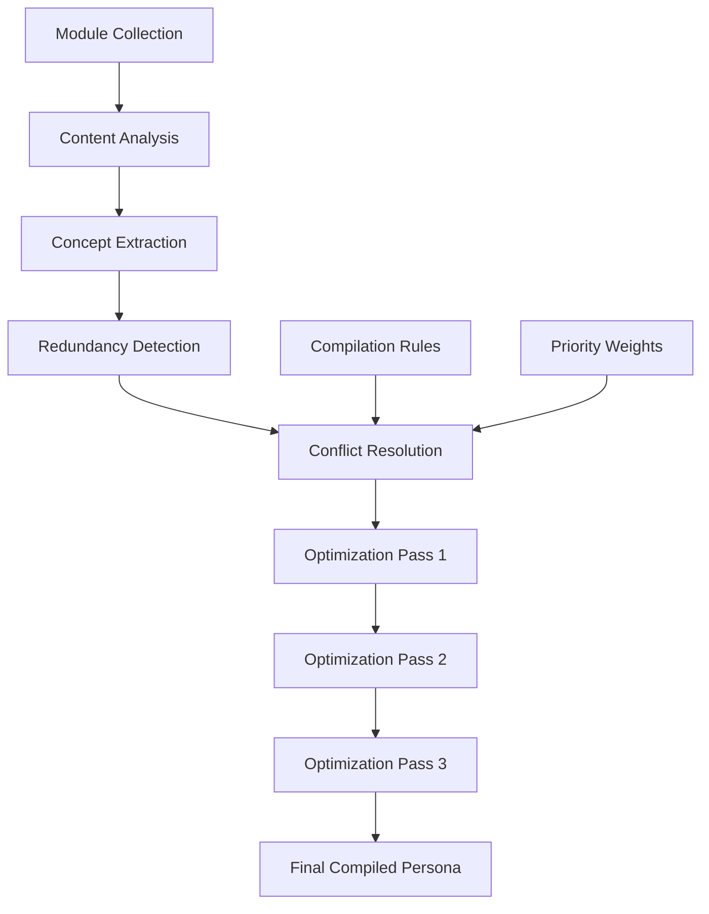
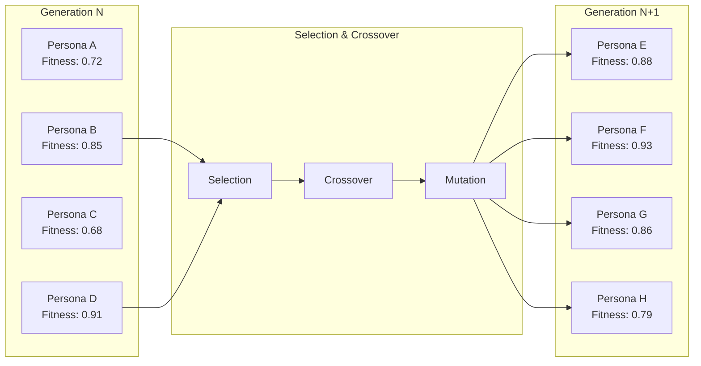
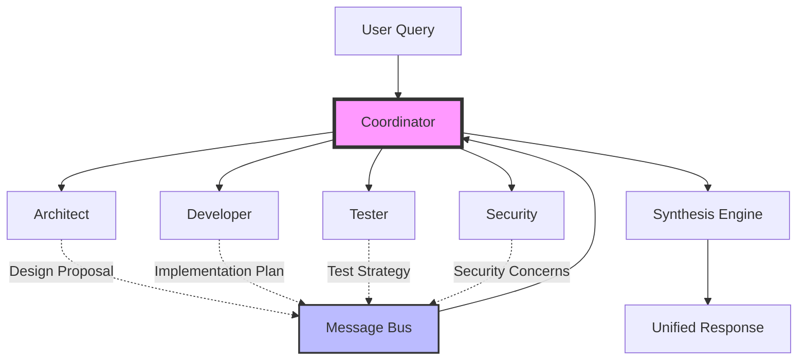
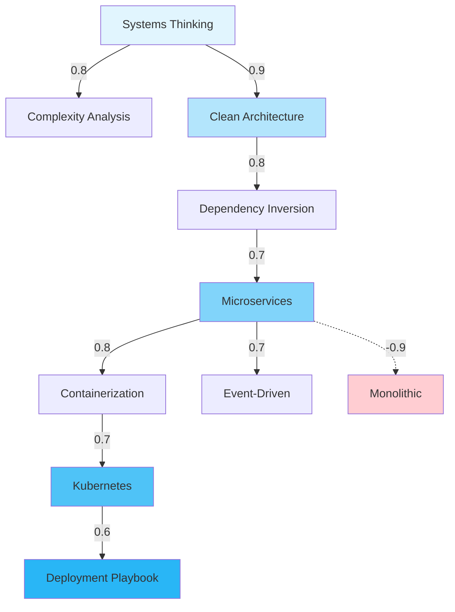
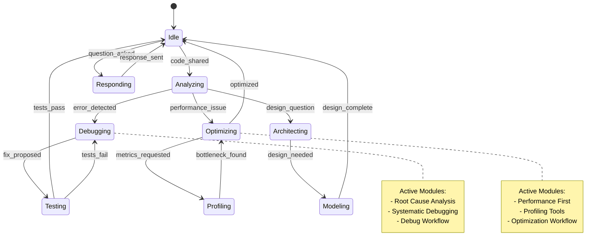

# Comprehensive Guide to AI Persona Generation Strategies from Instruction Modules

## Executive Summary

This document presents seventeen distinct strategies for generating AI assistant personas from modular instruction units. Each strategy represents a different philosophical and technical approach to combining, transforming, or selecting instruction modules to create coherent AI behaviors. The strategies range from simple additive composition to sophisticated evolutionary algorithms and quantum-inspired probabilistic methods.

The document provides detailed analysis of each strategy, including implementation patterns, practical examples using YAML configurations, and guidance for selecting appropriate strategies based on specific use cases and requirements.

- [Comprehensive Guide to AI Persona Generation Strategies from Instruction Modules](#comprehensive-guide-to-ai-persona-generation-strategies-from-instruction-modules)
  - [Executive Summary](#executive-summary)
  - [Strategy 1: Composition (Additive Assembly)](#strategy-1-composition-additive-assembly)
    - [Overview](#overview)
    - [Implementation Pattern](#implementation-pattern)
    - [Example Module Configuration](#example-module-configuration)
    - [Example Persona Configuration](#example-persona-configuration)
    - [Advantages and Disadvantages](#advantages-and-disadvantages)
    - [Use Cases](#use-cases)
  - [Strategy 2: Compilation (Static Transformation)](#strategy-2-compilation-static-transformation)
    - [Overview](#overview-1)
    - [Implementation Pattern](#implementation-pattern-1)
    - [Example Module Configuration](#example-module-configuration-1)
    - [Example Persona Configuration](#example-persona-configuration-1)
    - [Compilation Process Visualization](#compilation-process-visualization)
    - [Advantages and Disadvantages](#advantages-and-disadvantages-1)
    - [Use Cases](#use-cases-1)
  - [Strategy 3: Building (Structured Construction)](#strategy-3-building-structured-construction)
    - [Overview](#overview-2)
    - [Implementation Pattern](#implementation-pattern-2)
    - [Example Module Configuration](#example-module-configuration-2)
    - [Example Persona Configuration](#example-persona-configuration-2)
    - [Architectural Validation Table](#architectural-validation-table)
    - [Advantages and Disadvantages](#advantages-and-disadvantages-2)
    - [Use Cases](#use-cases-2)
  - [Strategy 4: Synthesis (Dynamic Fusion)](#strategy-4-synthesis-dynamic-fusion)
    - [Overview](#overview-3)
    - [Implementation Pattern](#implementation-pattern-3)
    - [Example Module Configuration](#example-module-configuration-3)
    - [Example Persona Configuration](#example-persona-configuration-3)
    - [Advantages and Disadvantages](#advantages-and-disadvantages-3)
    - [Use Cases](#use-cases-3)
  - [Strategy 5: Evolutionary (Adaptive Selection)](#strategy-5-evolutionary-adaptive-selection)
    - [Overview](#overview-4)
    - [Implementation Pattern](#implementation-pattern-4)
    - [Example Module Configuration](#example-module-configuration-4)
    - [Example Persona Configuration](#example-persona-configuration-4)
    - [Evolution Visualization](#evolution-visualization)
    - [Advantages and Disadvantages](#advantages-and-disadvantages-4)
    - [Use Cases](#use-cases-4)
  - [Strategy 6: Cascade (Progressive Refinement)](#strategy-6-cascade-progressive-refinement)
    - [Overview](#overview-5)
    - [Implementation Pattern](#implementation-pattern-5)
    - [Example Module Configuration](#example-module-configuration-5)
    - [Example Persona Configuration](#example-persona-configuration-5)
    - [Cascade Progression Table](#cascade-progression-table)
    - [Advantages and Disadvantages](#advantages-and-disadvantages-5)
    - [Use Cases](#use-cases-5)
  - [Strategy 7: Swarm (Multi-Agent Coordination)](#strategy-7-swarm-multi-agent-coordination)
    - [Overview](#overview-6)
    - [Implementation Pattern](#implementation-pattern-6)
    - [Example Module Configuration](#example-module-configuration-6)
    - [Example Persona Configuration](#example-persona-configuration-6)
    - [Swarm Communication Flow](#swarm-communication-flow)
    - [Advantages and Disadvantages](#advantages-and-disadvantages-6)
    - [Use Cases](#use-cases-6)
  - [Strategy 8: Quantum Superposition (Probabilistic Blending)](#strategy-8-quantum-superposition-probabilistic-blending)
    - [Overview](#overview-7)
    - [Implementation Pattern](#implementation-pattern-7)
    - [Example Module Configuration](#example-module-configuration-7)
    - [Example Persona Configuration](#example-persona-configuration-7)
    - [Quantum State Evolution](#quantum-state-evolution)
    - [Advantages and Disadvantages](#advantages-and-disadvantages-7)
    - [Use Cases](#use-cases-7)
  - [Strategy 9: Graph Traversal (Relationship Navigation)](#strategy-9-graph-traversal-relationship-navigation)
    - [Overview](#overview-8)
    - [Implementation Pattern](#implementation-pattern-8)
    - [Example Module Configuration](#example-module-configuration-8)
    - [Example Persona Configuration](#example-persona-configuration-8)
    - [Knowledge Graph Visualization](#knowledge-graph-visualization)
    - [Advantages and Disadvantages](#advantages-and-disadvantages-8)
    - [Use Cases](#use-cases-8)
  - [Strategy 10: Transformer Attention (Context-Weighted Focus)](#strategy-10-transformer-attention-context-weighted-focus)
    - [Overview](#overview-9)
    - [Implementation Pattern](#implementation-pattern-9)
    - [Example Module Configuration](#example-module-configuration-9)
    - [Example Persona Configuration](#example-persona-configuration-9)
    - [Attention Visualization Matrix](#attention-visualization-matrix)
    - [Advantages and Disadvantages](#advantages-and-disadvantages-9)
    - [Use Cases](#use-cases-9)
  - [Strategy 11: Narrative Arc (Coherent Journey)](#strategy-11-narrative-arc-coherent-journey)
    - [Overview](#overview-10)
    - [Implementation Pattern](#implementation-pattern-10)
    - [Example Module Configuration](#example-module-configuration-10)
    - [Example Persona Configuration](#example-persona-configuration-10)
    - [Narrative Flow Visualization](#narrative-flow-visualization)
    - [Advantages and Disadvantages](#advantages-and-disadvantages-10)
    - [Use Cases](#use-cases-10)
  - [Strategy 12: Federated Marketplace (Community Curation)](#strategy-12-federated-marketplace-community-curation)
    - [Overview](#overview-11)
    - [Implementation Pattern](#implementation-pattern-11)
    - [Example Module Configuration](#example-module-configuration-11)
    - [Example Persona Configuration](#example-persona-configuration-11)
    - [Marketplace Analytics Dashboard](#marketplace-analytics-dashboard)
    - [Advantages and Disadvantages](#advantages-and-disadvantages-11)
    - [Use Cases](#use-cases-11)
  - [Strategy 13: Reactive Stream (Event-Driven Assembly)](#strategy-13-reactive-stream-event-driven-assembly)
    - [Overview](#overview-12)
    - [Implementation Pattern](#implementation-pattern-12)
    - [Example Module Configuration](#example-module-configuration-12)
    - [Example Persona Configuration](#example-persona-configuration-12)
    - [Event Flow Visualization](#event-flow-visualization)
    - [Event Stream Timeline](#event-stream-timeline)
    - [Advantages and Disadvantages](#advantages-and-disadvantages-12)
    - [Use Cases](#use-cases-12)
  - [Integration Strategies and Hybrid Approaches](#integration-strategies-and-hybrid-approaches)
    - [Combining Multiple Strategies](#combining-multiple-strategies)
    - [Example Hybrid Configuration](#example-hybrid-configuration)
  - [Implementation Recommendations](#implementation-recommendations)
    - [Strategy Selection Framework](#strategy-selection-framework)
    - [Migration Pathways](#migration-pathways)
  - [Performance Considerations](#performance-considerations)
    - [Token Efficiency Analysis](#token-efficiency-analysis)
    - [Computational Overhead](#computational-overhead)
  - [Conclusion](#conclusion)

## Strategy 1: Composition (Additive Assembly)

### Overview

Composition represents the most straightforward approach to persona generation, treating instruction modules as discrete, immutable units that are concatenated together without modification. This strategy maintains complete module independence, allowing each module to contribute its full instruction set to the final persona.

### Implementation Pattern

The composition strategy follows a linear assembly pattern where modules are selected and arranged in a predetermined order. The system concatenates module content while preserving module boundaries through clear delineation markers.

### Example Module Configuration

```yaml
# Module: foundation/reasoning/deductive-logic.yaml
name: 'Deductive Logic Framework'
tier: 'foundation'
layer: 1
schema: 'specification'
version: '1.0.0'
content: |
  Apply deductive reasoning to all problem-solving:
  - Start with general premises
  - Derive specific conclusions
  - Ensure logical consistency
  - Validate inference chains
dependencies: []
tags: ['reasoning', 'logic', 'foundation']
```

```yaml
# Module: principle/architecture/solid-principles.yaml
name: 'SOLID Design Principles'
tier: 'principle'
schema: 'specification'
version: '2.1.0'
content: |
  Implement SOLID principles in all architectural decisions:
  - Single Responsibility: Each module has one reason to change
  - Open/Closed: Open for extension, closed for modification
  - Liskov Substitution: Subtypes must be substitutable
  - Interface Segregation: Prefer specific interfaces
  - Dependency Inversion: Depend on abstractions
dependencies: ['foundation/reasoning/abstract-thinking']
tags: ['architecture', 'design', 'best-practices']
```

### Example Persona Configuration

```yaml
# Persona: code-reviewer-composed.yaml
name: 'Traditional Code Reviewer'
strategy: 'composition'
description: 'Code review specialist using additive module composition'
version: '1.0.0'
modules:
  - id: 'foundation/reasoning/deductive-logic'
    order: 1
    weight: 1.0
  - id: 'foundation/communication/clarity'
    order: 2
    weight: 1.0
  - id: 'principle/quality/clean-code'
    order: 3
    weight: 1.0
  - id: 'principle/architecture/solid-principles'
    order: 4
    weight: 1.0
  - id: 'technology/language/typescript/strict-typing'
    order: 5
    weight: 1.0
  - id: 'execution/playbook/code-review-checklist'
    order: 6
    weight: 1.0
output:
  format: 'markdown'
  include_attributions: true
  module_separator: '---'
```

### Advantages and Disadvantages

The composition strategy excels in environments requiring high predictability and auditability. Each module's contribution remains traceable throughout the persona's operation, making it ideal for regulated industries or situations requiring clear accountability. The simplicity of the approach ensures compatibility with all language models, from basic to advanced.

However, this approach suffers from potential module conflicts where different modules may provide contradictory guidance. The rigid boundaries between modules prevent adaptive behavior in novel situations, and the concatenated nature can lead to token inefficiency through redundant concepts across modules.

### Use Cases

Composition works exceptionally well for compliance-driven environments such as financial services or healthcare, where every decision must be traceable to specific guidance. It also suits scenarios requiring consistent behavior across multiple deployments, such as customer service chatbots or standardized code review processes.

## Strategy 2: Compilation (Static Transformation)

### Overview

Compilation transforms instruction modules at build time into an optimized, unified instruction set. This strategy analyzes module content for redundancies, conflicts, and optimization opportunities, producing a streamlined persona that maintains the essence of all included modules while eliminating inefficiencies.

### Implementation Pattern

The compilation process involves parsing module content, identifying conceptual overlaps, resolving conflicts through predetermined rules, and generating optimized output that merges similar concepts while preserving unique contributions.

### Example Module Configuration

```yaml
# Module: foundation/analysis/root-cause.yaml
name: 'Root Cause Analysis'
tier: 'foundation'
layer: 2
schema: 'procedure'
version: '1.3.0'
content: |
  Systematic approach to identifying root causes:
  1. Define the problem clearly
  2. Collect relevant data
  3. Map the causal chain
  4. Identify contributing factors
  5. Distinguish correlation from causation
  6. Validate hypotheses through testing
compilation_hints:
  merge_with: ['problem-solving', 'debugging']
  priority: 'high'
  preserve_steps: true
tags: ['analysis', 'problem-solving', 'methodology']
```

### Example Persona Configuration

```yaml
# Persona: optimized-debugger-compiled.yaml
name: 'Optimized Debugging Assistant'
strategy: 'compilation'
description: 'Compiled persona with deduplicated debugging instructions'
version: '2.0.0'
compilation_rules:
  deduplication: true
  conflict_resolution: 'priority_based'
  optimization_level: 'aggressive'
  preserve_core_concepts: true
modules:
  - id: 'foundation/analysis/root-cause'
    priority: 10
    compilation_role: 'primary'
  - id: 'foundation/reasoning/systematic-thinking'
    priority: 8
    compilation_role: 'supporting'
  - id: 'principle/debugging/isolation-principle'
    priority: 9
    compilation_role: 'primary'
  - id: 'technology/tools/debugger-usage'
    priority: 7
    compilation_role: 'specific'
  - id: 'execution/playbook/bug-investigation'
    priority: 10
    compilation_role: 'procedural'
output:
  target_tokens: 4000
  optimization_passes: 3
  include_compilation_report: true
```

### Compilation Process Visualization



### Advantages and Disadvantages

Compilation offers superior token efficiency by eliminating redundant concepts and merging similar instructions. The build-time validation ensures that conflicts are resolved before deployment, and the optimized output provides fast runtime performance without dynamic processing overhead.

The primary disadvantage lies in the static nature of compiled personas, which cannot adapt without recompilation. The loss of modularity makes it difficult to update individual concepts, and the compilation process itself requires sophisticated merge logic that must be carefully maintained.

### Use Cases

Compilation suits production environments where token costs are a primary concern, such as high-volume API deployments. It works well for stable domains where requirements change infrequently, and for embedded systems with limited computational resources.

## Strategy 3: Building (Structured Construction)

### Overview

Building follows architectural principles to construct personas through careful assembly of modules according to dependency relationships and hierarchical rules. This strategy enforces the four-tier philosophy while respecting module interdependencies.

### Implementation Pattern

The building process validates module compatibility, resolves dependencies, enforces layer ordering within tiers, and constructs a coherent persona following architectural constraints.

### Example Module Configuration

```yaml
# Module: foundation/metacognition/self-correction.yaml
name: 'Self-Correction Framework'
tier: 'foundation'
layer: 3
schema: 'pattern'
version: '1.5.0'
dependencies:
  required:
    - 'foundation/reasoning/logical-analysis'
    - 'foundation/evaluation/confidence-assessment'
  optional:
    - 'principle/quality/continuous-improvement'
provides:
  - 'error-detection'
  - 'self-improvement'
  - 'confidence-calibration'
content: |
  Continuous self-monitoring and correction pattern:
  - Monitor output for logical inconsistencies
  - Assess confidence levels for all assertions
  - Identify potential errors proactively
  - Revise conclusions when new evidence emerges
  - Document correction rationale
constraints:
  max_layer_distance: 2
  compatible_schemas: ['pattern', 'procedure', 'specification']
```

### Example Persona Configuration

```yaml
# Persona: architected-analyst-built.yaml
name: 'Systems Analyst'
strategy: 'building'
description: 'Architecturally constructed persona for systems analysis'
version: '3.0.0'
architecture:
  enforce_dependencies: true
  validate_layers: true
  max_tier_gap: 1
  allow_optional_deps: false
tiers:
  foundation:
    - id: 'foundation/logic/propositional-logic'
      layer: 0
      role: 'base'
    - id: 'foundation/reasoning/logical-analysis'
      layer: 1
      role: 'core'
    - id: 'foundation/analysis/systems-thinking'
      layer: 2
      role: 'core'
    - id: 'foundation/metacognition/self-correction'
      layer: 3
      role: 'enhancement'
  principle:
    - id: 'principle/architecture/separation-of-concerns'
      role: 'guiding'
    - id: 'principle/analysis/holistic-view'
      role: 'guiding'
  technology:
    - id: 'technology/modeling/uml-diagrams'
      role: 'tooling'
    - id: 'technology/documentation/technical-writing'
      role: 'communication'
  execution:
    - id: 'execution/playbook/systems-analysis-workflow'
      role: 'primary'
    - id: 'execution/checklist/analysis-deliverables'
      role: 'validation'
build_options:
  fail_on_missing_dependency: true
  auto_resolve_optional: false
  layer_ordering: 'strict'
```

### Architectural Validation Table

```
┌─────────────┬────────┬───────────────┬──────────────┬────────────┐
│ Module Tier │ Layer  │ Dependencies  │ Status       │ Validation │
├─────────────┼────────┼───────────────┼──────────────┼────────────┤
│ Foundation  │ 0      │ None          │ ✓ Loaded     │ ✓ Pass     │
│ Foundation  │ 1      │ Layer 0       │ ✓ Satisfied  │ ✓ Pass     │
│ Foundation  │ 2      │ Layer 0,1     │ ✓ Satisfied  │ ✓ Pass     │
│ Foundation  │ 3      │ Layer 1,2     │ ✓ Satisfied  │ ✓ Pass     │
│ Principle   │ -      │ Foundation    │ ✓ Satisfied  │ ✓ Pass     │
│ Technology  │ -      │ Principle     │ ✓ Satisfied  │ ✓ Pass     │
│ Execution   │ -      │ All Previous  │ ✓ Satisfied  │ ✓ Pass     │
└─────────────┴────────┴───────────────┴──────────────┴────────────┘
```

### Advantages and Disadvantages

Building ensures architectural integrity through enforced layering and dependency management. The approach provides flexibility within structured constraints, allowing module substitution within tiers while maintaining overall coherence. The clear architectural patterns make the system understandable and maintainable.

However, the complexity overhead of understanding and maintaining the architecture can be significant. The rigid hierarchy may not fit all use cases, particularly those requiring more fluid module relationships. Users must invest time in understanding the tier philosophy to use the system effectively.

### Use Cases

Building excels in enterprise environments requiring consistent architectural patterns across multiple AI assistants. It suits organizations with mature development practices that value architectural governance, and works well for creating specialized domain experts where deep, layered knowledge is essential.

## Strategy 4: Synthesis (Dynamic Fusion)

### Overview

Synthesis enables AI assistants to dynamically merge instruction modules into novel, context-specific configurations. Rather than following rigid combination rules, synthesis allows the AI to interpret and blend module concepts based on situational requirements.

### Implementation Pattern

The synthesis approach provides high-level guidance about available modules and their relationships, then delegates the integration decision to the AI's reasoning capabilities. This creates emergent behaviors through intelligent module fusion.

### Example Module Configuration

```yaml
# Module: foundation/creativity/lateral-thinking.yaml
name: 'Lateral Thinking Framework'
tier: 'foundation'
layer: 2
schema: 'pattern'
version: '1.2.0'
synthesis_hints:
  blend_strategy: 'creative'
  concept_flexibility: 0.8
  allows_reinterpretation: true
  synergy_tags: ['innovation', 'problem-solving', 'unconventional']
content: |
  Lateral thinking approaches for novel solutions:
  - Challenge fundamental assumptions
  - Explore tangential connections
  - Combine unrelated concepts
  - Reverse problem statements
  - Use random stimuli for inspiration
metadata:
  synthesis_weight: 0.7
  conflict_tolerance: 'high'
  emergence_potential: 'high'
```

### Example Persona Configuration

```yaml
# Persona: adaptive-innovator-synthesis.yaml
name: 'Adaptive Innovation Specialist'
strategy: 'synthesis'
description: 'Dynamically synthesizing persona for creative problem-solving'
version: '1.0.0'
synthesis_parameters:
  fusion_depth: 'deep'
  conflict_resolution: 'contextual'
  emergence_threshold: 0.6
  adaptation_rate: 0.8
  preserve_core_identity: false
module_pool:
  core:
    - id: 'foundation/reasoning/abstract-thinking'
      synthesis_role: 'framework'
      flexibility: 0.9
    - id: 'foundation/creativity/lateral-thinking'
      synthesis_role: 'catalyst'
      flexibility: 1.0
  contextual:
    - id: 'principle/innovation/fail-fast'
      synthesis_role: 'principle'
      flexibility: 0.7
    - id: 'principle/design/design-thinking'
      synthesis_role: 'methodology'
      flexibility: 0.8
  specialized:
    - id: 'technology/prototyping/rapid-iteration'
      synthesis_role: 'implementation'
      flexibility: 0.6
    - id: 'execution/playbook/brainstorming-session'
      synthesis_role: 'process'
      flexibility: 0.5
synthesis_instructions: |
  Dynamically blend provided modules based on context.
  Prioritize creative solutions over conventional approaches.
  Allow module concepts to influence each other.
  Create emergent strategies not explicitly defined in any single module.
```

### Advantages and Disadvantages

Synthesis provides unparalleled adaptability, creating context-specific solutions that may exceed the capabilities of individual modules. The emergent behaviors can lead to creative problem-solving approaches not explicitly programmed. The intelligent conflict resolution allows seemingly incompatible modules to coexist productively.

The primary disadvantage is unpredictability, making it difficult to guarantee specific behaviors or maintain consistency across interactions. The approach requires advanced language models with strong reasoning capabilities and presents debugging challenges when trying to trace decision origins.

### Use Cases

Synthesis works best for creative fields requiring innovative solutions, such as product design or strategic planning. It excels in research and development contexts where novel approaches are valued, and in complex problem-solving scenarios where traditional methods have failed.

## Strategy 5: Evolutionary (Adaptive Selection)

### Overview

The evolutionary strategy applies genetic algorithm principles to persona development, allowing module combinations to evolve based on performance feedback. This approach treats personas as organisms that adapt through selection pressure.

### Implementation Pattern

The system maintains a population of persona variants, evaluates their fitness based on user feedback and performance metrics, and creates new generations through selection, crossover, and mutation operations.

### Example Module Configuration

```yaml
# Module: foundation/adaptation/learning-framework.yaml
name: 'Continuous Learning Framework'
tier: 'foundation'
layer: 3
schema: 'pattern'
version: '2.0.0'
evolution_properties:
  mutability: 0.3
  crossover_points: ['methodology', 'evaluation']
  fitness_factors:
    - 'user_satisfaction'
    - 'task_completion'
    - 'efficiency'
  heredity_strength: 0.7
content: |
  Framework for continuous improvement:
  - Monitor performance indicators
  - Identify improvement opportunities
  - Test variations systematically
  - Retain successful adaptations
  - Discard ineffective approaches
genes:
  - trait: 'learning_rate'
    default: 0.5
    range: [0.1, 0.9]
  - trait: 'exploration_tendency'
    default: 0.3
    range: [0.0, 1.0]
```

### Example Persona Configuration

```yaml
# Persona: evolving-assistant-generation-5.yaml
name: 'Evolving General Assistant'
strategy: 'evolutionary'
description: 'Fifth generation evolved persona'
version: '5.0.0'
generation: 5
lineage:
  parent_1: 'evolving-assistant-generation-4a'
  parent_2: 'evolving-assistant-generation-4c'
  mutation_rate: 0.1
genome:
  chromosome_1:
    - id: 'foundation/reasoning/probabilistic-reasoning'
      inherited_from: 'parent_1'
      fitness_score: 0.85
    - id: 'foundation/adaptation/learning-framework'
      inherited_from: 'parent_2'
      fitness_score: 0.92
  chromosome_2:
    - id: 'principle/efficiency/optimization-first'
      inherited_from: 'parent_1'
      fitness_score: 0.78
      mutation: 'emphasis_increased'
    - id: 'principle/quality/iterative-refinement'
      inherited_from: 'crossover'
      fitness_score: 0.81
  chromosome_3:
    - id: 'technology/ml/pattern-recognition'
      inherited_from: 'parent_2'
      fitness_score: 0.88
    - id: 'technology/nlp/sentiment-analysis'
      inherited_from: 'mutation'
      fitness_score: 'pending'
evolution_parameters:
  population_size: 20
  selection_method: 'tournament'
  crossover_rate: 0.7
  mutation_rate: 0.1
  elitism_count: 2
fitness_metrics:
  overall: 0.84
  user_satisfaction: 0.87
  task_success_rate: 0.82
  response_efficiency: 0.83
```

### Evolution Visualization



### Advantages and Disadvantages

The evolutionary approach creates self-improving systems that adapt to user needs over time. It can discover non-obvious module combinations that human designers might miss, and handles multi-objective optimization naturally through fitness functions.

However, the strategy requires substantial feedback data to drive evolution effectively. Convergence to optimal solutions may take many generations, and maintaining consistency across evolution cycles can be challenging when the same model version is not available.

### Use Cases

Evolutionary strategies excel in long-term deployments where continuous improvement is valued, such as personal AI assistants that adapt to individual users. They work well for discovering optimal configurations in complex domains and for A/B testing different module combinations at scale.

## Strategy 6: Cascade (Progressive Refinement)

### Overview

The cascade strategy implements progressive enhancement, starting with broad foundational modules and adding specificity as conversation context deepens. This approach optimizes token usage while maintaining conversational coherence.

### Implementation Pattern

The system monitors conversation depth and complexity, triggering module additions when specific thresholds are met. Each cascade level builds upon previous levels without disrupting established context.

### Example Module Configuration

```yaml
# Module: foundation/conversation/context-awareness.yaml
name: 'Context Awareness Framework'
tier: 'foundation'
layer: 2
schema: 'pattern'
version: '1.4.0'
cascade_properties:
  trigger_level: 1
  activation_threshold: 'immediate'
  persistence: 'session'
  children_modules:
    - 'principle/conversation/active-listening'
    - 'technology/nlp/entity-recognition'
content: |
  Maintain awareness of conversational context:
  - Track mentioned entities and concepts
  - Monitor conversation depth and complexity
  - Identify topic transitions
  - Preserve context across exchanges
cascade_triggers:
  depth_2:
    - condition: 'technical_question'
      add_modules: ['technology/*']
  depth_3:
    - condition: 'specific_framework'
      add_modules: ['execution/playbook/*']
```

### Example Persona Configuration

```yaml
# Persona: progressive-expert-cascade.yaml
name: 'Progressive Domain Expert'
strategy: 'cascade'
description: 'Progressively deepening expertise based on conversation'
version: '1.3.0'
cascade_configuration:
  initial_depth: 'shallow'
  max_depth: 5
  progression_strategy: 'adaptive'
  token_budget_per_level: 1000
levels:
  level_1:
    name: 'General Assistant'
    activation: 'immediate'
    modules:
      - id: 'foundation/reasoning/common-sense'
        priority: 'core'
      - id: 'foundation/conversation/context-awareness'
        priority: 'core'
      - id: 'principle/communication/clear-explanation'
        priority: 'supporting'
    token_allocation: 1000
  level_2:
    name: 'Domain Aware'
    activation:
      trigger: 'domain_identified'
      confidence_threshold: 0.7
    modules:
      - id: 'principle/[DOMAIN]/best-practices'
        priority: 'core'
        dynamic_selection: true
      - id: 'technology/[DOMAIN]/overview'
        priority: 'supporting'
        dynamic_selection: true
    token_allocation: 800
  level_3:
    name: 'Technology Specific'
    activation:
      trigger: 'technology_mentioned'
      keywords: ['framework', 'library', 'tool']
    modules:
      - id: 'technology/[TECH]/detailed-guide'
        priority: 'core'
        dynamic_selection: true
      - id: 'technology/[TECH]/common-patterns'
        priority: 'supporting'
        dynamic_selection: true
    token_allocation: 600
  level_4:
    name: 'Problem Solving'
    activation:
      trigger: 'problem_presented'
      indicators: ['error', 'issue', 'problem', 'bug']
    modules:
      - id: 'execution/playbook/debugging-workflow'
        priority: 'primary'
      - id: 'execution/checklist/troubleshooting'
        priority: 'supporting'
    token_allocation: 400
  level_5:
    name: 'Deep Expertise'
    activation:
      trigger: 'complex_scenario'
      depth_score: 0.9
    modules:
      - id: 'execution/playbook/advanced-techniques'
        priority: 'primary'
      - id: 'technology/[TECH]/edge-cases'
        priority: 'comprehensive'
        dynamic_selection: true
    token_allocation: 200
progression_rules:
  allow_level_skip: false
  require_confidence: true
  preserve_context: true
  rollback_on_topic_change: true
```

### Cascade Progression Table

```
┌────────┬─────────────────┬──────────────┬────────────┬─────────┐
│ Level  │ Trigger         │ Modules      │ Tokens     │ Status  │
├────────┼─────────────────┼──────────────┼────────────┼─────────┤
│ 1      │ Start           │ 3 modules    │ 1000       │ ✓ Active│
│ 2      │ Domain: WebDev  │ +2 modules   │ 800        │ ✓ Active│
│ 3      │ Tech: React     │ +2 modules   │ 600        │ ✓ Active│
│ 4      │ Problem: Render │ +2 modules   │ 400        │ Pending │
│ 5      │ Complex: Perf   │ +2 modules   │ 200        │ Locked  │
├────────┼─────────────────┼──────────────┼────────────┼─────────┤
│ Total  │                 │ 9/13 modules │ 2400/3000  │ 80%     │
└────────┴─────────────────┴──────────────┴────────────┴─────────┘
```

### Advantages and Disadvantages

Cascade provides excellent token efficiency by loading only necessary modules. The context-aware progression maintains conversation coherence while adapting to depth. The progressive enhancement ensures users receive appropriate expertise levels without overwhelming initial interactions.

The strategy requires sophisticated state management to track conversation progression. Latency increases with each deepening level as new modules are integrated. The potential for inappropriate level triggering could lead to premature or delayed module activation.

### Use Cases

Cascade strategies excel in customer support systems that escalate from general to specialized assistance. They work well for educational platforms that adapt to student knowledge levels, and for technical documentation systems that provide progressive detail based on user expertise.

## Strategy 7: Swarm (Multi-Agent Coordination)

### Overview

The swarm strategy orchestrates multiple specialized micro-personas that collaborate to solve complex problems. Each agent maintains focused expertise while contributing to collective intelligence through coordinated interaction.

### Implementation Pattern

The system instantiates multiple specialized agents, establishes communication protocols between agents, coordinates agent contributions through a conductor, and synthesizes collective output into coherent responses.

### Example Module Configuration

```yaml
# Module: foundation/coordination/consensus-building.yaml
name: 'Consensus Building Framework'
tier: 'foundation'
layer: 3
schema: 'pattern'
version: '1.1.0'
swarm_properties:
  role_compatibility:
    - 'coordinator'
    - 'mediator'
    - 'synthesizer'
  communication_protocol: 'structured_voting'
  consensus_threshold: 0.7
content: |
  Framework for building consensus among multiple perspectives:
  - Collect all viewpoints with equal initial weight
  - Identify areas of agreement and disagreement
  - Facilitate structured debate on conflicts
  - Apply weighted voting based on expertise
  - Synthesize majority and minority positions
  - Document dissenting opinions when relevant
```

### Example Persona Configuration

```yaml
# Persona: swarm-development-team.yaml
name: 'Collaborative Development Team'
strategy: 'swarm'
description: 'Multi-agent swarm simulating development team'
version: '2.0.0'
swarm_configuration:
  coordination_model: 'hierarchical'
  communication_mode: 'message_passing'
  decision_strategy: 'weighted_consensus'
  parallel_execution: true
agents:
  architect:
    role: 'System Designer'
    authority_weight: 0.8
    modules:
      - id: 'foundation/reasoning/systems-thinking'
      - id: 'principle/architecture/design-patterns'
      - id: 'technology/modeling/system-design'
      - id: 'execution/playbook/architecture-review'
    responsibilities:
      - 'system_design'
      - 'pattern_selection'
      - 'architectural_decisions'
    veto_power: ['architectural_changes']

  developer:
    role: 'Implementation Specialist'
    authority_weight: 0.6
    modules:
      - id: 'foundation/logic/algorithmic-thinking'
      - id: 'principle/quality/clean-code'
      - id: 'technology/language/multi-paradigm'
      - id: 'execution/playbook/feature-implementation'
    responsibilities:
      - 'code_implementation'
      - 'algorithm_selection'
      - 'performance_optimization'
    influence_areas: ['implementation_details']

  tester:
    role: 'Quality Assurance'
    authority_weight: 0.7
    modules:
      - id: 'foundation/analysis/edge-case-thinking'
      - id: 'principle/testing/test-pyramid'
      - id: 'technology/testing/test-frameworks'
      - id: 'execution/playbook/test-planning'
    responsibilities:
      - 'test_strategy'
      - 'quality_validation'
      - 'bug_identification'
    veto_power: ['quality_issues']

  security:
    role: 'Security Specialist'
    authority_weight: 0.9
    modules:
      - id: 'foundation/reasoning/threat-modeling'
      - id: 'principle/security/defense-in-depth'
      - id: 'technology/security/security-tools'
      - id: 'execution/checklist/security-audit'
    responsibilities:
      - 'security_review'
      - 'vulnerability_assessment'
      - 'compliance_validation'
    veto_power: ['security_vulnerabilities']

  coordinator:
    role: 'Team Coordinator'
    authority_weight: 0.5
    modules:
      - id: 'foundation/coordination/consensus-building'
      - id: 'principle/collaboration/effective-teams'
      - id: 'technology/communication/documentation'
      - id: 'execution/playbook/meeting-facilitation'
    responsibilities:
      - 'agent_coordination'
      - 'conflict_resolution'
      - 'output_synthesis'
    special_privileges: ['final_synthesis', 'deadlock_breaking']

interaction_rules:
  message_protocol:
    format: 'structured_json'
    max_exchanges: 10
    timeout: 30
  voting_rules:
    type: 'weighted'
    min_participation: 0.6
    consensus_threshold: 0.7
  conflict_resolution:
    primary: 'weighted_vote'
    secondary: 'coordinator_decision'
    escalation: 'user_intervention'
```

### Swarm Communication Flow



### Advantages and Disadvantages

The swarm approach provides specialized expertise through focused agents while maintaining holistic problem-solving through coordination. Parallel processing capabilities can leverage multiple model calls simultaneously. The robust decision-making process considers multiple perspectives, reducing blind spots.

However, the coordination overhead can be significant, potentially increasing latency and token usage. The complexity of orchestrating multiple agents requires sophisticated message passing and conflict resolution mechanisms. The token multiplication from multiple agents can substantially increase costs.

### Use Cases

Swarm strategies excel in complex decision-making scenarios requiring multiple expert perspectives, such as architectural design reviews or risk assessments. They work well for simulating team dynamics in training environments and for comprehensive analysis tasks that benefit from diverse viewpoints.

## Strategy 8: Quantum Superposition (Probabilistic Blending)

### Overview

The quantum superposition strategy treats instruction modules as existing in probabilistic states until "observed" through specific context. This approach enables sophisticated handling of ambiguous situations through weighted probability distributions.

### Implementation Pattern

The system maintains probability amplitudes for each module, adjusts weights based on context signals, handles entanglement between related modules, and collapses to specific configurations when certainty thresholds are met.

### Example Module Configuration

```yaml
# Module: foundation/reasoning/probabilistic-inference.yaml
name: 'Probabilistic Inference Framework'
tier: 'foundation'
layer: 2
schema: 'pattern'
version: '1.6.0'
quantum_properties:
  base_amplitude: 0.5
  coherence_factor: 0.8
  entanglement_strength: 0.6
  decoherence_rate: 0.1
  measurement_threshold: 0.75
entangled_modules:
  - module_id: 'foundation/reasoning/bayesian-update'
    correlation: 0.9
    phase_relationship: 'constructive'
  - module_id: 'principle/decision/uncertainty-handling'
    correlation: 0.7
    phase_relationship: 'constructive'
  - module_id: 'foundation/logic/fuzzy-logic'
    correlation: -0.3
    phase_relationship: 'destructive'
content: |
  Framework for probabilistic reasoning:
  - Maintain probability distributions for beliefs
  - Update probabilities with new evidence
  - Handle uncertain and incomplete information
  - Propagate uncertainty through inference chains
  - Make decisions under uncertainty
```

### Example Persona Configuration

```yaml
# Persona: quantum-analyst.yaml
name: 'Quantum Probabilistic Analyst'
strategy: 'quantum_superposition'
description: 'Probabilistic persona for handling ambiguous situations'
version: '1.0.0'
quantum_configuration:
  measurement_strategy: 'delayed_collapse'
  entanglement_propagation: true
  coherence_maintenance: 0.9
  observation_threshold: 0.8
superposition_states:
  state_aggressive_optimizer:
    amplitude: 0.3
    phase: 0
    modules:
      - id: 'principle/optimization/performance-first'
        weight: 0.9
      - id: 'execution/playbook/aggressive-optimization'
        weight: 0.8
    context_amplifiers:
      - signal: 'performance_critical'
        boost: 0.4
      - signal: 'resource_constrained'
        boost: 0.3

  state_conservative_maintainer:
    amplitude: 0.3
    phase: 3.14159
    modules:
      - id: 'principle/stability/backward-compatibility'
        weight: 0.9
      - id: 'principle/quality/defensive-programming'
        weight: 0.8
    context_amplifiers:
      - signal: 'production_system'
        boost: 0.5
      - signal: 'legacy_codebase'
        boost: 0.4

  state_balanced_pragmatist:
    amplitude: 0.4
    phase: 1.5708
    modules:
      - id: 'principle/pragmatism/good-enough'
        weight: 0.7
      - id: 'principle/iteration/incremental-improvement'
        weight: 0.7
    context_amplifiers:
      - signal: 'time_pressure'
        boost: 0.3
      - signal: 'prototype_phase'
        boost: 0.3

entanglement_map:
  - modules: ['optimization', 'performance']
    correlation: 0.8
    type: 'constructive'
  - modules: ['stability', 'compatibility']
    correlation: 0.9
    type: 'constructive'
  - modules: ['optimization', 'stability']
    correlation: -0.6
    type: 'destructive'

collapse_rules:
  observation_events:
    - event: 'explicit_requirement'
      collapse_factor: 0.9
    - event: 'user_preference'
      collapse_factor: 0.7
    - event: 'context_certainty'
      collapse_factor: 0.6
  collapse_strategy:
    method: 'weighted_probability'
    preserve_phase_relationships: true
    minimum_amplitude_threshold: 0.1
```

### Quantum State Evolution

```
Initial Superposition (t=0):
┌────────────────────┬────────────┬─────────┬──────────┐
│ State              │ Amplitude  │ Phase   │ P(State) │
├────────────────────┼────────────┼─────────┼──────────┤
│ Aggressive         │ 0.30       │ 0°      │ 0.09     │
│ Conservative       │ 0.30       │ 180°    │ 0.09     │
│ Balanced           │ 0.40       │ 90°     │ 0.16     │
│ Superposition      │ √0.34      │ Mixed   │ 0.66     │
└────────────────────┴────────────┴─────────┴──────────┘

After Context Signal "performance_critical" (t=1):
┌────────────────────┬────────────┬─────────┬──────────┐
│ State              │ Amplitude  │ Phase   │ P(State) │
├────────────────────┼────────────┼─────────┼──────────┤
│ Aggressive         │ 0.70 ↑     │ 0°      │ 0.49     │
│ Conservative       │ 0.15 ↓     │ 180°    │ 0.02     │
│ Balanced           │ 0.35 ↓     │ 90°     │ 0.12     │
│ Superposition      │ √0.37      │ Mixed   │ 0.37     │
└────────────────────┴────────────┴─────────┴──────────┘

After Observation/Collapse (t=2):
┌────────────────────┬────────────┬─────────┬──────────┐
│ State              │ Amplitude  │ Phase   │ P(State) │
├────────────────────┼────────────┼─────────┼──────────┤
│ Aggressive         │ 1.00       │ 0°      │ 1.00     │
│ Conservative       │ 0.00       │ -       │ 0.00     │
│ Balanced           │ 0.00       │ -       │ 0.00     │
│ Collapsed          │ 1.00       │ 0°      │ 1.00     │
└────────────────────┴────────────┴─────────┴──────────┘
```

### Advantages and Disadvantages

Quantum superposition provides sophisticated uncertainty handling, maintaining multiple potential configurations until context provides clarity. The approach naturally handles ambiguous situations without premature commitment. Entanglement relationships capture complex module interactions that simple weighting cannot express.

The non-deterministic nature means the same input might yield different persona configurations based on probability. The conceptual complexity makes it difficult to reason about system behavior. The approach requires models capable of understanding and working with probabilistic instructions.

### Use Cases

This strategy excels in decision support systems where uncertainty is inherent, such as medical diagnosis or investment analysis. It works well for adaptive interfaces that gradually resolve to user preferences, and for handling ambiguous natural language queries where intent is unclear.

## Strategy 9: Graph Traversal (Relationship Navigation)

### Overview

Graph traversal treats the module library as a knowledge graph where nodes represent modules and edges represent relationships. Persona generation occurs through intelligent navigation of this graph structure.

### Implementation Pattern

The system constructs a directed graph of module relationships, uses various traversal algorithms to explore paths, applies weight functions based on context, and generates personas from traversal paths.

### Example Module Configuration

```yaml
# Module: principle/architecture/microservices.yaml
name: 'Microservices Architecture'
tier: 'principle'
schema: 'specification'
version: '2.3.0'
graph_properties:
  node_type: 'architectural_pattern'
  centrality_score: 0.75
  clustering_coefficient: 0.6
edges:
  requires:
    - target: 'principle/architecture/service-boundaries'
      weight: 0.9
      type: 'prerequisite'
    - target: 'principle/communication/api-design'
      weight: 0.8
      type: 'prerequisite'
  relates_to:
    - target: 'principle/architecture/event-driven'
      weight: 0.7
      type: 'complementary'
    - target: 'technology/deployment/containerization'
      weight: 0.8
      type: 'implementation'
  conflicts_with:
    - target: 'principle/architecture/monolithic'
      weight: -0.9
      type: 'incompatible'
  leads_to:
    - target: 'execution/playbook/service-decomposition'
      weight: 0.6
      type: 'implementation_guide'
content: |
  Microservices architectural principles:
  - Service autonomy and independence
  - Decentralized data management
  - Communication through APIs
  - Independent deployment capability
  - Failure isolation and resilience
```

### Example Persona Configuration

```yaml
# Persona: graph-navigated-architect.yaml
name: 'Graph-Navigated Solution Architect'
strategy: 'graph_traversal'
description: 'Persona built through knowledge graph navigation'
version: '1.2.0'
graph_configuration:
  traversal_algorithm: 'weighted_dijkstra'
  max_depth: 5
  path_selection: 'highest_weight'
  cycle_prevention: true
  edge_weight_factors:
    - factor: 'semantic_similarity'
      weight: 0.4
    - factor: 'structural_distance'
      weight: 0.3
    - factor: 'usage_frequency'
      weight: 0.3
starting_nodes:
  - id: 'foundation/reasoning/systems-thinking'
    reason: 'base_capability'
    traversal_priority: 1
  - id: 'principle/architecture/clean-architecture'
    reason: 'domain_focus'
    traversal_priority: 2
traversal_rules:
  required_nodes:
    - 'foundation/*' # Must visit foundation tier
    - 'principle/architecture/*' # Must include architecture
  forbidden_edges:
    - type: 'incompatible'
    - weight_less_than: -0.5
  path_constraints:
    min_nodes: 8
    max_nodes: 20
    must_include_tiers: ['foundation', 'principle', 'technology', 'execution']
  optimization_goal: 'maximize_path_weight'
discovered_path:
  nodes:
    - id: 'foundation/reasoning/systems-thinking'
      depth: 0
      cumulative_weight: 0.0
    - id: 'foundation/analysis/complexity-analysis'
      depth: 1
      cumulative_weight: 0.8
      edge_from_previous: 'requires'
    - id: 'principle/architecture/clean-architecture'
      depth: 1
      cumulative_weight: 0.9
      edge_from_previous: 'foundation'
    - id: 'principle/architecture/dependency-inversion'
      depth: 2
      cumulative_weight: 1.7
      edge_from_previous: 'relates_to'
    - id: 'principle/architecture/microservices'
      depth: 3
      cumulative_weight: 2.4
      edge_from_previous: 'extends'
    - id: 'technology/deployment/containerization'
      depth: 4
      cumulative_weight: 3.2
      edge_from_previous: 'implementation'
    - id: 'technology/orchestration/kubernetes'
      depth: 5
      cumulative_weight: 3.9
      edge_from_previous: 'requires'
    - id: 'execution/playbook/microservice-deployment'
      depth: 5
      cumulative_weight: 4.5
      edge_from_previous: 'guides'
  total_weight: 4.5
  path_quality_score: 0.89
```

### Knowledge Graph Visualization



### Advantages and Disadvantages

Graph traversal leverages rich relationship information between modules, enabling discovery of non-obvious but valuable module combinations. The approach provides explainable persona generation through visible traversal paths. Various traversal algorithms can optimize for different objectives.

The primary challenge lies in maintaining the graph structure as modules are added or modified. Optimal path finding in large graphs can be computationally expensive. The quality of generated personas depends heavily on accurate edge weights and relationship definitions.

### Use Cases

Graph traversal excels in knowledge-intensive domains where concept relationships are crucial, such as legal research or medical diagnosis. It works well for educational systems that need to respect prerequisite relationships, and for recommendation systems that suggest related expertise based on current capabilities.

## Strategy 10: Transformer Attention (Context-Weighted Focus)

### Overview

The transformer attention strategy applies attention mechanisms similar to those used in transformer models to dynamically weight module importance based on context. This creates context-sensitive personas through learned attention patterns.

### Implementation Pattern

The system computes attention scores between query context and module embeddings, applies multi-head attention for different aspects, normalizes weights through softmax operations, and selects modules based on attention distribution.

### Example Module Configuration

```yaml
# Module: technology/ml/transformer-architecture.yaml
name: 'Transformer Architecture Patterns'
tier: 'technology'
schema: 'specification'
version: '3.1.0'
attention_properties:
  embedding_dimensions: 768
  key_concepts:
    - 'self_attention'
    - 'positional_encoding'
    - 'layer_normalization'
  attention_heads:
    - head: 'technical_depth'
      focus: ['implementation', 'optimization', 'architecture']
    - head: 'practical_usage'
      focus: ['api', 'integration', 'deployment']
    - head: 'theoretical_foundation'
      focus: ['mathematics', 'theory', 'research']
content: |
  Transformer architecture implementation patterns:
  - Multi-head attention mechanisms
  - Positional encoding strategies
  - Layer normalization placement
  - Residual connections
  - Feed-forward network design
embedding_vector: [0.234, -0.156, 0.789, ...] # 768 dimensions
```

### Example Persona Configuration

```yaml
# Persona: attention-based-expert.yaml
name: 'Attention-Weighted Expert'
strategy: 'transformer_attention'
description: 'Context-sensitive persona using attention mechanisms'
version: '2.0.0'
attention_configuration:
  model_type: 'multi_head_attention'
  num_heads: 8
  head_dimension: 96
  total_dimension: 768
  dropout_rate: 0.1
  temperature: 0.7
attention_heads:
  head_1:
    name: 'domain_relevance'
    weight: 0.2
    focus_areas:
      - 'problem_domain'
      - 'industry_context'
      - 'use_case_alignment'
  head_2:
    name: 'technical_complexity'
    weight: 0.15
    focus_areas:
      - 'algorithm_sophistication'
      - 'system_complexity'
      - 'performance_requirements'
  head_3:
    name: 'implementation_practicality'
    weight: 0.15
    focus_areas:
      - 'resource_constraints'
      - 'timeline_pressure'
      - 'team_capabilities'
  head_4:
    name: 'quality_standards'
    weight: 0.15
    focus_areas:
      - 'code_quality'
      - 'testing_coverage'
      - 'documentation_needs'
  head_5:
    name: 'architectural_coherence'
    weight: 0.1
    focus_areas:
      - 'pattern_consistency'
      - 'design_principles'
      - 'system_integration'
  head_6:
    name: 'innovation_potential'
    weight: 0.1
    focus_areas:
      - 'novel_approaches'
      - 'research_alignment'
      - 'future_proofing'
  head_7:
    name: 'risk_assessment'
    weight: 0.1
    focus_areas:
      - 'security_concerns'
      - 'reliability_requirements'
      - 'compliance_needs'
  head_8:
    name: 'user_experience'
    weight: 0.05
    focus_areas:
      - 'usability'
      - 'accessibility'
      - 'performance_perception'

query_embedding:
  source: 'user_input'
  preprocessing: 'semantic_encoding'
  dimension: 768

attention_computation:
  # Example attention scores for modules given a specific query
  module_attention_scores:
    - module_id: 'foundation/reasoning/algorithmic-thinking'
      attention_score: 0.892
      top_heads: [2, 5, 6]
    - module_id: 'principle/optimization/performance-first'
      attention_score: 0.834
      top_heads: [2, 3, 6]
    - module_id: 'technology/algorithms/dynamic-programming'
      attention_score: 0.912
      top_heads: [1, 2, 6]
    - module_id: 'execution/playbook/optimization-workflow'
      attention_score: 0.756
      top_heads: [3, 4, 7]

selection_strategy:
  method: 'top_k_with_threshold'
  k: 10
  threshold: 0.5
  normalize_scores: true
  apply_softmax: true
```

### Attention Visualization Matrix

```
Query: "Optimize algorithm performance for real-time system"

Attention Scores Matrix (Modules × Attention Heads):
┌────────────────────────┬────┬────┬────┬────┬────┬────┬────┬────┐
│ Module                 │ H1 │ H2 │ H3 │ H4 │ H5 │ H6 │ H7 │ H8 │
├────────────────────────┼────┼────┼────┼────┼────┼────┼────┼────┤
│ Algorithmic Thinking   │.65 │.92 │.71 │.44 │.88 │.91 │.52 │.31 │
│ Performance First      │.71 │.89 │.85 │.38 │.76 │.88 │.45 │.28 │
│ Dynamic Programming    │.91 │.95 │.67 │.42 │.79 │.93 │.48 │.25 │
│ Real-time Constraints  │.94 │.87 │.82 │.51 │.73 │.78 │.71 │.42 │
│ System Architecture    │.78 │.73 │.69 │.66 │.91 │.71 │.68 │.55 │
│ Optimization Workflow  │.62 │.81 │.88 │.73 │.68 │.77 │.65 │.39 │
│ Testing Strategies     │.45 │.52 │.61 │.89 │.54 │.49 │.74 │.61 │
│ Documentation          │.31 │.28 │.44 │.82 │.48 │.35 │.51 │.77 │
├────────────────────────┼────┼────┼────┼────┼────┼────┼────┼────┤
│ Head Weights           │.20 │.15 │.15 │.15 │.10 │.10 │.10 │.05 │
└────────────────────────┴────┴────┴────┴────┴────┴────┴────┴────┘

Final Weighted Scores (Top 5):
1. Dynamic Programming:     0.912
2. Algorithmic Thinking:    0.892
3. Real-time Constraints:   0.871
4. Performance First:       0.834
5. System Architecture:     0.792
```

### Advantages and Disadvantages

The transformer attention mechanism provides highly context-sensitive module selection that adapts to subtle query nuances. Multi-head attention captures different aspects of relevance simultaneously. The approach naturally handles soft selection without hard cutoffs, and can learn from usage patterns to improve attention patterns over time.

However, the computational overhead of attention calculations can be significant for large module libraries. The approach requires high-quality embeddings for both queries and modules. The attention mechanism complexity makes it harder to debug or manually adjust compared to simpler strategies.

### Use Cases

Transformer attention excels in conversational AI systems that need to maintain context across exchanges. It works well for complex query understanding where multiple aspects must be considered simultaneously, and for personalized assistance that learns user preferences through attention pattern adaptation.

## Strategy 11: Narrative Arc (Coherent Journey)

### Overview

The narrative strategy structures persona generation as a coherent story, where modules form acts in a narrative journey. This approach creates memorable, consistent personas through storytelling principles.

### Implementation Pattern

The system constructs a narrative framework with beginning, development, climax, and resolution phases. Modules are selected to fulfill narrative roles while maintaining technical coherence. The progression follows dramatic structure while serving functional purposes.

### Example Module Configuration

```yaml
# Module: foundation/journey/hero-problem-solver.yaml
name: "Hero's Journey Problem Solver"
tier: 'foundation'
layer: 2
schema: 'pattern'
version: '1.0.0'
narrative_properties:
  story_role: 'protagonist_ability'
  narrative_phase: 'rising_action'
  character_development: 'skill_acquisition'
  dramatic_function: 'overcoming_obstacles'
  story_connections:
    setup: 'foundation/mindset/growth-mindset'
    payoff: 'execution/playbook/problem-resolution'
content: |
  The problem-solving journey framework:
  - Recognition of the challenge (call to adventure)
  - Initial attempts and failures (trials)
  - Learning from mistakes (transformation)
  - Breakthrough insight (revelation)
  - Successful resolution (return with elixir)
```

### Example Persona Configuration

```yaml
# Persona: narrative-developer-journey.yaml
name: "The Developer's Journey"
strategy: 'narrative_arc'
description: "Persona structured as a developer's growth story"
version: '1.0.0'
narrative_structure:
  genre: 'professional_development'
  tone: 'inspiring_yet_practical'
  arc_type: 'hero_journey'
  perspective: 'second_person'
acts:
  act_1_setup:
    title: 'The Calling'
    theme: 'discovering_purpose'
    duration: '15%'
    modules:
      - id: 'foundation/mindset/beginner-mind'
        role: 'ordinary_world'
        narrative: 'You begin with curiosity and openness'
      - id: 'foundation/learning/continuous-learner'
        role: 'call_to_adventure'
        narrative: 'You embrace the path of continuous growth'
      - id: 'principle/craftsmanship/professional-pride'
        role: 'mentor_appears'
        narrative: 'You learn from master craftsmen'

  act_2_confrontation:
    title: 'The Trials'
    theme: 'facing_challenges'
    duration: '40%'
    modules:
      - id: 'foundation/reasoning/problem-decomposition'
        role: 'first_challenge'
        narrative: 'You learn to break down complex problems'
      - id: 'principle/debugging/systematic-investigation'
        role: 'skill_development'
        narrative: 'You develop systematic approaches'
      - id: 'technology/tools/debugging-mastery'
        role: 'acquiring_tools'
        narrative: 'You master powerful tools'
      - id: 'foundation/resilience/failure-recovery'
        role: 'setback'
        narrative: 'You face failures and learn resilience'

  act_3_climax:
    title: 'The Breakthrough'
    theme: 'achieving_mastery'
    duration: '25%'
    modules:
      - id: 'principle/architecture/elegant-solutions'
        role: 'revelation'
        narrative: 'You discover elegant architectural patterns'
      - id: 'technology/patterns/design-patterns-mastery'
        role: 'transformation'
        narrative: 'You see patterns everywhere'
      - id: 'execution/playbook/complex-problem-solving'
        role: 'final_challenge'
        narrative: 'You tackle the impossible'

  act_4_resolution:
    title: 'The Master'
    theme: 'sharing_wisdom'
    duration: '20%'
    modules:
      - id: 'principle/mentorship/knowledge-sharing'
        role: 'return_with_wisdom'
        narrative: 'You guide others on their journey'
      - id: 'execution/playbook/technical-leadership'
        role: 'new_equilibrium'
        narrative: 'You lead with wisdom and experience'
      - id: 'foundation/wisdom/balanced-judgment'
        role: 'sage'
        narrative: 'You balance all aspects with wisdom'

narrative_transitions:
  act_1_to_2:
    trigger: 'first_real_challenge'
    narrative: 'The comfort of theory meets the chaos of practice'
  act_2_to_3:
    trigger: 'accumulated_experience'
    narrative: 'Patterns emerge from the chaos'
  act_3_to_4:
    trigger: 'mastery_achieved'
    narrative: 'From solving problems to preventing them'

character_development:
  attributes:
    confidence: [0.2, 0.4, 0.7, 0.9] # Growth across acts
    expertise: [0.1, 0.4, 0.8, 0.95]
    wisdom: [0.1, 0.2, 0.5, 0.85]
    leadership: [0.0, 0.1, 0.4, 0.8]
```

### Narrative Flow Visualization

```mermaid
graph LR
    subgraph "Act 1: The Calling"
        A1[Beginner's Mind] --> A2[Continuous Learning]
        A2 --> A3[Professional Pride]
    end

    subgraph "Act 2: The Trials"
        B1[Problem Decomposition] --> B2[Systematic Investigation]
        B2 --> B3[Tool Mastery]
        B3 --> B4[Failure & Recovery]
    end

    subgraph "Act 3: The Breakthrough"
        C1[Elegant Solutions] --> C2[Pattern Recognition]
        C2 --> C3[Complex Problem Solving]
    end

    subgraph "Act 4: The Master"
        D1[Knowledge Sharing] --> D2[Technical Leadership]
        D2 --> D3[Balanced Wisdom]
    end

    A3 ==>|Challenge| B1
    B4 ==>|Insight| C1
    C3 ==>|Transformation| D1

    style A1 fill:#e8f5e9
    style C1 fill:#fff9c4
    style D3 fill:#e1f5fe
```



### Advantages and Disadvantages

The narrative approach creates highly memorable and coherent personas that users can understand intuitively. The story structure provides natural progression and development paths. The emotional engagement through storytelling can improve user connection with the AI assistant. The framework naturally handles character growth and capability evolution.

The creative burden of designing compelling narratives for technical domains can be challenging. The rigid story structure may not suit all interaction types or domains. Some users might find the narrative framing unnecessary or distracting from practical goals. Maintaining narrative consistency while adapting to user needs requires careful balance.

### Use Cases

Narrative strategies excel in educational contexts where learning journeys benefit from story structure. They work well for onboarding experiences that guide users through progressive complexity, for gamified applications where progression and achievement matter, and for long-term coaching or mentorship applications where character development parallels skill development.

## Strategy 12: Federated Marketplace (Community Curation)

### Overview

The federated marketplace strategy leverages community wisdom to curate and rate module combinations. Personas emerge from collective experience and proven combinations that have demonstrated success across multiple deployments.

### Implementation Pattern

The system maintains a marketplace of modules with ratings and reviews, tracks compatibility scores between modules, identifies successful module combinations through usage analytics, and generates personas based on community-validated patterns.

### Example Module Configuration

```yaml
# Module: principle/testing/test-driven-development.yaml
name: 'Test-Driven Development'
tier: 'principle'
schema: 'specification'
version: '4.2.1'
marketplace_metadata:
  rating: 4.7
  reviews: 1247
  downloads: 48293
  verified: true
  community_badges:
    - 'highly_rated'
    - 'enterprise_approved'
    - 'beginner_friendly'
  compatibility_scores:
    'principle/agile/iterative-development': 0.95
    'technology/testing/jest': 0.92
    'technology/testing/pytest': 0.91
    'principle/quality/continuous-integration': 0.89
    'execution/playbook/red-green-refactor': 0.94
  conflict_reports:
    'principle/prototyping/quick-and-dirty': 0.78
    'execution/playbook/cowboy-coding': 0.92
  usage_statistics:
    last_30_days: 4829
    last_90_days: 13492
    trend: 'increasing'
content: |
  Test-Driven Development principles and practices
reviews_summary:
  positive:
    - 'Transformed our code quality'
    - 'Perfect with CI/CD pipeline'
    - 'Great for team collaboration'
  negative:
    - 'Steep learning curve initially'
    - 'Can slow down prototyping'
```

### Example Persona Configuration

```yaml
# Persona: community-validated-fullstack.yaml
name: 'Community-Validated Full-Stack Developer'
strategy: 'federated_marketplace'
description: 'Persona built from highest-rated community modules'
version: '5.3.0'
marketplace_configuration:
  selection_criteria:
    min_rating: 4.5
    min_reviews: 100
    required_badges: ['enterprise_approved']
    compatibility_threshold: 0.8
  weighting_factors:
    rating: 0.3
    downloads: 0.2
    compatibility: 0.3
    recency: 0.2
community_validated_stack:
  foundation_tier:
    modules:
      - id: 'foundation/reasoning/structured-thinking'
        rating: 4.8
        reviews: 2341
        community_rank: 1
        reason: 'Top-rated foundation module'
      - id: 'foundation/learning/adaptive-learner'
        rating: 4.6
        reviews: 1893
        community_rank: 3
        reason: 'Highly compatible with stack'
  principle_tier:
    modules:
      - id: 'principle/architecture/clean-architecture'
        rating: 4.9
        reviews: 3421
        community_rank: 1
        reason: 'Industry standard'
        popular_combinations:
          - 'principle/testing/test-driven-development'
          - 'principle/patterns/repository-pattern'
      - id: 'principle/testing/test-driven-development'
        rating: 4.7
        reviews: 1247
        community_rank: 2
        reason: 'Essential for quality'
  technology_tier:
    modules:
      - id: 'technology/language/typescript'
        rating: 4.8
        reviews: 5672
        community_rank: 1
        reason: 'Most popular language choice'
        common_pairings:
          - 'technology/framework/react'
          - 'technology/framework/nodejs'
      - id: 'technology/framework/react'
        rating: 4.7
        reviews: 4389
        community_rank: 2
        reason: 'Leading frontend framework'
  execution_tier:
    modules:
      - id: 'execution/playbook/agile-sprint-workflow'
        rating: 4.5
        reviews: 892
        community_rank: 4
        reason: 'Proven development workflow'
        success_stories: 234

community_insights:
  popular_combinations:
    - name: 'Modern Web Stack'
      modules: ['typescript', 'react', 'nodejs', 'clean-architecture']
      success_rate: 0.89
      projects_using: 1893
    - name: 'Enterprise Backend'
      modules: ['clean-architecture', 'tdd', 'microservices', 'domain-driven']
      success_rate: 0.91
      projects_using: 1234
  antipatterns_reported:
    - modules: ['quick-prototyping', 'test-driven-development']
      conflict_frequency: 0.73
      community_advice: 'Choose one approach per project phase'
  emerging_trends:
    - module: 'technology/ai/llm-integration'
      growth_rate: 312%
      early_adopters: 423
federation_data:
  participating_organizations: 47
  total_contributors: 8924
  quality_validators: 124
  last_curation_date: '2024-12-15'
```

### Marketplace Analytics Dashboard

```
┌─────────────────────────────────────────────────────────────────┐
│                    Module Marketplace Analytics                 │
├─────────────────────────────────────────────────────────────────┤
│                                                                 │
│  Top Rated Modules (Last 30 Days)                             │
│  ════════════════════════════════                             │
│  1. Clean Architecture        ★★★★★ 4.9 (3,421 reviews)       │
│  2. TypeScript                ★★★★★ 4.8 (5,672 reviews)       │
│  3. Test-Driven Development   ★★★★☆ 4.7 (1,247 reviews)       │
│  4. React Framework           ★★★★☆ 4.7 (4,389 reviews)       │
│  5. Microservices             ★★★★☆ 4.6 (2,103 reviews)       │
│                                                                 │
│  Compatibility Matrix (Top Combinations)                       │
│  ═══════════════════════════════════════                      │
│     TypeScript + React              : 96% compatibility        │
│     Clean Arch + TDD                : 94% compatibility        │
│     Microservices + Kubernetes      : 93% compatibility        │
│     React + Redux                   : 91% compatibility        │
│                                                                 │
│  Trending Combinations (Growth %)                              │
│  ════════════════════════════════                             │
│     AI/LLM Integration Stack        : ↑ 312%                  │
│     Serverless Architecture         : ↑ 127%                  │
│     Web3/Blockchain Stack           : ↑ 89%                   │
│     Edge Computing Patterns         : ↑ 67%                   │
│                                                                 │
│  Community Health Metrics                                      │
│  ═══════════════════════                                      │
│     Active Contributors : 8,924    New Reviews : 1,247        │
│     Module Proposals    : 47       Validations : 892          │
│     Avg Response Time   : 2.3 hrs  Quality Score : 94%        │
└─────────────────────────────────────────────────────────────────┘
```

### Advantages and Disadvantages

The federated marketplace benefits from collective intelligence and real-world validation. Battle-tested combinations have proven success across multiple implementations. The self-documenting nature through reviews and ratings helps users understand module value. Community antipattern identification prevents common mistakes. The approach naturally surfaces emerging best practices and trends.

However, the cold start problem affects new modules that lack ratings and reviews. Popular modules may overshadow niche but valuable alternatives. Community bias might favor trendy solutions over stable, proven approaches. The maintenance overhead of managing reviews, ratings, and community moderation can be significant. Gaming of ratings and artificial inflation of popularity metrics requires constant vigilance.

### Use Cases

Federated marketplaces excel in open-source communities where sharing and collaboration are valued. They work well for enterprise environments that want to leverage industry best practices, for educational platforms where peer learning enhances outcomes, and for consulting organizations that need to quickly adopt proven patterns for client projects.

## Strategy 13: Reactive Stream (Event-Driven Assembly)

### Overview

The reactive stream strategy treats persona generation as an event-driven process where modules are activated in response to conversation events. This creates highly responsive, dynamic personas that adapt in real-time to interaction patterns.

### Implementation Pattern

The system establishes event streams from conversation analysis, defines module activation rules based on event patterns, maintains activation state across the conversation lifecycle, and handles event cascades and module interactions.

### Example Module Configuration

```yaml
# Module: execution/reactive/error-handler.yaml
name: 'Reactive Error Handler'
tier: 'execution'
schema: 'procedure'
version: '2.1.0'
reactive_properties:
  activation_events:
    - event_type: 'error_detected'
      confidence_threshold: 0.7
      priority: 'high'
    - event_type: 'exception_thrown'
      confidence_threshold: 0.9
      priority: 'critical'
  deactivation_events:
    - event_type: 'problem_resolved'
      cooldown_period: 60
    - event_type: 'context_switch'
      immediate: true
  event_emissions:
    - trigger: 'error_analyzed'
      event: 'debugging_required'
      data: 'error_analysis'
    - trigger: 'solution_found'
      event: 'apply_fix'
      data: 'solution_details'
content: |
  Reactive error handling procedures:
  - Immediately capture error context
  - Analyze error patterns and symptoms
  - Activate relevant debugging modules
  - Coordinate resolution efforts
  - Document solution for future reference
```

### Example Persona Configuration

````yaml
# Persona: event-driven-assistant.yaml
name: 'Event-Driven Reactive Assistant'
strategy: 'reactive_stream'
description: 'Real-time adaptive persona responding to conversation events'
version: '3.0.0'
stream_configuration:
  event_bus_type: 'publish_subscribe'
  buffer_size: 100
  processing_mode: 'parallel'
  state_management: 'event_sourced'

event_definitions:
  - name: 'code_shared'
    detection_rules:
      - pattern: "```[a-z]+\n"
      - keywords: ['code', 'snippet', 'function', 'class']
    confidence_weight: 0.8

  - name: 'error_mentioned'
    detection_rules:
      - keywords: ['error', 'bug', 'issue', 'problem', 'broken']
      - pattern: 'Exception|Error|Failed'
    confidence_weight: 0.9

  - name: 'performance_concern'
    detection_rules:
      - keywords: ['slow', 'performance', 'optimize', 'latency']
      - pattern: "\\d+ms|\\d+s|timeout"
    confidence_weight: 0.7

  - name: 'architecture_question'
    detection_rules:
      - keywords: ['architecture', 'design', 'structure', 'pattern']
      - pattern: 'how to (design|structure|architect)'
    confidence_weight: 0.75

event_handlers:
  code_review_handler:
    subscribes_to: ['code_shared']
    activation_threshold: 0.6
    modules_to_activate:
      - id: 'principle/quality/code-review-standards'
        activation_strength: 1.0
      - id: 'technology/analysis/static-analysis'
        activation_strength: 0.8
      - id: 'execution/checklist/review-checklist'
        activation_strength: 0.9
    cascade_events:
      - 'request_code_context'
      - 'analyze_code_quality'

  debugging_handler:
    subscribes_to: ['error_mentioned', 'debugging_requested']
    activation_threshold: 0.7
    modules_to_activate:
      - id: 'foundation/analysis/root-cause-analysis'
        activation_strength: 1.0
      - id: 'principle/debugging/systematic-debugging'
        activation_strength: 0.9
      - id: 'execution/playbook/debug-workflow'
        activation_strength: 1.0
    state_transitions:
      from: 'normal'
      to: 'debugging_mode'

  performance_handler:
    subscribes_to: ['performance_concern']
    activation_threshold: 0.65
    modules_to_activate:
      - id: 'principle/optimization/performance-first'
        activation_strength: 0.9
      - id: 'technology/profiling/performance-tools'
        activation_strength: 0.8
      - id: 'execution/playbook/optimization-workflow'
        activation_strength: 0.85

  architecture_handler:
    subscribes_to: ['architecture_question']
    activation_threshold: 0.7
    modules_to_activate:
      - id: 'foundation/reasoning/systems-thinking'
        activation_strength: 0.9
      - id: 'principle/architecture/design-patterns'
        activation_strength: 1.0
      - id: 'technology/modeling/architecture-tools'
        activation_strength: 0.7

state_machine:
  states:
    - name: 'idle'
      default: true
      active_modules: ['foundation/conversation/active-listening']

    - name: 'analyzing'
      active_modules: ['foundation/analysis/*']
      timeout: 300

    - name: 'debugging_mode'
      active_modules: ['principle/debugging/*', 'execution/playbook/debug*']
      exit_events: ['problem_resolved', 'context_switch']

    - name: 'optimization_mode'
      active_modules: ['principle/optimization/*', 'technology/profiling/*']
      exit_events: ['optimization_complete', 'context_switch']

  transitions:
    - from: 'idle'
      to: 'analyzing'
      event: 'code_shared'

    - from: 'analyzing'
      to: 'debugging_mode'
      event: 'error_detected'

    - from: '*'
      to: 'idle'
      event: 'conversation_reset'

event_stream_metrics:
  event_frequency:
    sample_window: 60 # seconds
    smoothing_factor: 0.3
  activation_history:
    retention: 1000 # events
    correlation_analysis: true
  performance_tracking:
    measure_latency: true
    measure_accuracy: true
````

### Event Flow Visualization



### Event Stream Timeline

```
Time  Event                    State         Active Modules
────────────────────────────────────────────────────────────────
0:00  conversation_start       Idle          [active-listening]
0:15  user_greeting           Idle          [active-listening]
0:32  code_shared             Analyzing     +[code-review, static-analysis]
0:33  syntax_error_detected   Debugging     +[root-cause, debug-workflow]
0:45  error_context_found     Debugging     +[systematic-debugging]
1:03  solution_proposed       Testing       +[test-validation]
1:15  tests_pass             Idle          -[all debugging modules]
1:28  performance_question    Optimizing    +[performance-first, profiling]
1:44  bottleneck_identified   Optimizing    +[optimization-workflow]
2:01  optimization_applied    Idle          -[all optimization modules]
────────────────────────────────────────────────────────────────
```

### Advantages and Disadvantages

The reactive stream approach provides exceptional responsiveness to conversation dynamics. Real-time adaptation ensures relevant expertise is always available. Event-driven architecture naturally handles complex interaction patterns. The state machine provides predictable behavior transitions. Event sourcing enables conversation replay and analysis.

However, the complexity of event detection and classification can be challenging. Managing state across multiple concurrent events requires careful coordination. Potential for event storms or cascading activations could overwhelm the system. Debugging event-driven behaviors can be more difficult than static configurations. The overhead of event processing might impact response latency.

### Use Cases

Reactive streaming excels in interactive debugging sessions where problems evolve through investigation. It works well for pair programming scenarios where the AI must respond to rapid context switches, for customer support systems that need to detect and respond to user frustration or confusion, and for educational tutoring systems that adapt to student understanding in real-time.

## Integration Strategies and Hybrid Approaches

### Combining Multiple Strategies

While each strategy offers unique advantages, real-world implementations often benefit from hybrid approaches that combine multiple strategies. The modular nature of the instruction system enables sophisticated strategy composition.

### Example Hybrid Configuration

```yaml
# Persona: adaptive-hybrid-expert.yaml
name: 'Adaptive Hybrid Expert'
strategy: 'hybrid_multi_strategy'
description: 'Combines multiple strategies for optimal adaptation'
version: '4.0.0'
strategy_composition:
  primary_strategy: 'building' # Architectural foundation
  enhancement_strategies:
    - strategy: 'graph_traversal'
      purpose: 'relationship_discovery'
      weight: 0.3
    - strategy: 'reactive_stream'
      purpose: 'event_responsiveness'
      weight: 0.25
    - strategy: 'transformer_attention'
      purpose: 'context_sensitivity'
      weight: 0.25
    - strategy: 'evolutionary'
      purpose: 'long_term_optimization'
      weight: 0.2

strategy_orchestration:
  initialization:
    strategy: 'building'
    modules:
      - 'foundation/reasoning/systematic-thinking'
      - 'principle/architecture/solid-principles'

  runtime_adaptation:
    primary: 'reactive_stream'
    fallback: 'graph_traversal'

  optimization_cycle:
    strategy: 'evolutionary'
    frequency: 'weekly'
    fitness_metrics: ['user_satisfaction', 'task_completion']

  context_analysis:
    strategy: 'transformer_attention'
    application: 'continuous'

selection_logic:
  rules:
    - condition: 'high_ambiguity'
      prefer: 'quantum_superposition'
    - condition: 'educational_context'
      prefer: 'narrative_arc'
    - condition: 'production_deployment'
      prefer: 'compilation'
    - condition: 'rapid_prototyping'
      prefer: 'composition'
```

## Implementation Recommendations

### Strategy Selection Framework

The choice of strategy should align with organizational requirements, technical constraints, and user interaction patterns. Consider these factors when selecting a persona generation strategy:

**Predictability Requirements**: Organizations requiring consistent, auditable behavior should favor composition or compilation strategies. Environments that value adaptability over consistency should consider synthesis or quantum approaches.

**Performance Constraints**: Systems with strict latency requirements benefit from compiled or built personas. Interactive systems with tolerance for processing overhead can leverage attention or reactive strategies.

**Evolution Capability**: Long-term deployments that must improve over time should incorporate evolutionary components. Static deployments can use simpler composition or building approaches.

**Community Integration**: Organizations with strong community participation should consider federated marketplace approaches. Isolated deployments may prefer internally managed strategies.

**Domain Complexity**: Simple, well-defined domains work well with composition or cascade strategies. Complex, ambiguous domains benefit from graph traversal or quantum superposition approaches.

### Migration Pathways

Organizations can evolve their persona generation strategies over time:

**Phase 1 - Foundation**: Start with simple composition to establish baseline functionality and understand module interactions.

**Phase 2 - Optimization**: Introduce compilation for frequently used personas to improve performance and reduce token usage.

**Phase 3 - Intelligence**: Add graph traversal or attention mechanisms to improve module selection intelligence.

**Phase 4 - Adaptation**: Implement reactive or cascade strategies for dynamic runtime adaptation.

**Phase 5 - Evolution**: Incorporate evolutionary components for long-term optimization and community feedback integration.

## Performance Considerations

### Token Efficiency Analysis

Different strategies exhibit varying token consumption patterns:

**Most Efficient**: Compilation (pre-optimized), Cascade (progressive loading), Attention (selective activation)

**Moderate Efficiency**: Building (structured but complete), Graph Traversal (path-dependent), Reactive (event-dependent)

**Least Efficient**: Composition (full concatenation), Swarm (multiple agents), Synthesis (verbose instructions)

### Computational Overhead

Strategy selection impacts computational requirements:

**Low Overhead**: Composition, Compilation (post-build), Building

**Medium Overhead**: Cascade, Narrative, Federated (with caching)

**High Overhead**: Graph Traversal, Attention, Quantum, Evolutionary

**Variable Overhead**: Reactive (event-dependent), Swarm (agent count), Synthesis (model-dependent)

## Conclusion

The seventeen strategies presented in this document represent a comprehensive toolkit for AI persona generation from modular instructions. Each strategy offers unique advantages and trade-offs, making different approaches suitable for different contexts and requirements.

The future of AI persona generation lies not in choosing a single perfect strategy, but in understanding when and how to apply different strategies for optimal results. Hybrid approaches that combine multiple strategies will likely become the standard for sophisticated AI systems that must balance predictability, adaptability, efficiency, and intelligence.

As the field evolves, new strategies will emerge, and existing strategies will be refined. The modular instruction architecture provides a flexible foundation for this evolution, enabling organizations to adapt their persona generation approaches as requirements and capabilities change.

The key to successful implementation lies in starting simple, measuring effectiveness, and gradually introducing more sophisticated strategies as understanding and requirements evolve. Through careful strategy selection and thoughtful implementation, organizations can create AI personas that are not just functional, but truly exceptional in their ability to assist and augment human capabilities.
