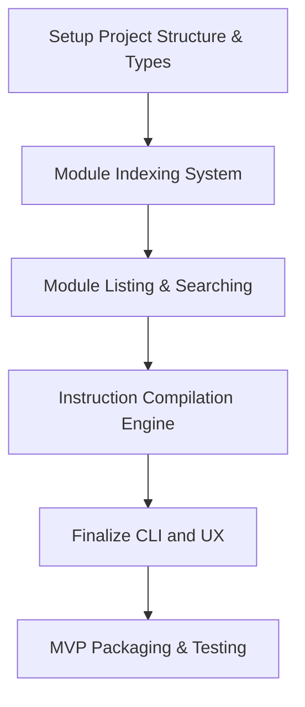

Of course. By combining the detailed, chronological steps from my plan with the excellent feature-oriented checklist from yours, we can create a single, highly granular, and comprehensive master implementation plan.

This is the definitive guide for building the CLI, incorporating the best of both documents.

---


### **Definitive Implementation Plan: Copilot Instructions Builder CLI**


This document outlines the atomic tasks and subtasks required to build the project, following modern Node.js standards with ES Modules.

#### **Task 1: Setup Project Structure & Types**

*   [x] **Subtask 1.1: Initialize Project Environment**
    *   Create the root project directory: `copilot-instructions-builder`.
    *   Navigate into the directory and run `npm init -y`.

*   [x] **Subtask 1.2: Install Dependencies**
    *   Install runtime dependencies: `npm install commander gray-matter fs-extra glob`.
    *   Install development dependencies: `npm install -D typescript @types/node @types/fs-extra @types/glob ts-node nodemon`.

*   [x] **Subtask 1.3: Configure TypeScript for ES Modules**
    *   Generate the configuration file: `npx tsc --init`.
    *   Modify `tsconfig.json` with the following properties:
        ```json
        {
          "compilerOptions": {
            "target": "ES2022", "module": "NodeNext", "moduleResolution": "NodeNext",
            "rootDir": "./src", "outDir": "./dist",
            "strict": true, "esModuleInterop": true, "resolveJsonModule": true
          },
          "include": ["src/**/*"]
        }
        ```

*   [x] **Subtask 1.4: Configure `package.json` for CLI Operations**
    *   Add `"type": "module"` to the top level of `package.json`.
    *   Add the `scripts` property:
        ```json
        "scripts": { "build": "tsc", "start": "node dist/cli.js", "dev": "nodemon src/cli.ts" }
        ```
    *   Add the `bin` property to define the CLI command:
        ```json
        "bin": { "instructions-builder": "./dist/cli.js" }
        ```

*   [x] **Subtask 1.5: Define Core Types**
    *   Create the file `src/types/index.ts`.
    *   In this file, `export` the `ModuleTier`, `ModuleMetadata`, `IndexedModule`, `Module`, and `PersonaFile` types as defined in the master project plan.

*   [x] **Subtask 1.6: Setup Directory Skeleton**
    *   Create source code directories: `mkdir -p src/commands src/core src/types src/utils`.
    *   Create default module directories: `mkdir -p instructions-modules/foundation instructions-modules/principle instructions-modules/technology instructions-modules/execution`.
    *   Create the personas directory: `mkdir personas`.

---

#### **Task 2: Module Indexing System**

*   [x] **Subtask 2.1: Implement File System & Parser Utilities**
    *   Create `src/utils/file-system.ts` and `src/core/parser.ts`.
    *   In `file-system.ts`, implement and `export` a function to recursively find all `.md` files in a directory.
    *   In `parser.ts`, implement `parseModuleMetadata(filePath, modulesPath)`. This function must:
        1.  Read the file content.
        2.  Use `gray-matter` to parse frontmatter.
        3.  Validate that `name` and `description` exist.
        4.  Derive `tier` from the top-level directory name and validate it against the `ModuleTier` type.
        5.  Derive `subject` from the intermediate path and validate its depth (max 2 levels).
        6.  Return a complete `IndexedModule` object.

*   [x] **Subtask 2.2: Implement the `index` Command**
    *   Create `src/commands/index.ts`.
    *   Define the `index` command using `commander`.
    *   Implement the command's action handler to:
        1.  Determine the `modulesPath` to use.
        2.  Call the file system utility to find all markdown files.
        3.  Map over the results, calling `parseModuleMetadata` for each file, wrapping in a `try/catch` to handle and report malformed modules.
        4.  Calculate the correct output path for the index file (`instructions-modules.index.json`).
        5.  Write the resulting array to the index file as JSON.
        6.  Log a success message.

---

#### **Task 3: Module Listing & Searching**

*   [x] **Subtask 3.1: Implement the `list` Command**
    *   Create `src/commands/list.ts`.
    *   Define the `list` command and its four boolean tier flags.
    *   Implement the action handler to:
        1.  Determine the index file path to read.
        2.  Read and parse the index file, with error handling for a missing index.
        3.  Filter the in-memory array of modules based on which tier flags were provided.
        4.  Display the filtered results using `console.table()`, formatted to clearly show the full module identifier, name, and description.

*   [x] **Subtask 3.2: Implement the `search` Command**
    *   Create `src/commands/search.ts`.
    *   Define the `search <query>` command and its four boolean tier flags.
    *   Implement the action handler to:
        1.  Read and parse the correct index file.
        2.  Filter the modules by tier based on the provided flags.
        3.  Perform a case-insensitive search on the `name` and `description` of the remaining modules.
        4.  Display the final results using `console.table()`.

---

#### **Task 4: Instruction Compilation Engine**

*   [x] **Subtask 4.1: Implement the `build` Command**
    *   Create `src/commands/build.ts`.
    *   Define the `build [personaFile]` command and all its options.

*   [] **Subtask 4.2: Implement Configuration Logic**
    *   In the `build` command's action handler, implement the precedence logic:
        1.  Load the Persona file if the `[personaFile]` argument is provided.
        2.  Create a final configuration object by overwriting the Persona file's values with any provided CLI options.

*   [] **Subtask 4.3: Implement Module Resolution Logic**
    *   In the `build` command's action handler:
        1.  Determine the final `modulesPath`.
        2.  Iterate through each tier in the correct order (`foundation` -> `principle` -> `technology` -> `execution`).
        3.  For each module identifier, handle both glob (`/*`) and specific file paths. Use a library like `glob` for expansion.
        4.  Sort the resolved file paths for each tier alphabetically.
        5.  Parse each resolved file using a `parseFullModule` function (which includes content).
        6.  Collect all resolved `Module` objects.

*   [] **Subtask 4.4: Implement Compilation & Output Logic**
    *   Create a `compile(modules: Module[]): string` function in `src/core/compiler.ts`.
    *   This function will group the modules by tier and concatenate their `content` in the strict four-tier order.
    *   In the `build` command, call this function and write the final compiled string to the output file specified in the configuration.

---

#### **Task 5: Finalize CLI and UX**

*   **Subtask 5.1: Create Main CLI Entry Point**
    *   Create `src/cli.ts`.
    *   Add the shebang `#!/usr/bin/env node`.
    *   Import and register all four commands (`index`, `list`, `search`, `build`).
    *   Define the global `--modules-path` option.
    *   End the file with `program.parse(process.argv)`.

*   **Subtask 5.2: Add Help Texts & UX**
    *   For each command defined with `commander`, use the `.description()` method to add a clear explanation of its purpose.
    *   For each option, add a description to the final argument of the `.option()` method.
    *   Use the `.addHelpText('after', ...)` method to provide concrete usage examples for each command.

---

#### **Task 6: MVP Packaging & Testing**

*   **Subtask 6.1: Manual End-to-End Testing**
    *   Create a sample set of modules across all four tiers.
    *   Run `cli index` and verify the `instructions-modules.index.json` is created correctly.
    *   Run `cli list` and `cli search` with various flags to verify the output.
    *   Create a sample `test.persona.json`.
    *   Run `cli build` with the persona file and verify the output file is concatenated in the correct tier order.
    *   Run `cli build` with CLI overrides and verify it works as expected.

*   **Subtask 6.2 (Stretch Goal): Unit Tests**
    *   Set up a testing framework like Jest.
    *   Write unit tests for the `parser.ts` to test valid/invalid modules and path derivation.
    *   Write unit tests for the `compiler.ts` to test module sorting and output correctness.