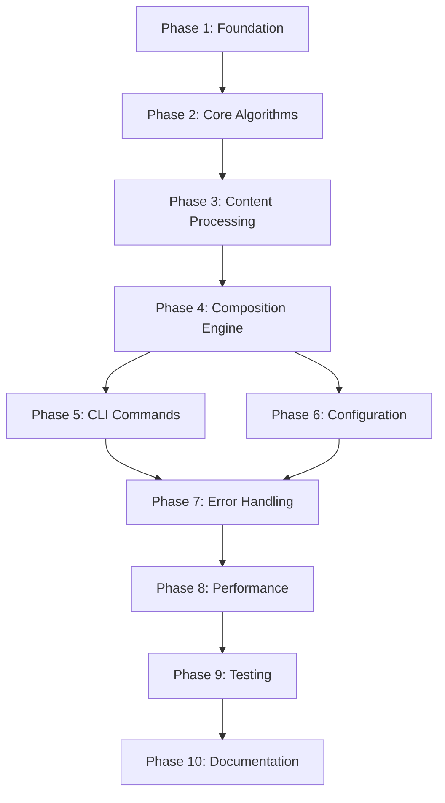

<!-- Generated by Claude Sonnet 4 -->

# Implementation Tasks - Copilot Instructions Builder CLI

This document breaks down the implementation of the Copilot Instructions Builder CLI into atomic tasks and subtasks based on the [architecture plan](./architecture-plan.md).

## 🎯 Task Organization

Tasks are organized by implementation phase and dependency order. Each task is marked with:

- **Priority**: `P0` (Critical), `P1` (High), `P2` (Medium), `P3` (Low)
- **Effort**: `XS` (1-2 days), `S` (3-5 days), `M` (1-2 weeks), `L` (2-4 weeks)
- **Dependencies**: References to prerequisite tasks

---

## Phase 1: Core Foundation

### 1.1 Project Setup and Infrastructure

**Priority**: P0 | **Effort**: S

- [x] **1.1.1** Initialize Node.js project structure
  - Create package.json with dependencies
  - Set up TypeScript configuration
  - Configure ESLint and Prettier
  - Set up Git hooks and CI/CD

- [x] **1.1.2** Create core directory structure
  - Set up `/src/core/`, `/src/modules/`, `/src/commands/` directories
  - Create `/modules/` directory for built-in modules
  - Set up `/templates/` and `/config/` directories
  - Initialize `/tests/` structure

- [x] **1.1.3** Set up development tooling
  - Configure Jest for testing
  - Set up development scripts (build, test, lint)
  - Create development environment configuration
  - Set up debugging configuration

### 1.2 Basic Module System

**Priority**: P0 | **Effort**: M | **Dependencies**: 1.1

- [x] **1.2.1** Define module schema and validation
  - Create JSON schema for module structure
  - Implement module validation using Ajv or similar
  - Create TypeScript interfaces for modules
  - Add schema validation tests

- [x] **1.2.2** Implement module loader
  - Create [`ModuleLoader`](../src/modules/loader.js) class
  - Implement file system module discovery
  - Add module caching mechanisms
  - Handle module loading errors gracefully

- [ ] **1.2.3** Create module registry
  - Implement [`ModuleRegistry`](../src/modules/registry.js) class
  - Add module indexing and search capabilities
  - Implement module metadata management
  - Create registry persistence layer

- [ ] **1.2.4** Build sample modules
  - Create base modules (programming-fundamentals, code-quality)
  - Create domain modules (frontend/react, backend/nodejs)
  - Create task modules (api-development, ui-components)
  - Add comprehensive module examples

### 1.3 Basic CLI Framework

**Priority**: P0 | **Effort**: S | **Dependencies**: 1.1

- [ ] **1.3.1** Set up CLI entry point
  - Create [`cli.js`](../src/core/cli.js) main entry point
  - Configure commander.js or yargs for CLI parsing
  - Implement basic command routing
  - Add global CLI options and help

- [ ] **1.3.2** Implement basic commands structure
  - Create command base class and interface
  - Set up command discovery and registration
  - Implement basic error handling for commands
  - Add command validation framework

---

## Phase 2: Core Algorithms

### 2.1 Dependency Resolution System

**Priority**: P0 | **Effort**: L | **Dependencies**: 1.2

- [ ] **2.1.1** Build dependency graph algorithms
  - Implement [`DependencyResolver`](../src/core/resolver.js) class
  - Create graph data structures and utilities
  - Implement topological sorting algorithm
  - Add graph visualization utilities for debugging

- [ ] **2.1.2** Implement cycle detection
  - Create cycle detection using DFS algorithm
  - Implement [`CycleDetector`](../src/algorithms/cycle-detection.js)
  - Add detailed cycle reporting and suggestions
  - Create cycle resolution strategies

- [ ] **2.1.3** Add dependency validation
  - Validate module dependencies exist
  - Check version compatibility
  - Implement dependency constraint checking
  - Add dependency health checks

- [ ] **2.1.4** Create resolution testing
  - Unit tests for all resolution scenarios
  - Integration tests with complex dependency chains
  - Performance tests for large module sets
  - Edge case testing (circular deps, missing modules)

### 2.2 Conflict Resolution System

**Priority**: P1 | **Effort**: L | **Dependencies**: 2.1

- [ ] **2.2.1** Implement conflict detection
  - Create [`ConflictResolver`](../src/core/conflict-resolver.js) class
  - Implement direct conflict detection
  - Add version conflict detection
  - Create section overlap detection

- [ ] **2.2.2** Build resolution strategies
  - Implement interactive conflict resolution
  - Add priority-based auto-resolution
  - Create version-based resolution
  - Implement policy-based resolution

- [ ] **2.2.3** Add conflict reporting
  - Create detailed conflict reports
  - Implement resolution suggestions
  - Add conflict visualization
  - Create resolution history tracking

- [ ] **2.2.4** Test conflict scenarios
  - Unit tests for all conflict types
  - Integration tests with complex conflicts
  - User interaction testing for resolution
  - Performance testing with many conflicts

### 2.3 Priority Calculation System

**Priority**: P1 | **Effort**: M | **Dependencies**: 2.1

- [ ] **2.3.1** Implement priority calculator
  - Create [`PriorityCalculator`](../src/core/priority-calculator.js) class
  - Implement multi-factor priority algorithm
  - Add type-based weighting system
  - Create dependency depth calculation

- [ ] **2.3.2** Add priority features
  - Implement user priority overrides
  - Add conflict penalty calculations
  - Create metadata-based weighting
  - Implement priority validation

- [ ] **2.3.3** Test priority calculations
  - Unit tests for priority algorithms
  - Integration tests with complex scenarios
  - Performance tests for large module sets
  - Validation tests for edge cases

---

## Phase 3: Content Processing

### 3.1 Smart Merge Algorithm

**Priority**: P1 | **Effort**: L | **Dependencies**: 2.2, 2.3

- [ ] **3.1.1** Implement content analysis
  - Create [`SmartMerger`](../src/core/smart-merger.js) class
  - Implement content categorization (rules, examples, guidelines)
  - Add semantic content analysis
  - Create content similarity detection

- [ ] **3.1.2** Build merge strategies
  - Implement replace, append, prepend strategies
  - Create intelligent merge algorithm
  - Add content deduplication
  - Implement hierarchical merging

- [ ] **3.1.3** Add merge customization
  - Create configurable merge rules
  - Implement custom merge functions
  - Add merge strategy selection logic
  - Create merge preview functionality

- [ ] **3.1.4** Test merge scenarios
  - Unit tests for all merge strategies
  - Integration tests with real content
  - Performance tests for large content sets
  - Quality tests for merge results

### 3.2 Template Processing System

**Priority**: P1 | **Effort**: M | **Dependencies**: 1.2

- [ ] **3.2.1** Implement template processor
  - Create [`TemplateProcessor`](../src/core/template-processor.js) class
  - Implement variable substitution engine
  - Add template function support
  - Create template validation

- [ ] **3.2.2** Add template features
  - Implement conditional templates
  - Add template inheritance
  - Create template debugging tools
  - Implement template caching

- [ ] **3.2.3** Build variable system
  - Create variable resolution engine
  - Implement environment variable support
  - Add computed variables
  - Create variable validation

- [ ] **3.2.4** Test template processing
  - Unit tests for template engine
  - Integration tests with complex templates
  - Performance tests for large templates
  - Error handling tests

### 3.3 Conditional Processing System

**Priority**: P2 | **Effort**: M | **Dependencies**: 3.2

- [ ] **3.3.1** Implement condition evaluator
  - Create [`ConditionEvaluator`](../src/core/condition-evaluator.js) class
  - Implement include/exclude condition logic
  - Add module requirement checking
  - Create tag-based conditions

- [ ] **3.3.2** Add condition features
  - Implement variable-based conditions
  - Add complex condition expressions
  - Create condition debugging tools
  - Implement condition optimization

- [ ] **3.3.3** Test condition evaluation
  - Unit tests for all condition types
  - Integration tests with complex scenarios
  - Performance tests for many conditions
  - Logic validation tests

---

## Phase 4: Composition Engine

### 4.1 Main Composition Engine

**Priority**: P0 | **Effort**: L | **Dependencies**: 2.1, 2.2, 3.1, 3.2, 3.3

- [ ] **4.1.1** Implement composer core
  - Create [`Composer`](../src/core/composer.js) class
  - Implement composition pipeline
  - Add composition state management
  - Create composition result handling

- [ ] **4.1.2** Build composition workflow
  - Implement module resolution phase
  - Add conflict resolution phase
  - Create content merging phase
  - Implement output generation phase

- [ ] **4.1.3** Add composition features
  - Implement incremental composition
  - Add composition validation
  - Create composition debugging
  - Implement composition caching

- [ ] **4.1.4** Test composition engine
  - Unit tests for composition pipeline
  - Integration tests with complete workflows
  - Performance tests for large compositions
  - End-to-end validation tests

### 4.2 Output Generation

**Priority**: P1 | **Effort**: M | **Dependencies**: 4.1

- [ ] **4.2.1** Implement output formatter
  - Create output formatting engine
  - Implement markdown template system
  - Add custom template support
  - Create output validation

- [ ] **4.2.2** Add output features
  - Implement multiple output formats
  - Add output post-processing
  - Create output optimization
  - Implement output debugging

- [ ] **4.2.3** Test output generation
  - Unit tests for formatters
  - Integration tests with real outputs
  - Quality tests for generated content
  - Format validation tests

---

## Phase 5: CLI Commands

### 5.1 Core Commands

**Priority**: P0 | **Effort**: M | **Dependencies**: 4.1, 4.2

- [ ] **5.1.1** Implement build command
  - Create [`BuildCommand`](../src/commands/build.js) class
  - Add command-line module selection
  - Implement profile-based building
  - Add build configuration options

- [ ] **5.1.2** Implement list command
  - Create [`ListCommand`](../src/commands/list.js) class
  - Add module filtering and search
  - Implement formatted output
  - Add module details display

- [ ] **5.1.3** Implement init command
  - Create [`InitCommand`](../src/commands/init.js) class
  - Add interactive project setup
  - Implement configuration generation
  - Add template selection

- [ ] **5.1.4** Test core commands
  - Unit tests for each command
  - Integration tests with real workflows
  - CLI interaction tests
  - Error handling tests

### 5.2 Management Commands

**Priority**: P1 | **Effort**: S | **Dependencies**: 5.1

- [ ] **5.2.1** Implement add command
  - Create [`AddCommand`](../src/commands/add.js) class
  - Add module addition to config
  - Implement dependency checking
  - Add configuration validation

- [ ] **5.2.2** Implement validate command
  - Create [`ValidateCommand`](../src/commands/validate.js) class
  - Add configuration validation
  - Implement dependency validation
  - Add module validation

- [ ] **5.2.3** Implement deps command
  - Create dependency visualization command
  - Add dependency analysis tools
  - Implement dependency reporting
  - Add dependency debugging

- [ ] **5.2.4** Test management commands
  - Unit tests for each command
  - Integration tests with configurations
  - CLI workflow tests
  - Validation tests

### 5.3 Utility Commands

**Priority**: P2 | **Effort**: S | **Dependencies**: 5.1

- [ ] **5.3.1** Implement search command
  - Create module search functionality
  - Add fuzzy search capabilities
  - Implement search result ranking
  - Add search filtering options

- [ ] **5.3.2** Implement active command (low priority)
  - Create instruction file management
  - Add enable/disable functionality
  - Implement status reporting
  - Add activation validation

- [ ] **5.3.3** Test utility commands
  - Unit tests for search functionality
  - Integration tests with module database
  - Performance tests for search
  - User experience tests

---

## Phase 6: Configuration System

### 6.1 Configuration Management

**Priority**: P1 | **Effort**: M | **Dependencies**: 1.2

- [ ] **6.1.1** Implement config manager
  - Create [`ConfigManager`](../src/core/config-manager.js) class
  - Add configuration loading and validation
  - Implement configuration merging
  - Add configuration schema validation

- [ ] **6.1.2** Add configuration features
  - Implement multiple configuration formats (JS, JSON, YAML)
  - Add environment-specific configurations
  - Create configuration inheritance
  - Implement configuration validation

- [ ] **6.1.3** Build profile system
  - Implement configuration profiles
  - Add profile inheritance and merging
  - Create profile validation
  - Add profile selection logic

- [ ] **6.1.4** Test configuration system
  - Unit tests for config loading
  - Integration tests with various formats
  - Validation tests for schemas
  - Error handling tests

---

## Phase 7: Error Handling and Recovery

### 7.1 Error System

**Priority**: P1 | **Effort**: M | **Dependencies**: All core systems

- [ ] **7.1.1** Implement error classes
  - Create custom error hierarchy
  - Implement [`CopilotBuilderError`](../src/utils/errors.js) base class
  - Add specific error types (CircularDependency, ConflictResolution, etc.)
  - Create error context and metadata

- [ ] **7.1.2** Add error handling
  - Implement global error handling
  - Add error recovery strategies
  - Create user-friendly error messages
  - Implement error reporting and logging

- [ ] **7.1.3** Build error recovery
  - Implement graceful degradation
  - Add error suggestion system
  - Create error debugging tools
  - Implement error prevention

- [ ] **7.1.4** Test error handling
  - Unit tests for error scenarios
  - Integration tests with error conditions
  - User experience tests for errors
  - Recovery mechanism tests

### 7.2 Logging and Debugging

**Priority**: P2 | **Effort**: S | **Dependencies**: 7.1

- [ ] **7.2.1** Implement logging system
  - Create [`Logger`](../src/utils/logger.js) class
  - Add configurable log levels
  - Implement structured logging
  - Add log formatting and output

- [ ] **7.2.2** Add debugging tools
  - Implement debug mode functionality
  - Add verbose output options
  - Create debugging utilities
  - Implement performance profiling

- [ ] **7.2.3** Test logging system
  - Unit tests for logging functionality
  - Integration tests with various log levels
  - Performance tests for logging
  - Log format validation tests

---

## Phase 8: Performance and Optimization

### 8.1 Caching System

**Priority**: P2 | **Effort**: M | **Dependencies**: Core systems

- [ ] **8.1.1** Implement module caching
  - Create module loading cache
  - Add cache invalidation strategies
  - Implement cache persistence
  - Add cache performance monitoring

- [ ] **8.1.2** Add result caching
  - Implement composition result caching
  - Add dependency-based cache keys
  - Create cache optimization
  - Implement cache cleanup

- [ ] **8.1.3** Build cache management
  - Add cache configuration options
  - Implement cache statistics
  - Create cache debugging tools
  - Add cache validation

- [ ] **8.1.4** Test caching system
  - Unit tests for cache functionality
  - Integration tests with real workloads
  - Performance tests for cache efficiency
  - Cache invalidation tests

### 8.2 Performance Optimizations

**Priority**: P2 | **Effort**: M | **Dependencies**: 8.1

- [ ] **8.2.1** Implement lazy loading
  - Add lazy module loading
  - Implement on-demand resolution
  - Create loading optimization
  - Add loading performance monitoring

- [ ] **8.2.2** Add parallel processing
  - Implement concurrent module processing
  - Add parallel dependency resolution
  - Create thread pool management
  - Implement processing optimization

- [ ] **8.2.3** Build memory optimization
  - Add memory usage monitoring
  - Implement memory cleanup
  - Create memory optimization strategies
  - Add memory leak detection

- [ ] **8.2.4** Test performance features
  - Performance benchmarks
  - Memory usage tests
  - Scalability tests
  - Load testing

---

## Phase 9: Testing and Quality

### 9.1 Unit Testing

**Priority**: P1 | **Effort**: L | **Dependencies**: All implementation phases

- [ ] **9.1.1** Core algorithm tests
  - Dependency resolution algorithm tests
  - Conflict resolution logic tests
  - Priority calculation tests
  - Template processing tests

- [ ] **9.1.2** Module system tests
  - Module loading and validation tests
  - Module registry tests
  - Module discovery tests
  - Module caching tests

- [ ] **9.1.3** CLI command tests
  - Individual command tests
  - Command argument parsing tests
  - Command validation tests
  - Command error handling tests

- [ ] **9.1.4** Utility and helper tests
  - Error handling tests
  - Logging system tests
  - Configuration system tests
  - Template system tests

### 9.2 Integration Testing

**Priority**: P1 | **Effort**: M | **Dependencies**: 9.1

- [ ] **9.2.1** End-to-end workflow tests
  - Complete composition workflow tests
  - CLI interaction tests
  - Configuration-driven tests
  - Multi-profile tests

- [ ] **9.2.2** Complex scenario tests
  - Large module set tests
  - Complex dependency chain tests
  - Multiple conflict resolution tests
  - Performance scenario tests

- [ ] **9.2.3** Real-world usage tests
  - React project composition tests
  - Node.js project composition tests
  - Multi-framework tests
  - Custom module tests

### 9.3 Quality Assurance

**Priority**: P2 | **Effort**: S | **Dependencies**: 9.1, 9.2

- [ ] **9.3.1** Code quality setup
  - Configure code coverage tools
  - Set up static analysis
  - Add code quality gates
  - Implement quality metrics

- [ ] **9.3.2** Documentation testing
  - Validate all code examples
  - Test documentation accuracy
  - Verify API documentation
  - Test configuration examples

- [ ] **9.3.3** User experience testing
  - CLI usability testing
  - Error message clarity testing
  - Documentation usability testing
  - Performance perception testing

---

## Phase 10: Documentation and Polish

### 10.1 Documentation

**Priority**: P1 | **Effort**: M | **Dependencies**: All features

- [ ] **10.1.1** API documentation
  - Generate comprehensive API docs
  - Add code examples for all APIs
  - Create integration examples
  - Add troubleshooting guides

- [ ] **10.1.2** User guides
  - Create getting started guide
  - Add advanced usage examples
  - Create best practices guide
  - Add migration guides

- [ ] **10.1.3** Developer documentation
  - Create contributor guide
  - Add architecture documentation
  - Create development setup guide
  - Add testing documentation

### 10.2 Release Preparation

**Priority**: P1 | **Effort**: S | **Dependencies**: All phases

- [ ] **10.2.1** Package preparation
  - Optimize bundle size
  - Add package metadata
  - Create release scripts
  - Add version management

- [ ] **10.2.2** Distribution setup
  - Configure npm publishing
  - Set up GitHub releases
  - Create installation scripts
  - Add update mechanisms

- [ ] **10.2.3** Final validation
  - Complete integration testing
  - Performance validation
  - Security audit
  - Documentation review

---

## 🎯 Implementation Priority Matrix

### **Phase 1-4: Critical Path** (Must implement first)

- Basic project structure and module system
- Core algorithms (dependency resolution, conflict resolution)
- Content processing (merging, templates, conditions)
- Main composition engine

### **Phase 5-6: Core Features** (Essential for MVP)

- CLI commands and configuration system
- User-facing functionality

### **Phase 7-8: Quality & Performance** (Important for production)

- Error handling and logging
- Performance optimizations and caching

### **Phase 9-10: Polish & Release** (Final stages)

- Comprehensive testing
- Documentation and release preparation

---

## 📊 Estimated Timeline

- **Phase 1-2**: 4-6 weeks (Foundation)
- **Phase 3-4**: 6-8 weeks (Core Engine)
- **Phase 5-6**: 3-4 weeks (CLI & Config)
- **Phase 7-8**: 3-4 weeks (Quality & Performance)
- **Phase 9-10**: 2-3 weeks (Testing & Documentation)

**Total Estimated Timeline**: 18-25 weeks for complete implementation

---

## 🔗 Task Dependencies

This task breakdown provides a comprehensive roadmap for implementing the Copilot Instructions Builder CLI with clear priorities, dependencies, and estimated effort for each component.
