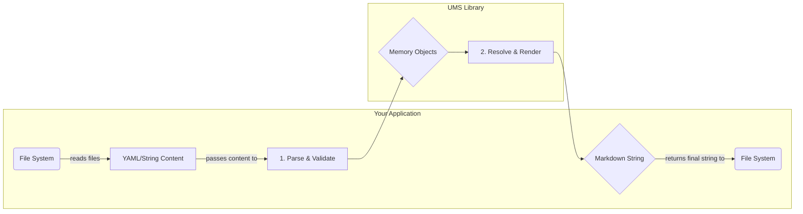

# UMS Library (`ums-lib`)

[](https://www.npmjs.com/package/ums-lib)
[](https://github.com/synthable/copilot-instructions-cli/blob/main/LICENSE)

A reusable, platform-agnostic library for UMS (Unified Module System) v2.0 operations, providing pure functions for parsing, validating, and building modular AI instructions.

## Core Philosophy

This library is designed to be a pure data transformation engine. It is completely decoupled from the file system and has no Node.js-specific dependencies, allowing it to be used in any JavaScript environment (e.g., Node.js, Deno, browsers).

The calling application is responsible for all I/O operations (like reading files). This library operates only on string content and JavaScript objects, ensuring predictable and testable behavior.

## Features

- ✅ **Platform Agnostic**: Contains no file-system or Node.js-specific APIs. Runs anywhere.
- ✅ **Conflict-Aware Registry**: Intelligent handling of module conflicts with configurable resolution strategies.
- ✅ **Tree-Shakable**: Modular exports allow importing only what you need for optimal bundle size.
- ✅ **Pure Functional API**: Operates on data structures and strings, not file paths, ensuring predictable behavior.
- ✅ **UMS v2.0 Compliant**: Full implementation of the specification for parsing, validation, and rendering.
- ✅ **TypeScript Support**: Fully typed for a robust developer experience.
- ✅ **Comprehensive Validation**: Detailed validation for both modules and personas against the UMS specification.
- ✅ **Performance Optimized**: Microsecond-level operations with comprehensive benchmarking.

## Architecture Overview

The following diagram illustrates the separation of concerns between your application and the `ums-lib`:



## Installation

```bash
npm install ums-lib
```

## Usage

The library provides a `ModuleRegistry` for advanced use cases involving conflict resolution, as well as a pure functional API for simple data transformations.

### Recommended: Using `ModuleRegistry`

The `ModuleRegistry` is the recommended approach for applications that load modules from multiple sources, as it provides robust conflict detection and resolution.

```typescript
import {
  ModuleRegistry,
  parseModule,
  parsePersona,
  renderMarkdown,
} from 'ums-lib';
import type { Module, Persona } from 'ums-lib';

// 1. Create a registry with a conflict resolution strategy ('error', 'warn', or 'replace')
const registry = new ModuleRegistry('warn');

// 2. Create module objects (typically loaded from .module.ts files)
import { CognitiveLevel } from 'ums-lib';

const moduleObj: Module = {
  id: 'testing/module-a',
  version: '1.0.0',
  schemaVersion: '2.0',
  capabilities: ['testing', 'example'],
  cognitiveLevel: CognitiveLevel.UNIVERSAL_PATTERNS,
  metadata: {
    name: 'Module A',
    description: 'A test module for demonstration.',
    semantic: 'Test module demonstrating UMS v2.0 structure and validation.',
  },
  instruction: {
    purpose: 'Demonstrate module structure',
    principles: ['Follow UMS v2.0 specification', 'Include all required fields'],
  },
};

// 3. Parse and validate the module, then add to registry
const module = parseModule(moduleObj);
registry.add(module, { type: 'local', path: './modules/module-a.module.ts' });

// 4. Create persona object (typically loaded from .persona.ts file)
const personaObj: Persona = {
  name: 'My Test Persona',
  version: '1.0.0',
  schemaVersion: '2.0',
  description: 'A test persona for demonstration.',
  semantic: 'Demonstration persona showing UMS v2.0 composition patterns.',
  modules: [
    {
      group: 'Core',
      ids: ['testing/module-a'],
    },
  ],
};

// 5. Parse and validate the persona
const persona = parsePersona(personaObj);

// 6. Resolve all modules required by the persona
const resolvedModules: Module[] = [];
for (const group of persona.modules) {
  if (Array.isArray(group)) {
    // Flat array format
    for (const moduleId of group) {
      const resolvedModule = registry.resolve(moduleId);
      if (resolvedModule) resolvedModules.push(resolvedModule);
    }
  } else {
    // Grouped format
    for (const moduleId of group.ids) {
      const resolvedModule = registry.resolve(moduleId);
      if (resolvedModule) resolvedModules.push(resolvedModule);
    }
  }
}

// 7. Render the final Markdown output
const markdownOutput = renderMarkdown(persona, resolvedModules);
console.log(markdownOutput);
```

### Pure Functional API

For simpler use cases where you manage the module collection yourself, you can use the pure functional API.

```typescript
import {
  parseModule,
  parsePersona,
  resolvePersonaModules,
  renderMarkdown,
} from 'ums-lib';
import type { Module, Persona } from 'ums-lib';

// 1. Create and parse module objects
import { CognitiveLevel } from 'ums-lib';

const moduleObj: Module = {
  id: 'testing/example',
  version: '1.0.0',
  schemaVersion: '2.0',
  capabilities: ['testing'],
  cognitiveLevel: CognitiveLevel.UNIVERSAL_PATTERNS,
  metadata: {
    name: 'Example Module',
    description: 'An example module.',
    semantic: 'Example module for testing pure functional API.',
  },
  instruction: {
    purpose: 'Demonstrate functional API usage',
    principles: ['Use pure functions', 'Manage state externally'],
  },
};

const module = parseModule(moduleObj);
const allAvailableModules: Module[] = [module];

// 2. Create and parse persona object
const personaObj: Persona = {
  name: 'Test Persona',
  version: '1.0.0',
  schemaVersion: '2.0',
  description: 'A test persona.',
  semantic: 'Test persona demonstrating functional API.',
  modules: ['testing/example'],
};

const persona = parsePersona(personaObj);

// 3. Resolve and render
const resolutionResult = resolvePersonaModules(persona, allAvailableModules);
if (resolutionResult.missingModules.length > 0) {
  console.error('Missing modules:', resolutionResult.missingModules);
}

const markdownOutput = renderMarkdown(persona, resolutionResult.modules);
console.log(markdownOutput);
```

## API Reference

The library is organized into functional domains, and its exports are tree-shakable.

### Main Entrypoint (`ums-lib`)

This exports all core functions, types, and error classes.

### Parsing (`ums-lib/core/parsing`)

- `parseModule(obj: unknown): Module`: Parses and validates a raw object as a UMS v2.0 module.
- `parsePersona(obj: unknown): Persona`: Parses and validates a raw object as a UMS v2.0 persona.

### Validation (`ums-lib/core/validation`)

- `validateModule(data: unknown): ValidationResult`: Validates a raw JavaScript object against the UMS v2.0 module schema.
- `validatePersona(data: unknown): ValidationResult`: Validates a raw JavaScript object against the UMS v2.0 persona schema.

### Resolution (`ums-lib/core/resolution`)

- `resolvePersonaModules(persona: Persona, modules: Module[]): ModuleResolutionResult`: A high-level function to resolve all modules for a persona from a flat list.
- `createModuleRegistry(modules: Module[]): Map<string, Module>`: Creates a simple `Map` from an array of modules.
- `validateModuleReferences(persona: Persona, registry: Map<string, Module>): ValidationResult`: Checks if all modules referenced in a persona exist in a given registry map.

### Rendering (`ums-lib/core/rendering`)

- `renderMarkdown(persona: Persona, modules: Module[]): string`: Renders a complete persona and its resolved modules into a final Markdown string.
- `renderModule(module: Module): string`: Renders a single module to a Markdown string.
- `generateBuildReport(...)`: Generates a build report compliant with the UMS v2.0 specification.

### Registry (`ums-lib/core/registry`)

- `ModuleRegistry`: A class that provides a conflict-aware storage and retrieval mechanism for UMS modules.
  - `new ModuleRegistry(strategy: ConflictStrategy = 'error')`
  - `.add(module: Module, source: ModuleSource): void`
  - `.resolve(moduleId: string, strategy?: ConflictStrategy): Module | null`
  - `.resolveAll(strategy: ConflictStrategy): Map<string, Module>`
  - `.getConflicts(moduleId: string): ModuleEntry[] | null`
  - `.getConflictingIds(): string[]`

### Types (`ums-lib/types`)

All UMS v2.0 interfaces are exported, including:

- `Module`, `Persona`, `Component`, `ModuleMetadata`, `ModuleGroup`
- `ValidationResult`, `ValidationError`, `ValidationWarning`
- `ModuleResolutionResult`
- `IModuleRegistry`, `ModuleEntry`, `ModuleSource`, `ConflictStrategy`
- `BuildReport`, `BuildReportGroup`, `BuildReportModule`

### Utilities (`ums-lib/utils`)

Custom error classes for robust error handling:

- `UMSError` (base class)
- `UMSValidationError`
- `ModuleLoadError`
- `PersonaLoadError`
- `BuildError`
- `ConflictError`

## License

[GPL-3.0-or-later](https://github.com/synthable/copilot-instructions-cli/blob/main/LICENSE)
