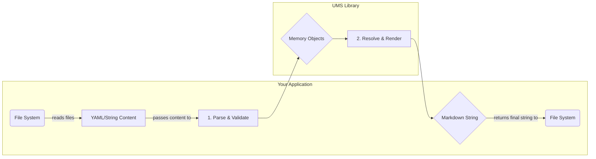

# UMS Library

A reusable, platform-agnostic library for UMS (Unified Module System) v1.0 operations, providing pure functions for parsing, validating, and building modular AI instructions.

## Core Philosophy

This library is designed to be a pure data transformation engine. It is completely decoupled from the file system and has no Node.js-specific dependencies, allowing it to be used in any JavaScript environment (e.g., Node.js, Deno, browsers).

The calling application is responsible for all I/O operations (like reading files). This library operates only on string content and JavaScript objects.

## Architecture Overview

The following diagram illustrates the separation of concerns between your application and the `ums-lib`:



## Installation

```bash
npm install ums-lib
```

## Usage

The library provides both pure functional APIs and a conflict-aware registry for handling module conflicts. Here are the main usage patterns:

### Basic Usage with ModuleRegistry

```typescript
import {
  ModuleRegistry,
  parseModule,
  parsePersona,
  renderMarkdown,
} from 'ums-lib';

// 1. Create a registry with conflict resolution strategy
const registry = new ModuleRegistry('warn'); // or 'error', 'replace'

// 2. Parse and add modules to the registry
const moduleContent = `
id: foundation/test/module-a
version: "1.0.0"
schemaVersion: "1.0"
shape: specification
meta:
  name: Module A
  description: A test module.
  semantic: A test module.
body:
  goal: This is a test goal.
`;

const module = parseModule(moduleContent);
registry.add(module, { type: 'local', path: './modules/module-a.yml' });

// 3. Parse and resolve persona modules
const personaContent = `
name: My Test Persona
version: "1.0.0"
schemaVersion: "1.0"
moduleGroups:
  - groupName: Core
    modules:
      - foundation/test/module-a
`;

const persona = parsePersona(personaContent);

// 4. Resolve modules from registry (handles conflicts automatically)
const requiredModuleIds = persona.moduleGroups.flatMap(group => group.modules);
const resolvedModules = [];
for (const moduleId of requiredModuleIds) {
  const module = registry.resolve(moduleId);
  if (module) resolvedModules.push(module);
}

// 5. Render the final Markdown output
const markdownOutput = renderMarkdown(persona, resolvedModules);
console.log(markdownOutput);
```

### Pure Functional API (Legacy)

```typescript
import {
  parseModule,
  parsePersona,
  resolvePersonaModules,
  renderMarkdown,
  type UMSModule,
} from 'ums-lib';

// Traditional functional approach without conflict handling
const persona = parsePersona(personaContent);
const module = parseModule(moduleContent);
const allAvailableModules: UMSModule[] = [module];

const resolutionResult = resolvePersonaModules(persona, allAvailableModules);
const markdownOutput = renderMarkdown(persona, resolutionResult.modules);
```

### Conflict Resolution Strategies

```typescript
import { ModuleRegistry } from 'ums-lib/core/registry';

// Error on conflicts (default)
const strictRegistry = new ModuleRegistry('error');

// Warn on conflicts, use first registered module
const warnRegistry = new ModuleRegistry('warn');

// Replace conflicts, use last registered module
const replaceRegistry = new ModuleRegistry('replace');

// Check for conflicts
const conflicts = registry.getConflicts('module-id');
const conflictingIds = registry.getConflictingIds();
```

## Available Exports

### Core Registry

- `ModuleRegistry` - Main registry class for handling module conflicts
- `IModuleRegistry` (interface) - Registry contract
- `ConflictStrategy` - Type for conflict resolution strategies ('error', 'warn', 'replace')
- `ModuleSource` - Type for tracking module sources
- `ModuleEntry` - Type for registry entries with metadata

### Modular Imports

The library supports tree-shaking with specific imports:

```typescript
// Registry only
import { ModuleRegistry } from 'ums-lib/core/registry';

// Parsing only
import { parseModule, parsePersona } from 'ums-lib/core/parsing';

// Validation only
import { validateModule, validatePersona } from 'ums-lib/core/validation';

// Resolution only
import { resolvePersonaModules } from 'ums-lib/core/resolution';

// Rendering only
import { renderMarkdown } from 'ums-lib/core/rendering';

// Types only
import type { UMSModule, UMSPersona } from 'ums-lib/types';

// Utils only
import { UMSError, UMSValidationError } from 'ums-lib/utils';
```

### Parsing & Validation

- `parseModule(content: string): UMSModule`
- `parsePersona(content: string): UMSPersona`
- `validateModule(module: UMSModule): ValidationResult`
- `validatePersona(persona: UMSPersona): ValidationResult`

### Resolution

- `resolvePersonaModules(persona: UMSPersona, modules: UMSModule[]): ModuleResolutionResult`
- `validateModuleReferences(persona: UMSPersona, registry: Map<string, UMSModule>): ValidationResult`

### Rendering

- `renderMarkdown(persona: UMSPersona, modules: UMSModule[]): string`
- `renderModule(module: UMSModule): string`
- `renderDirective(directive: DirectiveKey, content: unknown): string`

### Reporting

- `generateBuildReport(persona: UMSPersona, modules: UMSModule[]): BuildReport`
- `generatePersonaDigest(persona: UMSPersona): string`
- `generateModuleDigest(content: string): string`

### Error Types

- `UMSError`
- `UMSValidationError`
- `BuildError`
- `ConflictError` - Thrown when registry encounters conflicts with 'error' strategy

### Type Definitions

All UMS v1.0 interfaces are exported from `/types`:

- `UMSModule`, `UMSPersona`, `BuildReport`
- `ConflictStrategy`, `ModuleSource`, `ModuleEntry`
- `ValidationResult`, `ModuleResolutionResult`

## Features

- ✅ **Platform Agnostic**: Contains no file-system or Node.js-specific APIs. Runs anywhere.
- ✅ **Conflict-Aware Registry**: Intelligent handling of module conflicts with configurable resolution strategies.
- ✅ **Tree-Shakable**: Modular exports allow importing only what you need for optimal bundle size.
- ✅ **Pure Functional API**: Operates on data structures and strings, not file paths, ensuring predictable behavior.
- ✅ **UMS v1.0 Compliant**: Full implementation of the specification for parsing, validation, and rendering.
- ✅ **TypeScript Support**: Fully typed for a robust developer experience.
- ✅ **Comprehensive Validation**: Detailed validation for both modules and personas against the UMS specification.
- ✅ **Performance Optimized**: Microsecond-level operations with comprehensive benchmarking.

## License

GPL-3.0-or-later
